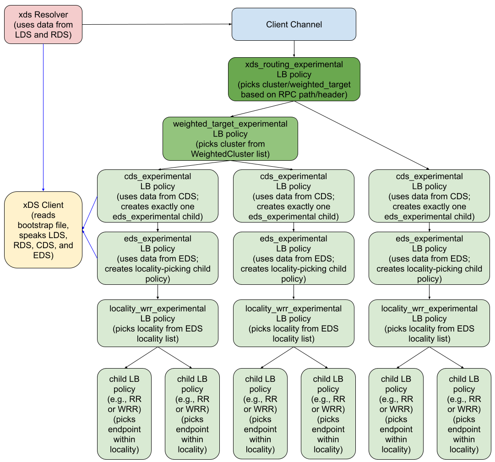

# gRPC xDS traffic splitting and routing
----
* Author(s): Menghan Li
* Approver: markdroth
* Status: Final
* Implemented in: C-core, Java, and Go
* Last updated: 2020-05-20
* Discussion at: https://groups.google.com/g/grpc-io/c/2Ot9HA3Rjeg
* Updated by: [A36: xDS-Enabled Servers](A36-xds-for-servers.md)


# Background

Traffic splitting is a feature where RPCs are sent to different clusters with
a specified distribution. RPC routing is a feature where RPCs are sent to
different clusters based on different criteria (e.g. path matching, header
matching). In xDS, routing configurations are specified in RDS responses,
including different ways to match a route, and different actions to perform
to split the traffic.

This doc covers how gRPC parses RDS routing related fields, and how to route
the RPCs.

It's based on the resolver/LB architecture and the xDS client behavior in the
[A27: xDS-Based Global Load
Balancing](https://github.com/grpc/proposal/blob/xds/A27-xds-global-load-balancing.md).


# Overview

To support traffic splitting and routing, the xDS resolver will be extended
to handle the routing fields in RDS responses, and convert them to service
config.

A new top level LB policy (`xds_routing_experimental`) will be added to do
RPC routing. It will pick the action to perform for the matched RPCs.

The action can be either to route to a cluster, or to do a weighted cluster
pick. So another LB policy (`weighted_target_experimental`) will be added to
support the latter.

The new architecture will be:



The next section of this doc covers what fields of RDS response will be
processed, how the xDS client will convert RDS to service config, and how the
LB policies will use them.

# Detailed design

This section will cover the LB policies, their configuration and behaviors
first, and then how the configuration is generated from RDS responses.

## Weighted target LB policy

The weighted target LB policy will have a group of child policies and their
corresponding weights, and will do weighted pick among the child policies.

This LB policy will have the following
[configuration](https://github.com/grpc/grpc-proto/blob/dd2dca318eb197b96b60f22297871fb1ed862800/grpc/service_config/service_config.proto#L317)

```proto
message WeightedTargetConfig {
  message Target {
    uint32 weight = 1;
    repeated LoadBalancingConfig child_policy = 2;
  }
  map<string, Target> targets = 1;
}
```

The name (key of the map) will allow the LB policy to be intelligent about
updating existing children instead of needlessly recreating them when it
receives an updated config.

The policy will create the child policy for each target. It will then distribute
picks to the child policies (that are reporting READY), based on the specified
weights. Note that this picking behavior is similar to most other gRPC LB
policies that only READY child policies are considered during a pick, unlike in
Envoy weighted_clusters, where READY and non-READY localities are both
considered.

For the purpose of traffic splitting, the child policy will always be
`cds_experimental`. But note that this policy can be generalized to have
other LB policies as children.

The way child policies are managed is similar to how the EDS policy manages
its child policies for localities (in fact, this policy can be reused as a
child of the EDS policy, but that’s out of the scope of this design). The
connectivity state of the policy will be the aggregated state of all child
policies. The WRR algorithm will be random based. When a child policy is
removed, it will be cached for 15 minutes.

## Routing LB policy

The routing LB policy will have a group of child policies, and their
corresponding matching criteria. The RPCs will be matched against the
criteria, and will be distributed to the matched child.

### Child policies

The child policies will be one of

*   `cds_experimental`
*   `weighted_target_experimental`
    *   Because this will only have CDS as children, this is essentially
        `weighted_CDS`

More child policies can be added in the future.

### LB policy config

The `xds_routing_experimental` LB policy will have the following
configuration:

```proto
/*

Route List                         Action map
+---------+--------+               +-------+-----------------+--------------+
| matcher | action |               | name  | policy          | config       |
+------------------+               +----------------------------------------+
| /s/m1   | wt_1   | +-----------> | wt_1  | weighted_target | <config_1>   |
+------------------+               +----------------------------------------+
| /s/m2   | cds_1  | +----\ /----> | wt_2  | weighted_target | <config_2>   |
+------------------+       x       +----------------------------------------+
| /s2/m3  | wt_2   | +----/ \----> | cds_1 | CDS             | <cds_config> |
+------------------+            -> +-------+-----------------+--------------+
| /s2/m4  | cds_1  | +---------/
+---------+--------+

 */

message XdsRouting {
  message Action {
    repeated LoadBalancingConfig child_policy = 1;
  }
  // Route represents a routing rule to send an RPC. It contains a matcher and
  // the name of the action to take. The action with the name can be found in
  // the action list.
  //
  // Route contains the action name instead of embedding the Action, so Action
  // can be shared and reused by multiple routes.
  message Route {
    message HeaderMatcher {
      message Int64Range {
        int64 start = 1;
        int64 end = 2;
      }
      string name = 1;
      oneof header_match_specifier {
        string exact_match = 2;
        string regex_match = 3;
        Int64Range range_match = 4;
        bool present_match = 5;
        string prefix_match = 6;
        string suffix_match = 7;
      }
      bool invert_match = 8;
    }

    oneof path_matcher {
      string path = 1;
      string prefix = 2;
      string regex = 3;
    }
    repeated HeaderMatcher headers = 3;

    // match_fraction specifies the percentage this route should be considered.
    // For fraction `N/D`, route is considered if `random(0,D) <= N`.
    //
    // The number in this field specifies the numerator.  The implicit
    // denominator is 1M (1,000,000). If the numerator specified is bigger than
    // the denominator, the final fractional percentage is capped at 1 (100%).
    //
    // The default value (when this field is not set) is 100%, which means
    // always consider this route (continue to evaluate the remaining match
    // criteria).
    google.protobuf.UInt32Value match_fraction = 4;

    string action = 5; // The action name
  }

  repeated Route route = 1;

  // action is a map from action name to the actual action.
  map<string, Action> action = 2;
}
```

The config must fulfill the following:

*   Routes
    * Matchers
        *   There must be exactly one `path_matcher`.
            *   `path_matcher` is a oneof so this is always true in proto. But
                json doesn’t have the oneof concept, so a route may have
                multiple path matchers, and it will be considered invalid.
        *   There can be one or more optional `header matchers`.
        *   There can be one optional `match_fraction`.
    *   The `action` name must be present in the action map.
    *   Duplicate matchers are allowed.
        *   Duplicate matcher means that more than one routes have the same
            matcher, no matter whether the actions are the same or not.
        *   Because the first match wins, the second matcher will never be used.
*   Actions
    *   Every action in the map must be referred to by at least one route.
    *   There must be at least one valid config in `child_policy`.

Violating any of these will make the LB policy config invalid, and be rejected.

For each pick, a route is matched if all matching criteria are matched. The
first match wins.

For each action, the config in `child_policy` to be used to create a child LB
policy will be picked using the same algorithm as [service
config](https://github.com/grpc/grpc-proto/blob/dd2dca318eb197b96b60f22297871fb1ed862800/grpc/service_config/service_config.proto#L401).

*   The first known (registered) policy name in the list will be picked
    *   If none is registered, the config is invalid
*   The config for the picked policy will be validated
    *   If the validation fails, the config is invalid. We won’t move on to the
        next entry

Action names are used as ID for the child policies. If an action name exists in
the previous service config, the action’s LB policy config will be sent as an
update to the corresponding child policy (instead of creating a new child policy
for it). The route refers to the action name instead of embedding the action
directly, so that one action can be shared by multiple routes.

NOTE: this LB policy is named `xds_routing` (instead of just routing) because we
plan to make it deeply integrated with the xds resolver as part of the
forthcoming RouteAction design.

### Picking

When making a pick, the first match wins.

For example, with config

```
{prefix: "/MyService"}:             childPolicy-1
{path:   "/MyService/MyMethod"}:    childPolicy-2
```

`ChildPolicy-1` will be picked for `/MyService/MyMethod`, even though the
second route is an exact match. It is this way because Envoy always picks the
first matched route. And with header matching, finding the exact match can be
tricky.

Note that only [custom
metadata](https://github.com/grpc/grpc/blob/master/doc/PROTOCOL-HTTP2.md#requests)
is considered during header matching, unlike in Envoy, where all headers
(including HTTP/2 pseudo-headers) are included. This is because the pick
happens above gRPC’s transport (HTTP/2) layer, so transport headers are
not accessible. However, we will support matching against the
`content-type` header; if a gRPC implementation does not add that header
until after xDS route selection is done, then xDS route selection will
assume a hard-coded value of `application/grpc`. Also, we will explicitly
exclude headers with a `-bin` suffix from matching (i.e., we will behave as
if the header is not present, even if it actually is).

The pick will consider the child policies that are not reporting READY (unlike
in most gRPC LB policies, e.g. weighted_target, where only the READY child
policies will be considered during pick). So the pick will always be delegated
to the picker from the matched child, even if the child is in a non-READY
connectivity state.

There will also be cases where for an RPC, a match is found, but the child
policy hasn’t generated the picker (for example, the child policy is still
initializing, and no picker has been created). When this happens, the RPCs
will be always queued until a picker is updated.

If no match can be found, the RPC will fail with code UNAVAILABLE, and
detailed information in the error message.

When the policy gets an update, including:

*   LB policy config update from the resolver (route update)
*   Child policy picker update

The queued RPCs will all re-pick, even though it could get the same result
because its route isn’t updated, or it’s matching child policy hasn’t
changed. (This is less than ideal, and some of the picks are wasted. But this
is necessary because the RPCs are queued by the channel, and the LB policy
cannot only re-pick some of them.)

The connectivity state of the policy will be the aggregated state of all the
child policies. Even though this is not true for a specific RPC (the actual
state is the state of the child policy that will be picked), it represents
the overall state of the channel.

## xDS resolver and xDS client

The xDS resolver and xds client's overall behavior will be similar as before.
The xDS resolver will call the xDS client to send xDS, and will send service
config generated from RouteConfiguration (the RDS response) to the parent gRPC
client channel. The xDS client will make LDS and RDS (as in
[A27](https://github.com/grpc/proposal/blob/master/A27-xds-global-load-balancing.md#xds-resolver)),
but will read and parse more fields in the RDS response.

Note on flag-protection for new features: new features should be flag-protected
until it has proven to be stable. LB policies are passively picked by service
config, so the flag-protection can be done before service config generation.
Because xds\_client also does response validation, and xds\_resolver behavior
can be controlled by the parsed result from xds\_client, the flag-protection
should be done in the xds\_client. The flag-protection for routing will use the
following environment variable:

```
GRPC_XDS_EXPERIMENTAL_ROUTING = (true|false)
```

### Response validation

After LDS/RDS, when the xDS client gets a
[RouteConfiguration](https://github.com/envoyproxy/envoy/blob/v1.13.1/api/envoy/api/v2/route.proto#L24),
it will look at the list of VirtualHosts and find the element whose
[domains](https://github.com/envoyproxy/envoy/blob/v1.13.1/api/envoy/api/v2/route/route_components.proto#L72)
field **_most specifically matches_** the server name from URI (with scheme
stripped off). If no matching VirtualHost is found, the xDS client will report
that to the xDS resolver, and the xDS resolver will return an error to the
client channel.

In the matched VirtualHost, the xDS client will iterate over the list of
[routes](https://github.com/envoyproxy/envoy/blob/v1.13.1/api/envoy/api/v2/route/route_components.proto#L76),
and validate match field and action field:

The route’s [match
field](https://github.com/envoyproxy/envoy/blob/v1.13.1/api/envoy/api/v2/route/route_components.proto#L179)

*   Must have
    [path\_specifier](https://github.com/envoyproxy/envoy/blob/v1.13.1/api/envoy/api/v2/route/route_components.proto#L360)
    *   Options supported:
        [prefix](https://github.com/envoyproxy/envoy/blob/v1.13.1/api/envoy/api/v2/route/route_components.proto#L365),
        [path](https://github.com/envoyproxy/envoy/blob/v1.13.1/api/envoy/api/v2/route/route_components.proto#L369)
        or
        [safe\_regex](https://github.com/envoyproxy/envoy/blob/v1.13.1/api/envoy/api/v2/route/route_components.proto#L405)
        *   With `safe_regex`, the [recently
            deprecated](https://github.com/envoyproxy/envoy/pull/10971)
            `max_program_size` field will be ignored
    *   NOT regex
        *   Justification: unsafe and deprecated -- replaced by safe\_regex
        *   The presence of this field will cause a NACK
    *   Not having path\_specifier will cause a NACK
*   Can have
    [headers](https://github.com/envoyproxy/envoy/blob/v1.13.1/api/envoy/api/v2/route/route_components.proto#L435),
    with
    [header\_match\_specifier](https://github.com/envoyproxy/envoy/blob/v1.13.1/api/envoy/api/v2/route/route_components.proto#L1382)
    set to
    *   Options supported:
        [exact\_match](https://github.com/envoyproxy/envoy/blob/v1.13.1/api/envoy/api/v2/route/route_components.proto#L1384),
        [safe\_regex\_match](https://github.com/envoyproxy/envoy/blob/v1.13.1/api/envoy/api/v2/route/route_components.proto#L1409),
        [range\_match](https://github.com/envoyproxy/envoy/blob/v1.13.1/api/envoy/api/v2/route/route_components.proto#L1422),
        [present\_match](https://github.com/envoyproxy/envoy/blob/v1.13.1/api/envoy/api/v2/route/route_components.proto#L1426),
        [prefix\_match](https://github.com/envoyproxy/envoy/blob/v1.13.1/api/envoy/api/v2/route/route_components.proto#L1434),
        [suffix\_match](https://github.com/envoyproxy/envoy/blob/v1.13.1/api/envoy/api/v2/route/route_components.proto#L1442)
        or
        [invert\_match](https://github.com/envoyproxy/envoy/blob/v1.13.1/api/envoy/api/v2/route/route_components.proto#L1451)
        *   With `safe_regex_match`, the [recently
            deprecated](https://github.com/envoyproxy/envoy/pull/10971)
            `max_program_size` field will be ignored
    *   NOT regex\_match
        *   Justification: unsafe and deprecated -- replaced by
            safe\_regex\_match
        *   The presence of this field will cause a NACK
*   Can have
    [runtime\_fraction](https://github.com/envoyproxy/envoy/blob/v1.13.1/api/envoy/api/v2/route/route_components.proto#L428)
    *   gRPC doesn’t support runtime config, so only
        [default\_value](https://github.com/envoyproxy/envoy/blob/v1.13.1/api/envoy/api/v2/core/base.proto#L369)
        will be used,
        [runtime\_key](https://github.com/envoyproxy/envoy/blob/v1.13.1/api/envoy/api/v2/core/base.proto#L372)
        will be ignored
*   Can have
    [query\_parameters](https://github.com/envoyproxy/envoy/blob/v1.13.1/api/envoy/api/v2/route/route_components.proto#L442)
    *   Note: the entire route containing this will be ignored, regardless of
        the other matchers, this is the same as this always evaluates to false,
        because gRPC does not and will not support query parameters
*   Can have
    [grpc](https://github.com/envoyproxy/envoy/blob/v1.13.1/api/envoy/api/v2/route/route_components.proto#L447)
    *   This matcher will be ignored (but the other matchers in the route will
        be evaluated)
*   Can have
    [tls_context](https://github.com/envoyproxy/envoy/blob/v1.13.1/api/envoy/api/v2/route/route_components.proto#L453)
    *   This matcher will be ignored (but the other matchers in the route will
        be evalulated). We may add support for this feature later, but the
        service owners need to be careful how they start using it, because the
        older clients will ignore it
*   Can have
    [case\_sensitive](https://github.com/envoyproxy/envoy/blob/v1.13.1/api/envoy/api/v2/route/route_components.proto#L410)
    *   If the config explicitly sets case\_sensitive to false, the client will
        do case\_insensitive matches (e.g. "MyService/MyMethod" will match a
        route on "/myservice/mymethod"). But note that the gRPC backend will
        still do case\_sensitive matches.

The route’s [action
field](https://github.com/envoyproxy/envoy/blob/v1.13.1/api/envoy/api/v2/route/route_components.proto#L181)
must be
[route](https://github.com/envoyproxy/envoy/blob/v1.13.1/api/envoy/api/v2/route/route_components.proto#L185),
and its
[cluster\_specifier](https://github.com/envoyproxy/envoy/blob/v1.13.1/api/envoy/api/v2/route/route_components.proto#L696):
*   Can be
    [Cluster](https://github.com/envoyproxy/envoy/blob/v1.13.1/api/envoy/api/v2/route/route_components.proto#L701)
*   Can be
    [Weighted\_clusters](https://github.com/envoyproxy/envoy/blob/v1.13.1/api/envoy/api/v2/route/route_components.proto#L719)
    *   The sum of
        [weights](https://github.com/envoyproxy/envoy/blob/v1.13.1/api/envoy/api/v2/route/route_components.proto#L278)
        must add up to the
        [total\_weight](https://github.com/envoyproxy/envoy/blob/v1.13.1/api/envoy/api/v2/route/route_components.proto#L335).
*   Can be unset or an unsupported field. The route containing this action will be
   ignored.
    *   At the time of this gRFC,
        [cluster\_header](https://github.com/envoyproxy/envoy/blob/v1.13.1/api/envoy/api/v2/route/route_components.proto#L712)
        is the only such unsupported field. But the client must handle other
        fields in the `oneof` being added in the future, with or without
        recompiling the client with the new proto. Protobuf considers unknown
        fields of a oneof as an unset oneof, as it doesn't know the field is
        part of the oneof.

Duplicate matches are allowed, but because the first match wins, the second
will never be used.

Violating any of the validation causes the response to be rejected (NACK’ed).
The fields not covered by this section will all be ignored.

### Service config generating

The service config generated by the xDS resolver will pick
`xds_routing_experimental` as the LB policy. As an optimization, when there’s
only one route, the LB policy picked may be `cds_experimental` or
`weighted_target_experimental` depending on the action, so we can skip the
`xds_routing` policy that has only one child.

The `xds_routing_experimental` LB policy config will contain the validated
`{matchers, action}` pairs. The actions will be in a separate list, and will
be referred to by the routes by their names.

#### Action list

All the actions from the validated `{matchers, action}` pairs will be
de-duplicated and stored in a cache. All actions in the cache will be
assigned a unique name.

When processing an RDS response, for each action:

*   If the action is cluster, the child\_policy will be `cds_experimental`, with
    a LB policy config containing the cluster string.
*   If the action is weighted\_clusters, the child\_policy will be
    `weighted_target_experimental`. The LB policy config will contain a list of
    `cds_experimental` LB configs, and their corresponding weights.
*   If this action is already in the cache, it will be reused, and nothing needs
    to be done
*   If the action is new, it will be be added to the list and assigned a name
    *   The name should be a human readable string with information of the
        config, to be logged for debugging purposes.
    *   For example, the names can be `cds:cluster1` and
        `weighted:cluster1_cluster2_<index_number>`.

When assigning names to new actions, we will try to reuse the existing names.
This will help the xds\_routing policy to not always close/create child
policy. But we will limit the name reuse only between weighted cluster
actions that share the same set of clusters (the only update is weights).
This covers the typical use case where the user keeps updating the cluster
weights during a canary rollout.

To do this, for each new RDS response, the client will

1.  Calculate the list of new actions to add, and the list of old actions to remove.
    1.  This is to find what actions changed between the new response and the previous response, two actions are the same if they have the same set of clusters, and the same weight for each cluster.
1.  For each new action, either find an action to reuse, or create a new action
    1.  If there’s a to-be-removed action with the same set of clusters (but different weights), it will get the old action’s name, otherwise it will be assigned a new name.


#### Route list

For each `{matchers, action}`, a route will be generated:

*   With matchers in JSON representation.
    *    For `runtime_fraction`, the denominator will be scaled up to 1M, and
         only the numerator (after scaling up) will be specified in JSON field
         `match_fraction`.
*   The action will be the name of this action from the action list.

The processed response will be converted to a [JSON service
config](#JSON-service-config-generated-by-xDS-resolver).

### Multiple watches for the same resource

There could be multiple instances of CDS LB policies, and EDS as a child of
CDS. So the xDS client will get parallel requests for `WatchCluster()` and
`WatchEndpoints()`. And those watches can be for the same or for different
resource\_names. The xDS client should be able to handle them.

#### Start a new watch

When the client is asked to watch for a resource\_name:

*   If there’s an existing watch for this resource\_name, the client will not
    send a xDS request
    *   If there’s already a response, the new watcher will be notified
        immediately
*   If this is a new resource\_name, the client will start the watch by sending a
    xDS request
    *   If there are existing watches for the same type, but different
        resource\_names, the new xDS request’s resource\_names should be the the
        new name appended to the old names
    *   Note that this could cause the server to resend the data for the previous
        resouce\_names. The xDS client should try to filter out the duplicate
        responses, and not notify the watchers.

#### Cancel a watch

When a watch is cancelled:

*   If there are still other watch for the same name, the client will do nothing
*   If this is the last watch for this name
    *   The client will send a xDS request, with this name removed from
        resource\_names list
        *   Note that this will result in a xDS request with an empty
            resource\_names list when the last watch is cancelled. It's expected
            that the server won't handle this as a wild card (because this is not
            the first request).
    *   The item for this resource\_name will be cleared from the cache
        *   The cache should only contain the responses for the in-process
            watches. If we keep the item in cache after the watch is cancelled,
            it will quickly become outdated.

#### Handle responses

When a response is received, the xDS client will

*   Parse and notify all the watchers for this type
*   Store the updated resource in cache, to prepare for future watches for the
    same resource

# Alternatives considered

## Child policy sharing

One child policy instance, including `cds_experimental` and
`weighted_target_experimental`, can be an action shared by multiple routes.

For example, the same `{"cds": cluster_1}` can be used as direct actions in
route1 and route2, and as a child policy of `weighted_target` in route3.

Problem with multiple LB policy instances (not sharing)

*   There may be a lot of routes (resulting in a lot of LB instances)
    *   The routes also carry RPC configurations, which can be different even if
        the route actions are the same
    *   It’s quite easy for users to add a route
    *   One route only contains one path, not a list of paths
*   The subchannels are not shared across LB policies in Java and Go (so
    duplicate TCP connections)
*   The logic in all child policy will be duplicate (potential memory problem)

Problem with sharing

*   It dramatically complicates the implementation
    *   The child policy will be owned by multiple parents, life cycle and update
        propagation (e.g. subchannel state change) get complex. And any picker
        update will need to fork and notify all parents.
*   When the route changes, the action may be diverged to a different policy (new
    or existing). Any state (e.g. stickiness) will be lost.

### Solutions

The problem we want to solve immediately is the duplicate TCP connections. We
can do

*   Share at the top level `xds_routing_experimental` LB policy
*   Share all cds policy instances
*   Share subchannels

The first solution is chosen because it’s easy to implement, and it solves
most of the subchannel duplication problem. Even without subchannel sharing,
the number of TCP connections will be linear to the number of different
actions, not the number of routes. Users can create a large amount of routes,
but the number of different actions to take is usually small.

# Appendix

## JSON service config generated by xDS resolver

For an RDS response with content

```
{
  "URL_MAP/1",
  path: "/service_1/method_1",
  cluster: {cluster_1}
},
{
  "URL_MAP/2",
  path: "/service_1/method_2",
  cluster: {cluster_1}
},
{
  "URL_MAP/3",
  prefix: "/service_2/method_2",
  weighted_clusters: [
    {name: cluster_1, weight: 75},
    {name: cluster_2, weight: 25}
  ]
},
{
  "URL_MAP/4",
  prefix: "/service_2",
  weighted_clusters: [
    {name: cluster_1, weight: 75},
    {name: cluster_2, weight: 25}
  ]
},
{
  "URL_MAP/5",
  safe_regex: "^/service_2/method_3$",
  weighted_clusters: [
    {name: cluster_1, weight: 99},
    {name: cluster_3, weight: 1}
  ]
},
```

The generated service config will be

```json
{
  "loadBalancingConfig":[{
    "xds_routing_experimental":{
      "Action":{
        "cds:cluster_1":{
          "childPolicy":[{
            "cds_experimental":{"cluster":"cluster_1"}
          }]
        },
        "weighted:cluster_1_cluster_2_1":{
          "childPolicy":[{
            "weighted_target_experimental":{
              "targets": {
                "cluster_1" : {
                  "weight":75,
                  "childPolicy":[{"cds_experimental":{"cluster":"cluster_1"}}]
                },
                "cluster_2" : {
                  "weight":25,
                  "childPolicy":[{"cds_experimental":{"cluster":"cluster_2"}}]
                }
              }
            }
          }]
        },
        "weighted:cluster_1_cluster_3_1":{
          "childPolicy":[{
            "weighted_target_experimental":{
              "targets": {
                "cluster_1": {
                  "weight":99,
                  "childPolicy":[{"cds_experimental":{"cluster":"cluster_1"}}]
                },
                "cluster_3": {
                  "weight":1,
                  "childPolicy":[{"cds_experimental":{"cluster":"cluster_3"}}]
                }
              }
            }
          }]
        }
      },

      "Route":[{
        "path":"/service_1/method_1",
        "action":"cds:cluster_1"
      },
      {
        "path":"/service_1/method_2",
        "action":"cds:cluster_1"
      },
      {
        "prefix":"/service_2/method_1",
        "action":"weighted:cluster_1_cluster_2_1"
      },
      {
        "prefix":"/service_2",
        "action":"weighted:cluster_1_cluster_2_1"
      },
      {
        "regex":"^/service_2/method_3$",
        "action":"weighted:cluster_1_cluster_3_1"
      }]
    }
  }]
}
```

