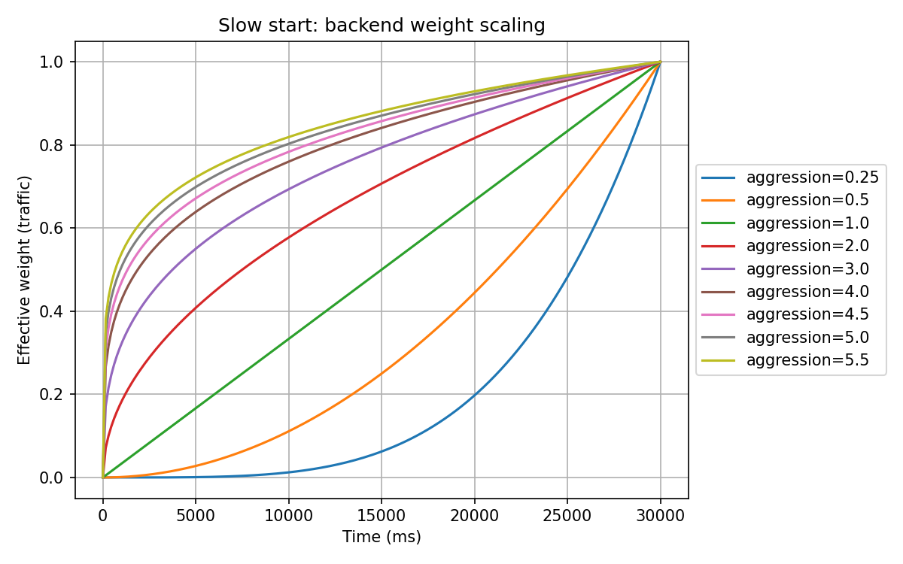

A100: Client-side weighted round-robin slow start configuration
----

* Author(s): [Anurag Agarwal](https://github.com/anuragagarwal561994)
* Approver: Mark Roth (@markdroth), Eric Anderson (@ejona86), Doug Fawley (@dfawley)
* Status: Draft
* Last updated: 2025-05-31
* Discussion at: TBD

## Abstract

This proposal introduces an enhancement to the existing client-side weighted_round_robin (WRR) load balancing policy in
gRPC by incorporating a configurable `slow_start_config` mechanism. This feature enables a controlled, gradual increase
in traffic allocation to backend endpoints that are either newly introduced or recently rejoined the cluster. By
gradually ramping up their traffic, this enhancement ensures backend endpoints have enough time to warm up, optimize
performance, and stabilize before serving their full traffic share.

The design borrows from production-ready practices in other data planes such as Envoy, where gradual traffic ramp-up
(slow start) is a [well-established technique][Envoy Slow Start Documentation] for avoiding performance degradation and
request failures during backend startup or recovery. The slow start feature gradually increases the traffic sent to
newly added endpoints during a warmup period, allowing them to warm up their caches and establish connections before
receiving the full traffic load.

## Background

gRPC's WRR load balancing policy allows clients to route requests to backend endpoints in proportion to assigned
weights. These weights are usually derived from backend metrics, such as CPU usage, QPS, and error rates published by
the backend servers. This allows gRPC clients to adapt traffic distribution dynamically based on backend capacity.

The current WRR implementation includes a blackout period with some warm-up functionality, but it falls short in various
scenarios. When a new endpoint is introduced due to autoscaling, replacement, or recovery—clients still route traffic
based on weights that don’t account for the endpoint’s initialization state. This can overwhelm the endpoint before it
is fully stable, leading to degraded response times and reduced service reliability. It is especially problematic for
systems with cold caches, JIT compilation warm-up delays, or dependency initialization steps.

In contrast, many modern systems adopt slow start strategies in load balancing to address these issues. These strategies
allow endpoints to ramp up traffic gradually over a defined window, smoothing transitions and mitigating the risks of
traffic spikes. Similar functionality exists in Envoy's load balancing policies, where a slow start is implemented for
round-robin and the least request policies.

Introducing a `slow_start_config` configuration in gRPC WRR will offer these benefits within the native client policy,
reducing reliance on external traffic-shaping mechanisms or manual intervention.

### Related Proposals:

* [gRFC A24][A24]
* [gRFC A58][A58]
* [gRFC A66][A66]
* [gRFC A78][A78]
* [gRFC A79][A79]
* [gRFC A89][A89]

## Proposal

Add slow start configuration to the `weighted_round_robin` load balancing policy. The slow start feature will scale the
computed weights for endpoints during their warmup period, gradually increasing the traffic they receive.

### LB Policy Config and Parameters

The `weighted_round_robin` [LB policy config][A24] will be extended to include slow start configuration:

```textproto
message LoadBalancingConfig {
  oneof policy {
    WeightedRoundRobinLbConfig weighted_round_robin = 20 [json_name = "weighted_round_robin"];
  }
}

message WeightedRoundRobinLbConfig {
  // ... existing fields ...

  // Configuration for slow start feature
  SlowStartConfig slow_start_config = 7;
}

message SlowStartConfig {
  // Represents the size of slow start window.
  //
  // The newly created endpoint remains in slow start mode starting from its creation time
  // for the duration of slow start window.
  google.protobuf.Duration slow_start_window = 1; // Required

  // This parameter controls the speed of traffic increase over the slow start window. Defaults to 1.0,
  // so that endpoint would get linearly increasing amount of traffic.
  // When increasing the value for this parameter, the speed of traffic ramp-up increases non-linearly.
  // The value of aggression parameter must be greater than 0.0.
  // By tuning the parameter, it is possible to achieve polynomial or exponential shape of ramp-up curve.
  //
  // During slow start window, effective weight of an endpoint would be scaled with time factor and aggression:
  // ``new_weight = weight * max(min_weight_percent / 100, time_factor ^ (1 / aggression))``,
  // where ``time_factor = max(time_since_start_seconds, 1) / slow_start_window_seconds``.
  //
  // As time progresses, more and more traffic would be sent to endpoint, which is in slow start window.
  // Once endpoint exits slow start, time_factor and aggression no longer affect its weight.
  float aggression = 2;

  // Configures the minimum percentage of the original weight that will be used for an endpoint
  // in slow start. This helps to avoid a scenario in which endpoints receive no traffic during the
  // slow start window. Valid range is [0.0, 100.0]. If the value is not specified, the default is 10%.
  float min_weight_percent = 3;
}
```

### Subchannel Weights and Scaling During Warmup

To maintain independence between the blackout period and slow start period, a new timestamp `ready_since` will be
introduced to track when an endpoint transitioned to ready state. This timestamp is separate from the existing
`non_empty_since` timestamp used for the blackout period.

The `ready_since` timestamp is set when an endpoint transitions from a non-ready state (e.g., CONNECTING,
TRANSIENT_FAILURE) to a ready state (READY). This marks the beginning of the slow start period for that endpoint. The
existing `non_empty_since` timestamp continues to be used exclusively for tracking the blackout period, which begins
when the first non-zero load report is received.

Weight calculation in the WRR policy follows a two-step process. First, the base weight for each endpoint is computed
using the formula from [gRFC A58][A58]:

$$weight = \dfrac{qps}{utilization + \dfrac{eps}{qps} * error\\_utilization\\_penalty}$$

This base weight represents the endpoint's capacity based on its current performance metrics. When an endpoint enters
the
warmup period after being in a non-ready state, its weight will be scaled by a factor that increases non-linearly from
`min_weight_percent` to 100% over the duration of `slow_start_window`.

The scale factor is calculated as follows:

$$time\\_factor = \dfrac{max(time\\_since\\_ready\\_seconds, 1)}{slow\\_start\\_window\\_seconds}$$

$$scaled\\_weight = weight * max(min\\_weight\\_percent/100, time\\_factor ^ {1/aggression})$$

The following image shows how different aggression values affect the scaling factor over time during the slow start
window (in milliseconds):



The scaling formula ensures that new endpoints receive a gradually increasing share of traffic while maintaining a
minimum threshold to prevent starvation. The `aggression` parameter allows fine-tuning of the ramp-up curve, enabling
either more aggressive initial scaling (values > 1.0) or more conservative approaches (values < 1.0).

When an endpoint is not in the warmup period, the scale factor is set to 1.0, meaning the original weight is used
without modification. This ensures that the slow start mechanism only affects endpoints during their initial warmup
phase, after which they participate in normal load balancing based on their actual performance metrics.

### Blackout Period vs. Slow Start

The WRR load balancing policy will offer two independent mechanisms for handling new endpoints: the blackout period and
slow start. These mechanisms can be used independently or in combination, allowing operators to choose the approach that
best fits their needs.

The blackout period begins when an endpoint’s first non‑zero load report is observed (tracked by `non_empty_since`) and
defaults to 10 seconds. Traffic is still routed to the endpoint during this time, but the load balancer ignores
per‑endpoint reported weights and uses the average of all backend‑reported weights instead. This reduces churn in
load‑balancing decisions as the set of endpoints changes and allows time for weight reports to become stable before they
are used.

The slow start period begins when an endpoint transitions to ready state (tracked by `ready_since` timestamp) and
applies a gradual scaling factor to the weights over a configurable duration. This scaling is applied to whatever weight
is being used (either the mean weight during the blackout period or the actual backend-reported weight after the
blackout
period). The slow start period operates independently of the blackout period, meaning it will continue to scale the
weights regardless of whether the blackout period is still active or has ended.

The independence of these mechanisms allows for more flexible configurations:

- Slow start can begin immediately when an endpoint becomes ready, even before any load reports are received
- The blackout period can continue to function as designed for weight stability, regardless of the slow start
  configuration
- Both mechanisms can be tuned independently based on specific operational requirements

It is recommended to keep the blackout period shorter than the slow start period. This is because when the blackout
period ends, the endpoint's weight will suddenly change from the mean weight to its actual backend-reported weight. If
this weight is significantly higher than the mean (e.g., 2x the mean weight), it could cause a sudden traffic spike that
defeats the purpose of gradual traffic increase. By having a longer slow start period, the scaling factor will continue
to gradually increase the weight even after the blackout period ends, ensuring a smooth transition to the full
backend-reported weight.

When endpoint weights become stale after the `weight_expiration_period`, the load balancer will continue to use the mean
weight for load balancing. This is different from the blackout period as it's a response to weight staleness rather than
initial endpoint setup. In these cases, since the endpoint weights were previously active, the slow start period is
typically not triggered. When new weights arrive after expiration, the endpoint will enter the blackout period again but
not the slow start since there was no transition of sub-channel state and no gradual traffic increase should be
expected.

These mechanisms can be configured in different ways:

- Using only the blackout period: Ensures stable weight reporting by using mean weights before switching to backend
  weights
- Using only slow start: Allows immediate use of backend weights but scales them gradually
- Using both: Provides both stable weight reporting and gradual scaling
    - The slow start period will scale the mean weights during the blackout period
    - After the blackout period ends, it will continue to scale the actual backend-reported weights

This flexible design allows operators to tune the behavior based on their specific needs, whether they want to
prioritize stable weight reporting, faster weight adoption, or gradual traffic ramp-up.

### Example Implementation

```pseudo
// Configuration parameters
slow_start_window: Duration
min_weight_percent: float
aggression: float

// State
non_empty_since: Time  // Time when first non-zero load report was received (for blackout period)
ready_since: Time      // Time when endpoint transitioned to ready state (for slow start period)

function get_scale() -> float:
    time_elapsed_since_ready = current_time - ready_since
    if time_elapsed_since_ready >= slow_start_window:
        return 1.0
        
    time_factor = max(time_elapsed_since_ready, 1.0) / slow_start_window
    min_scale = min_weight_percent / 100.0
    
    // Apply non-linear scaling based on aggression factor
    scale = max(min_scale, time_factor ^ (1.0 / aggression))
    return scale

function get_final_weight(endpoint_weight: float, scaling_factor: float) -> float:
    // endpoint_weight is either:
    // - mean_weight for stale endpoints or endpoints in blackout period
    // - actual backend-reported weight after blackout period
    return endpoint_weight * scaling_factor
```

### xDS Integration

The slow start configuration will be added to the xDS proto for the weighted round-robin policy:

```textproto
package envoy.extensions.load_balancing_policies.client_side_weighted_round_robin.v3;

message ClientSideWeightedRoundRobin {
  // ... existing fields ...
  common.v3.SlowStartConfig slow_start_config = 8;
}

message SlowStartConfig {
  google.protobuf.Duration slow_start_window = 1;
  core.v3.RuntimeDouble aggression = 2;
  type.v3.Percent min_weight_percent = 3;
}
```

xDS PR: https://github.com/envoyproxy/envoy/pull/40090

#### Transforming xDS message to gRPC service config

The gRPC client converts the xDS policy config into the gRPC service config format defined
in [LB Policy Config](#lb-policy-config-and-parameters). For the slow start fields, the transformation is as follows:

* `ClientSideWeightedRoundRobin.slow_start_config` -> `LoadBalancingConfig.weighted_round_robin.slow_start_config`
* `SlowStartConfig.slow_start_window` -> `SlowStartConfig.slow_start_window`
* `SlowStartConfig.aggression` -> `SlowStartConfig.aggression`
* `SlowStartConfig.min_weight_percent.value` -> `SlowStartConfig.min_weight_percent`

### Metrics

The following metric will be exposed to help monitor the slow start behavior:

`grpc.lb.wrr.endpoints_in_slow_start`

- Type: Counter
- Description: Number of endpoints currently in the slow start period. This is incremented when a new scheduler is
  created.
- Labels:
    - `grpc.lb.locality`: The locality of the endpoints [gRFC A78][A78]
    - `grpc.lb.backend_service`: The backend service name [gRFC A89][A89]
    - `grpc.target`: gRPC channel target [gRFC A66][A66]

This metric will help operators monitor the number of endpoints currently in slow start mode across different localities
and backend services.

Please note that this metric will start as experimental and off by default, and we will consider stabilizing it in the
future.

## Rationale

The slow start feature helps prevent overwhelming new endpoints by gradually increasing their traffic load. This is
particularly important in systems where endpoints need time to:

- Warm up their caches
- Establish connections to downstream services
- Initialize internal state
- Build up connection pools

By scaling the weights during the warmup period, we allow new endpoints to handle a smaller portion of traffic
initially, reducing the risk of errors and high latency during the critical warmup phase.

### Effectiveness Considerations

The slow start feature is most effective in scenarios where:

- Few new endpoints are added at a time (e.g., scale events in Kubernetes)
- Endpoints need time to warm up caches or establish connections
- The system has enough traffic to gradually increase the load

The feature may be less effective when:

- All endpoints are relatively new (e.g., new deployment in Kubernetes)
- The system has low traffic volume
- There are many endpoints in the cluster

In these cases, the slow start feature may lead to:

- Endpoint starvation (low probability of receiving requests)
- Non-gradual traffic increases when requests do arrive
- Reduced effectiveness of the load balancing algorithm

### Scope and Limitations

This proposal only adds a slow start to weighted round-robin. While similar slow start functionality could potentially
be implemented for other load balancing algorithms like Round Robin and Least Request, these are not included in this
proposal for the following reasons:

1. These algorithms don't use weights to determine endpoint selection, making the implementation of slow start more
   complex
2. Additional considerations would be needed for how to gradually increase traffic to new endpoints in these algorithms
3. The implementation details would likely differ significantly from the weighted round-robin approach

These other load balancing algorithms can be considered for slow start implementation in future proposals, with their
own specific design considerations and requirements.

## Implementation

The functionality is being implemented in Java. It will be implemented in Go, C++ in the near future.

Java Implementation: https://github.com/grpc/grpc-java/pull/12200

[Envoy Slow Start Documentation]: https://www.envoyproxy.io/docs/envoy/latest/intro/arch_overview/upstream/load_balancing/slow_start

[A58]: A58-client-side-weighted-round-robin-lb-policy.md

[A66]: A66-otel-stats.md

[A78]: A78-grpc-metrics-wrr-pf-xds.md

[A79]: A79-non-per-call-metrics-architecture.md

[A89]: A89-backend-service-metric-label.md

[A24]: A24-lb-policy-config.md