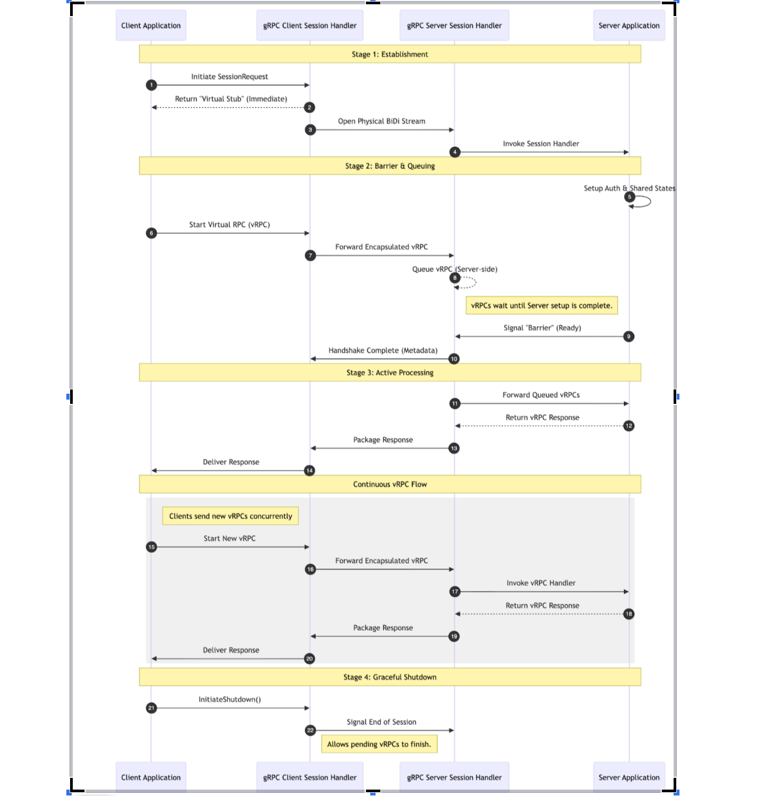
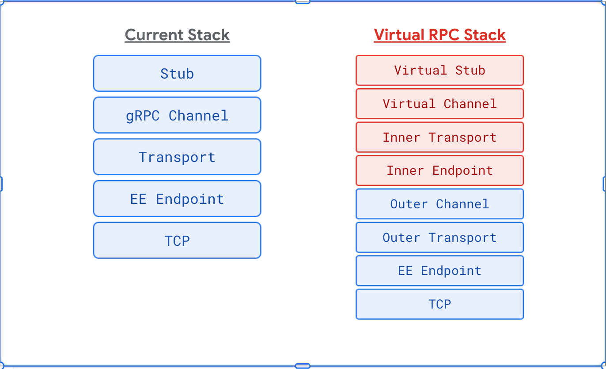

gRPC Virtual RPCs on Bidi Streams
---------------------------------

* Author(s): Siddharth Nohria
* Approver: a11r
* Status: Draft
* Implemented in: C++ (Prototype)
* Last updated: 2026-03-20

Table of Contents
-----------------

* [Abstract](#abstract)
* [Background](#background)
* [Terminology](#terminology)
* [Design](#design)
  * [Protobuf API](#protobuf-api)
  * [Generic API Support](#generic-api-support)
  * [The Session Lifecycle](#the-session-lifecycle)
    * [Establishment and Barrier Mechanism](#establishment-and-barrier-mechanism)
    * [Deadlines and Cancellations](#deadlines-and-cancellations)
    * [Client Retries](#retries)
    * [Graceful Shutdown](#graceful-shutdown)
  * [Data Flow and Multiplexing](#data-flow-and-multiplexing)
    * [Wire Format: HTTP/2 on HTTP/2](#wire-format)
    * [Alternative Wire Format](#alternative-wire-format)
    * [Why HTTP/2 on HTTP/2 is Chosen](#why-http2-on-http2-is-chosen)
  * [Flow Control](#flow-control)
  * [Server-Side Architecture: Dual Server Approach](#server-side-architecture)
* [C++ User-Facing APIs](#c-user-facing-apis)
  * [Client-Side API](#client-side-api)
  * [Server-Side API & Context Propagation](#server-side-api)
    * [Context Propagation](#context-propagation)
* [Java User-Facing APIs](#java-user-facing-apis)
* [Go User-Facing APIs](#go-user-facing-apis)

Abstract
--------

gRPC will support multiplexing virtual RPCs over a single common bi-directional
stream. The high-level idea is that by sending the virtual RPCs over the same
stream, we can eliminate significant one-time setup costs associated with each
RPC. In addition, server applications can cache and re-use potentially heavy
per-client application metadata, which are likely to be consistent across all
RPCs from the same client.

Background
----------

Currently, each RPC sent over a gRPC channel incurs per-RPC overheads.
For high-throughput services, operations like authentication, authorization
policy validation, and other repetitive checks consume latency and CPU usage on
a per-RPC basis. When the same clients are sending the RPC methods repeatedly,
these are wasted cycles. Additionally, this allows applications to re-use heavy
per-client application states, which are likely to be consistent across all RPCs
from the same client.

While applications can implement custom multiplexing over bidirectional streams,
doing so forces owners to reinvent gRPC features, from the core features like
deadlines and cancellations, to the more complex ones like telemetry, flow
control, load shedding etc. Moving this functionality into gRPC as a central
framework avoids duplicated effort and provides a structured mechanism for
high-performance, stateful RPC multiplexing.

Terminology
-----------

* **Physical Stream**: The underlying BiDi stream over which all messages are exchanged.
* **Virtual RPC (vRPC) / Stream**: The user-facing single RPC / stream, multiplexed over the physical stream.
* **Client / Server Session**: The internal gRPC state handling the virtual RPCs.
* **Session RPC**: The initial user-facing RPC used to establish and manage the session.
* **Virtual Stub**: Wraps a single physical stream and is used to start virtual RPCs.

Design
--------

### Protobuf API

We introduce a new proto syntax: `returns service`. The client will send an
initial Session Request to establish the common context to be used for every
virtual RPC.

```proto
service FooService {
  rpc SessionRequest(ApplicationRequest) returns (service FooVrpcService);
}

service FooVrpcService {
  rpc VrpcUnaryMethod(VrpcRequest) returns (VrpcResponse);
  rpc VrpcClientStreamingMethod(stream VrpcRequest) returns (VrpcResponse);
  rpc VrpcServerStreamingMethod(VrpcRequest) returns (stream VrpcResponse);
  rpc VrpcBidiStreamingMethod(stream VrpcRequest) returns (stream VrpcResponse);
}
```

Since the `returns service` syntax will not be available until a future Protobuf
edition, we need to support a workaround way to start sessions.

### Generic API Support

The `GenericStub` allows users to send requests without any dependency on
Protobuf, and the corresponding generated code. Clients can directly send
any methods over the stub. This is especially useful for proxies that need to
dynamically route requests without knowing the specific payload types in
advance.

gRPC will provide a `GenericStub` based API for both the session establishment
request, and the virtual RPCs, allowing clients in all supported languages to
invoke sessions dynamically.

### The Session Lifecycle



#### Establishment and Barrier Mechanism

The session begins when the client initiates a Session RPC. This RPC establishes
the physical bi-directional stream and allows the client to send session-level
metadata, and an initial payload message. To the client application, this RPC
immediately returns a "Virtual Stub", which the application can then use to send
any virtual RPCs.

The client can start sending virtual RPCs immediately, before the initial
metadata / payload reach the server. However, the server application will
provide an explicit signal (a "barrier") telling the server session handler that
all common application context has been successfully set up, and the server is
ready to accept virtual RPC traffic. Internally, this signal triggers sending
the `server_initial_metadata` from the session request handler to the client.

While the client application does not need to wait to explicitly get this
signal, all virtual RPCs sent prior to the barrier will be queued internally on
the server side until this handshake is complete. This queuing is desirable on
the server side instead of the client side, to avoid adding an extra round trip
before sending the virtual requests, since this adds extra latency to all the
early virtual requests in the session. This latency penalty can be especially
bad for short-lived sessions, where clients might establish some session to
exchange very few requests before closing.

Alternatively, while by default the application can send the virtual RPCs before
the session is acknowledged, the client may also strictly want to wait for the
session to be established correctly. Since the server will send the
`server_initial_metadata` after session acknowledgement, the client can wait
for this signal (e.g., via an `OnSessionAcknowledged` callback) to validate
session acknowledgement before sending virtual RPCs.

```cpp
void ClientReactor::OnSessionReady(grpc::internal::Call call) override {
  channel_ = grpc:::CreateVirtualChannel(std::move(call));
}

void ClientReactor::OnSessionAcknowledged(bool ok) override {
  if (ok) {
    // Start sending vRPCs
  } else {
    // Shutdown
  }
}
```

#### Deadlines and Cancellations

We must support deadlines and cancellations for both the Session Request and
each individual virtual request.

* **Session Deadline**: The session deadline is converted to a `grpc-timeout`
header and sent to the server as the standard initial metadata.
When this expires, the gRPC client cancels the Session Request with a
`DeadlineExceeded` status immediately. The session handler then considers all
live virtual requests cancelled. Note that the error status on the virtual RPC
will not be `DeadlineExceeded`, since the virtual RPC's deadline did not expire.
Instead, the virtual RPC will fail with `Unavailable` error status, indicating
an underlying connection failure.

* **Virtual RPC Deadline**: Deadlines on individual vRPCs work natively, same as
non-virtual RPCs. The only difference will be that, when the deadline expires,
the cancellation signal will be caught by the session handler and sent as a
payload message over the physical stream.

#### Client Retries

For regular RPCs, gRPC natively supports retries. Clients can define their retry
policy in the service config provided to the channel arguments. A retry policy
allows the users to define the following parameters:

* **maxAttempts**: how many times to attempt the RPC before failing.
* **backOff**: configures delay between attempts.
* **retryableStatusCodes**: retry only when receiving these status codes.

If retries are enabled for Bi-directional streams, client maintains a list of
all messages on the stream, until the initial metadata is received from the
server. In case of rejection, all these messages are retried.

Retries for the session establishment request itself will work exactly the same
as regular RPCs, using the same retry configuration. Because
`server_initial_metadata` is not sent until the server application's
acknowledgement, all queued virtual RPCs will also be safely retried on the new
physical stream.

For virtual RPC failures, retries on the same session are
**generally not advisable**, because retries should typically happen to
different backends. But since the session is tied to a single specific backend,
retries should ideally be handled by the client application itself.
That said, configuration options to retry on virtual channels will be provided
for clients who explicitly require it.

#### Graceful Shutdown

The server can initiate a graceful shutdown of the session, telling the client
to finish all scheduled virtual RPCs but not start new ones.

* Internally, gRPC will accomplish this by sending an HTTP/2 `GOAWAY` frame on
the inner transport.
* Upon receiving this, the client virtual channel enters the
`GRPC_CHANNEL_TRANSIENT_FAILURE` state. New virtual RPCs are immediately
rejected with `UNAVAILABLE` status.
* Once all pending virtual RPCs complete, the session will be cleanly shut down.

### Data Flow and Multiplexing

#### Wire Format: HTTP/2 on HTTP/2



To natively inherit gRPC's rich feature set, we will build the virtual stack as
a new HTTP/2 transport stack, running *over* the standard HTTP/2 stack.

1. The client application first initiates a physical stream over the primary
HTTP/2 transport. The initial metadata and the first payload message are sent
as is over this stream.
2. This established stream is wrapped in a new gRPC Endpoint. We then create the
new inner HTTP/2 transport and the virtual channel with this endpoint, and
return this virtual channel to the client application.
3. Virtual RPCs on this channel are first sent to the inner HTTP/2 transport,
the transport encodes these into raw bytes and writes to the Endpoint.
These raw bytes are then sent as payload messages over the outer stream wrapped
in this endpoint.

4. On the server side also, receiving a session request similarly spins up an
inner HTTP/2 transport that decodes the subsequent payload messages as
independent inner streams.

#### Alternative Wire Format

An alternative design considered was defining a custom frame format over the
physical stream where the over the wire payload message would be structured as
follows:
1. **Metadata Length (4 Bytes)**: An integer denoting the size of the following serialized metadata.
2. **Serialized Metadata**: An encapsulated frame
(`ClientVrpcFrame` or `ServerVrpcFrame`) containing the unique virtual RPC ID
and the frame type (initial metadata, payload, cancellation, or half-close).
3. **Optional Raw Payload**: The raw binary bytes of the application message
follow immediately after the serialized proto. This is present only if the
message is of the payload type.

#### Why HTTP/2 on HTTP/2 is chosen

The big benefit of the HTTP/2 on HTTP/2 approach is that we do not need to
re-invent many gRPC features for the virtual stack, which are already provided
by the HTTP/2 stack.

* If we utilized the alternative wire format, we would have to implement many
core features like Flow Control, max_concurrent_streams, message chunking,
retries, etc. By using the HTTP/2 as the inner wire format, we get all these
features for free.

* The downside is that this wire format is somewhat more complicated, and there
is a non-trivial cost to the double encoding.

### Flow Control

In a traditional bidirectional stream, if an application handler is slow and
fails to read messages, gRPC’s internal buffers fill up, eventually causing the
receiver to push back on the sender and stalling the entire stream.
When multiple independent virtual RPCs share a single physical stream, a single
slow handler could potentially stall all other concurrent virtual RPCs in the
session.

The HTTP/2-on-HTTP/2 architecture implicitly addresses this through:

*   **Stall Prevention**: The outer HTTP/2 transport proactively writes data to
the inner transport's endpoint. This frees the outer stream to continue
receiving and processing frames for other virtual RPCs, even if one specific
vRPC is being handled slowly.
*   **Backpressure**: The inner transport’s flow control window and
`max_concurrent_streams` setting prevent unbounded queue growth.
*   **Fairness**: Native HTTP/2 frame interleaving ensures that large virtual
RPC payloads do not block smaller, latency-sensitive ones.

### Server-Side Architecture: Dual Server Approach

Often, gRPC servers are configured with mandatory interceptors or modules
(e.g., authentication, authorization) that run on every incoming connection.
Because virtual RPCs have already been authorized at the outer session level,
re-running these modules on the inner virtual RPCs is unnecessary.

To allow virtual handlers to bypass these mandatory checks, the design uses a
dual-server approach. We will create a new gRPC server without these modules.
Virtual service handlers are registered exclusively on this second server.
When the primary gRPC server receives a Session Request, it bridges the inner
HTTP/2 transport to this secondary server, ensuring vRPCs seamlessly bypass the
primary server's mandatory modules.

This also provides an easy interface to configure the inner HTTP/2 server
differently. Any configuration we want specific to the inner transport, can just
be set on this second server.

### C++ User-Facing APIs

The C++ prototype uses Reactor-based APIs to manage the session lifecycle and
establish virtual channels using the generic API approach.

#### Client-Side API

Clients establish a session using `ClientSessionReactor` and
`GenericStubSession`.

```cpp
class MySessionReactor : public grpc::ClientSessionReactor {
 public:
  void OnSessionReady(grpc::internal::Call call) override {
    // Create the virtual channel using the established call.
    // CreateVirtualChannel creates a light-weight client side channel.
    virtual_channel_ = grpc::experimental::CreateVirtualChannel(std::move(call));
  }
  void OnSessionAcknowledged(bool ok) override { /* Session is fully ready */ }
  void OnDone(const grpc::Status& s) override { /* Session ended */ }
  
 private:
  std::shared_ptr<grpc::Channel> virtual_channel_;
};

// Setting up the session
grpc::experimental::GenericStubSession<SessionRequest, Empty> session_stub(channel);
auto* reactor = new MySessionReactor();
session_stub.PrepareSessionCall(&context, "/service/SessionRequest", {}, &request, reactor);
reactor->StartCall();
```

#### Server-Side API

On the server, `ServerSessionReactor` is used to establish the common session
context, and represent the lifecycle of the session.

```cpp
class MyServerSessionReactor : public grpc::ServerSessionReactor {
 public:
  MyServerSessionReactor() {
    // Notify gRPC that we are ready to accept virtual RPCs
    StartVirtualRPCs();
  }
  void TriggerGracefulShutdown() {
    InitiateGracefulShutdown([this](absl::Status status) {
       Finish(grpc::Status::OK);
    });
  }
  void OnDone() override { delete this; }
};
```

#### Context Propagation

Applications need to prepare and share session-level resources (such as
authentication credentials or cached application states) among multiple virtual
RPC handlers. To provide easy and implicit lifetime management for these
session-level resources, this application context will be stored on the Session
Call's **Arena**.

Because gRPC’s Arena is a ref-counted object, when a virtual call is created,
gRPC can simply store a reference to the parent session call's arena on the new
virtual call's arena.

This design ensures that:

* **Decoupled Lifetimes**: Shared context remains valid even if the parent
session handler completes, as the virtual handlers hold a reference to the same underlying memory.
* **Implicit Management**: Resources are automatically cleaned up only after
both the session and all its associated virtual RPCs have finished.

Users can set and retrieve this shared context through the `ServerContext` API:

```cpp
// In Session Handler: Set the context on the outer request ServerContext
context->SetContext(std::make_shared<ApplicationContext>(...));

// In Virtual RPC Handler: Retrieve the shared application state from the session
auto app_context = context->GetSessionContext<ApplicationContext>();
```

### Java User-Facing APIs

TBD

### Go User-Facing APIs

TBD

