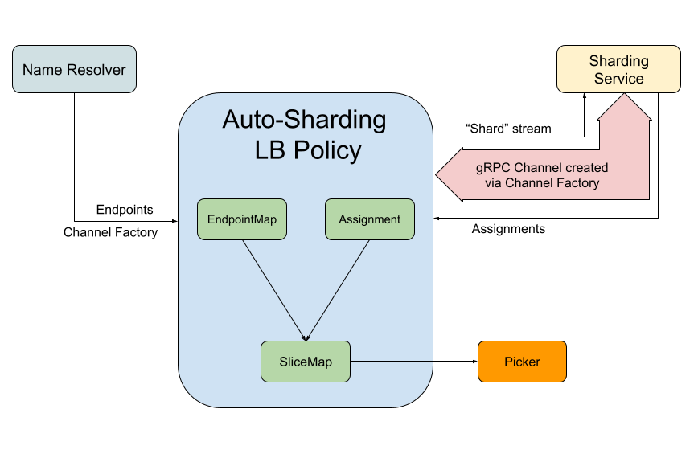
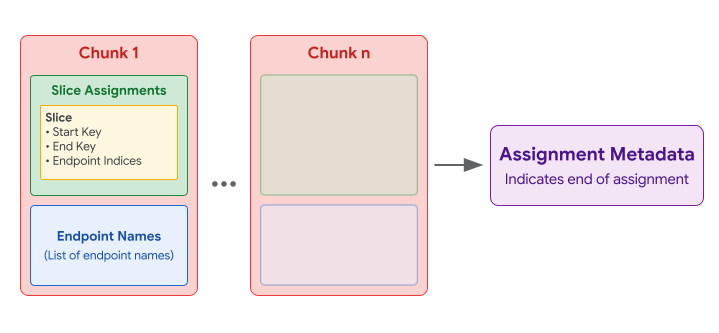

A119: Auto-Sharding LB Policy
----
* Author: easwars
* Approver: markdroth
* Implemented in: TBD
* Last updated: 2026-09-21
* Discussion at: <https://groups.google.com/g/grpc-io/c/BXcwH6ytqRs>

## Abstract

Add support for an auto-sharding load balancing policy, that communicates with
an external sharding service to receive resource assignments. This policy should
be supported in both xDS and non-xDS based deployments.

## Background

An auto-sharding service enables client-side load balancing through the
following process:

* Dividing the keyspace into distinct, non-overlapping ranges (or slices)
* Assigning specific resources to these key ranges
* Adjusting these mappings in real-time to account for resource availability and
  fluctuating load
* Gathering load metrics for keys within an application-defined keyspace

Within this framework, application-defined keys generally consist of arbitrary
byte sequences, such as:

* Individual User IDs or Project IDs
* Tenant identifiers for multi-tenant architectures
* Identifiers created via hashing

The targets for traffic distribution, or resources, frequently include:

* Application servers
* Kubernetes pods within a cluster

Implementing a load balancing policy in gRPC that uses an auto-sharding service
has applications in various scenarios, such as:

* Enhancing request affinity in stateful environments
* Improving isolation and system resilience for multi-tenant services
* Providing the scalability required for rapid growth in AI-driven applications

### Related Proposals

* [A42: xDS Ring Hash LB Policy][A42]
* [A52: gRPC xDS Custom Load Balancer Configuration][A52]
* [A62: Pick First][A62]
* [A74: xDS Config Tears][A74]
* [A75: xDS Aggregate Cluster Behavior Fixes][A75]
* [A78: gRPC OTel Metrics for WRR, Pick First, and XdsClient][A78]
* [A81: xDS Authority Rewriting][A81]
* [A102: xDS GrpcService Support][A102]
* [A121: RPC Delay Observability][A121]

## Proposal

Add the `autosharding_experimental` LB policy in gRPC that contains the
following functionality:

* Utilizing the [OSS Autosharding gRPC protocol][Autosharding] for communicating
  with a sharding service and processing assignments from that service.
  * These assignments will partition an application-defined keyspace into
    distinct, non-overlapping key-ranges or slices, each associated with a set
    of server endpoints.
* Mapping client application requests to a specific key within the
  application-defined keyspace.
* Identifying the matching key-range and choosing a server endpoint assigned to
  it.
* Providing a fallback mechanism to route client traffic when assignments from
  the sharding service are unusable.

Crucially, the LB policy receives its configuration and endpoint data from the
Name Resolver and not from the sharding service.

### LB Policy Architecture



The LB policy receives the following information from the Name Resolver apart
from its configuration:

* A set of endpoints where each endpoint may include an optional hostname
  attribute. If this attribute is missing, the first address associated with the
  endpoint shall serve as the hostname. The endpoint hostname attribute
  described in [gRFC A81][A81] will be used here.
* A "Channel Factory" that returns a fully functional gRPC Channel to the
  sharding service, given an opaque string specified in the configuration

#### EndpointMap

The endpoints are stored in a map where the key is the hostname of the endpoint,
and the value is the state associated with the endpoint. This state includes a
child `pick_first` LB policy that is created lazily, and the most recent
connectivity state and picker returned by that policy. We'll call this map the
`EndpointMap` going forward. This could look something like this:

```python
# Endpoint state used in the LB policy.
class EndpointState:
  index:    int                # Index of the endpoint within the NR update
  endpoint: Endpoint           # The actual endpoint returned by the NR
  child_lb: Balancer           # Child balancer managing the endpoint
  state:    ConnectivityState  # Most recent connectivity state of the endpoint
  picker:   Picker             # Most recent picker returned by the child balancer

  # Called to request a connection.
  # Lazily creates the LB policy as needed.
  def RequestConnection(self):
    if self.child_lb is None:
      # ...create child policy...
    self.child_lb.ExitIdle()

# Map from endpoint hostname to endpoiont state
class EndpointMap:
  m: dict[str, EndpointState]
```

The LB policy must create a new `EndpointMap` whenever it receives endpoints
from the Name Resolver. If multiple endpoints share the same hostname,
implementations may arbitrarily pick one and drop the others.

```python
def build_endpoint_map(resolved_endpoints: list[Endpoint]) -> EndpointMap:
  endpoint_map = EndpointMap(m={})
  for endpoint in resolved_endpoints:
    if endpoint.hostname not in endpoint_map.m:
      endpoint_map.m[endpoint.hostname] = EndpointState(
          index    = len(endpoint_map.m),
          endpoint = endpoint,
      )
  return endpoint_map
```

The LB policy should update the existing `EndpointMap` when it receives an
update from the child policy. This means that the `EndpointMap` cannot be shared
with the picker without synchronizing access to it. Instead, we propose creating
a new data structure that contains only the fields from `EndpointState` that the
`Picker` needs access to.

```python
# Endpoint state used in the picker.
class PickerEndpoint:
  state:    ConnectivityState
  picker:   Picker

  # The purpose of this field is to allow the Picker to trigger a connection
  # attempt on the child policy. If the child LB policy instance does not yet
  # exist, the implementation MUST lazily create it before triggering the
  # connection attempt. Implementations are free to use a type that is
  # most appropriate for them.
  endpoint: ExitIdler | EndpointState
```

#### Assignment

The LB policy relies on an internal helper component, which we will refer to as
the `AutoshardingClient`, to produce a validated and gap-free set of key-ranges
and their associated endpoints in a data structure named `Assignment`.

The LB policy must use the injected "Channel Factory" to create a gRPC channel
to the sharding service, and must pass it to the `AutoshardingClient`, which
will use it to create a `WatchShardingAssignment` stream to receive assignments
from the sharding service. The `Assignment` data structure could look something
like this:

```python
class Slice:
  start_key:  bytes      # Inclusive
  end_key:    bytes      # Exclusive, None for sentinel
  endpoints:  list[int]  # Indices into Assignment.endpoint_names

class Assignment:
  slices:         list[Slice]  # List of non-overlapping key-range slice assignments
  endpoint_names: list[str]    # Complete list of endpoint names in the assignment
  generation:     int          # Generation number of the assignment
```

#### SliceMap

To route each RPC, the picker will essentially need to use the `Assignment` to
determine which `Slice` to use, choose an endpoint name from within that
`Slice`, and then look up that endpoint name in the `EndpointMap`. For
performance reasons, we want to avoid having to look up the endpoint name in a
map, so we will create a new data structure called a `SliceMap` that is
optimized for lookups. Given a key, it returns a matching key-range. The
`SliceMap` must be immutable, allowing the Picker to access it without any
explicit synchronization with the LB policy. The `SliceMap` is meant to be used
by the `Picker` in conjunction with a list of `PickerEndpoint`s such that the
list can be swapped out, as long as the number and order of endpoints don't
change.

```python
class SliceEntry:
  start_key: bytes      # Inclusive start key
  endpoints: list[int]  # Indices into list[PickerEndpoint] in Picker

class SliceMap:
  slices:        list[SliceEntry] # Sorted by start_key
  fallback_pool: list[int]        # Indices into list[PickerEndpoint] for resolver endpoints
  generation:    int              # Snapshot generation number
```

Because assignments are pre-validated to have no gaps and cover the full key
range, and since `SliceMap.slices` is sorted by `start_key`, the implementation
of `SliceMap.lookup` boils down to a binary search to find the smallest index
`i` where `SliceMap.slices[i].start_key > key`. Once we have `i`, index `i - 1`
is what we are actually looking for. Here is a psuedo-code for it:

```python
# Returns an index into SliceMap.slices
def lookup(self, key: bytes) -> int | None:
  # Handle the startup/fallback case where there are no assignments.
  if not self.slices:
    return None

  # Binary search for key, comparing against slice_entry.start_key.
  # Returns (idx, found):
  # - found = True  if slices[idx].start_key == key
  # - found = False if key is not an exact start_key match;
  #           idx is the insertion index (first slice where start_key > key).
  idx, found = binary_search(self.slices, key, key_func=lambda se: se.start_key)

  # Exact match on start_key.
  if found:
      return idx

  # Key falls in range [slices[idx - 1].start_key, slices[idx].start_key).
  return idx - 1
```

#### Building the SliceMap

The `SliceMap` is generated from the `EndpointMap` and `Assignment` when either
of them change. Here is the pseudo-code for the logic to build the `SliceMap`:

```python
def build_slice_map(endpoint_map: EndpointMap, assignment: Assignment | None) -> SliceMap:
  slice_map = SliceMap(slices=[], fallback_pool=[], generation=0)

  # Populate fallback_pool deterministically sorted by endpoint index.
  slice_map.fallback_pool = [
      es.index for es in sorted(endpoint_map.m.values(), key=lambda es: es.index)
  ]

  # If no assignment has been received yet (startup case), return early with
  # empty slices.
  if assignment is None:
      return slice_map

  slice_map.generation = assignment.generation

  # Build SliceEntry for each Slice in the assignment.
  for slice_data in assignment.slices:
    slice_entry = SliceEntry(start_key=slice_data.start_key, endpoints=[])

    for idx in slice_data.endpoints:
      # Map index -> hostname -> EndpointState.index
      # Drop hostnames not present in the endpoint map.
      hostname = assignment.endpoint_names[idx]
      if hostname in endpoint_map.m:
        slice_entry.endpoints.append(endpoint_map.m[hostname].index)

    slice_map.slices.append(slice_entry)

  return slice_map
```

### Fallback Mechanism

The LB policy must support a fallback mechanism that utilizes all endpoints
provided by the Name Resolver. There are two types of fallback:

* Per-slice fallback: This happens when the LB policy contains valid endpoints
  and assignments, but all endpoints in the matching `SliceEntry` for an RPC are
  in `TRANSIENT_FAILURE`.
* Fallback at startup: This happens when the `AutoshardingClient` returns an
  error. See [AutoshardingClient](#contract-of-the-autoshardingclient) for more
  details on when it returns an error.

Key considerations here:

* The LB policy must employ the fallback mechanism only when enabled in the LB
  policy configuration.
* The LB policy must consider all available endpoints during fallback and must
  not employ any sort of subsetting.

#### Fallback at Startup

When the LB policy creates a new `AutoshardingClient`, it must continue using
state reported by the previous one (either a valid assignment or an error) until
it receives state from the new one.

* If the LB policy is using an existing assignment, it must continue to process
  endpoint updates from the Name Resolver and state updates from the child LB
  policies as normal.
* If the LB policy does not contain any state from the previous
  `AutoshardingClient`, it must queue RPCs until it receives state from the new
  one.

When the policy receives state from the newly created `AutoshardingClient`, it
must build a `SliceMap` and update the parent gRPC Channel with a new `Picker`,
which then retries any queued RPCs:

* If a valid assignment is received , the new `Picker` will use this assignment
  for the retried RPCs.
* If an error is received:
  * If fallback is enabled: RPCs are routed at random to all endpoints provided
    by the Name Resolver.
  * If fallback is disabled: RPCs fail until a valid assignment is received.

While RPCs are queued waiting for one of the above events to happen, the
`Picker` must set `delay_type` to "autosharding_assignment_pending". See [WIP
gRFC A121][A121].

### Supported modes of operation

The LB policy must support two primary modes of operation:

* An LB policy that performs both locality and endpoint picking:
  * In xDS use-cases, such an LB policy receives endpoints across all
    localities and shards requests accordingly. This is similar to how the
    `ring_hash` LB policy, specified in [gRFC A42][A42], works.
  * In non-xDS use-cases, such an LB policy will be configured as the top-level
    LB policy, sharding requests across a flat list of endpoints provided by the
    Name Resolver.
* An LB policy that only performs endpoint picking:
  * In xDS use-cases, such an LB policy will be configured under a policy like
    `weighted_target_experimental` that handles locality picking, while each
    `autosharding_experimental` child policy instance only handles endpoint
    picking within its specific locality.

The LB policy must maintain consistent behavior across both modes and must not
require explicit knowledge of its operational context. Notably, we do not
support using this LB policy solely for locality picking with delegation to a
separate endpoint-picking policy. This configuration lacks identified use cases
and introduces significant implementation complexity.

### Load Balancing Configuration

The `autosharding_experimental` LB policy's configuration will be as follows:

```proto
message AutoshardingLbConfig {
 // Key to pass to the "Channel Factory" to create a gRPC Channel to the
 // sharding service.
 string channel_factory_key = 1;

 // A unique ID sent to the sharding service to locate assignments.
 //
 // Can optionally contain a "%s" token that will be replaced with the
 // "Locality" before sending. If a "%s" token is present, but the "Locality"
 // information is not available to the LB policy, the token will be replaced
 // with an empty string.
 string autosharding_target = 2;

 // Name of the request header containing the application-defined key. This key
 // is used to look up the matching key-range assigned by the sharding service.
 string key_header_name = 3;

 // If true, fallback mechanism is enabled.
 bool enable_fallback = 4;

 // How long to wait for the initial assignment from the sharding service. If
 // no assignment is received before the timer fires, the LB policy  will either
 // go into fallback mode (if enable_fallback is true) or fail RPCs.
 // Defaults to 60 seconds if not specified.
 google.protobuf.Duration initial_assignment_timeout = 5;
}
```

Key considerations regarding the LB policy configuration that must be handled by
the "Channel Factory".

* The configuration deliberately omits credentials to be used for the
  communication with the sharding service. This decision prevents potential
  privilege-escalation vulnerabilities resulting from a compromised control
  plane, following the security framework established in [gRFC A102][A102].
* Per-request gRPC metadata for the sharding service is omitted from the
  configuration.

### Handling updates from the Name Resolver

The logic for handling updates from the Name Resolver is described in this
pseudo-code:

```python
def handle_name_resolver_update(
    self, state: ResolverState, config: LbConfig
) -> Status:
  if not state.endpoints:
    # Set channel's connectivity state to TRANSIENT_FAILURE and provide an
    # erroring picker.
    self.update_channel_state(TRANSIENT_FAILURE, ErrorPicker(bad_resolver_state))
    return bad_resolver_state

  channel_factory = get_channel_factory_from_resolver_state(state)
  if channel_factory is None:
    # Set channel's connectivity state to TRANSIENT_FAILURE and provide an
    # erroring picker.
    self.update_channel_state(TRANSIENT_FAILURE, ErrorPicker(bad_resolver_state))
    return bad_resolver_state

  # Reuse the existing gRPC channel unless channel_factory_key has changed.
  channel = self.grpc_channel
  create_new_autosharding_client = False
  new_grpc_channel_created = False

  if (
      self.config is None
      or config.channel_factory_key != self.config.channel_factory_key
  ):
    channel = channel_factory(config.channel_factory_key)
    if channel is None:
      # Set channel's connectivity state to TRANSIENT_FAILURE and provide an
      # erroring picker.
      self.update_channel_state(
          TRANSIENT_FAILURE, ErrorPicker(channel_creation_error)
      )
      return channel_creation_error
    create_new_autosharding_client = True
    new_grpc_channel_created = True

  # If autosharding_target in config has changed, ensure a new
  # AutoshardingClient is created.
  if (
      self.config is None
      or config.autosharding_target != self.config.autosharding_target
  ):
    create_new_autosharding_client = True

  # Create the new AutoshardingClient first, then close the previous client,
  # and only then close the previous gRPC channel so no active client ever
  # references a closed channel.
  if create_new_autosharding_client:
    new_client = self.create_new_autosharding_client(channel, config, state)
    self.close_previous_autosharding_client()
    self.autosharding_client = new_client

  if new_grpc_channel_created:
    self.close_previous_grpc_channel()
    self.grpc_channel = channel

  # Update cached copy of the configuration before building the new Picker.
  self.config = config

  # Update the EndpointMap with the new set of endpoints and lazily create a
  # `pick_first` child policy for each endpoint.
  self.update_endpoint_map(state.endpoints)
  self.create_child_policies()

  # Rebuild the SliceMap using the latest EndpointMap and current Assignment
  # (if any), then update the channel's connectivity state and Picker.
  self.slice_map = build_slice_map(self.endpoint_map, self.assignment)
  self.update_state_and_picker()
  return OK
```

### Handling updates from child policies

When the LB policy receives a state update from one of its child policies,
containing the new connectivity state and picker for the child policy, the LB
policy must perform the following:

* Update the `EndpointState` stored in the `EndpointMap` corresponding to the
  child policy.
* Build a new `Picker` with the existing `SliceMap` and updated `EndpointMap`.
  * Since the order or number of endpoints did not change as part of this
    update, the `Picker` will be able to build a new `list[PickerEndpoint]` and
    use it with the existing `SliceMap`.
* Compute the aggregated connectivity state of the gRPC channel.
* Update the gRPC channel with the new connectivity state and `Picker`.

### Creating a gRPC Channel to the Autosharding Service

The LB policy will be injected with a “Channel Factory” via attributes,
alongside its configuration. This utility will help create a fully functional
gRPC Channel given the `channel_factory_key` in the LB policy configuration.
Implementations must ensure the key uniquely encodes all parameters necessary
for channel creation. For example, credentials need only be included in the key
if the factory supports creating channels with different credentials.

If the `channel_factory_key` is unrecognized or disallowed, or if channel
creation fails for any other reason, the “Channel Factory” must indicate this
failure to the LB policy. Depending on the language, the factory may either
return an error directly (as in Go) or return a "lame" channel that fails all
RPCs with an appropriate status message (as in C++).

In xDS-based deployments, this “Channel Factory” will be injected by the
`cds_experimental` LB policy. Refer to section [Changes to CDS LB
policy](#changes-to-cds-lb-policy) for more details. For non-xDS environments,
users will have the capability to inject this utility via a dedicated channel
option.

#### Go

The “Channel Factory” or provider is defined as a function type that accepts a
string key, and returns a gRPC channel. The existing `grpc.ClientConnInterface`
interface, instead of the concrete `*grpc.ClientConn` type,  is used to
represent a gRPC channel, to allow for wrapping. The LB policy can create a
client stub to the sharding service by passing this interface to the protobuf
generated code and make RPCs using that client stub.

```golang
package grpc

// A factory to create a grpc.ClientConn given a string. 
//
// The second return value is a cancel function that the caller must invoke
// once they are done using the returned grpc.ClientConn. 
type ClientConnProvider func(string) (ClientConnInterface, func(), error)
```

A `DialOption` will be added to allow the user to inject a “Channel Factory”.
gRPC will take care of plumbing this down to the LB policies.

```golang
package grpc

// WithClientConnProvider returns a dial option that makes the channel provider
// available to LB policies.
func WithClientConnProvider(f ClientConnProvider) DialOption { ... }
```

We will also have APIs to set and get this factory from the `resolver.State`
struct that is sent to the LB policy as part of a resolver update.

```golang
package grpc

// ClientConnProviderFromResolverState returns a ClientConnProvider from the
// given resolver state, or nil if not present.
func ClientConnProviderFromResolverState(state resolver.State) ClientConnProvider { ... }

// SetClientConnProvider returns a copy of the resolver state with the provider
// set as an attribute.
func SetClientConnProvider(s resolver.State, p ClientConnProvider) resolver.State { ... }
```

#### C++

TBD

#### JAVA

TBD

### Communicating with the Autosharding service

The LB policy communicates with an external sharding service using the [OSS
Autosharding gRPC][Autosharding] protocol. Implementations are encouraged to
encapsulate all aspects of this communication like managing the stream
lifecycle, parsing received messages and validating the assignments inside a
dedicated component named the `AutoshardingClient`.

#### Creating the AutoshardingClient

The LB policy must create a new instance of the `AutoshardingClient` whenever
the `channel_factory_key` or the `autosharding_target` field in the
configuration changes. In the former case, it must also create a new gRPC
channel to the sharding service using the “Channel Factory” provided to it
before creating the `AutoshardingClient`.

When the `channel_factory_key` changes, the `AutoshardingClient` might be
talking to a completely new sharding server and when the `autosharding_target`
changes, the `AutoshardingClient` is requesting assignments for a completely
different resource. In both these cases, any previously stored generation number
is no longer valid. Continuing to use them may cause the `AutoshardingClient` to
not accept updates from the sharding server for a long time. Creating a new
`AutoshardingClient` in these cases gracefully handles these issues.

At creation time, the `AutoshardinClient` is passed the following:

* A gRPC channel to the autosharding service.
* A string that uniquely identifies an assignment in the autosharding service.
  This string is derived from the `autosharding_target` field of the LB policy
  configuration. If a `%s` token was present in configuration field, the LB
  policy must replace it with the “Locality” value  passed to it as a resolver
  state attribute (similar to how the “Channel Factory” is passed).
  * In xDS use-cases, the “Locality” value is currently populated by the
    `weighted_target_experimental` LB policy as a resolver state attribute, and
    is available to all LB policies that sit underneath it.
    * When the `autosharding_experimental` LB policy is used for endpoint
      picking alone, it will sit underneath the `weighted_target_experimental`
      LB policy, and therefore will have access to this resolver attribute. See
      [gRFC A78][A78] for more details.
    * When the `autosharding_experimental` LB policy is used for both locality
      and endpoint picking, the “Locality” value will not be part of the
      `autosharding_target` field of the LB policy configuration, as the policy
      will handle endpoints from all localities.
  * In non-xDS use-cases, the common case is for the `autosharding_target` to
    not contain `%s` tokens. But if they do, it is the responsibility of the
    user to ensure that this attribute is populated by the Name Resolver. If
    this attribute is not available, the LB policy will replace the `%s` token
    with an empty string.
* A UUID created by the LB policy time at build time. The `AutoshardingClient`
  must reuse this value across stream restarts.
* A timeout that determines how long to should wait for the initial assignment
  from the sharding service. The LB policy passes the value of the
  `initial_assignment_timeout` field from the LB policy configuration here.

#### Contract of the AutoshardingClient

To ensure that the LB policy's implementation to build a `SliceMap` can remain
simple and the picker's binary search on the `SliceMap` remains fast and
correct, the `AutoshardingClient` must produce an `Assignment` that conforms to
the following rules:

1. The list of `Slice`s must cover the entire possible keyspace, starting from
   the minimum possible key (the empty byte string `b""`) and ending with the
   maximum possible key (infinity, represented as `None`).
2. The `slices` list must be sorted in ascending lexicographical order by
   `start_key`.
3. The partitioning must be contiguous and non-overlapping. For every slice
   index `i` from `0` to `N - 2`, `slices[i].end_key` must exactly equal
   `slices[i + 1].start_key`.
4. Any gaps in the key-ranges returned by the autosharding server must be
   explicitly filled by the `AutoshardingClient` as a `Slice` entry with an
   empty `endpoints` list (`[]`).

The `AutoshardingClient` must report valid assignments to the LB policy as and
when it receives them from the autosharding server. If it encounters errors, it
must report them to the LB policy **only** if it did not previously report a
valid assignment. Once a given `AutoshardingClient` reports a valid assignment,
it does not need to report any errors after that, because the LB policy will
continue to use the previous valid assignment.

The `AutoshardingClient` must report the following scenarios as errors:

* The stream fails without receiving a valid assignment
* The stream receives an invalid assignment
* The initial assignment timer fires before it receives a complete assignment

#### Sending the first message

The `AutoshardingClient` sends an `InitialClientConfig` message on the stream to
kick things off. This message currently contains three fields:

* `target`: The autosharding target string passed to it at creation time.
* `client_uuid`: The UUID string passed to it at creation time.
  the same value across stream restarts.
* `latest_generation`: The generation number of the most recent valid assignment
  received by this `AutoshardingClient` or `0` if it is yet to receive any valid
  assignment.
  * This allows the sharding service to not resend a previously sent good
    assignment in the case of a stream failure.

#### Handling responses from the Autosharding server

Responses received from the sharding server in a
`WatchShardingAssignmentResponse` message can one of the following:

* `AssignmentChunk`: This contains one chunk of a logical assignment from the
  sharding server. The `AutoshardingClient` must cache chunks until it receives
  an `AssignmentMetadata` message.
* `AssignmentMetadata`: This indicates the end of a logical assignment from the
  sharding server. The `AutoshardingClient` must attempt to combine previously
  received chunks into one single logical assignment.
* `LoadReportingConfig`: This contains configuration for how load needs to be
  aggregated and sent to the sharding server. This message must be ignored for
  the time being.

See section on [Handling assignments from the sharding
server](#handling-assignments-from-the-autosharding-server) for more
information.

#### Backoff on stream and connectivity failures

When a `WatchShardingAssignment` stream fails without receiving at least one
good logical assignment, the `AutoshardingClient` must use exponential backoff
before each successive attempt to re-establish the stream. The algorithm should
be similar to what gRPC uses for connection attempts. The backoff state will be
reset when a `WatchShardingAssignment` stream finally receives a good logical
assignment from the server.  Implementations should use the `wait_for_ready`
option on the `WatchShardingAssignment` stream to help recover faster from
connectivity failures instead of applying a backoff when stream creation fails.

#### Handling assignments from the Autosharding server

The autosharding server implementing the [OSS Autosharding gRPC][Autosharding]
protocol will distribute (chunked) complete assignments to its clients, instead
of deltas. From the `AutoshardingClient`’s point of view, this will look as
follows:

* A single logical assignment is split into multiple
  `WatchShardingAssignmentResponse` messages
* Each `WatchShardingAssignmentResponse` message contains either an
  `AssignmentChunk` message or an `AssignmentMetadata` message.
* Each `AssignmentChunk` message contains a list of `SliceAssignment` messages
  and a list of `EndpointState` messages:
  * Each `SliceAssignment` message contains a `Slice` that contains a
    `[start_key, end_key)` and a list of `PerSliceEndpointState` messages each
    containing an endpoint index into the combined endpoint list over all chunks
    (in chunk order).
  * Each `EndpointState` message contains a single endpoint name.
* The `AssignmentMetadata` message indicates that the sharding server has
  completed sending all chunks for the current assignment and contains a
  generation number for the logical assignment.

Visually, we can represent this as follows:



The `AutoshardingClient` must cache the `AssignmentChunk` messages locally until
it sees an `AssignmentMetadata` message. This is because each `Chunk` contains
several endpoint names and each `Slice` within a chunk contains an index into
the complete set of endpoint names, combined in chunk order. So, until all
chunks are received, the `AutoshardingClient` cannot meaningfully use any of
them.

Once the `AssignmentMetadata` message is received, the `AutoshardingClient`
validates the assignment as follows:

1. The `generation` in `AssignmentMetadata` is strictly greater than any
   previously accepted generation.
2. Each `Slice` has `start_key < end_key`, non-overlapping key-ranges, and
   valid indices into the combined endpoint list. `Slice`s that fail validation
   are treated as gaps.

The `AutoshardingClient` then replies with an `AssignmentAck` (carrying the
received `generation`) and notifies the LB policy according to the outcome:

| Outcome | `accepted` | `error_message` | Action on LB Policy |
| :--- | :--- | :--- | :--- |
| **Stale generation** | `false` | Set | None (assignment dropped) |
| **No usable `Slice`s remain** | `false` | Set | Report error to LB policy |
| **Some `Slice`s invalid, $\ge 1$ usable** | `true` | Set | Pass gap-filled, sorted `Assignment` |
| **All `Slice`s valid** | `true` | Empty | Pass gap-filled, sorted `Assignment` |

Note that an error is reported **only** if a valid assignment was not reported
previously, as mentioned [here](#contract-of-the-autoshardingclient).

When `accepted` is `true`, the `Assignment` passed to the LB policy must conform
to the [Contract of the AutoshardingClient](#contract-of-the-autoshardingclient),
and the LB policy builds a new `SliceMap` and `Picker` to update the channel.

#### Handling gaps in the assignment

Gaps in the key-ranges represented by the `Slice`s within an assignment are
allowed. In this case, the `AutoshardingClient` must fill these gaps with
`Slice`s that contain no endpoints. This will cause requests that match these
`Slice`s to fallback (if enabled) or fail.

### The Picker

The LB policy must create a new `Picker` every time a new `SliceMap` is built,
which happens every time the LB policy receives new endpoints from the Name
Resolver or new assignments from the sharding service. The LB policy must create
a new `Picker` when it receives a state update from one of its child policies as
well, but in this case, the existing `SliceMap` can be reused.

Here is the pseudo-code for the `Picker` method of the picker:

```python
class Picker:
  slice_map:                 SliceMap
  endpoints:                 list[PickerEndpoint] # Ordered 1:1 by EndpointState.index
  slice_in_fallback:         list[bool]           # Precomputed per-slice in_fallback status
  lb_config:                 LbConfig             # A ref to the LB policy config

  def __init__(self, endpoint_map: EndpointMap, slice_map: SliceMap, lb_config: LbConfig):
    self.slice_map             = slice_map
    self.lb_config             = lb_config
 
    # Build immutable snapshot of PickerEndpoints sorted by EndpointState.index.
    self.endpoints = [
        PickerEndpoint(
            state    = es.state,
            picker   = es.picker,
            endpoint = es
        )
        for es in sorted(endpoint_map.m.values(), key=lambda es: es.index)
    ]
 
    # Precompute in_fallback status for each slice.
    self.slice_in_fallback = [
        self._is_pool_in_fallback(se.endpoints)
        for se in slice_map.slices
    ]

  # A pool is in fallback if it contains zero valid endpoints or if all assigned
  # endpoints are in TRANSIENT_FAILURE.
  def _is_pool_in_fallback(self, indices: list[int]) -> bool:
    if not indices:
      return True
    return all(self.endpoints[i].state == TRANSIENT_FAILURE for i in indices)

  def pick(self, pick_args: PickArgs) -> PickResult:
    # Extract sharding key from request metadata/header
    key = extract_key_from_metadata(pick_args, self.lb_config.key_header_name)
    if key is None:
      return PICK_FAILED

    # Lookup matching slice range index and SliceEntry
    slice_idx = self.slice_map.lookup(key)

    # No assignment covers this key. This is only possible when the
    # initial_assignment_timeout has expired *and* no valid assignments have
    # been received from the sharding service. Implementations may choose to use
    # a different "erroring" picker in this case, and thereby guarantee that
    # SliceMap lookups always return a valid result.
    if slice_idx is None:
      if self.lb_config.enable_fallback:
        return self.pick_from_endpoint_indices(self.slice_map.fallback_pool, pick_args)
      return PICK_FAILED

    # Matching key range is in fallback mode and fallback is enabled
    if self.slice_in_fallback[slice_idx] and self.lb_config.enable_fallback:
      return self.pick_from_endpoint_indices(self.slice_map.fallback_pool, pick_args)

    # Delegate to assigned endpoints for the matching key range.
    # When the matching key range is in fallback, but fallback is disabled, this
    # will yield a better error message.
    slice_entry = self.slice_map.slices[slice_idx]
    return self.pick_from_endpoint_indices(slice_entry.endpoints, pick_args)

  def pick_from_endpoint_indices(self, indices: list[int], pick_args: PickArgs) -> PickResult:
    # This can be true only when the matching entry is in fallback mode
    # (due to having zero endpoints) *and* fallback is disabled.
    if not indices:
      return PICK_FAILED

    # Pick a random starting index within the pool
    first_index = random_index(indices)

    requested_connection = False
    found_connecting     = False

    # Iterate through candidate endpoints starting at first_index
    for i in range(len(indices)):
      ep_idx   = indices[(first_index + i) % len(indices)]
      endpoint = self.endpoints[ep_idx]

      # If READY, use immediately (Happy Path)
      if endpoint.state == READY:
        return endpoint.picker.pick(pick_args)

      # Record if we see a CONNECTING endpoint
      if endpoint.state == CONNECTING:
        found_connecting = True

      # If IDLE, trigger connection on the child LB (at most one per pick)
      if not requested_connection and endpoint.state == IDLE:
        endpoint.RequestConnection()
        requested_connection = True

    # If no READY endpoint was found, but we requested a connection or found a
    # CONNECTING endpoint, queue the pick
    if requested_connection or found_connecting:
        return PICK_QUEUE

    # All endpoints are in TRANSIENT_FAILURE. Fail by delegating to the randomly
    # picked endpoint's picker to yield a detailed error message
    first_ep_idx = indices[first_index]
    return self.endpoints[first_ep_idx].picker.pick(pick_args)
```

### Interactions with `pick_first`

The LB policy will not proactively connect to endpoints given to it by the Name
Resolver. Instead, connections are triggerred from the picker as described above
in the picker pseudo-code. `autosharding_experimental` must create a
`pick_first` child for every endpoint given to it by the Name Resolver.
`pick_first` starts connecting as soon as it is given its endpoint. So,
`autosharding_experimental` must make sure that the child `pick_first` policy is
created lazily, when a connection to that endpoint needs to be established. This
may be accomplished by wrapping `pick_first` in a parent policy that creates
`pick_first` only when asked to establish a connection.

The `autosharding_experimental` LB policy also relies on the sticky-TF behavior
(specified in [gRFC A62][A62]) implemented by the `pick_first` policy, that
ensures endpoints in `TRANSIENT_FAILURE` stay in that state and continuously try
to reconnect with exponential backoff until they become `READY`.

### Aggregated Connectivity State

The LB policy will use the same rules used by the `ring_hash` LB policy, as
described in [gRFC A42][A42] to determine the aggregated connectivity state of
the gRPC Channel. The complete connectivity state aggregation rules are as
follows:

1. If there is at least one subchannel in `READY` state, report `READY`.
2. If there are 2 or more subchannels in `TRANSIENT_FAILURE` state, report
   `TRANSIENT_FAILURE`.
3. If there is at least one subchannel in `CONNECTING` state, report
   `CONNECTING`.
4. If there is one subchannel in `TRANSIENT_FAILURE` and there is more than
   one subchannel, report state `CONNECTING`.
5. If there is at least one subchannel in `IDLE` state, report `IDLE`.
6. Otherwise, report `TRANSIENT_FAILURE`.

Unlike most other LB policies, which start off in `CONNECTING`, this policy
starts off in `IDLE` because it establishes connections lazily in response to
RPCs. It uses a heuristic and reports `TRANSIENT_FAILURE` when at least two
subchannels are in `TRANSIENT_FAILURE` and none of the subchannels are `READY`.
This heuristic is an attempt to to balance the need to allow the `priority`
policy (which would be an ancestor to this LB policy in the tree of LB policies
used in xDS use-cases) to quickly failover to the next priority and the desire
to avoid reporting the entire policy as having failed when the problem is just
one individual subchannel that happens to be unreachable.

The specific behavior that will enable this LB policy to stop reporting
`TRANSIENT_FAILURE` even when it is not receiving picks will be that whenever
this policy receives a subchannel connectivity state update or a resolver
update, if the aggregated connectivity state is `TRANSIENT_FAILURE` or
`CONNECTING` and there are no endpoints in `CONNECTING` state, the policy will
choose one of the endpoints in `IDLE` state (if any) to trigger a connection
attempt on. It does not matter which `IDLE` endpoint is chosen; that is left up
to the implementation to determine. An efficient way to choose an `IDLE`
endpoint is to keep track of the first `IDLE` endpoint while iterating through
all endpoints to determine the aggregated connectivity state and use it directly.

An alternative approach is shown in the following pseudo-code:

```python
if aggregated_state in (CONNECTING, TRANSIENT_FAILURE):
  first_idle = None

  for endpoint in endpoints:
    if endpoint.state == CONNECTING:
      first_idle = None
      break
    if first_idle is None and endpoint.state == IDLE:
      first_idle = endpoint

  if first_idle is not None:
    first_idle.request_connection()
```

### xDS integration

In order to use the `autosharding_experimental` policy in xDS use-cases, we will
define a protobuf message that represents the configuration for this policy in
the Envoy xDS repo. The xDS management server will then make use of the
[load_balancing_policy](https://github.com/envoyproxy/envoy/blob/d26361ac44e48ad347afbaff141c5c0387d48c40/api/envoy/config/cluster/v3/cluster.proto#L1229)
field of the
[Cluster](https://github.com/envoyproxy/envoy/blob/d26361ac44e48ad347afbaff141c5c0387d48c40/api/envoy/config/cluster/v3/cluster.proto#L50)
resource appropriately.

As mentioned in the [Supported modes of
operation](#supported-modes-of-operation) section, client applications can be
configured to use the `autosharding_experimental` LB policy for both locality
and endpoint picking, by setting the `load_balancing_policy` field to an
instance of the `Autosharding` protobuf message described in the next section.
To use the `autosharding_experimental` LB policy *only* for endpoint picking,
the `load_balancing_policy` field could be set to a locality picking policy like
[WrrLocality](https://github.com/envoyproxy/envoy/blob/d26361ac44e48ad347afbaff141c5c0387d48c40/api/envoy/extensions/load_balancing_policies/wrr_locality/v3/wrr_locality.proto#L21)
and setting the `endpoint_picking_policy` field inside it to the `Autosharding`
protobuf message described below.

#### xDS LB policy configuration

A new message type that represents the configuration for the
`autosharding_experimental` LB policy will be added to the envoy repository in
the
[api/envoy/extensions/load_balancing_policies](https://github.com/envoyproxy/envoy/tree/main/api/envoy/extensions/load_balancing_policies)
directory.

```proto
import "envoy/config/core/v3/grpc_service.proto";

message Autosharding {
 // Configuration for the gRPC service that the LB policy will communicate with
 // to receive sharding assignments from.
 config.core.v3.GrpcService grpc_service = 1;

 // A unique ID sent to the sharding service to locate assignments.
 //
 // Can optionally contain a "%s" token that will be replaced with the
 // "Locality" before sending. If a "%s" token is present, but the "Locality"
 // information is not available to the LB policy, the token will be replaced
 // with an empty string.
 string autosharding_target = 2;

 // Name of the request header containing the application-defined key. This key
 // is used to look up the matching key-range assigned by the sharding service.
 string key_header_name = 3;

 // If true, fallback mechanism is enabled.
 bool enable_fallback = 4;

 // How long to wait for the initial assignment from the sharding service. If
 // no assignment is received before the timer fires, the LB policy  will either
 // go into fallback mode (if enable_fallback is true) or fail RPCs.
 // Defaults to 60 seconds if not specified.
 google.protobuf.Duration initial_assignment_timeout = 5;
}
```

While most of the fields in the above proto are similar to the fields in the
[Load Balancing Configuration](#load-balancing-configuration) section, the
notable difference is the use of the
[GrpcService](https://github.com/envoyproxy/envoy/blob/d26361ac44e48ad347afbaff141c5c0387d48c40/api/envoy/config/core/v3/grpc_service.proto#L29)
protobuf message to specify the configuration for the sharding service.  See
[gRFC A102][A102] for details on how this message is parsed.

#### Changes to xDS LB Policy Registry

The xDS LB Policy Registry API described in [gRFC A52][A52] will be enhanced to
support two new bits of functionality, as follows:

1. Parsing a `GrpcService` proto embedded within an LB policy's configuration
   into its internal representation, requires access to the following:
   * the complete bootstrap configuration to access the `allowed_grpc_services`
     section of the bootstrap configuration.
   * configuration of the specific xDS server that delivered this resource, to
     determine if the server is to be trusted or not.
1. Returning additional information (like the parsed internal representation of
   the `GrpcService` proto), other than the currently returned gRPC LB
   policy configuration (in JSON format), to be forwarded to the LB policies.

In Go, the existing `Converter` type will be modified as follows:

```golang
package xdslbregistry/converter

// ConverterOptions contains options passed to the Converter.
type ConverterOptions struct {
 // BootstrapConfig is the complete xDS bootstrap configuration.
 BootstrapConfig *bootstrap.Config
 // ServerConfig is the configuration of the xDS server from which the
 // resource was received.
 ServerConfig *bootstrap.ServerConfig

 // ParsedGRPCServices is a map where the key is a string that uniquely
 // identifies the contents of the GrpcService proto, and the value is the
 // parsed internal representation. This is to be populated by converters that
 // parse a GrpcService proto.
 ParsedGRPCServices map[string]*grpcservice.GRPCService
}

// Converter converts raw proto bytes into JSON LB policy configuration.
// 
// Returns the following:
// - converted JSON form of the LB policy configuration
// - Any error encountered during the conversion.
// - Parsed GrpcService proto in ConverterOptions.
type Converter func(rawProto []byte, depth int, opts ConverterOptions) (json.RawMessage, error)
```

We need a map of GrpcServices to be passed from the xDS LB Registry to the
`cds_experimental` policy for the following reasons:

* We can have a tree of LB policies within the
  [load_balancing_policy](https://github.com/envoyproxy/envoy/blob/d26361ac44e48ad347afbaff141c5c0387d48c40/api/envoy/config/cluster/v3/cluster.proto#L1229)
  field of the
  [Cluster](https://github.com/envoyproxy/envoy/blob/d26361ac44e48ad347afbaff141c5c0387d48c40/api/envoy/config/cluster/v3/cluster.proto#L50)
  resource. This means that we could have multiple LB policies that contain a
  GrpcService proto in their configuration.
* The key for this map needs to be uniquely identify the contents of the
  `GrpcService` proto and not just the target URI field inside of it, because we
  could have more than one LB policy that wishes to communicate with the same
  external server, but use different credentials.

The converter for the `Autosharding` xDS LB policy must set the
`channel_factory_key` field of the `autosharding_experimental` LB policy to
contain the same value that is used as the map key in the returned map of
GrpcServices.

#### Child policy config generation

The `ClusterUpdate` struct is gRPC's internal representation of the xDS cluster
resource. A new field `LBPolicyInfo` will be added to this struct to carry
additional information to be conveyed to the LB policy, in additional to the
existing field `LBPolicy` that carries the LB policy configuration.

```golang
package xdsresource

type ClusterUpdate struct {
  // Existing fields redacted

  // LBPolicyInfo contains additional information to be passed to the LB policy,
  // outside of its configuration.
  LBPolicyInfo LBPolicyInfo

  // LBPolicy represents the locality and endpoint picking policy in JSON,
  // which will be the child policy of xds_cluster_impl.
  LBPolicy json.RawMessage
}
```

The existing logic to parse the xDS cluster resource will remain mostly
untouched apart from populating the above mentioned new field when returned by
the xDS LB Policy Registry.

#### Changes to CDS LB policy

Post [gRFC A74][A74], the `cds_experimental` LB policy generates child policy
configuration for all LB policies in the LB policy tree configured for a
specific cluster. This includes generating configuration for the locality and
endpoint picking policies based on the configuration specified in the
`ClusterUpdate` struct.

To support `autosharding_experimental` LB policy, on every update from the Name
Resolver, the `cds_experimental` LB policy must check if the `LBPolicyInfo`
field has changed.  If the `LBPolicyInfo` contains an updated map of
GrpcServices, it must create a new "Channel Factory" that is capable of creating
gRPC channels to the external services specified in the map. The newly created
"Channel Factory" must then be injected as a resolver state attribute and passed
down to the child policies.

Post [gRFC A75][A75], the `cds_experimental` LB policy will not perform the
above mentioned steps for aggregate clusters.

### Temporary environment variable protection

During initial development, this feature will be enabled via the
`GRPC_XDS_EXPERIMENTAL_ENABLE_AUTOSHARDING_LB` environment variable, that will
guard the registration of the `Autosharding` LB policy in the xDS LB Registry.
This environment variable protection will be removed once the feature has proven
stable.

## Rationale

### Why not create a child LB policy for every `SliceEntry`?

Configuring a child policy under every `SliceEntry` would make it possible to
configure any supported LB policy to pick the endpoint from a matching
key-range. But this comes with the following problems:

* Sharding services usually assign the same endpoint to multiple key-ranges.
  This means that configuring a child policy per key-range would result in
  multiple connections to the same endpoint.
* Sharding services usually move endpoints frequently between key-ranges. LB
  policies that maintain scheduling state apart from endpoint state (like WRR)
  would have to reset their scheduling state, thereby making them less
  effective.

Picking a random endpoint from a matching key-range solves all known existing
use-cases. If we need to support something other than this, we *could* consider
building the logic for such an LB policy inside of the
`autosharding_experimental` LB policy, instead of creating a child policy for
it.

### Locality-picking policy alone

Since we decided to not support child policies per key-range, supporting the
`autosharding_experimental` LB policy as a locality picking policy that would
use a different endpoint picking policy goes out of the window.

Supporting such a configuration would add a lot of complexity without any
identified use-case requiring it.

### Why use a "Channel Factory" to create a gRPC channel?

Without the "Channel Factory" taking care of handling the credentials required
to talk to the external sharding service, we would have had to somehow plumb
these credentials into the LB policy. Passing credentials through the LB policy
configuration, which can be aquired through DNS, is a serious security risk.
Other options like using the parent channel credentials are equally less
appealing as well.

### Why create connections lazily?

The LB policy could be used by applications in two widely differing scenarios:

* A reverse-proxy where client requests arrive before being routed to the
  backend tasks of a sharded service. Here, traffic is expected to hit almost
  all key-ranges.
* A client application communicating directly with a sharded service. Here,
  traffic is expected to hit very few key-ranges, or just a single key-range.

While connecting to backends eagerly like `pick_first` or `round_robin` would
work for the first case, it would be extermely wasteful in the second case. Most
of our known use-cases fall into the second bucket and optimizing for that seems
prudent. Connecting to backends lazily will work fine for the reverse-proxy case
as well, as it will quickly wind up establishing connections to all endpoints.

### Why use pre-existing assignments when moving to a new sharding service?

In the [Fallback at Startup](#fallback-at-startup) section, we mentioned that
when the LB policy creates a new `AutoshardingClient`, it continues using a
valid assignment reported by the previous one until the new one reports either a
valid assignment or an error. While it may seem wrong to use assignments from an
`AutoshardingClient` that the LB policy is no longer expected to be using, there
are valid reasons for doing so.

* Throwing away existing assignments would lead to RPCs getting queued until a
  valid assignment is received, causing an unnecessary spike in latency.
* Indefinitely using existing assignments until a valid one is received can lead
  to an outage at a later point in time when the application restarts, making it
  harder to debug.

Adding a metric to surface this condition to the service operator makes it
possible for them to deal with the issue before it turns into an outage. But the
LB policy would need to know whether the service operators are monitoring such a
metric, and we would need a configuration knob for this. Given that a change in
the sharding service is a very rare event, we don't want to add support for it
unless there is a valid use-case for it.

## Implementation

TBD

[A42]: A42-xds-ring-hash-lb-policy.md
[A52]: A52-xds-custom-lb-policies.md
[A62]: A62-pick-first.md
[A74]: A74-xds-config-tears.md
[A75]: A75-xds-aggregate-cluster-behavior-fixes.md
[A78]: A78-grpc-metrics-wrr-pf-xds.md
[A81]: A81-xds-authority-rewriting.md
[A102]: <https://github.com/grpc/proposal/pull/510>
[A121]: <https://github.com/grpc/proposal/pull/556>
[Autosharding]: <https://github.com/GoogleCloudPlatform/autosharding/blob/main/proto/autosharding/v1/autosharding.proto>
