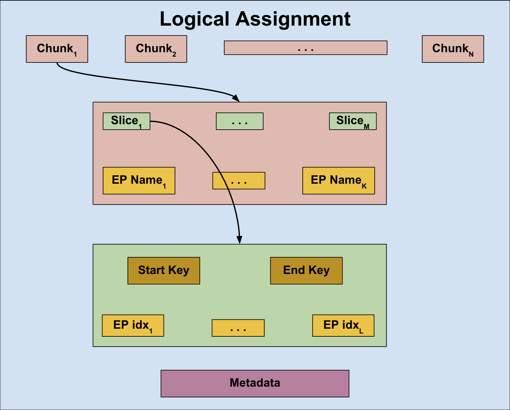

# A119: Slicer LB Policy

* Author(s): easwars
* Approver: markdroth
* Implemented in: TBD
* Last updated: 2026-05-22
* Discussion at: TDB

## Abstract

Add support for a sharding load balancing policy, that communicates with an
external sharding service to receive resource assignments. This policy should be
supported in both xDS and non-xDS based deployments.

## Background

An auto-sharding service enables client-side load balancing through the
following process:

* Gathering load metrics for keys within an application-defined keyspace
* Dividing the keyspace into distinct, non-overlapping ranges (or slices)
* Assigning specific resources to these key ranges
* Adjusting these mappings in real-time to account for resource availability and
  fluctuating load

Within this framework, application-defined keys generally consist of arbitrary
byte sequences, such as:

* Tenant identifiers for multi-tenant architectures
* Individual User IDs
* Identifiers created via hashing

The targets for traffic distribution, or resources, frequently include:

* Application servers
* Kubernetes pods within a cluster
* Regions within a multi-regional service deployment

Implementing a load balancing policy in gRPC that uses an auto-sharding service
has applications in various scenarios, such as:

* Enhancing request affinity in stateful environments
* Improving isolation and system resilience for multi-tenant services
* Supporting hybrid setups spanning Borg and GCP infrastructures
* Providing the scalability required for rapid growth in AI-driven applications

### Related Proposals

* [A42: xDS Ring Hash LB Policy][A42]
* [A52: gRPC xDS Custom Load Balancer Configuration][A52]
* [A57: XdsClient Failure Mode Behavior][A57]
* [A62: Pick First][A62]]
* [A102: xDS GrpcService Support][A102]
* [OSS DynamicSharding gRPC Protocol Spec](TBD)

## Proposal

Add the `slicer_experimental` LB policy in gRPC that contains the following
functionality:

* Utilizing the OSS DynamicSharding gRPC protocol for communicating with an
  auto-sharding service and processing assignments from that service.
  * These assignments will partition an application-defined keyspace into
    distinct, non-overlapping slices, each associated with a specific set of
    server endpoints.
* Mapping client application requests to a specific key within the
  application-defined keyspace.
* Identifying the matching key range and choosing a server endpoint assigned to
  it.
* Reporting real-time load metrics back to the auto-sharding service.
* Providing a fallback mechanism to route client traffic when assignments from
  the auto-sharding service are unusable.

Crucially, the LB policy receives its configuration and endpoint data from the
Name Resolver and not from the auto-sharding service.

### Supported modes of operation

The slicer_experimental LB policy must support two primary modes of operation:

* An LB policy that performs both locality and endpoint picking:
  * In xDS use-cases, such an LB policy receives endpoints across all
    localities and shards requests accordingly. This is similar to how the
    `ring_hash` LB policy, specified in [gRFC A42][A42], works.
  * In non-xDS use-cases, such an LB policy will be configured as the top-level
    LB policy, sharding request across a flat list of endpoints provided by the
    Name Resolver.
* An LB policy that only performs endpoint picking:
  * In xDS use-cases, such an LB policy will be configured under a policy like
    `weighted_target_experimental` that handles locality picking, while each
    `slicer_experimental` child policy instance only handles endpoint picking
    within its specific locality.

The `slicer_experimental` policy maintains consistent behavior across both modes
and does not require explicit knowledge of its operational context. Notably, we
do not support using this LB policy solely for locality picking with delegation
to a separate endpoint-picking policy. This configuration lacks identified use
cases and introduces significant implementation complexity.

### Load Balancing Configuration

The `slicer_experimental` LB policy's configuration will be as follows:

```proto
message SlicerLbConfig {
 // Name of the auto-sharding service, as a gRPC target URI.
 string sharding_service_target_uri = 1;

// An identifier sent to the sharding service. Assignments and load reports are
// scoped to this identifier.
//
// Can optionally contain up to two "%s" tokens. The first is replaced with the
// "Backend Service" and the second with the "Locality" before sending. If a
// token is present, but the corresponding information is not available to the
// LB policy, the token will be replaced with an empty string.
 string slicing_target = 3;

// Name of the request header containing the application-defined key. This key
// is used to look up the matching key range (slice) assigned by the sharding
// service.
 string slice_key_header_name = 4;

 // Mode used to pick an endpoint for a request.
 enum EndpointPickingMode {
  RANDOM = 0;
 }

 // Mode used to pick an endpoint from a matching key range.
 // If unset, defaults to RANDOM.
 EndpointPickingMode slice_picking_mode = 5;

 // Mode used to pick an endpoint when using the fallback mechanism.
 // If unset, defaults to RANDOM.
 EndpointPickingMode fallback_picking_mode = 6;

 // Names of load metrics to send to the external sharding service.
 repeated string load_metric_keys = 7;
}
```

Key considerations regarding the LB policy configuration:

* The configuration specifies the auto-sharding service's target URI but
  deliberately omits credentials to be used for this communication. This
  decision prevents potential privilege-escalation vulnerabilities resulting
  from a compromised control plane, following the security framework established
  in [gRFC A102][A102].
* Per-request gRPC metadata for the sharding service is omitted from the
  configuration. While the xDS `GrpcService` proto can define initial metadata
  to be included on every stream to the external service, the current
  OSS DynamicSharding protocol does not require it.
  * Excluding this field now maintains future extensibility without increasing
    implementation complexity.

### Handling updates from the Name Resolver

When the LB policy receives a configuration update, it must do the following:

* If the `sharding_service_target_uri` field has changed (or if this is the
  first configuration update), use a “Channel Factory” to [create a new gRPC
  channel to this target URI](#creating-a-grpc-channel-to-the-sharding-service).
  If a new gRPC channel is created:
  * Create a new `Shard` stream on the newly created gRPC channel, and,
  * Close the previously created gRPC channel to the sharding service
* If the `slicing_target` field has changed, create a new `Shard` stream because
  the `slicing_target` controls the assignments sent by the sharding service.
* If the `load_metric_keys` field has changed: TBD

#### Managing endpoints received from the Name Resolver

The `slicer_experimental` LB policy must create a `pick_first` child for every
endpoint that it receives from the Name Resolver, and the latter will create
subchannels for the addresses within the endpoints.

In Go, a utility LB policy exists, named `endpointsharding` that takes care of
this functionality. The `slicer_experimental` LB policy creates a single
`endpointsharding` child and forwards all the endpoints to this child, which will
create one `pick_first` child per endpoint. The `endpointsharding` child will return
the connectivity state and picker for every endpoint, and the
`slicer_experimental` uses this to compute the aggregated connectivity state for
the gRPC channel and its own picker. See [The Picker](#the-picker) section for
more details.

The LB policy should maintain a map, that is updated based on updates from the
`endpointsharding` child and consulted when a new picker is built. The key for
this map is the hostname attribute on the endpoint received from the Name
Resolver and the value is the state associated with that endpoint. The value
must contain the following:

* The connectivity state of the child `pick_first` LB policy for that endpoint
* The most recent picker returned by the child `pick_first` LB policy for that
  endpoint

Whenever the LB policy receives new endpoints from the Name Resolver, it must
create a new [SliceMap](#the-slicemap) (possibly based on a copy of the existing
one) and create a new picker using it. See section [Constructing a
SliceMap](#constructing-a-slicemap) for more information.

If the LB policy receives an empty set of endpoints from the Name Resolver, it
must set the connectivity state of the gRPC channel to `TRANSIENT_FAILURE` and
fail all subsequent RPCs until an update with a non-empty set of endpoints is
received.

### Creating a gRPC channel to the sharding service

The LB policy will be injected with a “Channel Factory” via attributes,
alongside its configuration. This utility will help create a fully functional
gRPC channel given a target URI. In xDS-based deployments, this “Channel
Factory” will be injected by the `cds_experimental` LB policy. Refer to section
[Changes to CDS LB policy](#changes-to-cds-lb-policy) for more details. For
non-xDS environments, users will have the capability to inject this utility via
a dedicated channel option.

#### Go

The “Channel Factory” or provider is defined as a function type that accepts the
target URI as a string, and returns a gRPC channel. The existing
`grpc.ClientConnInterface` interface, instead of the concrete `*grpc.ClientConn`
type,  is used to represent a gRPC channel, to allow for wrapping. The LB policy
can create a client stub to the sharding service by passing this interface to
the protobuf generated code and make RPCs using that client stub.

```golang
package grpc

// A factory to create a grpc.ClientConn to the given target URI. 
//
// The second return value is a cancel function that the caller must invoke
// once they are done using the returned grpc.ClientConn. 
type ClientConnProvider func(string) (ClientConnInterface, func(), error)
```

A `DialOption` will be added to allow the user to inject a “Channel Factory”.
gRPC will take care of plumbing this down to the LB policies.

```golang
package grpc

// WithClientConnProvider returns a dial option that makes the channel provider
// available to LB policies.
func WithClientConnProvider(f ClientConnProvider) DialOption { ... }
```

We will also have APIs to set and get this factory from the `resolver.State`
struct that is sent to the LB policy as part of a resolver update.

```golang
package grpc

// ClientConnProviderFromResolverState returns a ClientConnProvider from the
// given resolver state, or nil if not present.
func ClientConnProviderFromResolverState(state resolver.State) ClientConnProvider { ... }

// SetClientConnProvider returns a copy of the resolver state with the provider
// set as an attribute.
func SetClientConnProvider(s resolver.State, p ClientConnProvider) resolver.State { ... }
```

#### C++

TBD

#### JAVA

TBD

### Communicating with the sharding service

The LB policy communicates with an external sharding service using the OSS
DynamicSharding gRPC protocol. As described earlier, the LB policy creates a
gRPC channel to the sharding service using the “Channel Factory” provided to it,
whenever the `sharding_service_target_uri` in its configuration changes. It will
then create a `Shard` stream on that channel.

#### Sending the first message

The LB policy sends an `Init` message on the stream to kick things off. This
message currently contains three fields:

* `target`: The value for this field is derived from the `slicing_target` field
  of the LB policy configuration. If `%s` tokens are present in this string,
  they are replaced with the “Backend Service” and “Locality” values passed to
  the LB policy as attributes in the resolver update (similar to how the
  “Channel Factory” is passed).
  * In xDS use-cases, the “Backend Service” and “Locality” attributes are
    already available:
    * The “Backend Service” attribute is currently set by the
      `xds_cluster_impl_experimental` LB policy, for consumption by the endpoint
      picking policy.
    * The “Locality” attribute is currently set by the `cds_experimental` LB
      policy, for consumption by the locality picking policy.
  * In non-xDS use-cases, the common case is for the `slicing_target` to not
    contain `%s` tokens. But if they do, it is the responsibility of the user to
    ensure that these attributes are populated by the Name Resolver. If these
    attributes are not available, the LB policy will replace these tokens with
    empty strings.
* `client_uuid`: The LB policy generates a UUID at creation time and must reuse
  the same value across stream restarts.
* `current_generation`: The LB policy must store the generation number of the
  most recent good assignment received from the sharding service and use that
  value here.

#### Handling responses from the sharding server

Responses received from the sharding server in a `ShardingResponse` message can
one of the following:

* `LoadReportingConfig`: This contains configuration for how load needs to be
  aggregated and sent to the sharding server. See section on [Load
  Reporting](#load-reporting) for more information.
* `AssignmentChunk`: This contains one chunk of a logical assignment from the
  sharding server. The LB policy must cache chunks until it receives an
  `AssignmentMetadata` message.
* `AssignmentMetadata`: This indicates the end of a logical assignment from the
  sharding server. The LB policy must attempt to combine previously received
  chunks into one single logical assignment.

See section on [Handling assignments from the sharding
server](#handling-assignments-from-the-sharding-server) for more information.

#### Backoff on stream and connectivity failures

When a `Shard` stream fails without receiving at least one good logical
assignment, the LB policy must use exponential backoff before each successive
attempt to re-establish the stream. The algorithm should be similar to what gRPC
uses for connection attempts. The backoff state will be reset when a `Shard`
stream finally receives a good logical assignment from the server.

Implementations should use the `wait_for_ready` option on the `Shard` stream to
help recover faster from connectivity failures instead of applying a backoff
when stream creation fails. This is in contrast to what the XdsClient does (as
described in [gRFC A57][A57]), and is considered acceptable here because there
is not much the LB policy can do with these connectivity errors other than
simply logging it. When connectivity to the sharding server is broken and there
are no previously received assignments, the LB policy must use the fallback
option described in the section [Fallback mechanism](#fallback-mechanism)
section.

#### Handling assignments from the sharding server

The sharding server implementing the OSS DynamicSharding gRPC protocol will
distribute (chunked) complete assignments to its clients, instead of deltas.
From the `slicer_experimental` LB policy’s point of view, this will look as
follows:

* A single logical assignment is split into multiple `ShardingResponse` messages
* Each `ShardingResponse` message contains either an `AssignmentChunk` message
  or an `AssignmentMetadata` message.
* Each `AssignmentChunk` message contains a list of `SliceAssignment` messages
  and a list of `EndpointState` messages (each of which contains a single
  endpoint name).
* Each `SliceAssignment` message contains a `Slice` that contains a `[start_key,
  end_key)` and a list of endpoint indices into the combined endpoint list over
  all chunks (in chunk order)
* The `AssignmentMetadata` message indicates that the sharding server has
  completed sending all chunks for the current assignment and contains a
  generation number for the logical assignment.

Visually, we can represent this as follows:



The LB policy must cache the `AssignmentChunk` messages locally until it sees an
`AssignmentMetadata` message. This is because each `Chunk` contains several
endpoint names and each `Slice` within a chunk contains an index into the
complete set of endpoint names, combined in chunk order. So, until all chunks
are received, the LB policy cannot meaningfully use any of them.

Once the `AssignmentMetadata` message is received, the LB policy must build a
`SliceMap` data structure. See [The SliceMap](#the-slicemap) section for more
information on how to build this data structure and its internals. If building
the `SliceMap` fails, the LB policy must terminate the stream to the sharding
service, and attempt to re-establish it.

Once a `SliceMap` is built successfully, the LB policy must create a new picker
with the newly built `SliceMap` and send an update to the gRPC channel.

### The SliceMap

The `SliceMap` is the most important data structure within the
`slicer_experimental` LB policy. The most recently built `SliceMap` should be
stored within the LB policy and a reference to it is passed to the picker. Any
server implementing the OSS DynamicSharding protocol will send complete
assignments, and not deltas, and therefore the `slicer_experimental` LB policy
should build a brand new `SliceMap` whenever it receives a new logical
assignment from the sharding server. When the LB policy receives updates from
the `pick_first` children though, it could make a copy of the existing
`SliceMap` and only update the endpoint state stored in it before creating a new
picker. In any case, the `SliceMap` must be immutable to allow the picker to
access it without having to acquire a mutex.

While the exact choice of the underlying data structures are left to the
implementation’s choice, here is a general idea of what a `SliceMap` would look
like:

```golang
// An arbitrary set of bytes representing a key in the application defined key
// space.
struct slice_key {
  key:         []byte  // At most 512 bytes
  is_infinity: bool    // Sentinel key
}
 
// A key range that includes start, but does not include end.
struct slice_range {
  start: slice_key  // Inclusive
  end:   slice_key  // Exclusive (can be positive infinity sentinel)
}
 
// State associated with a single endpoint or backend instance.
struct endpoint_state {
  hostname:           string
  connectivity_state: enum    // From child pick_first (e.g. READY, TRANSIENT_FAILURE)
  picker:             Picker  // Picker returned by the child pick_first
}
 
// The collection of endpoints associated with a specific slice.
struct assigned_endpoints {
  all_endpoints:   []endpoint_state  // Full list of endpoints assigned to this slice
  ready_endpoints: []endpoint_state  // Endpoints currently in READY state
  in_fallback:     boolean           // True when all endpoints are in TRANSIENT_FAILURE
}
 
// A slice from the sharding server and its associated endpoint resources.
struct slice_entry {
  range:              slice_range
  assigned_endpoints: assigned_endpoints
}

// Complete SliceMap stored in the LB policy and in the Picker.
struct slice_map {
  // Ordered list of entries sorted by slice_key, where slice_key is the
  // slice_range.end associated with the specific slice. This support O(log N)
  // lookup for a matching entry given a key.
  sorted_slices: []pair(slice_key, slice_entry)

  // Received from the sharding server.
  generation_number: int64

  // State for all endpoints received from the Name Resolver. Used when all
  // endpoints in a matching range are in TRANSIENT_FAILURE.
  fallback_entry: assigned_endpoints
}
```

#### Constructing a SliceMap

When the LB policy receives a complete logical assignment from the sharding
service, indicated by the receipt of an `AssignmentMetadata` message, it must
create a new `SliceMap` by doing the following:

* Combine the list of  endpoint names into one list, in chunk order
* Create one `slice_entry` for each `Slice` in the assignment data.
  * Iterate through the list of endpoint indices in the `Slice` an` figure out
    the corresponding endpoint name. Lookup the endpoints map in the LB policy
    to find the matching `endpointState` for the hostname.
    * Add an entry to the `all_endpoints` list with this state
    * If the endpoint is `READY`, also add the state to the `ready_endpoints`
      list
    * If no matching `endpointState` exists in the endpoints map, add an entry
      to the `all_endpoints` list that only contains the hostname field.
  * If all endpoints belonging to the `Slice` are in `TRANSIENT_FAILURE`, set
    the `in_fallback` bit
* Create the `fallback_endpoints` array with state for all endpoints received from
  the resolver.
* Validate the `SliceMap` by ensuring that there are no gaps in the key ranges.
  The sharding server is expected to cover the entire key space.
* If validation succeeds, update the `generation_number` field to the value
  specified in the `AssignmentMetadata` message. Else, throw away the cached
  assignment data and close the ongoing stream with the sharding server.

When the LB policy receives a new set of endpoints from the Name Resolver, it
must send the endpoints to its child policy. And once it receives an update from
the child policy, it must update the endpoints map. Once this is done, it must
build a new `SliceMap`. If one already exists, it should make a copy of it, and
update only the endpoint states. As a special case, when there are no
assignments from the sharding service yet, the LB policy must create a new
`SliceMap` that only contains the `fallback_endpoints`.

### The Picker

The LB policy must create a new picker every time one of the following events
happens:

* A new logical assignment is received from the sharding service
* An update is received from its child policy because the connectivity state of
  one of the endpoints has changed

The picker is given the `SliceMap` and the name of the request header from which
it can extract the key for the incoming request. Here is the pseudo-code for the
`Pick` method of the picker:

```golang
func Pick(request):
    // Extract the key from the specified header
    target_key = request.headers.get(slice_key_header_name)
    if target_key is empty:
        FAIL pick with status set to UNAVAILABLE
        return

    // Look up the matching key range. Guaranteed to find a match as long at
    // least one logical assignment has been received, as assignments are
    // validated to not contain gaps
    slice_entry = SliceMap.find_matching_range(target_key)
    if slice_entry is nil:
        // Special case where endpoints are available, but assignments are not
        delegate_pick(slice_entry.fallback_entry)
        return


    // Check for fallback
    if slice_entry.in_fallback == true:
        if slice_entry.fallback_entry.in_fallback == true:
            FAIL the pick // All endpoints are in TF
            return
        else:
            delegate_pick(slice_entry.fallback_entry)
            return
    else:
        delegate_pick(slice_entry)
        return

func delegate_pick(entry):
    // Select a random endpoint
    selected_endpoint = entry.all_endpoints.random()

    // Use it if in READY state
    if selected_endpoint.status == READY:
        selected_endpoint.picker.Pick(request)
        return

    // Handle IDLE state
    if selected_endpoint.status == IDLE:
        start_background_connection(selected_endpoint)

        // Find a random READY endpoint
        ready_endpoint = entry.ready_endpoints.random()
        if ready_endpoint is not nil:
            ready_endpoint.picker.Pick(request)
            return
        else:
            QUEUE the pick
            return

    // Handle CONNECTING or TRANSIENT_FAILURE states
    if selected_endpoint.status == CONNECTING or TRANSIENT_FAILURE:
        // Wake up the first IDLE endpoint we can find
        curr_idx = selected_endpoint.idx()
        for (i = 1; i < len(entry.all_endpoints); i++):
            ep = entry.all_endpoints[(curr_idx + i) % len(entry.all_endpoints)]
            if ep.status == IDLE:
                start_background_connection(ep)
                break // Only trigger connection on the first IDLE one found

        ready_endpoints = entry.ready_endpoints.random()
        if ready_endpoint is not nil:
            ready_endpoint.picker.Pick(request)
            return
        else:
            QUEUE the pick
            return
```

### Subchannel State Handling

Subchannels will start in state `IDLE`, and the `slicer_experimental` policy
will not proactively connect to them. When the picker chooses a random endpoint
from the matching `slice_entry` for a call, if the associated subchannel is not
`READY`, the picker will trigger a connection attempt for the first `IDLE`
subchannel, as described in the picker pseudo-code, and the subchannel will
transition to state `CONNECTING`.

If the connection attempt is successful, the subchannel will transition to state
`READY`. If the connection attempt is not successful, the subchannel will move
to `TRANSIENT_FAILURE`, and will remain there until it successfully connects, at
which point it will move to READY. Once the subchannel moves to
`TRANSIENT_FAILURE`, the pick_first child will continuously try to reconnect
(with exponential backoff), as specified in the sticky `TRANSIENT_FAILURE`
behavior in [gRFC A62][A62].

### Aggregated Connectivity State

The behavior will be exactly the same as that of the ring_hash policy, as
described in [gRFC A42][A42]. Highlights here are:

* The LB policy starts off in `IDLE`, unlike most policies that start off in
  `CONNECTING`
* The LB policy uses a heuristic and reports `TRANSIENT_FAILURE` when at least
  two subchannels are in `TRANSIENT_FAILURE` and none of the subchannels are
  `READY`
* When the LB policy reports `TRANSIENT_FAILURE` or `CONNECTING`, it ensures
  that there is at least one subchannel that is actively trying to connect,
  giving itself a chance to move to `READY` even when it is not getting picks.

### Fallback Mechanism

The `slicer_experimental` LB policy must employ a fallback mechanism that
utilizes all endpoints provided by the Name Resolver when one of the following
conditions are met:

* All the endpoints in the matching `slice_entry` for a request are in
  `TRANSIENT_FAILURE` state
  * The picker takes care of this by using the `fallback_entry` field in the
    `SliceMap` when a matching `slice_entry` is in fallback mode.
* No good logical assignments have been received from the sharding service yet,
  but endpoints have been received from the Name Resolver
  * The LB policy takes care of this by creating a `SliceMap` that does not have
    any `slice_entry`s, but has the `fallback_entry` field set

The LB policy must also continue using previously received good assignments from
the sharding service, if it subsequently receives a bad one. The LB policy
should update the `SliceMap` only if the received assignments are valid, and
thereby take care of this requirement.

### Load Reporting

TBD

### xDS integration

In xDS-based deployments, client applications can be configured to use the
`slicer_experimental` LB policy by leveraging gRPC's support for custom LB
policies, as described in [gRFC A52][A52]. The xDS management server will set
the
[load_balancing_policy](https://github.com/envoyproxy/envoy/blob/d26361ac44e48ad347afbaff141c5c0387d48c40/api/envoy/config/cluster/v3/cluster.proto#L1229)
field of the
[Cluster](https://github.com/envoyproxy/envoy/blob/d26361ac44e48ad347afbaff141c5c0387d48c40/api/envoy/config/cluster/v3/cluster.proto#L50)
resource appropriately.

As mentioned in the [Supported modes of
operation](#supported-modes-of-operation) section, client applications can be
configured to use the `slicer_experimental` LB policy for both locality and
endpoint picking, by setting the `load_balancing_policy` field to an instance of
the `Slicer` protobuf message described in the next section. To use the
`slicer_experimental` LB policy *only* for endpoint picking, the
`load_balancing_policy` field could be set to a locality picking policy like
[WrrLocality](https://github.com/envoyproxy/envoy/blob/d26361ac44e48ad347afbaff141c5c0387d48c40/api/envoy/extensions/load_balancing_policies/wrr_locality/v3/wrr_locality.proto#L21)
and setting the `endpoint_picking_policy` field inside it to the `Slicer`
protobuf message described below.

#### xDS LB policy configuration

A new message type that represents the configuration for the
`slicer_experimental` LB policy will be added to the envoy repository in the
[api/envoy/extensions/load_balancing_policies](https://github.com/envoyproxy/envoy/tree/main/api/envoy/extensions/load_balancing_policies)
directory.

```proto
import "envoy/config/core/v3/grpc_service.proto";

message Slicer {
 // Configuration for the gRPC service that the LB policy will communicate with
 // to receive sharding assignments from and to send load reports to.
 config.core.v3.GrpcService grpc_service = 1

 // An identifier sent to the sharding service. Assignments and load reports are
 // scoped to this identifier.
 //
 // Can optionally contain up to two "%s" tokens. The first is replaced with the
 // "Backend Service" and the second with the "Locality" before sending. If a
 // token is present, but the corresponding information is not available to the
 // LB policy, the token will be replaced with an empty string.
 string slicing_target = 2;

 // Name of the request header containing the application-defined key. This key
 // is used to look up the matching key range (slice) assigned by the sharding
 // service.
 string slice_key_header_name = 3;

 // Mode used to pick an endpoint for a request.
 enum EndpointPickingMode {
  RANDOM = 0;
 }

 // Mode used to pick an endpoint from a matching key range.
 // If unset, defaults to RANDOM.
 EndpointPickingMode slice_picking_mode = 4;

 // Mode used to pick an endpoint when using the fallback mechanism.
 // If unset, defaults to RANDOM.
 EndpointPickingMode fallback_picking_mode = 5;

 // Names of load metrics to send to the external sharding service.
 repeated string load_metric_keys = 6;
}
```

While most of the fields in the above proto are similar to the fields in the
[Load Balancing Configuration](#load-balancing-configuration) section, the
notable difference is the use of the
[GrpcService](https://github.com/envoyproxy/envoy/blob/d26361ac44e48ad347afbaff141c5c0387d48c40/api/envoy/config/core/v3/grpc_service.proto#L29)
protobuf message to specify the configuration for the auto-sharding service.

* gRPC only supports the `google_grpc` field inside the `target_specifier`
  field. If this field is not set, the `Cluster` resource must be NACKed.
* gRPC ignores the `timeout` field because the RPC to the sharding service uses
  bidi-streaming.
* gRPC ignores the `initial_metadata` and `retry_policy` fields because the OSS
  DynamicSharding gRPC protocol has no current use case for these.
* The credentials used to communicate with the external auto-sharding service
  will be the ones specified in the `GrpcService` proto, if the xDS management
  server is a trusted server. Else, it will be based on the
  `allowed_grpc_services` field of the bootstrap configuration. See [gRFC
  A102][A102] for more details.

#### Changes to xDS LB Policy Registry

The xDS LB Policy Registry API described in [gRFC A52][A52] will be enhanced to
support the two new bits of functionality, as follows:

1. Parsing a `GrpcService` proto embedded within an LB policy's configuration
   into its internal representation, requires access to the following:
   * the complete bootstrap configuration to access the `allowed_grpc_services`
     section of the bootstrap configuration.
   * configuration of the specific xDS server that delivered this resource, to
     determine if the server is to be trusted or not.
1. Returning additional information (like the parsed internal representation of
   the `GrpcService` proto), other than the currently returned gRPC LB
   policy configuration (in JSON format), to be forwarded to the LB policies.

In Go, the existing `converter` type will be modified as follows:

```golang
// ConverterOptions contains options passed to the Converter.
type ConverterOptions struct {
 // BootstrapConfig is the complete xDS bootstrap configuration.
 BootstrapConfig *bootstrap.Config
 // ServerConfig is the configuration of the xDS server from which the
 // resource was received.
 ServerConfig *bootstrap.ServerConfig
}

// LBPolicyInfo contains information to be passed to the LB policy, outside of
// its configuration.
type LBPolicyInfo struct {
  // GRPCService is the internal parsed representation of a GrpcService proto
  // that was present in the xDS LB policy configuration.
  GRPCService InternalGRPCService

}

// Converter converts raw proto bytes into JSON LB policy configuration.
// 
// Returns the following:
// - converted JSON form of the LB policy configuration
// - Additional information to be passed to the LB policy, and,
// - Any error encountered during the conversion.
type Converter func(rawProto []byte, depth int, opts ConverterOptions) (json.RawMessage, LBPolicyInfo, error)
```

#### Child policy config generation

TBD

#### Changes to XdsClient

TBD

#### Changes to CDS LB policy

TBD

### Temporary environment variable protection

TBD

## Rationale

### Why not create a child LB policy for every `slice_entry`?

TBD

### Why create connections lazily?

TBD

## Implementation

Will be implemented in Go first, closely followed by Java and C++.

[A42]: A42-xds-ring-hash-lb-policy.md
[A52]: A52-xds-custom-lb-policies.md
[A57]: A57-xds-client-failure-mode-behavior.md
[A62]: A62-pick-first.md
[A102]: (https://github.com/grpc/proposal/pull/510)
