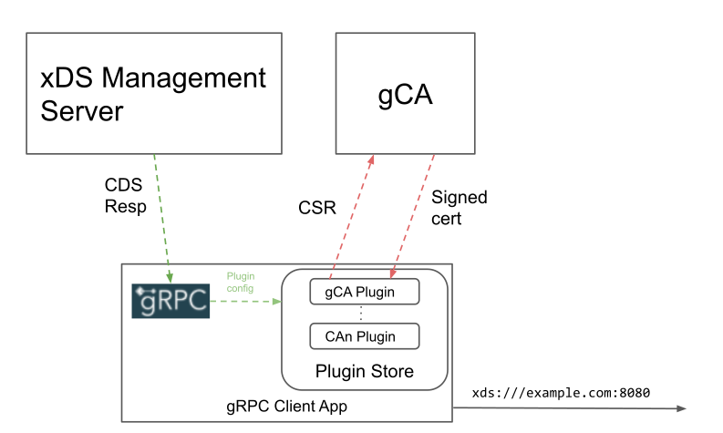
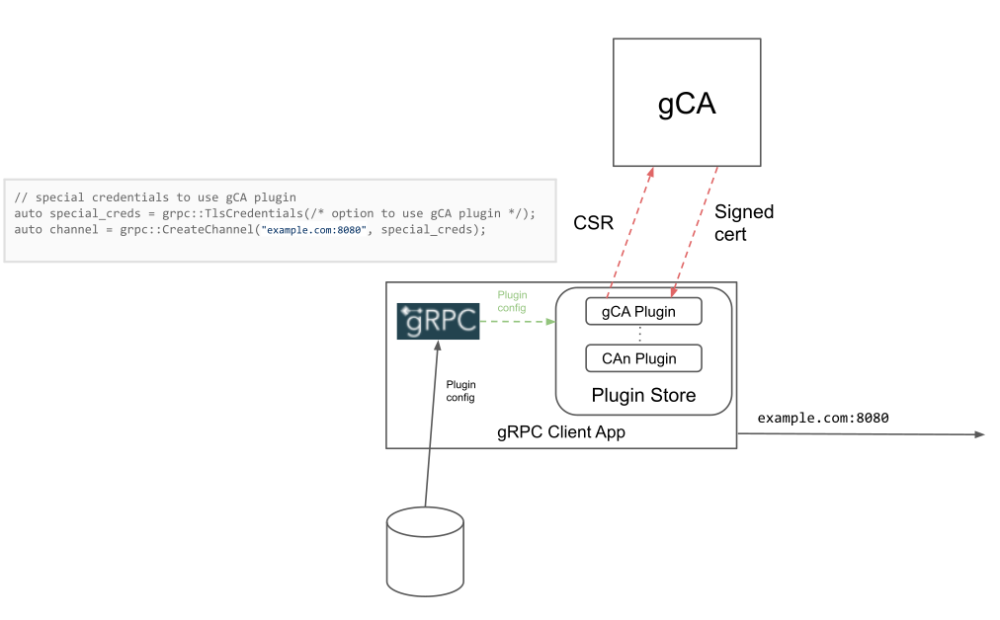
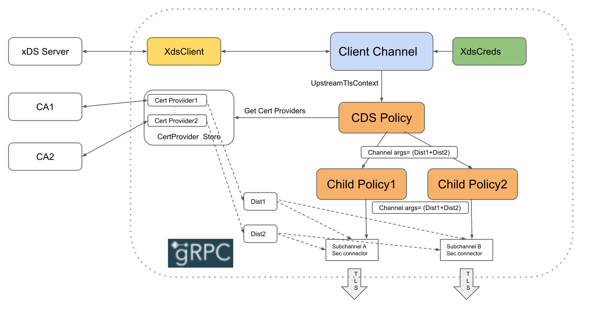
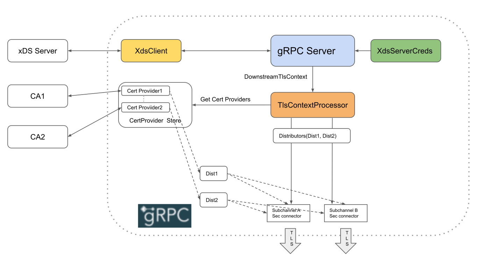

A29: xDS-Based Security for gRPC Clients and Servers
----
* Author(s): Sanjay M. Pujare
* Approver: a11r
* Status: Draft
* Implemented in: C-core, Java, and Go (planned)
* Last updated: 2020-06-04
* Discussion at: 

## Abstract

This proposal describes adding transport security via TLS or mTLS to xDS-orchestrated
gRPC connections. TLS/mTLS adds encryption and authentication capabilities to the
gRPC connections. Other aspects of security \- such as RBAC \- are not covered.

This is an incremental feature over existing
[xDS support](https://github.com/grpc/proposal/blob/master/A27-xds-global-load-balancing.md)
in gRPC to add transport security capabilities offered by xDS and present in Envoy.
gRPC will be adding more xDS capabilities over a period of time to match Envoy's
as part of the efforts to provide a proxyless alternative to Envoy.

## Background

The xDS API supports both TLS termination of incoming connections in listeners and
TLS origination of outbound connections in clients. The TLS configuration on the listener side
is provided in the
[Listener](https://github.com/envoyproxy/envoy/blob/master/api/envoy/config/listener/v3/listener.proto)
resource and on the client side in the [Cluster](https://github.com/envoyproxy/envoy/blob/master/api/envoy/config/cluster/v3/cluster.proto) resource.
This proposal covers supporting a subset of these TLS configurations to enable
gRPC traffic to be automatically secured by the xDS control plane thereby eliminating
the overhead of manually provisioning and managing TLS certificates by gRPC developers.

We leverage the xDS API's TLS configuration capabilities to achieve this and extend
gRPC's channel and server credentials concept to enable users to take advantage of
the xDS control plane. The proposal is based on version 3 of the xDS API but
the support will be upgraded to match newer xDS API versions. The proposal depends on
the
[Certificate Provider](https://www.envoyproxy.io/docs/envoy/latest/api-v3/extensions/transport_sockets/tls/v3/tls.proto#extensions-transport-sockets-tls-v3-commontlscontext-certificateprovider)
additions made to xDS API v3 to support agentless transport security.

### Related Proposals
[A27: xDS-Based Global Load Balancing](https://raw.githubusercontent.com/grpc/proposal/master/A27-xds-global-load-balancing.md)

## Proposal

### Usage

A gRPC developer explicitly signals the use of this feature by using a new type of
credentials on the client side and server side.

#### Client Side Usage

A prerequisite is to use xDS on the client side as described
[here](https://github.com/grpc/proposal/blob/master/A27-xds-global-load-balancing.md#grpc-client-architecture).
The gRPC developer also needs to use a new type of (client-side) credentials called
`XdsCredentials` to use the feature on the client side. An example of this in C++ is:

```
// Create XdsCredentials object.
auto channel_creds = grpc::XdsCredentials(grpc::XdsCredentialsOptions());

// Create a channel using the credentials
auto channel = grpc::CreateChannel("xds:///myserver:8080", channel_creds);
```

`XdsCredentials` is a type of (or subclass of) a gRPC channel credentials. The user
can use a different type of credentials to not allow the xDS-provided TLS configuration
to be used for the channel as shown below:

```
// Create TlsCredentials object.
auto tls_creds = grpc::TlsCredentials(...);

// Create a channel using Tls credentials
auto channel = grpc::CreateChannel("xds:///myserver:8080", tls_creds);

```

#### Server Side Usage

Until now xDS support in gRPC was limited to client side. The use of
xDS security on the server side first requires using xDS on the server side and
then allowing xDS-provided TLS configuration as shown below in a C++ example:

```
// build a server to use xDS 
ServerBuilder builder;

builder.setOption(grpc::XdsOption());

// enable use of xDS-provided TLS configuration by creating XdsServerCredentials
ServerCredentials xds_creds =
        grpc::XdsServerCredentials(grpc::XdsServerCredentialsOptions());

// Listen on the given address using XdsServerCredentials
builder.AddListeningPort(server_address, xds_creds);

```

Similar to the client side, the user can use a different type of server credentials
to not allow the xDS-provided TLS configuration to be used for the server.

#### Fallback Credentials

Both `XdsCredentials` and `XdsServerCredentials` require a mandatory value for something
called a "fallback credentials". Fallback credentials is a channel or
server credentials to be used when the xDS-provided TLS-configuration cannot be used
as in the following cases:

- when xDS is not in use such as when the `xds:` scheme is not used on the client side or
the xDS-server builder-option is not used on the server side.

- xDS is in use but the xDS server didn't provide any TLS-configuration.

In these cases the user can provide a fallback credentials for the channel or server to use.
Only if the fallback credentials itself is of plaintext (or insecure) type, fallback to
plaintext will take place. 

An example of using a `TlsCredentials` as a fallback credentials is:

```
// Create a TlsCredentials object 
auto tls_creds = grpc::TlsCredentials(...);

// Use it as the fallback creds for our xds creds options
auto xds_creds_options = grpc::XdsCredentialsOptions(tls_creds);

// Create XdsCredentials object with those options.
auto channel_creds = grpc::XdsCredentials(xds_creds_options);
```

### Architecture

#### Certificate Provider Plugin Architecture

We take advantage of the new
[Certificate Provider protos](https://www.envoyproxy.io/docs/envoy/latest/api-v3/extensions/transport_sockets/tls/v3/tls.proto#extensions-transport-sockets-tls-v3-commontlscontext-certificateprovider)
added to xDS API v3. This makes our transport security solution agentless as well
as proxyless since an "SDS-server" in the form of a Node Agent is not needed with this
approach. A "Certificate Provider" in this context consists of 2 parts: a third party
service that is capable of issuing or supplying certificates to authenticated clients and
a "plugin" that acts as a client to the service. These client plugins are part of a new
plugin architecture for agentless transport security in gRPC. The plugin
directly talks to the Certificate Provider service - typically a certification
authority (aka CA) - that is set up to provide requested certificates to its
clients. Note that this service does not have to be a CA but could
be a proxy for a CA or any service that is providing pre-minted certificates
to authenticated clients - which is why we call this a "Certificate Provider".
A Certificate Provider is expected to provide two kinds of certificates:

- an identify certificate that a server (or client in case of mTLS) sends to its peer
- a root certificate used to authenticate the peer's identify certificate.

The plugins are part of a "plugin store" where each plugin is identified by a unique
name and the Certificate Provider config used to instantiate it. The following diagram
shows - at a high level - how this would work on the gRPC client side.



The CDS response from the xDS Management Server includes the appropriate
[Certificate Provider value](https://www.envoyproxy.io/docs/envoy/latest/api-v3/extensions/transport_sockets/tls/v3/tls.proto#extensions-transport-sockets-tls-v3-commontlscontext-certificateprovider)
which includes the plugin-name and the config. gRPC finds an existing plugin
in the store to match the (name + config) combination or instantiates a new
one in the store if one doesn't exist. Once a plugin is available its APIs are
used to retrieve the certificates required for the TLS handshake. The details
of how this is achieved for the client and server flow are described later.

##### Third Party Plugin Development

Using this plugin architecture it should be possible for third parties to create a
plugin implementation to support any third party Certificate Provider (or CA).
The plugin distribution and linking mechanism will be language dependent and is
out of scope for this document. As an example, a Java-based plugin could be packaged
as a separate jar file and added to the classpath of the gRPC-java application.

##### Non-xDS Use Case

It should also be noted that this plugin architecture has no hard or direct
dependency on xDS. It is possible to use this architecture to provide
a custom mechanism to dynamically provide certificates to any gRPC channel
or server if a suitable credentials using this mechamism is provided. As a
hypothetical example, the following diagram shows using the regular `TlsCredentials`
with a special option to use the `gCA Plugin` Certificate Provider and load the
plugin config from the file system (instead of the xDS control plane).



The rest of this document, however, will only cover the xDS use case.

The various components and APIs of the Plugin Architecture common to all
gRPC languages are described below.

##### Certificate Provider API

The Certificate Provider plugin and the service communicate using their own
API and is not part of this spec. However the Plugin Architecture ensures
that each plugin is initialized with all the configuration necessary for this
API to work. For a Certification Authority (CA), this API typically
consists of a CSR (certificate signing request) going from the plugin to the
service and the service returning a signed cert in the response.

##### Certificate Provider Config

A Certificate Provider plugin is instantiated with a plugin configuration
that comes from the xDS control plane as [Certificate Provider config](https://www.envoyproxy.io/docs/envoy/latest/api-v3/extensions/transport_sockets/tls/v3/tls.proto#extensions-transport-sockets-tls-v3-commontlscontext-certificateprovider).
The received [TypedExtensionConfig](https://www.envoyproxy.io/docs/envoy/latest/api-v3/config/core/v3/extension.proto#envoy-v3-api-msg-config-core-v3-typedextensionconfig) is typically converted to JSON before
being passed to the [Certificate Provider Factory](#certificate-provider-factory).

##### Certificate Provider Factory

Each plugin implementation exposes a "factory" that is used to instantiate
a plugin with the given
[Certificate Provider config](https://www.envoyproxy.io/docs/envoy/latest/api-v3/extensions/transport_sockets/tls/v3/tls.proto#extensions-transport-sockets-tls-v3-commontlscontext-certificateprovider). The received
[TypedExtensionConfig](https://www.envoyproxy.io/docs/envoy/latest/api-v3/config/core/v3/extension.proto#envoy-v3-api-msg-config-core-v3-typedextensionconfig) is first converted to a JSON-string before being passed
to the factory. The factory also exposes the unique name (as a string) associated with the
plugin implementation e.g. `"gCAPlugin"` for the plugin that supports the gCA. 

##### Registry

A Certificate Provider plugin registers itself with gRPC so the plugin
can be instantiated when needed. The plugin calls into the registry (exported
by gRPC) with an instance of the [Certificate Provider Factory](#certificate-provider-factory)
which is used by the [Certificate Provider Store](#certificate-provider-store)
to instantiate plugins using the plugin-name and the
[Certificate Provider Config](#certificate-provider-config).

##### Certificate Provider Store

Certificate Provider Store consists of Certificate Provider instances where each reference-counted
instance is identified by the name of plugin and the Certificate Provider config used to instantiate
it. The store has a `createOrGetProvider` method to retrieve (after optionally creating if needed)
a Certificate Provider instance and a `releaseProvider` method to release that instance (and
optionally deallocate it when the reference count reaches zero). The reason for maintaining shared
reference-counted instances is because in most cases most clusters and listeners will be sharing
only one or a handful of Certificate Provider configurations.

##### Certificate Provider

This is the actual plugin responsible for returning the requested certificates. The Certificate
Provider is responsible for the following:

- use the [Certificate Provider API](#certificate-provider-api) to fetch a signed cert from
the service at periodic intervals configured for the plugin.

- extract the root cert from the signed cert or use another API to retrieve the root cert
from the service based on root cert expiry.

- call back into the [Distributor](#distributor) to inform it of new certificate updates.

##### Distributor

A Distributor is a convenience class that "distributes" a single update from a
[Certificate Provider](#certificate-provider) to multiple consumers. Also note that
a Distributor is the only link between the Certificate Provider plugin code and its
consumers which helps eliminate dependencies between the two pieces of code.

A Distributor provides two interfaces:

- an interface for the Certificate Provider to update certificate(s).

- an interface for a consumer to register a watcher for watching certificate updates.

For every incoming update from the Certificate Provider the Distributor will send out
the same update to all its registered watchers. The Distributor can be considered as
an extension of the Certificate Provider that allows a single Certificate Provider to
support multiple watchers.

#### gRPC Client Side Changes

Let us see what changes are needed in the gRPC client architecture to use Certificate Provider
plugins in the xDS use-case.

The gRPC client xDS flow is described in
[gRPC Client Architecture](./A27-xds-global-load-balancing.md#grpc-client-architecture).
One of the steps in the flow involves receiving the Cluster resource in the
[CDS response](./A27-xds-global-load-balancing.md#cds).
When transport security (i.e. TLS/mTLS) is enabled, the response will include
[UpstreamTlsContext](https://github.com/envoyproxy/envoy/blob/35702fed462f63a0a237cfbfdf26184272207c11/api/envoy/extensions/transport_sockets/tls/v3/tls.proto#L27)
containing the TLS configuration needed by all the sub-channels in that cluster.
The root-certificate information is contained in the validation context fields - either
[validation_context_certificate_provider](https://github.com/envoyproxy/envoy/blob/35702fed462f63a0a237cfbfdf26184272207c11/api/envoy/extensions/transport_sockets/tls/v3/tls.proto#L190)
or [combined_validation_context.validation_context_certificate_provider](https://github.com/envoyproxy/envoy/blob/35702fed462f63a0a237cfbfdf26184272207c11/api/envoy/extensions/transport_sockets/tls/v3/tls.proto#L145). For mTLS, it will also include local identity certificate
information in [tls_certificate_certificate_provider](https://github.com/envoyproxy/envoy/blob/35702fed462f63a0a237cfbfdf26184272207c11/api/envoy/extensions/transport_sockets/tls/v3/tls.proto#L169).

If a channel is using `XdsCredentials`, whenever its CDS balancer receives a
CDS response containing UpstreamTlsContext, it will ask the
[Certificate Provider Store](#certificate-provider-store) to find or create a
[Certificate Provider](#certificate-provider) for each of the two `certificate_provider`
values received. If these two values turn out to be the same, the same Certificate
Provider will be used in both the cases. The [Distributor](#distributor)s
associated with the Certificate Providers are passed via channel args to all the descendants
of the CDS policy which enables a subchannel created from any of these descendant policies
to receive Certificate updates and provide them to the associated security connector.



#### gRPC Server (Listener) Side Changes

Adding xDS-based transport security on the server side requires server-side xDS support
first, which currently does not exist. Adding xDS support to gRPC servers
is a separate design activity and is out of scope for this proposal. However for further
discussion, we assume the support is in place.

Once a gRPC server is created with a `XdsServerCredentials` and the appropriate
xDS-related server options, the server is set up to receive the relevant LDS responses
from the xDS control plane containing the
[Listener](https://github.com/envoyproxy/envoy/blob/35702fed462f63a0a237cfbfdf26184272207c11/api/envoy/config/listener/v3/listener.proto#L31)
resource. When transport security (i.e. TLS/mTLS) is enabled, the resource will include
[DownstreamTlsContext](https://github.com/envoyproxy/envoy/blob/35702fed462f63a0a237cfbfdf26184272207c11/api/envoy/extensions/transport_sockets/tls/v3/tls.proto#L58) containing the TLS configuration needed for all the incoming connections
to that listener. The local identity certificate
information is in [tls_certificate_certificate_provider](https://github.com/envoyproxy/envoy/blob/35702fed462f63a0a237cfbfdf26184272207c11/api/envoy/extensions/transport_sockets/tls/v3/tls.proto#L169). For mTLS, it will also include
root-certificate information in the validation context fields - either
[validation_context_certificate_provider](https://github.com/envoyproxy/envoy/blob/35702fed462f63a0a237cfbfdf26184272207c11/api/envoy/extensions/transport_sockets/tls/v3/tls.proto#L190) or [combined_validation_context.validation_context_certificate_provider](https://github.com/envoyproxy/envoy/blob/35702fed462f63a0a237cfbfdf26184272207c11/api/envoy/extensions/transport_sockets/tls/v3/tls.proto#L145).

Once the gRPC Server (listener) receives an LDS update that contains the DownstreamTlsContext,
it will ask the [Certificate Provider Store](#certificate-provider-store) to find or create a
[Certificate Provider](#certificate-provider) for each of the two `certificate_provider`
values received. If these two values turn out to be the same, the same Certificate
Provider will be used in both the cases. The [Distributor](#distributor)s
associated with the Certificate Providers are used to receive Certificate updates and
provide them to each incoming connection's security connector.



## Supporting SDS (for interop with Envoy)

Envoy currently uses SDS to acquire certificates from an SDS server (which eventually
gets them from a Certification Authority). Current Envoy deployments receive
SDS configuration from the xDS control plane. For gRPC to seamlessly interoperate with
Envoy, it needs to be able to consume the same SDS config. It is possible to support
SDS within this plugin architecture where an SDS client can be implemented as a
Certificate Provider plugin which talks to the SDS server (a Node Agent) over SDS and
returns certificates to clusters and listeners using the Distributor mechanism described
above.

The cluster and listener code that processes the CDS and LDS responses respectively
will be enhanced to translate the
[SDS config](https://www.envoyproxy.io/docs/envoy/latest/api-v3/extensions/transport_sockets/tls/v3/secret.proto#extensions-transport-sockets-tls-v3-sdssecretconfig) into equivalent
[Certificate Provider Config](#certificate-provider-config) and provide the plugin name
for our "SDS-client" plugin that can be used to instantiate the plugin.
