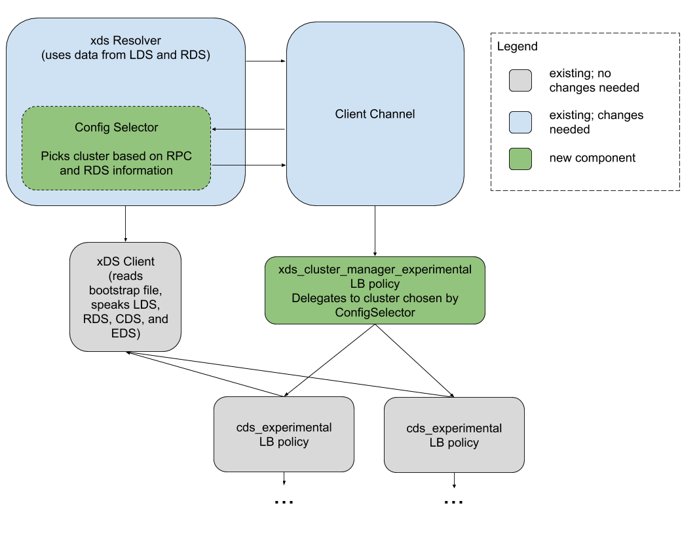

A31: gRPC xDS RouteAction Support
----
* Author(s): Doug Fawley (dfawley)
* Approver: markdroth, ejona86
* Status: In Review
* Implemented in:
* Last updated: 2020-07-13
* Discussion at: https://groups.google.com/g/grpc-io/c/iujkovEFSJU

## Abstract

gRPC provides per-method configuration for some features like timeouts and
retries.  This configuration is part of the [Service
Config](https://github.com/grpc/grpc/blob/master/doc/service_config.md),
provided by the Name Resolver, and currently has limited matching semantics
(per-service or per-method with exact name matching only).

In xDS, RDS
[provides](https://www.envoyproxy.io/docs/envoy/latest/api-v2/api/v2/route/route_components.proto#route-routeaction)
the ability to configure timeouts and several other features using its matchers,
which support a more rich set of matching semantics than gRPC, including
examining the outgoing HTTP headers and using regexes.

Further complicating matters, gRPC needs to be able to determine timeout
settings before invoking the Load Balancing Policy, which is the point at which
the bulk of the current xDS support is integrated with gRPC.

Extending gRPC to support these matchers directly is not a preferred solution to
the problem, as it could impact performance for all gRPC users, increase our API
surface, and grow our code base for features we otherwise do not intend to
implement.


## Proposal

This proposal is broken up into two sections: the addition of new functionality
to gRPC itself, and then a description of using that functionality to implement
support for xDS RouteActions.

### New Functionality in gRPC

In order to allow the xDS matchers to configure gRPC behavior, but to avoid
implementing support for them directly in gRPC, a new "per-RPC Config Selector"
will be added for internal-only use.  This will be provided by the Name Resolver
component when calling `Update` on the channel in a way that does not extend our
publicly-visible API, similarly to how the xDS Client is provided to the Load
Balancing Policy.

If present, this Config Selector will be invoked once at the beginning of every
RPC (after the name resolver has produced a result), and it will produce four
things:

1.  The same per-RPC configuration which is currently determined by the Service
    Config's MethodConfig.  A default implementation will return the Service
    Config's selected values.
1.  An optional interceptor or callback.  The interceptor would be invoked by
    the channel immediately for the RPC, or the callback would be invoked at
    some point after the channel knows the RPC will no longer call the Load
    Balancing Policy's Pick method and before the end of the RPC.  This is
    necessary for cluster lifecycle management, which will be explained in
    detail later.
1.  Information which will be passed to the Load Balancing Policy's Pick method
    by the channel.  E.g. in Go this could be done via the Context, and Java may
    use CallOptions.  If an interceptor is used for (2) it is possible that the
    interceptor may be capable of satisfying this requirement directly.
1.  An RPC status; if not OK, the RPC is terminated with this status.  This is
    needed in case the RPC cannot be routed.  Like (3), this could be satisfied
    via an interceptor.

Note that, for reasons described below, the Load Balancing Policy's Update
method must be called and return before the Config Selector may be used by the
channel.


### Implementation for xDS RouteAction Support

The "xds" resolver will return a Config Selector which applies the xDS matchers
to the RPC (using the Method name and RPC Header data provided to it) and uses
those inputs to perform the initial routing steps for the RPC based upon the RDS
Routes.  This will enable it to set the timeouts and other settings
appropriately in the MethodConfig according to the RouteActions.  Since the
routing decisions are made here, it will also return the cluster name to the
top-level Load Balancing Policy (described in detail below) in order to inform
the policy which endpoint picker to use for the RPC.  Note that the Config
Selector will also be assuming the responsibility of the current
`weighted_target` Load Balancing Policy.  This means two things: 1. connectivity
state is not considered when making this routing decision, and 2. once a cluster
is chosen for an RPC, retry attempts will only use this cluster.  This matches
Envoy behavior, and also supersedes the behavior specified in [gRFC
A28](https://github.com/grpc/proposal/blob/master/A28-xds-traffic-splitting-and-routing.md).

Because routing is happening in the Config Selector, the "xds_routing" Load
Balancing Policy will no longer be needed.  Instead, the top-level Load
Balancing Policy will be named "xds_cluster_manager", and will be a simple
aggregator of child "cds" Load Balancing Policies.  The Load Balancing Config
provided by the Resolver will be a [JSON
representation](developers.google.com/protocol-buffers/docs/proto3#json) of the
following proto message:

```proto
message XDSClusterManager {
    repeated CDSConfig cds_config = 1;
}
```

The "xds_cluster_manager" policy will maintain a map from cluster name (in each
`cds_config` entry) to child Policy in order to route Picks.

The Resolver and Config Selector need to coordinate removal of clusters when
they are deleted by xDS.  In order to prevent deleted clusters from being
removed from the LB Policy when they may still be needed, the Config Selector
will mark each chosen cluster as in-use and complete at the start and end of
each RPC, respectively.  This could be implemented with atomics, locks, or by
reference-counted objects.  To avoid races, the removal of a cluster will
require two steps:

1.  The Resolver produces a Config Selector incapable of selecting the deleted
    cluster, but a Service Config which still contains it.  This will ensure the
    Load Balancing Policy still contains any cluster chosen by the old Config
    Selector during the transition.
1.  After the Config Selector has been updated and the previous one can no
    longer be called, and when the count of RPCs referencing a deleted cluster
    is zero, the cluster can safely be removed from the Load Balancing Config in
    the Service Config.

This wouldn't need to be encoded as an explicit two-step process -- the first
step should happen as an immediate result of the xDS update, and the second step
can happen when clusters are no longer referenced by anything.  E.g. if the
Config Selector has a reference to the deleted cluster, then when there are no
more references to the config selector, the final reference to the cluster will
be removed, triggering the Service Config update.

Note that when a cluster is deleted in xDS, if the xds_cluster_manager Load
Balancing Policy were to queue RPCs in this scenario, wait-for-ready RPCs would
be stuck indefinitely referencing the cluster, and it could never be removed.
Deleted clusters need to drop the RPC and return an UNAVAILABLE status.

When new clusters are added to xDS, they will be added to both the Config
Selector and Service Config simultaneously.  Here, precautions must be taken to
ensure it is not possible for the Config Selector to be used before the Load
Balancing Policy's Picker has been updated to be aware of the new cluster.  The
channel must update the Load Balancing Policy before applying the Config
Selector, and the Load Balancing Policy must provide a new Picker before its
Update method returns back to the channel. If the Picker does not recognize a
cluster name provided to it, which should not be possible when following the
steps above in that order, it will drop the RPC with an INTERNAL status code.

The following drawing shows which parts of the system will contain which current
Load Balancing Policies.  The blue box represents the Config Selector and the
red box represents the top-level Load Balancing Policy and its children.



#### Supported Fields

Initially, only timeout-related `RouteAction` settings will be supported:
<code>[timeout](https://github.com/envoyproxy/envoy/blob/7abb0e0bbed4f6b6304403b93762614ad385f80d/api/envoy/api/v2/route/route_components.proto#L886)</code>
and
<code>[max_grpc_timeout](https://github.com/envoyproxy/envoy/blob/7abb0e0bbed4f6b6304403b93762614ad385f80d/api/envoy/api/v2/route/route_components.proto#L979)</code>.
gRPC's xDS support will completely ignore
<code>[grpc_timeout_offset](https://github.com/envoyproxy/envoy/blob/7abb0e0bbed4f6b6304403b93762614ad385f80d/api/envoy/api/v2/route/route_components.proto#L988)</code>.
This field is used in Envoy for shortening timeouts set by clients to ensure the
timeout is reached before the gRPC client cancels the RPC due to its deadline,
so supporting it directly in the client is unnecessary and would be
counter-productive.

If <code>max_grpc_timeout</code> is not present, the <code>timeout</code> field
will specify the maximum RPC timeout for this route, with a default of 15s.

If <code>max_grpc_timeout</code> is present, then timeout is ignored and
<code>max_grpc_timeout</code> limits the maximum timeout for RPCs on this route.
A value of 0 indicates no limit should be applied.  In all cases, the RPC
timeout set by the application may never be exceeded due to these settings.  For
examples, see the following table:

Application Deadline | `max_grpc_timeout` | `timeout` | Effective Timeout
-------------------- | ------------------ | --------- | -----------------
unset | unset | unset | 15s
unset | unset | 10s | 10s
unset | 0s | any | infinite
unset | 10s | any | 10s
10s | unset | unset | 10s
20s | unset | unset | 15s
20s | unset | 10s | 10s
20s | 0s | any | 20s
20s | 10s | any | 10s

## Rationale

### Alternatives Considered

Many alternatives were considered as part of this design.  Below are several of them:

1.  Support xDS matchers in gRPC directly.
    -  This could lead to performance problems for existing users and would
       require extending the gRPC API for features we do not otherwise want.
1.  Create a new "routing" plug-in, similar to the proposal here, but with an
    entry in the service config to configure it.
    -  This means extending our API in ways potentially confusing to our users.
1.  Allow a new class of "scheme" plug-ins that are able to effectively replace
    the Name Resolver, Load Balancing Policy, and client channel implementation.
    -  This would be a significant effort to design and implement.
1.  Allow the Load Balancing Policy to provide an interceptor capable of
    intercepting RPCs early in their lifecycle.
    -  This is similar to the proposed approach, but it would give the power to
       the Load Balancing Policy instead of the Name Resolver.  Since it is
       impacting settings decided before the existing Load Balancing Policy
       integration, this did not seem appropriate.
1.  Name Resolver provides an RPC interceptor.
    -  This option would require more effort than the proposal, since it would
       require implementing retry and hedging support via an interceptor when we
       need to add support for those features.  Note that, since an interceptor
       may be included in this proposal, we have the capability to do similar
       things in the future if needed.
