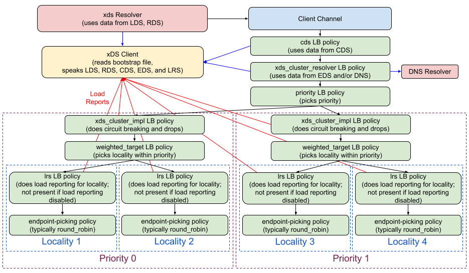

A37: xDS Aggregate and Logical DNS Clusters
----
* Author(s): Mark D. Roth (roth@google.com)
* Approver: ejona86
* Status: Implemented
* Implemented in: C-core, Java
* Last updated: 2021-05-06
* Discussion at: https://groups.google.com/g/grpc-io/c/bZ7wLIdNCVY

## Abstract

gRPC will add support for the xDS [aggregate cluster extension](https://www.envoyproxy.io/docs/envoy/latest/intro/arch_overview/upstream/aggregate_cluster.html)
and [logical DNS cluster type](https://www.envoyproxy.io/docs/envoy/latest/intro/arch_overview/upstream/service_discovery#logical-dns).
These two features, in combination, will allow configuring a fallback
from EDS to DNS for a given cluster, which may ease transition to xDS in
some environments.

## Background

Currently, gRPC supports only the [EDS cluster type](https://www.envoyproxy.io/docs/envoy/latest/intro/arch_overview/upstream/service_discovery#endpoint-discovery-service-eds).
However, in some environments, endpoint discovery is instead done via
DNS.  It is desirable to be able to support such environments, and it is
desirable to allow them to migrate from DNS to EDS in a way that allows
them to fall back to DNS if the new EDS service fails.

It should be noted that the intended xDS aggregate cluster behavior has
recently been fleshed out, and Envoy's implementation of this behavior
will be changing to meet the new spec.  gRPC's implementation will meet
this new spec from the start.  For details, see
https://github.com/envoyproxy/envoy/issues/13134.

### Related Proposals: 

This proposal builds on the earlier xDS work described in the following
proposals:
- [A27: xDS-Based Global Load Balancing](https://github.com/grpc/proposal/blob/master/A27-xds-global-load-balancing.md)
- [A32: xDS Circuit Breaking](https://github.com/grpc/proposal/blob/master/A32-xds-circuit-breaking.md)

## Proposal

The load balancing policy hierarchy in gRPC has been undergoing changes
recently, especially in the xDS area.  In particular, prior to this design,
we refactored the original xds LB policy into four distinct policies:
`eds_experimental`, `priority_experimental`, ` weighted_target_experimental`,
and `lrs_experimental`.

As part of this design, we are making further changes, splitting the
`eds_experimental` policy into two new policies,
`xds_cluster_resolver_experimental` and `xds_cluster_impl_experimental`.
The new LB policy tree is shown in the following diagram.



[Link to SVG file](A37_graphics/grpc_xds_client_architecture.svg)

### XdsClient ClusterWatcher Changes

New fields will be added to the data structure reported to the ClusterWatcher
to represent logical DNS and aggregate clusters.  Specifically:

- cluster type (EDS, logical DNS, or aggregate)
- for logical DNS clusters, the DNS name to resolve (in "host:port" form)
  - Using the `Cluster` proto field `load_assignment.endpoints[0].lb_endpoints[0].endpoint.address.socket_address`,
    the host is the `address` field and the port is the `port_value` field.
- for aggregate clusters, a prioritized list of underlying cluster names
  - When the `Cluster` proto field `cluster_type.typed_config` is parsed as a
    message of type `type.googleapis.com/envoy.extensions.clusters.aggregate.v3.ClusterConfig`,
    this list is the `clusters` field of that message.

The existing field for the EDS service name will be used only when the
cluster type is EDS.

The existing field for the LRS load reporting server name will not be
used in clusters that are pointed to by an aggregate cluster.

### CDS LB Policy Support for Aggregate and Logical DNS Clusters

When the XdsClient informs a CDS policy that the cluster is an aggregate
cluster, the CDS policy must start watches for the underlying clusters
as well, so that it knows what mechanisms will need to be used for
endpoint discovery.  Note that it is possible for an aggregate cluster
to point to another aggregate cluster, so this process may be recursive;
the CDS policy should create all necessary cluster watchers to ensure
that it has all of the necessary data.

For example:
- CDS policy is created for cluster A and starts CDS watch for cluster A.
- CDS watch for A indicates that it is an aggregate cluster pointing to
  clusters B and C.
- CDS policy starts CDS watches for B and C.
- CDS watch for B indicates that it is an EDS cluster.
- CDS watch for C indicates that it is an aggregate cluster pointing to
  clusters D and E.
- CDS policy starts CDS watches for D and E.
- CDS watch for D indicates that it is an EDS cluster.
- CDS watch for E indicates that it is a logical DNS cluster.
- CDS policy will therefore use the following discovery mechanisms, in order:
  [EDS for B, EDS for D, logical DNS for E].

Each underlying cluster will have an associated discovery mechanism.
The ordered list of discovery mechanisms will be passed down in the
config for the new `xds_cluster_resolver_experimental` policy, which is the
child of the CDS policy. If an underlying cluster appears more than once in
the list of clusters, only one discovery mechanism entry should be created for
it, in the earliest position in the list in which it is seen.

Note that if a cluster is used both by itself and via an aggregate
cluster, the XdsClient will have two CDS watchers for the cluster
from two different CDS policies.  However, this should not change the
communication between the xDS client and xDS server, because duplicate
watchers for the same resource will still yield only one subscription on
the ADS stream.  When the xDS server sends an update for that resource,
the XdsClient should notify both watchers.

Also, if a cluster is used both by itself and via an aggregate cluster,
gRPC will create duplicate connections to the endpoints in that cluster.
This is not ideal but is considered acceptable (and if it becomes a
problem, we might be able to fix this later via subchannel pooling
functionality).  However, we will share the atomic used for circuit breaking
thresholds across all connections for a given cluster, as discussed below.

The tree of aggregate clusters has a depth limit of 16. If a CDS policy's
tree exceeds that depth, it should report that it is in TRANSIENT_FAILURE.

If any of a CDS policy's watchers reports that the resource does not exist, the
policy should report that it is in TRANSIENT_FAILURE. If any of the watchers
reports a transient ADS stream error, the policy should report that it is in
TRANSIENT_FAILURE if it has never passed a config to its child.

### Splitting up EDS LB Policy

We will split up the EDS LB policy into two pieces:
1. An `xds_cluster_resolver_experimental` policy, which will resolve
endpoint addresses.  This will be the immediate child of the CDS policy,
just like the EDS policy is today.  However, it will handle endpoint
resolution for both EDS and logical DNS clusters, and in the aggregate
cluster case, it will do both of those in a single policy.
2. An `xds_cluster_impl_experimental` policy, which will handle the actual
functionality for a given cluster, such as circuit breaking and EDS drops.
(In the future, we will also move load reporting into this policy.)  This
policy will be the immediate child of the priority policy, above the
`weighted_target_experimental` policy.  Moving this functionality to
that point in the tree will allow us to use different settings for each
cluster underlying a single aggregate cluster.

#### `xds_cluster_resolver_experimental` LB Policy

The `xds_cluster_resolver_experimental` LB policy will resolve endpoint
addresses using a list of one or more discovery mechanisms.

The config for this policy will look like this:

```proto
message XdsClusterResolverLoadBalancingPolicyConfig {
  // Describes a discovery mechanism instance.
  // For EDS or LOGICAL_DNS clusters, there will be exactly one
  // DiscoveryMechanism, which will describe the cluster of the parent
  // CDS policy.
  // For aggregate clusters, there will be one DiscoveryMechanism for each
  // underlying cluster.
  message DiscoveryMechanism {
    // Cluster name.
    string cluster = 1;

    // LRS server to send load reports to.
    // If not present, load reporting will be disabled.
    // If set to the empty string, load reporting will be sent to the same
    // server that we obtained CDS data from.
    google.protobuf.StringValue lrs_load_reporting_server_name = 2;

    // Maximum number of outstanding requests can be made to the upstream cluster.
    // Default is 1024.
    google.protobuf.UInt32Value max_concurrent_requests = 3;

    enum Type { EDS, LOGICAL_DNS };
    Type type = 4;

    // For type EDS only.
    // EDS service name, as returned in CDS.
    // May be unset if not specified in CDS.
    string eds_service_name = 5;

    // For type LOGICAL_DNS only.
    // DNS name to resolve in "host:port" form.
    string dns_hostname = 6;
  }

  // Ordered list of discovery mechanisms.
  // Must have at least one element.
  // Results from each discovery mechanism are concatenated together in successive
  // priorities.
  repeated DiscoveryMechanism discovery_mechanisms = 1;

  // Locality-picking policy.
  // This policy's config is expected to be in the format used
  // by the weighted_target policy.  Note that the config should include
  // an empty value for the "targets" field; that empty value will be
  // replaced by one that is dynamically generated based on the EDS data.
  // Optional; defaults to "weighted_target".
  repeated LoadBalancingConfig locality_picking_policy = 2;

  // Endpoint-picking policy.
  // This will be configured as the policy for each child in the
  // locality-policy's config.
  // Optional; defaults to "round_robin".
  repeated LoadBalancingConfig endpoint_picking_policy = 3;
}
```

Internally, the `xds_cluster_resolver_experimental` policy will have an
ordered list of discovery mechanism instances.  Each instance will be
able to report structured data in a form equivalent to an EDS resource
(endpoints grouped into priorities and localities).  In addition, each
discovery instance will be able to optionally indicate that it wants to
override the child policy to be used for its priorities, and it will be
able to indicate whether it supports re-resolution (which will be used
to set a new attribute in the priority policy config). Each discovery
instance will also separately track the priority names it generates and the
corresponding localities, to preserve them across updates.

There will be two discovery mechanism implementations:
- EDS.  This will get data via an EDS watch on the XdsClient.  It will not
  override the child policy for its priorities, and it will not support
  re-resolution.
- Logical DNS.  This will use a DNS resolver to obtain the endpoint
  information by resolving the DNS name encoded in the LOGICAL_DNS CDS
  resource.  The DNS resolver will not fetch a service config; only the
  address information will be used.  All endpoints will be reported in a
  single priority and a single locality, whose fields are empty.  It will
  override the child policy for its priority to be `pick_first`, and it
  will support re-resolution.

The `xds_cluster_resolver_experimental` policy will be gracefully switched
whenever its config changes, so it will not need to process config updates.

If any discovery mechanism instance experiences an error retrieving data, and
it has not previously reported any results, it should report a result that is
a single priority with no endpoints. An EDS discovery mechanism should do the
same if its watcher reports that the resource does not exist (whether or not
it has previously reported a result).

#### `xds_cluster_impl_experimental` LB Policy

When an aggregate cluster points to multiple clusters, each of the
underlying clusters will have its own circuit breaking config and (for
EDS clusters) its own [EDS DropOverloads
config](https://github.com/envoyproxy/envoy/blob/0130b93f72cc591580bc6b56d38939c422a1058c/api/envoy/config/endpoint/v3/endpoint.proto#L79).
Since the endpoints for each underlying cluster will be represented as a
different set of priorities in the aggregate cluster, we will need a way to
configure circuit breaking and drops separately on a per-priority basis.

To accomplish this, we will move circuit breaking and drop handling out
of the EDS policy and into a new `xds_cluster_impl_experimental` policy.
This new policy will be positioned in between the `priority_experimental`
policy and the `weighted_target_experimental` policy.  The circuit breaking
and drop config for each priority will come from the endpoint discovery
mechanism that the priority's endpoints came from.

The config for this new policy will look like this:

```proto
message XdsClusterImplLoadBalancingPolicyConfig {
  // Cluster name.  Required.
  string cluster = 1;

  // EDS service name.
  // Not set if cluster is not an EDS cluster or if it does not
  // specify an EDS service name.
  string eds_service_name = 2;

  // Server to send load reports to.
  // If unset, no load reporting is done.
  // If set to empty string, load reporting will be sent to the same
  // server as we are getting xds data from.
  google.protobuf.String lrs_load_reporting_server_name = 3;

  // Maximum number of outstanding requests can be made to the upstream cluster.
  // Default is 1024.
  google.protobuf.UInt32Value max_concurrent_requests = 4;

  // Drop configuration.
  message DropCategory {
    string category = 1;
    uint32 requests_per_million = 2;
  }
  repeated DropCategory drop_categories = 5;

  // Child policy.
  repeated LoadBalancingConfig child_policy = 6;
}
```

### Use Global Circuit Breaking Atomic

As mentioned above, if a cluster is used both by itself and via an aggregate
cluster, gRPC will wind up with two `xds_cluster_impl_experimental` policies
for the cluster.  However, since we want both of these clusters to use the
same circuit breaking threshold, this means that we need to track the total
number of RPCs currently in flight to the cluster from either policy.  To do
this, we will create a global map of call counters per {cluster, EDS service
name} pair, so that the counters can be shared across LB policy instances
(and across channels).

### Priority Policy Reresolution Handling

In an aggregate cluster where the primary cluster is an EDS cluster
and the secondary cluster is a logical DNS cluster, if we are currently
failed over to the priority for the logical DNS cluster, the priorities
for the EDS cluster will be constantly trying to reconnect, which means
that they will be constantly generating re-resolution requests.  However,
these re-resolution requests would also cause DNS re-resolution to occur,
which will cause unnecessary connection churn in the priority for the
logical DNS cluster, which is currently connected.

To avoid this problem, we are going to add an option to the config for
the `priority_experimental` LB policy to tell it to ignore reresolution
requests from a given child.  Here is how the config will look (new
field marked with a comment):

```proto
message PriorityLoadBalancingPolicyConfig {
  // A map of name to child policy configuration.
  // The names are used to allow the priority policy to update
  // existing child policies instead of creating new ones every
  // time it receives a config update.
  message Child {
    repeated LoadBalancingConfig config = 1;
    bool ignore_reresolution_requests = 2;  // NEW FIELD
  }
  map<string, Child> children = 1;

  // A list of child names in decreasing priority order
  // (i.e., first element is the highest priority).
  repeated string priorities = 2;
}
```

This new field will be enabled for all priorities that come from EDS
clusters, as described in the section about the
`xds_cluster_resolver_experimental` LB policy above.

### Validation

The `Cluster` proto validation rules are modified as follows:

- Either the `type` field must be set to `EDS` or `LOGICAL_DNS`, or the `cluster_type` field must be set.
- If the `type` field is set to `EDS`, the `eds_cluster_config` field should be validated as before.
- If the `type` field is set to `LOGICAL_DNS`, the `load_assignment` field must be set. Inside of it:
  - The `endpoints` field must have exactly one entry. Inside of it:
    - The `lb_endpoints` field must have exactly one entry. Inside of it:
      - The `endpoint` field must be set. Inside of it:
        - The `address` field must be set. Inside of it:
          - The `socket_address` field must be set. Inside of it:
            - The `address` field must be non-empty.
            - The `port_value` field must be set.
- If the `cluster_type` field is set, inside of it:
  - The `typed_config` field must be set. Inside of it:
    - The `type_url` field must have the value `type.googleapis.com/envoy.extensions.clusters.aggregate.v3.ClusterConfig`
    - Inside the `value` field, decoded as a `ClusterConfig` message:
      - The `clusters` field must have at least one entry.

## Rationale

If we didn't provide this kind of fallback functionality in gRPC,
applications would need to create multiple channels and manage their own
fallback between them.  Doing this inside of gRPC adds support for more
useful xDS features and avoids the needs for applications to handle this
themselves.

## Implementation

This functionality is implemented in C-core and Java.  It will be
implemented in Go in the near future.
