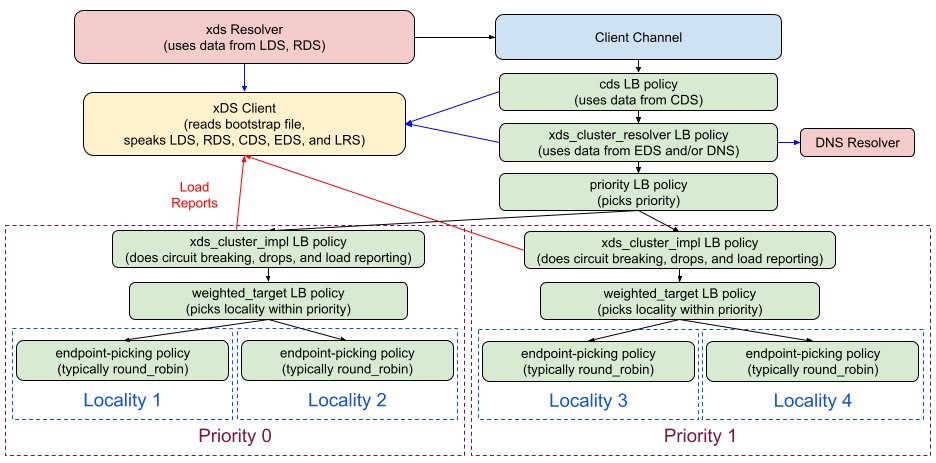
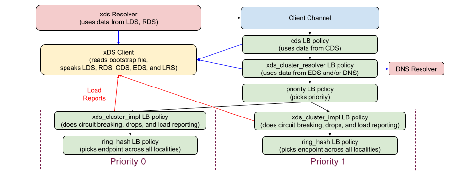

A42: xDS Ring Hash LB Policy
----
* Author(s): markdroth
* Approver: ejona86
* Status: Implementation in Progress
* Implemented in: Java (C-core and Go in progress)
* Last updated: 2021-06-04
* Discussion at: https://groups.google.com/g/grpc-io/c/_Z_oiWVXf6k

## Abstract

We are adding support for hash-based load balancing configured via xDS.

## Background

There are two features that xDS supports that, in concert, allow
hash-based load balancing: setting a hash policy in the route that
determines the hash to be used for each request, and configuring a
load balancing policy that uses that hash.

xDS supports many different types of hash policies.  gRPC will support
only a subset of these, but it will do so in a forward-compatible manner
that will allow us to support additional hash policies in the future if
needed.

xDS supports two hash-based LB policies, `RING_HASH` and `MAGLEV`.  For
now, gRPC will support only `RING_HASH`, although we could add support
for `MAGLEV` in the future.

### Related Proposals:

This proposal builds on earlier work described in the following gRFCs:
* [gRFC A27: xDS-based Global Load Balancing](https://github.com/grpc/proposal/blob/master/A27-xds-global-load-balancing.md)
* [gRFC A28: xDS-based Traffic Splitting and Routing](https://github.com/grpc/proposal/blob/master/A28-xds-traffic-splitting-and-routing.md)
* [gRFC A31: xDS-based Timeout and Config Selector](https://github.com/grpc/proposal/blob/master/A31-xds-timeout-support-and-config-selector.md)
* [gRFC A37: xDS Aggregate and Logical DNS Clusters](https://github.com/grpc/proposal/blob/master/A37-xds-aggregate-and-logical-dns-clusters.md)

## Proposal

As mentioned above, gRPC will support two xDS features: setting a hash
policy in the route, and configuring the `RING_HASH` LB policy.

### Hash Policy

This section explains how gRPC will support xDS-configured hash policies.

#### xDS API Fields

In xDS, the `RouteAction` message has a [`hash_policy`
field](https://github.com/envoyproxy/envoy/blob/2443032526cf6e50d63d35770df9473dd0460fc0/api/envoy/config/route/v3/route_components.proto#L1046)
that specifies the policy used to compute the hash for each request that
uses the route.  This is a `repeated` field, so it specifies a list of
hash policies.  Each hash policy is evaluated individually, and the
combined result is used to determine the request's hash.  The method of
combination is deterministic, such that identical lists of hash policies
will produce the same hash.  Since a hash policy examines specific parts of
a request, it can fail to produce a hash (e.g., if the hashed header is not
present).  If (and only if) all configured hash policies fail to generate a
hash, a random hash will be used for the request, which (assuming a
hash-based LB policy is used) will result in picking a random endpoint
for the request.  If a hash policy has the `terminal` attribute set to true,
and the policy does generate a result, then all subsequent hash policies
are skipped.

These semantics allow gRPC to support only a subset of xDS hash policy
types in a forward-compatible way.  For any hash policy type that gRPC
does not support, that hash policy is treated as simply not returning any
result for the request.  (Note that this differs from Envoy's behavior,
which is to reject a config with an unsupported hash policy.)

Here is how gRPC will handle each type of hash policy:

- [`header`](https://github.com/envoyproxy/envoy/blob/2443032526cf6e50d63d35770df9473dd0460fc0/api/envoy/config/route/v3/route_components.proto#L710):
  gRPC will support this type of hash policy.  This allows hashing on a
  request header.
- [`cookie`](https://github.com/envoyproxy/envoy/blob/2443032526cf6e50d63d35770df9473dd0460fc0/api/envoy/config/route/v3/route_components.proto#L713):
  gRPC does not support HTTP cookies, so we will not support this hash
  policy.  If specified, this policy will not return any result.
- [`connection_properties`](https://github.com/envoyproxy/envoy/blob/2443032526cf6e50d63d35770df9473dd0460fc0/api/envoy/config/route/v3/route_components.proto#L716):
  In Envoy, this allows hashing based on the source IP address, which
  ensures that all requests from a given client are sent to the same
  endpoint.  However, gRPC cannot support this, because it is a client
  and not a proxy, so it does not know what source address will be used
  for the request until after it has finished load balancing.  If
  specified, this policy will not return any result.  (However, see
  `filter_state` below for an alternative.)
- [`query_parameter`](https://github.com/envoyproxy/envoy/blob/2443032526cf6e50d63d35770df9473dd0460fc0/api/envoy/config/route/v3/route_components.proto#L719):
  gRPC does not support query parameters, so we will not support this
  hash policy.  If specified, this policy will not return any result.
- [`filter_state`](https://github.com/envoyproxy/envoy/blob/2443032526cf6e50d63d35770df9473dd0460fc0/api/envoy/config/route/v3/route_components.proto#L722):
  gRPC does not currently support the general-purpose concept of filter state
  the way that Envoy does.  However, we will support one special filter state
  [`key`](https://github.com/envoyproxy/envoy/blob/2443032526cf6e50d63d35770df9473dd0460fc0/api/envoy/config/route/v3/route_components.proto#L703)
  called `io.grpc.channel_id`, which will hash to the same value for all
  requests on a given gRPC channel. In order to facilitate an even selection
  of backends across different channels (which may or may not be in the same
  process or machine), the value of `io.grpc.channel_id` should be initialized
  with a random number from a uniform distribution. This can be used in similar
  situations to where Envoy uses `connection_properties` to hash on the source
  IP address. (Note that we do not recommend that applications create multiple
  gRPC channels to the same virtual host, but if you do that, then the behavior
  here will not be exactly the same as using `connection_properties`, because
  each channel may use a different endpoint.)

#### XdsClient Changes

In gRPC, the `xds` resolver registers a watcher with the `XdsClient` object
to get the `RouteConfiguration` resource.  The struct returned by that
watcher will be extended to include the following fields in each route
(C++ syntax):

```
struct HashPolicy {
  enum Type { HEADER, CHANNEL_ID };
  Type type;
  bool terminal = false;
  // Fields used for type HEADER.
  std::string header_name;
  std::unique_ptr<RE2> regex;
  std::string regex_substitution;
};
std::vector<HashPolicy> hash_policies;
```

The `XdsClient` will populate these fields from the fields of the
`RouteAction` message described above.

#### `XdsConfigSelector` Changes

The `XdsConfigSelector` is created by the xds resolver and is responsible
for performing routing for each request.  The `XdsConfigSelector` will
therefore be responsible for using the hash policies in the chosen route
to compute the hash for the request.  The hash will be computed using
`XX_HASH`, as defined in https://github.com/Cyan4973/xxHash in the `XXH64()`
function with seed 0.  The computed hash will be communicated from the
`XdsConfigSelector` to the LB policy using the same mechanism described in [gRFC
A31](https://github.com/grpc/proposal/blob/master/A31-xds-timeout-support-and-config-selector.md)
for passing the cluster name to the LB policy.

### Ring Hash LB Policy

#### xDS API Fields

The xDS `Cluster` resource specifies the load balancing policy to use
when choosing the endpoint to which each request is sent.  The policy to
use is specified in the [`lb_policy`
field](https://github.com/envoyproxy/envoy/blob/2443032526cf6e50d63d35770df9473dd0460fc0/api/envoy/config/cluster/v3/cluster.proto#L722).
Prior to this proposal, gRPC supported only one value for this field,
which was `ROUND_ROBIN`.  With this proposal, we will add support for an
additional policy, `RING_HASH`.

The configuration for the Ring Hash LB policy is in the
[`ring_hash_lb_config`
field](https://github.com/envoyproxy/envoy/blob/2443032526cf6e50d63d35770df9473dd0460fc0/api/envoy/config/cluster/v3/cluster.proto#L907).
The field is optional; if not present, defaults will be assumed for all
of its values.  gRPC will support the
[`minimum_ring_size`](https://github.com/envoyproxy/envoy/blob/2443032526cf6e50d63d35770df9473dd0460fc0/api/envoy/config/cluster/v3/cluster.proto#L397)
and
[`maximum_ring_size`](https://github.com/envoyproxy/envoy/blob/2443032526cf6e50d63d35770df9473dd0460fc0/api/envoy/config/cluster/v3/cluster.proto#L406)
fields.  As in Envoy, values above 8M will be NACKed.  Note that gRPC has
different restrictions on ring size than Envoy does and a different default
for the max ring size (see below for details), so to ensure correct xDS
defaults, the xDS code must explicitly set this field in the gRPC LB policy
config even if the field is unset in the xDS resource (and therefore the
default xDS value of 8388608 is used).  The
[`hash_function`](https://github.com/envoyproxy/envoy/blob/2443032526cf6e50d63d35770df9473dd0460fc0/api/envoy/config/cluster/v3/cluster.proto#L401)
field will be required to be set to `XX_HASH`; if it is set to any other
value (at present, the only other value is `MURMUR_HASH_2`), gRPC will
NACK the `Cluster` resource.

#### Background: Envoy vs. gRPC LB Policies

Envoy's LB policies are expected to handle both locality-picking and
endpoint-picking in a single layer.  It does not currently have a clean
way to independently select the locality-picking and endpoint-picking
policies the way that we do in gRPC.  For example, with the `ROUND_ROBIN`
LB policy, Envoy has a single policy that handles both picking the
locality and the endpoint within that locality as a single step.
In contrast, in gRPC, we implement the xDS `ROUND_ROBIN` policy by
having a `weighted_target` LB policy that chooses the locality and then
delegates to a nested `round_robin` policy for that locality to choose
the endpoint within the locality.

Unfortunately, we cannot do the same thing with the `RING_HASH` policy.
The `RING_HASH` LB policy in Envoy handles both locality-picking and
endpoint-picking in a single layer.  It basically puts all endpoints in
all localities into a single ring and then chooses an endpoint for a
request from the ring based on the request's hash.  We cannot split this
up into two different policies, because the two policies would pick
independently, which means that the failover behavior would cause
unnecessary thrashing in the choice of endpoint when the originally
chosen endpoint is down.  For example, consider the case where the
endpoint nearest to the request's hash is in locality A and the
next-nearest is in locality B.  If the client sees that the endpoint
in locality A is unreachable before it sees an EDS update that removes
that endpoint, the endpoint-picking policy for locality A would switch
to the next-closest endpoint in the same locality.  Then, when the EDS
update removes that endpoint from the list, the locality-picking endpoint
would choose locality B instead.  This would result in switching backends
twice instead of just once, which is too much churn.  As a result, gRPC
will need to route to both the locality and endpoint in a single layer,
just like Envoy does.

This has a couple of implications:
- We need to change the way that we handle child policy configuration in
  the `xds_cluster_resolver` LB policy.
- We can no longer insert the LRS policy in between the locality-picking
  and endpoint-picking policies, so we need a different way to handle load
  reporting.

These two changes are described in the next two sections.

#### Change Child Policy Config Generation in `xds_cluster_resolver` Policy

As per [gRFC
A37](https://github.com/grpc/proposal/blob/master/A37-xds-aggregate-and-logical-dns-clusters.md),
the config for the `xds_cluster_resolver` LB policy has the following
fields:

```
  // Locality-picking policy.
  // This policy's config is expected to be in the format used
  // by the weighted_target policy.  Note that the config should include
  // an empty value for the "targets" field; that empty value will be
  // replaced by one that is dynamically generated based on the EDS data.
  // Optional; defaults to "weighted_target".
  repeated LoadBalancingConfig locality_picking_policy = 2;

  // Endpoint-picking policy.
  // This will be configured as the policy for each child in the
  // locality-policy's config.
  // Optional; defaults to "round_robin".
  repeated LoadBalancingConfig endpoint_picking_policy = 3;
```

The `xds_cluster_resolver` policy used these fields to generate its child
policy config.  In essence, the split between locality-picking and
endpoint-picking is baked into our design.

However, now that we need to support a policy that cannot be split up
this way, we need to switch to a more xDS-style model.  We will replace
the two fields above with the following:

```
  // xds LB policy.
  repeated LoadBalancingConfig xds_lb_policy = 4;
```

This new field is intended to represent the xDS LB policy, which does not
map exactly to a gRPC LB policy.  (In effect, you can think of this field
as being the equivalent of the new xDS LB policy config field added in
https://github.com/envoyproxy/envoy/pull/7744 but not yet supported by
Envoy.)  It will be a direct translation of the existing enum and
hard-coded LB policy config fields in the CDS response:
- For `ROUND_ROBIN`, the policy name will be `"ROUND_ROBIN"`.  The config will
  be empty.
- For `RING_HASH`, the policy name will be `"RING_HASH"`, and the config will
  be the one for the `ring_hash_experimental` LB Policy described below.

Despite this new config field being structured as a `LoadBalancingConfig`
message, it will not actually indicate a child policy; instead, the
functionality to understand the differences between `ROUND_ROBIN` and
`RING_HASH` will be baked directly into the `xds_cluster_resolver` policy.
In effect, the `xds_cluster_resolver` policy will contain the logic to
convert from an xDS LB policy config to a gRPC LB policy config.

When the `xds_cluster_resolver` policy sees `"ROUND_ROBIN"`, it will continue
to do what it does today, assuming that the locality-picking policy is
`weighted_target` and the endpoint-picking policy is `round_robin`.  The LB
policy tree will look like this (see also "Move Load Reporting into
`xds_cluster_impl` Policy" below):



[Link to SVG file](A42_graphics/grpc_xds_client_architecture_round_robin.svg)

However, when the `xds_cluster_resolver` policy sees `"RING_HASH"`, it will
create a priority policy where the child for each priority is a
`ring_hash_experimental` LB Policy.  The config for the `ring_hash` policy
will be passed along verbatim from the `xds_cluster_resolver` policy's
config.  The LB policy tree will then look like this:



[Link to SVG file](A42_graphics/grpc_xds_client_architecture_ring_hash.svg)

In the `RING_HASH` case, the endpoint weights will need to be adjusted by
the locality weight.  We will add a per-address attribute for endpoint
weight, and the `xds_cluster_resolver` policy can multiply any pre-existing
weight by the locality weight.  For example, consider the following EDS data:
- locality 1: weight=3:
  - endpoint A: weight 2
  - endpoint B: weight 1
- locality 2: weight=2:
  - endpoint C: weight 3
  - endpoint D: weight 1

The `xds_cluster_resolver` policy will need to pass down the following list
of addresses to the `ring_hash_experimental` policy:
- A: weight 2x3 = 6
- B: weight 1x3 = 3
- C: weight 3x2 = 6
- D: weight 1x2 = 2

#### Move Load Reporting into `xds_cluster_impl` Policy

Because the `ring_hash` policy is going to handle both locality picking and
endpoint picking in a single policy, we will no longer be able to insert
the LRS policy in between those two layers as we are doing today.  So we
need an alternative approach for handling load reporting.

Initially, we considered simply building the LRS functionality directly
into the `ring_hash` LB policy.  However, this approach has a number of
down-sides:
- It duplicates the LRS code in two places.  This is suboptimal but is not
  really a huge problem; the amount of code that would need to be
  duplicated is not large.
- It means that LRS will work a little differently in the `ROUND_ROBIN` and
  `RING_HASH` cases, which is confusing when we're trying to debug things.
  It makes the system harder to understand.
- It makes the `ring_hash` policy xDS-specific.  This is undesirable, since
  we'd ultimately like to also use the same policy to provide affinity in
  non-xDS use-cases.  (This will be the subject of future work in which we
  will add fields to service config to control setting the hash for a
  request.)

So instead, we're going to completely eliminate the LRS policy and move
all load reporting up into the `xds_cluster_impl` policy.  The approach
will be:
- The `xds_cluster_resolver` policy will attach an attribute to each
  address indicating what locality the endpoint is in.
- The `xds_cluster_impl` policy's helper will see the attribute in the
  `CreateSubchannel()` call.  It will look up the appropriate stats
  object and attach it to a wrapped subchannel.  If the attribute is
  not present (e.g., because the address is from a `LOGICAL_DNS` cluster
  instead of an EDS cluster), the stats will be reported under an empty
  locality name.
- When the `xds_cluster_impl` policy's picker sees the result of the pick
  from its child, it will use the stats object in the subchannel wrapper
  for load reporting.

#### `ring_hash_experimental` LB policy

We will implement a `ring_hash_experimental` LB policy that uses the same
algorithm as Envoy's implementation.  However, this policy will be
implemented in a non-xDS-specific way, so that it can also be used without
xDS in the future.

The `ring_hash` policy will accept both multiple instances of the same
address and the per-address weight attribute.  This provides two
different ways to indicate weighting when generating an address list.

Whenever the address list changes, a new ring will be generated.  The
ring will be stored within the picker, so any time a new ring is
generated, a new picker will be returned.

The picker will contain not just the ring but also the current state of
every subchannel in the ring.  Implementations may either generate a new
picker every time a subchannel's state changes, or they may provide a
mechanism to synchronize subchannel state data between the LB policy
itself and the picker.

##### LB Policy Config

The `ring_hash_experimental` policy will have the following config:

```
message RingHashLoadBalancingConfig {
  // A client-side cap will limit these values.  If either of these values
  // are greater than the client-side cap, they will be treated as the
  // client-side cap.  The default cap is 4096.
  uint64 min_ring_size = 1;  // Optional, defaults to 1024.
  uint64 max_ring_size = 2;  // Optional, defaults to 4096, max is 8M.
}
```

These parameters are used to determine how the ring is constructed, just
as they are in the Envoy implementation.  However, in order to limit the
possibility of a control plane causing a client to OOM by creating a lot
of large rings, we want to limit the ring size to a much smaller value
than Envoy does.  The `max_ring_size` field will default to 4096 instead
of 8M as in Envoy, although it will still accept values up to 8M for
compatibility with Envoy (values above 8M will be NACKed).  In addition,
the client will have a local option (either per-channel or global) to set
a cap for the ring size, which will also default to 4096; if either the
`min_ring_size` or `max_ring_size` values in the LB policy config are greater
than the locally configured cap, they will be treated as the locally
configured cap.  The resulting behavior will be:
- When used via xDS, `max_ring_size` will be set to 8M when
  `envoy.extensions.load_balancing_policies.ring_hash.v3.RingHash.maximum_ring_size`
  is unset, but will be capped by the locally configured cap of 4096.  So
  if an xDS-enabled client needs a larger ring size, they can just change
  the locally configured cap without needing to modify the xDS config.
- In the future, when we can use the `ring_hash` policy without xDS, the
  default for `max_ring_size` will be 4096, the same as the locally
  configured cap.  So if a client needs a larger ring size, they will
  need to increase both the locally configured cap and the value of
  `max_ring_size` in the config.

The hash function will be `XX_HASH`, as defined in
https://github.com/Cyan4973/xxHash in the `XXH64()` function with seed 0.

When the picker is asked for a pick, it will receive the hash for the
request via the same mechanism that we use to pass the cluster name to
the `xds_cluster_manager` policy in the `RouteAction` design, as
described above.  The picker will use that hash to determine which endpoint
to choose from the ring.

##### Subchannel State Handling

Subchannels will start in state `IDLE`, and the `ring_hash` policy will not
proactively connect to them.  When the picker chooses a subchannel for
a call, if the subchannel is in state `IDLE`, the picker will trigger a
connection attempt for that subchannel.  The subchannel will then go
into state `CONNECTING`.

If the connection attempt is successful, the subchannel will transition
to state `READY`.

If the connection attempt is not successful, the subchannel will be
considered to be in state `TRANSIENT_FAILURE`, but it will not
automatically attempt to reconnect; those connection attempts will also
be triggered from the picker.

Once a subchannel goes into state `TRANSIENT_FAILURE`, it will be
considered to stay in that state until it has managed to successfully
connect, at which point it transitions into state `READY`.  In other
words, even if the underlying subchannel reports state `CONNECTING` for
subsequent connection attempts, the `ring_hash` policy will treat it as if
it were still in state `TRANSIENT_FAILURE`, both in terms of the picker's
behavior and in terms of the overall connectivity state that the
`ring_hash` policy reports to its parent.

If a subchannel was in state `READY` but the connection fails, the
`ring_hash` policy will treat it as if it has transitioned to state `IDLE`,
both for the purposes of the picker's behavior and in terms of the
overall connectivity state that the `ring_hash` policy reports to its
parent.

##### Aggregated Connectivity State

Because the `ring_hash` policy does not proactively connect to
subchannels but rather triggers connection attempts based on picks, it
cannot use the aggregation rules used by most LB policies (e.g., those used
by the `weighted_target` policy) as-is.  Instead, it has two differences
in how it handles `TRANSIENT_FAILURE`, both of which are motivated by
ensuring that the `ring_hash` policy will report reasonable connectivity
state transitions to its parent (which today is always the `priority`
policy but might at some point in the future be the channel itself).

The `priority` policy essentially has an ordered list of child policies and
will send picks to the highest priority child that is currently reporting
`READY` or `IDLE`.  This means that for `ring_hash` to function as a child
of the `priority` policy, it needs to report `TRANSIENT_FAILURE` when its
subchannels are not reachable.  However, `ring_hash` attempts to connect
only to those subchannels that pick requests hash to, and if the first
subchannel fails to connect, it then sequentially attempts to connecto to
subsequent subchannels in ring order, so it may take a very long time
for all of the subchannels to report `TRANSIENT_FAILURE` instead of `IDLE`.
Under the normal aggregation rules, that means that the `ring_hash` policy
would take far too long to report `TRANSIENT_FAILURE`.  And more
generally, if `ring_hash` has only attempted to connect to a small
subset of its subchannels, it cannot truly know the overall reachability
of all of the subchannels.  To address these problems, the `ring_hash`
policy will use a heuristic that if there are two or more subchannels
reporting `TRANSIENT_FAILURE` and none in state `READY`, it will report
an aggregated connectivity state of `TRANSIENT_FAILURE`.  This heuristic
is an attempt to balance the need to allow the `priority` policy to
quickly failover to the next priority and the desire to avoid reporting
the entire `ring_hash` policy as having failed when the problem is just
one individual subchannel that happens to be unreachable.

In addition, once the `ring_hash` policy reports `TRANSIENT_FAILURE`, it
needs some way to recover from that state.  The `ring_hash` policy
normally requires pick requests to trigger subchannel connection
attempts, but if it is being used as a child of the `priority` policy,
it will not be getting any picks once it reports `TRANSIENT_FAILURE`.
To work around this, it will make sure that it is attempting to
connect (after applicable backoff period) to at least one subchannel at
any given time.  After a given subchannel fails a connection attempt, it
will move on to the next subchannel in the ring.  It will keep doing this
until one of the subchannels successfully connects, at which point it
will report `READY` and stop proactively trying to connect.

Another issue is the way that the `priority` policy handles its failover
timer.  The failover timer is used to apply an upper bound to the amount
of time that `priority` policy waits for a child policy to become
connected before it gives up and creates the child policy for the next
priority.  The failover timer is started when a child is first created
and is cancelled when the child reports any state other than `CONNECTING`.
To allow this timer to work properly, the `ring_hash` policy should
remain in state `CONNECTING` until it transitions to either
`TRANSIENT_FAILURE` or `READY`.  Specifically, after the first subchannel
reports `TRANSIENT_FAILURE` and all other subchannels are in `IDLE`, it
should continue to report `CONNECTING` instead of `IDLE`.  In this case,
just as in the `TRANSIENT_FAILURE` case above, it will proactively attempt
to connect to at least one subchannel at all times while it is reporting
`CONNECTING`, so that it does not stay in state `CONNECTING` indefinitely
if it is not receiving picks (e.g., if the application is only occassionally
starting RPCs and giving them very short deadlines).

Note that when the `ring_hash` policy first starts up with a completely
new set of subchannels that are all in state `IDLE`, it will report `IDLE`
as a consequence of the aggregation rules shown below.  This is different
from most policies, which start in state `CONNECTING`, and it will
prevent the failover timer in the `priority` policy from working
correctly, because the timer will be started when the child is created
but then immediately cancelled when it reports `IDLE`.  To address this,
we will change the `priority` policy to restart the failover timer when a
child reports `CONNECTING`, if that child has not reported `TRANSIENT_FAILURE`
more recently than it reported `READY` or `IDLE`.

Taking all of the above into account, the aggregation rules for
the `ring_hash` policy are as follows:
1. If there is at least one subchannel in `READY` state, report `READY`.
2. If there are 2 or more subchannels in `TRANSIENT_FAILURE` state, report
   `TRANSIENT_FAILURE`.
3. If there is at least one subchannel in `CONNECTING` state, report
   `CONNECTING`.
4. If there is one subchannel in `TRANSIENT_FAILURE` and there is more than
   one subchannel, report state `CONNECTING`.
5. If there is at least one subchannel in `IDLE` state, report `IDLE`.
6. Otherwise, report `TRANSIENT_FAILURE`.

##### Picker Behavior

The picker will start by finding the subchannel on the ring that is
closest to the request's hash.  The next behavior depends on the state
of that subchannel.

The basic rules are:
- If the subchannel is in state `READY`, the pick will be sent to that
  subchannel.
- If the subchannel is in state `IDLE`, the picker will tell the LB policy
  to attempt to connect that subchannel, and it will queue the pick.
  (Note that the call's hash will be the same when it is re-attempted
  with a new picker, so it will always hash to the same subchannel.)
- If the subchannel is in state `CONNECTING`, the picker will queue the
  pick.
- If the subchannel is in state `TRANSIENT_FAILURE`, the picker will do the
  following:
  - Ensure that another connection attempt of the subchannel will occur,
    after appropriate connection backoff behavior for the individual
    subchannel.
  - Look at the next unique subchannel in the ring (i.e., the one it
    would have chosen based on the request's hash if the subchannel that
    is in state `TRANSIENT_FAILURE` had not been present in the ring),
    skipping duplicates of the first subchannel.
    - If this second unique subchannel is in state `READY`, `IDLE`, or
      `CONNECTING`, handle as we would have handled the original subchannel
      in those states.
    - If this second unique subchannel is in state `TRANSIENT_FAILURE`:
      - Ensure that another connection attempt of this second subchannel
        will occur, after appropriate connection backoff behavior for the
        individual subchannel.
      - Loop over all remaining entries in the ring.
        - As soon as we hit the first subchannel in state `READY`, return it.
        - If we have not yet seen a subchannel in a state other than
          `TRANSIENT_FAILURE`, then:
          - If this subchannel is in `TRANSIENT_FAILURE`, ensure that
            another connection attempt of this subchannel will occur,
            after appropriate connection backoff behavior for the
            individual subchannel.
          - Otherwise, if the first subchannel that is not
            `TRANSIENT_FAILURE` is `IDLE`, then trigger another connection
            attempt of this subchannel.
        - If we get to the end of the ring and have not found a
          subchannel in state `READY`, then fail the pick.

This behavior ensures that the policy delays an individual RPC for no
longer than the time it takes to attempt connection on two subchannels.
It also avoids unnecessarily delaying RPCs immediately after recovering
from `TRANSIENT_FAILURE` state, when there may be only one subchannel
connected.

Here is some pseudo-code showing the picker's behavior:

```
first_index = ring.FindIndexForHash(request.hash);
if (ring[first_index].state == READY) {
  return PICK_COMPLETE using ring[first_index].subchannel;
}
if (ring[first_index].state == IDLE) {
  ring[first_index].subchannel
      .TriggerConnectionAttemptInControlPlane();
  return PICK_QUEUE;
}
if (ring[first_index].state == CONNECTING) {
  return PICK_QUEUE;
}
if (ring[first_index].state == TRANSIENT_FAILURE) {
  ring[first_index].subchannel.TriggerConnectionAttemptInControlPlane();
  first_subchannel = ring[first_index].subchannel;
  found_second_subchannel = false;
  found_first_non_failed = false;
  for (i = 1; i < ring.size(); ++i) {
    index = (first_index + i) % ring_size();
    if (ring[index].subchannel == first_subchannel) continue;
    if (ring[index].state == READY) {
      return PICK_COMPLETE using ring[index].subchannel;
    }
    if (!found_second_subchannel) {
      if (ring[index].state == CONNECTING) {
        return PICK_QUEUE;
      }
      if (ring[index].state == IDLE) {
        ring[index].subchannel
            .TriggerConnectionAttemptInControlPlane();
        return PICK_QUEUE;
      }
      found_second_subchannel = true;
    }
    if (!found_first_non_failed) {
      if (ring[index].state == TRANSIENT_FAILURE) {
        ring[index].subchannel
            .TriggerConnectionAttemptInControlPlane();
      } else {
        if (ring[index].state == IDLE) {
          ring[index].subchannel
              .TriggerConnectionAttemptInControlPlane();
        }
        found_first_non_failed = true;
      }
    }
  }
  return PICK_FAILED;
}
```

#### `XdsClient` Changes

In the data structure returned by a watch on a CDS resource, new fields
will be added to represent the LB policy configuration, as follows (C++
syntax):

```
  // The LB policy to use (e.g., "ROUND_ROBIN" or "RING_HASH").
  std::string lb_policy;
  // Used for RING_HASH LB policy only.
  uint64_t min_ring_size;
  uint64_t max_ring_size;
```

#### CDS LB Policy Changes

The CDS LB policy will use the new fields described in the previous
section when generating its child policy config.  Specifically, it
will populate the new `xds_lb_policy` field in the `xds_cluster_resolver`
policy's config.

### Temporary environment variable protection

During initial development, this feature will be enabled via the
`GRPC_XDS_EXPERIMENTAL_ENABLE_RING_HASH` environment variable.  This
environment variable protection will be removed once the feature has
proven stable.

## Rationale

As mentioned above, we considered splitting the `ring_hash` policy into
two layers, one for locality picking and another for endpoint picking,
but we ruled out that approach because it would have caused unnecessary
churn in choosing endpoints when an endpoint becomes unreachable and the
client notices before the control plane does.

Also as mentioned above, we considered duplicating the load reporting
functionality in the `ring_hash` policy, but we instead elected to move
it to the `xds_cluster_impl` policy to avoid this duplication.

## Implementation

Implementation is already mostly complete in C++ and Java, and will soon
start in Go.
