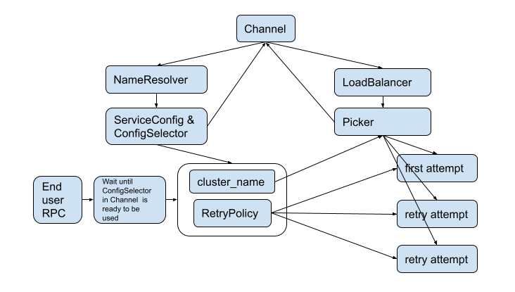

A44: gRPC xDS Retry Support
----
* Author(s): dapengzhang0
* Approver: markdroth
* Status: In Review
* Implemented in: C-core, Java
* Last updated: 2021-08-04
* Discussion at: https://groups.google.com/g/grpc-io/c/rTUvJ14gjDs

## Abstract
Retry is an important feature that helps users improve service availability if instances or endpoints (that host your server application(s)) are slow or flaky. This doc aims to design a retry mechanism for proxyless gRPC clients using xDS based traffic routing.

## Background

gRPC library provides a [built-in retry](A6-client-retries.md) mechanism based on gRPC retry policy in service config. Envoy also provides a [proxy-level retry](https://www.envoyproxy.io/docs/envoy/latest/intro/arch_overview/http/http_routing.html#retry-semantics) based on either route configuration or request headers for either REST or gRPC requests. The Envoy retry for gRPC requests is triggered either based on the failure indicated by the initial metadata in the response, in the same way as gRPC built-in retry, or based on a per-try-timeout. For proxyless gRPC (aka gRPC-xDS), it is proposed to support various features and configurations in route action such as timeout and retry using a per-RPC ConfigSelector (see [gRPC xDS Config Selector Design](A31-xds-timeout-support-and-config-selector.md)). It is natural to fit Envoy retry config into gRPC retry policy with proper extension.

There are some key differences between gRPC’s and Envoy’s retry policy:

- Envoy has the notion of [per_try_timeout](https://github.com/envoyproxy/envoy/blob/a67d8e588532fc2e3a7d89ee6aa469931c6419be/api/envoy/config/route/v3/route_components.proto#L1269) which current gRPC retry policy doesn’t have. In gRPC retry, when the deadline is exceeded for a request attempt, the RPC fails as a whole and there will be no retry possible after that. Whereas Envoy can set a timeout (earlier than the overall deadline) for each attempt, and in addition, all retries are contained within the overall request timeout.
- Envoy’s [HedgePolicy](https://www.envoyproxy.io/docs/envoy/latest/api-v3/config/route/v3/route_components.proto#envoy-v3-api-msg-config-route-v3-hedgepolicy) is fundamentally different from gRPC’s HedgingPolicy. Envoy can have RetryPolicy and HedgePolicy specified together. In fact, Envoy’s HedgePolicy currently is only based on RetryPolicy’s per_try_timeout: a request attempt can only be hedged on per_try_timeout. If a request attempt fails prior to per_try_timeout, it might be retried after an exponential backoff, but will not be hedged after a hedging delay. On the contrary, gRPC can specify only one of the retry and hedging policy at a time for each method, but not both.
- gRPC uses retry throttling to prevent server overload, whereas Envoy uses retry budgets or maximum active retries circuit breakers for the same purpose.
  - Throttler config is a subconfig of service config, whereas retry circuit breaker is part of CDS update or cluster_impl lb config.
  - Throttler is shared per client channel, whereas retry circuit breaker is shared per upstream cluster.

### Related Proposals

- [A6: gRPC Retry Design](A6-client-retries.md)
- [A31: gRPC xDS Timeout Support and Config Selector Design](A31-xds-timeout-support-and-config-selector.md)

## Proposal

### Features to support

Due to the differences between gRPC and Envoy, incomplete implementation status of the original [retry gRFC](A6-client-retries.md) and unresolved [compatibility issues](https://github.com/envoyproxy/envoy/issues/17412) with dynamic cluster selection, we propose initially to support only some of the retry features in Envoy.

#### Supported Retry Features

1. Retry on a given set of gRPC status codes ([x-envoy-retry-grpc-on](https://www.envoyproxy.io/docs/envoy/latest/configuration/http/http_filters/router_filter#x-envoy-retry-grpc-on) values) specified by the retry_on config.
1. Backoff retry on retriable error status by a time given by the retry_back_off config.
1. Limit the number of attempts that can be retried for a given RPC by the num_retries config.

#### Deferred or Unsupported Retry Features

1. The HedgePolicy.
1. The `per_try_timeout` config.
1. Any `retry_on` conditions from values of [x-envoy-retry-on](https://www.envoyproxy.io/docs/envoy/latest/configuration/http/http_filters/router_filter#x-envoy-retry-on).
1. The `retriable_headers` attribute in RetryPolicy.
1. The `retriable_request_headers` attribute in RetryPolicy.
1. Any retry related request headers such as: x-envoy-retry-on, x-envoy-retry-grpc-on, x-envoy-max-retries, and x-envoy-upstream-rq-per-try-timeout-ms.
1. Retry circuit breaker.
1. The `retry_priority` config.
1. The `retry_host_predicate` config.
1. The `host_selection_retry_max_attempts` config.

### Converting Envoy RetryPolicy to gRPC RetryPolicy

We convert the following (supported) attributes in [Envoy RetryPolicy](https://www.envoyproxy.io/docs/envoy/latest/api-v3/config/route/v3/route_components.proto#config-route-v3-retrypolicy) to [gRPC RetryPolicy](A6-client-retries.md#retry-policy):

| Attributes in Envoy RetryPolicy | Attributes in gRPC RetryPolicy |
| ------------------------------- | ------------------------------ |
| retry\_on                       | retryableStatusCodes           |
| num\_retries                    | maxAttempts = num\_retries + 1 | 
| retry\_back\_off                | initialBackoff = retry\_back\_off.base\_interval   maxBackoff = retry\_back\_off.max\_interval   backoffMultiplier = 2 |

When converting `retry_on` value to `retryableStatusCodes`, the gRPC xDS client will only convert conditions that are documented in [x-envoy-retry-grpc-on](https://www.envoyproxy.io/docs/envoy/latest/configuration/http/http_filters/router_filter#x-envoy-retry-grpc-on), that is, "cancelled", "deadline-exceeded", "internal", "resource-exhausted" and "unavailable", and will ignore any other conditions. If the resulting retryableStatusCodes is empty, gRPC xDS client will not include a retry policy in the corresponding route action.

The num_retries attribute defaults to 1 as specified in Envoy API doc. As specified in the original retry gRFC any maxAttempts value greater than 5 will be treated as 5, so any value greater than 4, will effectively be converted to maxAttempts=5. The num_retries attribute must not be less than 1.

As specified in Envoy API doc, retry_back_off is optional and defaults to base_interval=25ms and max_interval=250ms. In retry_back_off, base_interval is required. The max_interval is optional and defaults to 10 times base_interval. The value of base_interval and max_interval must be greater than zero. Values of base_interval or max_interval less than 1ms will be treated as 1ms. The value of max_interval must be no less than the value of base_interval.

When validating xDS update from the control plane, gRPC xDS client will reject the config if any of the above requirements is not met.

We ignore all other attributes in Envoy RetryPolicy.

### Workflow of xDS Retry

As shown in the chart below, the client RPC obtains from ConfigSelector (i) the name of the upstream cluster that the RPC is routed to, and (ii) optionally a gRPC RetryPolicy as subconfig of per-RPC service config. 

For client versions in which the xDS retry feature is experimental, if the environment variable `GRPC_XDS_EXPERIMENTAL_ENABLE_RETRY` is not set as true, the client will ignore RetryPolicy updates from the control plane.

If the application disables retries for the channel via the gRPC API, then the retry config from xDS will be validated as described above but will not actually be used as [specified by the retry gRFC](A6-client-retries.md#disabling-retries).

The gRPC RetryPolicy is converted from Envoy RetryPolicy, where the Envoy RetryPolicy is obtained in either the LDS or RDS update from the control plane. If a RetryPolicy is given in the RouteAction config for the selected route, that will be used; otherwise if a RetryPolicy is given in the VirtualHost config for the selected VirtualHost, that will be used.

If retry is allowed by the RetryPolicy, after the backoff period, each retry attempt will re-pick a subchannel that routes to the upstream cluster from the most up-to-date picker provided by the load balancer.

## Rationale

### Supporting per_try_timeout

If we were to support per_try_timeout in non-hedging case before hedging support is implemented, then in the future if xDS server returns a config with a hedging policy, because the semantic of per_try_timeout is different for hedging and non-hedging, xDS clients that do not support hedging would have compatibility issues. These are the options considered:

1. NACK the config
   - Pros
     - Won’t do anything unintended for old clients
   - Cons
     - Could not update the config without outage until all old clients get updated first
1. Ignore only hedging policy
   - Cons
     - If the new config with hedging policy sets the per_try_timeout field extremely small, old clients will have unintended wrong behavior: retry extremely frequently and fail immediately.
1. Ignore the entire retry policy
   - Pros
     - Could update the config without outage for old clients
   - Cons
     - Upon change of policy, old clients will have different behavior which might result in different availability and error rates. The availability drop is unintended. 
1. Ignore only hedging policy as well as the per_try_timeout field in retry policy (We’re not doing hedging for old clients)
   - Pros
     - Could update the config without outage for old clients
     - Old client won’t disable retry completely
   - Cons
     - In the case of the new config with per_try_timeout unchanged and with hedging enabled, old clients will have different behavior which might result in different availability and error rates upon the change of policy. The availability drop is unintended. 
1. Ignore the entire route
   - Pros
     - Provides backward compatibility if the control plane always sends routes with backup (identical to the route with old policy) when updating hedging policy.
   - Cons
    - It requires the control plane to always send an additional backup route whenever adding hedging policy while there are any old clients. Concern is the case that the control plane doesn't realize that there are old clients and does a single route update by accident.
1. Delay retries until hedging is implemented
   - Cons
     - Users asking for only basic retry features need to wait longer.

### Supporting circuit breaker

If we were to support retry circuit breaker, we would propose the following:

For each remote control plane, gRPC should maintain a registry of counters for active retries keyed by cluster name. This registry is shared by all the client channels connecting to the same remote control plane. XdsNameResolver creates a channel-level map to store the max_retries number for each cluster. The map is passed to CDS LB via Attributes of name resolution result. CDS LB policy sets the max_retries in the map when receiving updates. A new interface with methods `shouldRetry()` and `commit()` needs to be added and be used by the gRPC retry logic. The implementation of this interface is instantiated by the ConfigSelector. When the RPC is about to retry based on the RetryPolicy, the `shouldRetry()` method first decrements the counter if the counter has been incremented, and then checks the counter in the registry associated with the cluster that the RPC is routed to. If the max value has already been reached, the attempt should not retry and the overall RPC should fail; otherwise, it increments the counter. Once the overall RPC is committed, the `commit()` method decrements the counter if it has been incremented earlier. If no CDS update has been received yet, or the circuit breaker or max_retries in circuit breaker is not specified, the default value of max_retries for proxyless gRPC is 3, the same as Envoy.

However, this design relies on the assumption that all retry attempts will choose the same cluster level LB policy from the xDS LB policy tree, and will not work properly if the cluster is dynamically selected.

### Temporary environment variable protection

`GRPC_XDS_EXPERIMENTAL_ENABLE_RETRY`

## Implementation

This functionality is being implemented in C-core and Java. It will be implemented in Go in the near future.
