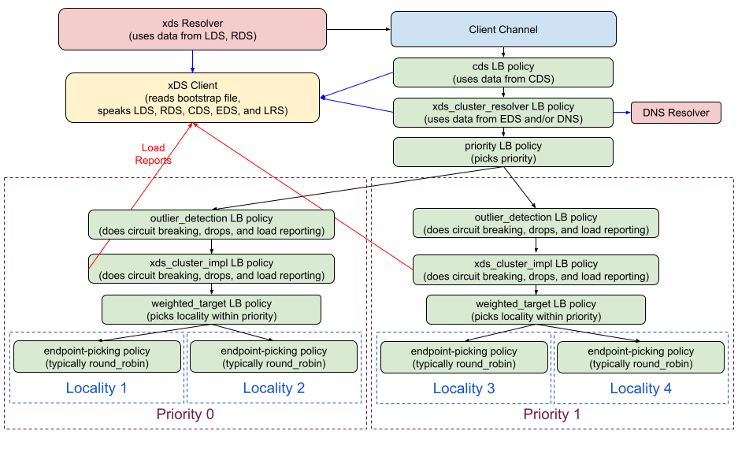

A50: gRPC xDS Outlier Detection Support
----
* Author(s): murgatroid99
* Approver: markdroth
* Implemented in:
* Last updated: 2022-01-24
* Discussion at: https://groups.google.com/g/grpc-io/c/dk4ZX7nbBIk/m/n5r6ezQlBgAJ

## Abstract

gRPC will add support for the xDS [Outlier Detection feature](https://www.envoyproxy.io/docs/envoy/latest/intro/arch_overview/upstream/outlier). This feature allows users to configure heuristics that clients can use to decide to stop sending requests to a specific backend because it appears unhealthy.

## Background

Service mesh orchestration systems perform active health checking and provide that information to clients. Outlier Detection is an additional heuristic-based passive health checking strategy that clients can perform directly.


### Related Proposals:

This proposal builds on earlier work described in the following gRFCs:
* [gRFC A27: xDS-based Global Load Balancing](https://github.com/grpc/proposal/blob/master/A27-xds-global-load-balancing.md)
* [gRFC A30: xDS v3 Support](https://github.com/grpc/proposal/blob/master/A30-xds-v3.md)
* [gRFC A37: xDS Aggregate and Logical DNS Clusters](https://github.com/grpc/proposal/blob/master/A37-xds-aggregate-and-logical-dns-clusters.md)
* [gRFC A42: xDS Ring Hash LB Policy](https://github.com/grpc/proposal/blob/master/A42-xds-ring-hash-lb-policy.md)

## Proposal

xDS outlier detection supports configuring many different ejection algorithms. We plan to support only two of them, [success rate](https://www.envoyproxy.io/docs/envoy/latest/intro/arch_overview/upstream/outlier#success-rate) and [failure percentage](https://www.envoyproxy.io/docs/envoy/latest/intro/arch_overview/upstream/outlier#failure-percentage). See the "Rationale" section below for why we are not supporting the other algorithms.

The outlier detection functionality will be provided via a new `outlier_detection` LB policy, which delegates to a child policy to perform the actual load balancing. The outlier_detection policy will monitor the results of calls to the endpoints that the child dispatches requests to, and it will use that data to eject endpoints based on the configured ejection algorithms and thresholds. The LB policy will eject endpoints by having their subchannels report `TRANSIENT_FAILURE` to the child policy.

Note that the `outlier_detection` LB policy will not be specific to xDS, so it will also be usable by non-xDS gRPC users.

### LB Policy Config

The `outlier_detection` policy will have the following config. All fields except the last one come directly from Envoy's [`Outlier Detection` message](https://github.com/envoyproxy/envoy/blob/main/api/envoy/config/cluster/v3/outlier_detection.proto), and the comments are modified from the comments there:

```proto
message OutlierDetectionLoadBalancingConfig {
  // The time interval between ejection analysis sweeps. This can result in
  // both new ejections as well as addresses being returned to service. Defaults
  // to 10000ms or 10s.
  google.protobuf.Duration interval = 1;

  // The base time that as address is ejected for. The real time is equal to the
  // base time multiplied by the number of times the address has been ejected.
  // Defaults to 30000ms or 30s.
  google.protobuf.Duration base_ejection_time = 2;

  // The maximum time that an address is ejected for. If not specified, the default value (300000ms or 300s) or
  // the base_ejection_time value is applied, whatever is larger.
  google.protobuf.Duration max_ejection_time = 3;

  // The maximum % of an address list that can be ejected due to outlier
  // detection. Defaults to 10% but will eject at least one address regardless of the value.
  google.protobuf.UInt32Value max_ejection_percent = 4;

  // Parameters for the success rate ejection algorithm.
  // This algorithm monitors the request success rate for all endpoints and
  // ejects individual endpoints whose success rates are statistical outliers.
  message SuccessRateEjection {
    // This factor is used to determine the ejection threshold for success rate
    // outlier ejection. The ejection threshold is the difference between the
    // mean success rate, and the product of this factor and the standard
    // deviation of the mean success rate: mean - (stdev *
    // success_rate_stdev_factor). This factor is divided by a thousand to get a
    // double. That is, if the desired factor is 1.9, the runtime value should
    // be 1900. Defaults to 1900.
    google.protobuf.UInt32Value stdev_factor = 1;

    // The % chance that an address will be actually ejected when an outlier status
    // is detected through success rate statistics. This setting can be used to
    // disable ejection or to ramp it up slowly. Defaults to 100.
    google.protobuf.UInt32Value enforcement_percentage = 2;

    // The number of addresses that must have enough request volume to
    // detect success rate outliers. If the number of addresses is less than this
    // setting, outlier detection via success rate statistics is not performed
    // for any addresses. Defaults to 5.
    google.protobuf.UInt32Value minimum_hosts = 3;

    // The minimum number of total requests that must be collected in one
    // interval (as defined by the interval duration above) to include this address
    // in success rate based outlier detection. If the volume is lower than this
    // setting, outlier detection via success rate statistics is not performed
    // for that address. Defaults to 100.
    google.protobuf.UInt32Value request_volume = 4;
  }

  // Parameters for the failure percentage algorithm.
  // This algorithm ejects individual endpoints whose failure rate is greater than
  // some threshold, independently of any other endpoint.
  message FailurePercentageEjection {
    // The failure percentage to use when determining failure percentage-based outlier detection. If
    // the failure percentage of a given address is greater than or equal to this value, it will be
    // ejected. Defaults to 85.
    google.protobuf.UInt32Value threshold = 1;

    // The % chance that an address will be actually ejected when an outlier status is detected through
    // failure percentage statistics. This setting can be used to disable ejection or to ramp it up
    // slowly. Defaults to 100.
    google.protobuf.UInt32Value enforcement_percentage = 2;

    // The minimum number of addresses in order to perform failure percentage-based ejection.
    // If the total number of addresses is less than this value, failure percentage-based
    // ejection will not be performed. Defaults to 5.
    google.protobuf.UInt32Value minimum_hosts = 3;

    // The minimum number of total requests that must be collected in one interval (as defined by the
    // interval duration above) to perform failure percentage-based ejection for this address. If the
    // volume is lower than this setting, failure percentage-based ejection will not be performed for
    // this host. Defaults to 50.
    google.protobuf.UInt32Value request_volume = 4;
  }

  // If set, success rate ejections will be performed
  SuccessRateEjection success_rate_ejection = 5;

  // If set, failure rate ejections will be performed
  FailurePercentageEjection failure_percentage_ejection = 6;

  // The config for the child policy
  repeated LoadBalancingConfig child_policy = 13;
}
```

### Outlier Detection Behavior

Internally, the `outlier_detection` LB policy will store a map with keys that are subchannel addresses, and values that are objects that contain the following:

 - The call result counter object (see [Call Counter section](#call-counter))
 - The latest ejection timestamp, or `null` if the address is currently not ejected
 - The current ejection time multiplier, starting at 0
 - A list of subchannel wrapper objects that correspond to this address

When the `outlier_detection` LB policy receives an address update, it will create a map entry for each subchannel address in the list, and remove each map entry for a subchannel address not in the list, then pass the address list along to the child policy.

When the child policy asks for a subchannel, the `outlier_detection` will wrap the subchannel with a wrapper (see [Subchannel Wrapper section](#subchannel-wrapper)). Then, the subchannel wrapper will be added to the list in the map entry for its address, if that map entry exists. If there is no map entry, or if the subchannel is created with multiple addresses, the subchannel will be ignored for outlier detection. If that address is currently ejected, that subchannel wrapper's `eject` method will be called.

The `outlier_detection` LB policy will provide a picker that delegates to the child policy's picker, and when the request finishes, increment the corresponding counter in the map entry referenced by the subchannel wrapper that was picked. If both the `success_rate_ejection` and `failure_percentage_ejection` fields are unset in the configuration, the picker should not do that counting.

The `outlier_detection` LB policy will have a timer that triggers on a period determined by the `interval` config option, and does the following:

 1. Record the timestamp for use when ejecting addresses in this iteration.
 2. For each address, swap the call counter's buckets in that address's map entry.
 3. If the `success_rate_ejection` configuration field is set, run the [success rate](#success-rate-algorithm) algorithm.
 4. If the `failure_percentage_ejection` configuration field is set, run the [falure percentage](#failure-percentage-algorithm) algorithm.
 5. For each address in the map:
    - If the address is not ejected and the multiplier is greater than 0, decrease the multiplier by 1.
    - If the address is ejected, and the current time is after `ejection_timestamp + min(base_ejection_time * multiplier, max(base_ejection_time, max_ejection_time))`, un-eject the address.

The `outlier_detection` LB policy will store the timestamp of the most recent timer start time. When a new config is provided, if the timer start timestamp is unset, set it to the current time and start the timer for the configured interval, then for each address, reset the call counters. If the timer start timestamp is set, instead cancel the existing timer and start the timer for the configured interval minus the difference between the current time and the previous start timestamp, or 0 if that would be negative. When the timer fires, set the timer start timestamp to the current time. If a config is provided with both the `success_rate_ejection` and `failure_percentage_ejection` fields unset, skip starting the timer and unset the timer start timestamp.

### Ejection and Un-ejection

To eject an address, set the current ejection timestamp to the timestamp that was recorded when the timer fired, increase the ejection time multiplier by 1, and call `eject()` on each subchannel wrapper in that address's subchannel wrapper list.

To un-eject an address, set the current ejection timestamp to `null` and call `uneject()` on each subchannel wrapper in that address's subchannel wrapper list.

### Call Counter

This design is based directly on Envoy's implementation. The object contains two buckets, and each bucket has a number counting successes, and another counting failures. The active bucket is updated each time a call finishes. When the timer triggers, the inactive bucket is zeroed and swapped with the active bucket. Then the inactive bucket contains the number of successes and failures since the last time the timer triggered. Those numbers are used to evaluate the ejection criteria.

### Subchannel Wrapper

The subchannel wrappers created by the `outlier_detection` LB policy will hold a reference to its map entry in the LB policy, if that map entry exists.

The subchannel wrapper will track the latest state update from the underlying subchannel. By default, it will simply pass those updates along. The wrapper will have the following methods:

 - `eject()`: The wrapper will report a state update with the `TRANSIENT_FAILURE` state, and will stop passing along updates from the underlying subchannel.
 - `uneject()`: The wrapper will report a state update with the latest update from the underlying subchannel, and resume passing along updates from the underlying subchannel.

### Success Rate Algorithm

 1. If the number of addresses with request volume of at least `success_rate_ejection.request_volume` is less than `success_rate_ejection.minimum_hosts`, stop.
 2. Calculate the mean and standard deviation of the fractions of successful requests among addresses with total request volume of at least `success_rate_ejection.request_volume`.
 3. For each address:
    1. If the percentage of ejected addresses is greater than `max_ejection_percent`, stop.
    2. If the address's total request volume is less than `success_rate_ejection.request_volume`, continue to the next address.
    3. If the address's success rate is less than `(mean - stdev * (success_rate_ejection.stdev_factor / 1000))`, then choose a random integer in `[0, 100)`. If that number is less than `success_rate_ejection.enforcement_percentage`, eject that address.

### Failure Percentage Algorithm

 1. If the number of addresses is less than `failure_percentage_ejection.minimum_hosts`, stop.
 2. For each address:
    1. If the percentage of ejected addresses is greater than `max_ejection_percent`, stop.
    2. If the address's total request volume is less than `failure_percentage_ejection.request_volume`, continue to the next address.
    3. If the address's failure percentage is greater than `failure_percentage_ejection.threshold`, then choose a random integer in `[0, 100)`. If that number is less than `failiure_percentage_ejection.enforcement_percentage`, eject that address.

### Update Addresses

In Java and Go, a Subchannel can specify that its address list has changed. This set of scenarios can occur with respect to the plurality of the address list, with the behavior specified for each scenario:

1. Single to single:
    1. Forward the update to the Client Conn.
    2. Update (create/delete map entries) the map of addresses if applicable.
    3. Relay state with eject() recalculated (using the corresponding map entry to see if it's currently ejected).
      * Note: this is racey in regards to what state gets sent to the Subchannel between an UpdateSubConnState() from the ClientConn from the forwarded UpdateAddress() call. This is fine, as the state from the ClientConn will eventually make it's way down to the SubConn, with no negative externalities.

2. Single to multiple:
    1. Remove Subchannel from Addresses map entry.
    2. Remove the map entry if only Subchannel for that address.
    3. Clear the Subchannel wrapper's Call Counter entry.

3. Multiple to single:
    1. Add map entry for that Address if applicable.
    2. Add Subchannel to Addresses map entry.

4. Multiple to multiple:
    1. No op, as the Subchannel continues to be ignored by the Outlier Detection Load Balancer.

In order to support these algorithms, every Subchannel must be wrapped, as at any point any Subchannel has the potential to be added to the address map.


### Validation

The `google.protobuf.Duration` fields `interval`, `base_ejection_time`, and `max_ejection_time` must obey the restrictions in the [`google.protobuf.Duration` documentation](https://developers.google.com/protocol-buffers/docs/reference/google.protobuf#google.protobuf.Duration) and they must have non-negative values. The fields `max_ejection_percent`, `success_rate_ejection.enforcement_percentage`, `failure_percentage_ejection.threshold`, and `failure_percentage.enforcement_percentage` must have values less than or equal to `100`. When parsing a config from JSON, if any of these requirements is violated, that should be treated as a parsing error.

### xDS Integration

The `xds_cluster_resolver` config described in [gRFC A37: xDS Aggregate and Logical DNS Clusters](https://github.com/grpc/proposal/blob/master/A37-xds-aggregate-and-logical-dns-clusters.md) will be modified so that the `DiscoveryMechanism` inner message contains an additional `outlier_detection` field with the type `OutlierDetectionLoadBalancingConfig`. In this context, the `child_policy` field of that message will be ignored.

The `xds_cluster_resolver` LB policy will configure an `outlier_detection` LB policy instance for each priority as the top-level LB policy for that priority.  The configuration for that `outlier_detection` policy will be based on the `outlier_detection` field in the corresponding `DiscoveryMechanism` config for that priority.

In the `cds` LB policy, if the `outlier_detection` field is not set in the `Cluster` resource, a "no-op" `outlier_detection` config will be generated in the corresponding `DiscoveryMechanism` config, with `interval` set to the maximum possible value and all other fields unset.

If the `outlier_detection` field *is* set in the `Cluster` resource, if the `enforcing_success_rate` field is set to 0, the config `success_rate_ejection` field will be `null` and all `success_rate_*` fields will be ignored. If the `enforcing_failure_percent` field is set to 0 or `null`, the config `failure_percent_ejection` field will be `null` and all `failure_percent_*` fields will be ignored. Then the message fields will be mapped to config fields as follows:

 - `interval` -> `interval`
 - `base_ejection_time` -> `base_ejection_time`
 - `max_ejection_time` -> `max_ejection_time`
 - `max_ejection_percent` -> `max_ejection_percent`
 - `success_rate_stdev_factor` -> `success_rate_ejection.stdev_factor`
 - `enforcing_success_rate` -> `success_rate_ejection.enforcement_percentage`
 - `success_rate_minimum_hosts` -> `success_rate_ejection.minimum_hosts`
 - `success_rate_request_volume` -> `success_rate_ejection.request_volume`
 - `failure_percentage_threshold` -> `failure_percentage_ejection.threshold`
 - `enforcing_failure_percentage` -> `failure_percentage_ejection.enforcement_percentage`
 - `failure_percentage_minimum_hosts` -> `failure_percentage_ejection.minimum_hosts`
 - `failure_percentage_request_volume` -> `failure_percentage_ejection.request_volume`

All other fields will be ignored, and all unsupported algorithms will be treated as disabled.

The `child_policy` config will be the `xds_cluster_impl` policy config that previously would have been at the top level for the priority. For example, when using round robin, the LB policy tree will look like this:



[Link to SVG file](A50_graphics/grpc_xds_client_architecture.svg)


#### xDS Validation

The `outlier_detection` field of the `Cluster` resource should have its fields validated according to the rules for the corresponding LB policy config fields in the above "Validation" section. If any of these requirements is violated, the `Cluster` resource should be NACKed.

### Temporary environment variable protection

During initial development, this feature will be enabled by the `GRPC_EXPERIMENTAL_ENABLE_OUTLIER_DETECTION` environment variable. If unset or not `true`, the `outlier_detection` LB policy will not be registered, and all of the logic specified in the "xDS Integration" section will be disabled. This environment variable protection will be removed once the feature has proven stable.

## Rationale

### Consecutive 5xx and Consecutive Gateway Failure criteria

Envoy's specification of outlier detection includes the ejection criteria Consecutive 5xx and Consecutive Gateway Failure. We will not support those because they are defined as acting on specific HTTP/1.1 error codes. gRPC does not track or expose those error codes, and there is not a 1-to-1 correspondence between gRPC status codes and HTTP/1.1 error codes, so we cannot match the semantics of those criteria. In the future, equivalent criteria may be created that act on specific gRPC status codes, and if so, we will implement those.

### Splitting External and Local Origin errors

Envoy defines some errors as "external" and some as "local origin", and their specification of outlier detection allows separate configurations for handling each of them. gRPC does not separate errors that way, so there is no way to split them like that and handle those two categories separately.

### Map Entry Source

We chose to populate the map entries using the address list passed in from the parent LB policy. As an alternative, we considered populating the map using addresses that the child LB policy uses to create subchannels. These two options would have approximately the same behavior with all common child LB policies, and this choice simplifies management of the lifecycle of map entries.

### Ejection Reporting

We chose to report address ejections by wrapping subchannels to report the TRANSIENT_FAILURE state when their address is ejected. As an alternative, we considered reporting ejections by removing the address from the list that is passed to the child LB policy. However, doing that would usually cause child LB policies to discard the connection, and we want the connection to be preserved so that when the address gets reinstated, it can be used immediately.

### Per-priority outlier detection

The xDS spec for outlier detection defines the operations for all hosts in a cluster. We chose instead to do those operations on the addresses within each priority instead, because, with the introduction of aggregate cluster support in [gRFC A37](https://github.com/grpc/proposal/blob/master/A37-xds-aggregate-and-logical-dns-clusters.md), there is not always an LB policy corresponding to the entirety of every underlying cluster. Instead, the aggregate and underlying cluster tree is flattened to a single priority list with all of the priorities for every cluster. So, there is no clear place to insert logic that applies to all of the addresses in a single underlying cluster. We considered adding a global map for outlier detection LB policies in the same cluster to share data, but it would add a lot of complexity and the returns would be minimal.

We believe that this behavior difference will be acceptable for the following reasons:

 - The outlier detection logic is only applied to addresses that had enough traffic within the interval. gRPC only sends traffic to one priority at a time, so in almost all cases, applying the logic to a whole cluster would only actually apply it to the addresses in a single priority anyway. This differs from Envoy, which supports partial failover to a second priority while the primary priority still has some healthy hosts. There are exceptions, but we consider them to be edge cases that are acceptable to not fix:
   - If a priority switchover occurs in the middle of an interval, the addresses in both priorities will have some traffic. This situation will always be temporary, so the per-priority logic will be correct starting in the following interval.
   - The xDS specification of `failure_percentage_minimum_hosts` says that it counts all hosts in a cluster without considering traffic. As a result, looking at only individual priorities will result in gRPC not applying the failure percentage algorithm in some situations when Envoy would.
  - If the xDS LB policy tree ever changes to consistently have an LB policy that represents each underlying cluster, the xDS logic in this proposal can easily be modified to put the `outlier_detection` policy at that part of the tree and make it act over the whole cluster.

### Non-xDS-specific LB policy

We decided to implement outlier detection as a generic LB policy instead of making it xDS-specific, possibly as part of the `xds_cluster_impl` policy. The outlier detection logic has no real dependency on xDS, and making it generic in this way allows us to provide its value to more of our users.

## Implementation

This will be implemented in C++, Java, Go, and Node in the first quarter of 2022.
