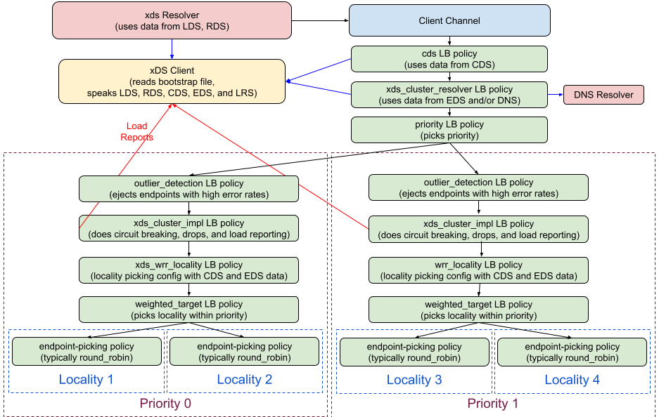

A52: gRPC xDS Custom Load Balancer Configuration
----
* Author(s): temawi
* Approver: markdroth
* Implemented in: 
* Last updated: 2022-04-22
* Discussion at: https://groups.google.com/g/grpc-io/c/BoRazEVUEz0

## Abstract
Adds the ability to configure custom load balancing policies retrieved from a control plane via the xDS API.

## Background

gRPC clients provide interfaces for users to plug in their own load balancing policy implementations that can be deployed with a gRPC client. Currently no solution is provided for configuring these custom policies via the control plane and users are left to e.g. deploy bespoke configuration files.

### Related Proposals:

This proposal builds on earlier work described in the following gRFCs:
* [gRFC A27: xDS-based Global Load Balancing](https://github.com/grpc/proposal/blob/master/A27-xds-global-load-balancing.md)
* [gRFC A24: Load Balancing Policy Configuration](https://github.com/grpc/proposal/blob/master/A24-lb-policy-config.md)
* [gRFC A42: xDS Ring Hash LB Policy](https://github.com/grpc/proposal/blob/master/A42-xds-ring-hash-lb-policy.md)

## Proposal

Load balancing configuration of a gRPC client is based on the fields in the [`Cluster`](https://github.com/envoyproxy/envoy/blob/305a200ce2002de9984e7fb7bb98d92b8e9fbcca/api/envoy/config/cluster/v3/cluster.proto#L48) xDS resource delivered to the client by the [`AggregatedDiscoveryService`](https://www.envoyproxy.io/docs/envoy/latest/api-v3/service/discovery/v3/ads.proto.html). Currently the combination of the [`lb_policy`](https://github.com/envoyproxy/envoy/blob/55a506f4cc053c9841c44644238aced88dea191d/api/envoy/config/cluster/v3/cluster.proto#L779) enum value and a policy specific configuration field in the [`lb_config`](https://github.com/envoyproxy/envoy/blob/305a200ce2002de9984e7fb7bb98d92b8e9fbcca/api/envoy/config/cluster/v3/cluster.proto#L991) oneof are used to determine the policy configuration. What will be added is the additional support for the newer [`load_balancing_policy`](https://github.com/envoyproxy/envoy/blob/305a200ce2002de9984e7fb7bb98d92b8e9fbcca/api/envoy/config/cluster/v3/cluster.proto#L1064) field.

If the `load_balancing_policy` field is provided, it will be used instead of the `lb_policy` and `lb_config` fields. If `load_balancing_policy` is not provided, full backward compatibility with the old fields will be maintained.

### XdsClient

When the xDS client receives a CDS update it notifies its listeners/watchers of the configuration changes, including the load balancing policy to be used. Currently the xDS client only considers the `lb_policy` field in the CDS update when constructing the update information it sends out. This logic will change to consider the new `load_balancing_policy` field that will be used as the source of LB policy configuration if it is populated.

Regardless of the field that load balancing policy configuration is picked up from, internally `XdsClient` will represent the information in a uniform manner. The CDS update struct will be updated to carry LB policy configuration in JSON form. We move from an enum for the policy selection and a set of `oneof` configuration fields to having a [LoadBalancingConfig](https://github.com/grpc/grpc-proto/blob/ab96cf12ec7ce135e03d6ea91d96213fa4cb02af/grpc/service_config/service_config.proto#L560) JSON object.

The load balancer config portion of the CDS update struct will change to take the following form (in C++):

```c
struct XdsClusterResource {
  // ...

  // The gRPC LB policy config to be used as the child of the xds_cluster_impl LB policy.
  Json::Array lb_policy_config;

  // ...
}
```

The XdsClient will transfer the responsibility of converting the xDS configuration to the internal JSON format to a new *xDS LB policy registry*. This new registry will return an error if the xDS load balancing configuration cannot be converted, but it will not validate a converted configuration. It will be the responsibility of the XdsClient to validate the converted configuration. It will do this by having the gRPC LB policy registry parse the configuration.

The CDS resource is rejected and a NACK returned to the control plane in either of the following cases:

- xDS LB policy registry cannot convert the configuration and returns an error 
- gRPC LB policy registry cannot parse the converted configuration.

### xDS LB Policy Registry

This new registry will maintain a set of converters that are able to map from the xDS LoadBalancingPolicy message to the internal gRPC JSON format. The conversion process will be recursive so that e.g. the conversion of the new xDS WRR Locality policy (see below) will call into the registry to convert the child policies.

The implementation should not allow excessive recursion. Configurations that require more than 16 levels of recursion are considered invalid and should result in a NACK response.

The registry will provide the following function:

```javascript
// Converts an xDS cluster load balancing policy message to the internal
// PolicyConfig JSON string.
//
// An error/exception will be returned if the message type
// is not recognized, or if policy configuration is invalid in a way that
// can't be determined by looking at the PolicyConfig output. 
string convertToServiceConfig(envoy.config.cluster.v3.LoadBalancingPolicy loadBalancingPolicy)
```

This function will iterate over the list of `Policy` messages in `LoadBalancingPolicy`, attempting to convert each one to gRPC form, stopping at the first supported policy. The `Policy` message contains a `TypedExtensionConfig` message with the configuration information. `TypedExtensionConfig` in turn uses an Any typed `typed_config` field to store policy configuration of any type. This `typed_config` field is used to determine both the name of a policy and the configuration for it, depending on its type:

- `envoy.extensions.load_balancing_policies.ring_hash.v3.RingHash`
  - The gRPC policy name will be `ring_hash_experimental`.
  - The `minimum_ring_size` and `maximum_ring_size` xDS fields are converted to the `minRingSize` and `maxRingSize` fields in service config
  - The `hash_function` field will not be converted, but will need to be validated. Any function besides `XX_HASH` will cause the conversion to fail
- `envoy.extensions.load_balancing_policies.round_robin.v3.RoundRobin`
  - The gRPC policy name will be `round_robin`.
  - Has no configuration - an empty JSON object is returned
- `envoy.extensions.load_balancing_policies.wrr_locality.v3.WrrLocality`
  - The gRPC policy name will be `xds_wrr_locality_experimental`
  - Contains a `LoadBalancingPolicy` field that has a list of endpoint picking policies. This field will be processed by recursively calling the xDS LB policy registry, and the result will be used in the `child_policy` field in the configuration for the `xds_wrr_locality_experimental` policy (see the “xDS WRR Locality Load Balancer” sections for details on the config format).
- `xds.type.v3.TypedStruct` or `udpa.type.v1.TypedStruct`
  - This type represents a custom policy, deployed with the gRPC client by a user
  - The gRPC policy name will be the "type name" part of the value of the `type_url` field in the `TypedStruct`. We get this by using the part after the last `/` character.
  - The `Struct` contained in the `TypedStruct` will be returned as-is as the configuration JSON object.
  - Note that when registering custom policy implementations in the gRPC load balancer registry, the name should follow valid protobuf message naming conventions and use a custom package, e.g. "`myorg.MyCustomLb`".

Any entry not in the above list is unsupported and will be skipped.

An error is returned under two circumstances:
- The function finds a supported policy but fails to convert the config to gRPC form
- The function does not find any supported policy in the list

### xDS WRR Locality Load Balancer

The WRR Locality (`xds_wrr_locality_experimental`) is a new load balancer policy that will support xDS configuration provided in the `envoy.extensions.load_balancing_policies.wrr_locality.v3.WrrLocality` config extension message. It will be a parent to the existing weighted_target_experimental policy and build a configuration for it.

The [service_config.proto](https://github.com/grpc/grpc-proto/blob/master/grpc/service_config/service_config.proto) definition that documents the gRPC internal configuration will be updated to reflect the new xDS WRR Locality configuration:

```protobuf
// Configuration for the xds_wrr_locality load balancing policy.
message XdsWrrLocalityLoadBalancingPolicyConfig {
  repeated LoadBalancingConfig child_policy = 1;
}

message LoadBalancingConfig {
  oneof policy {

    …

    optional XdsWrrLocalityLoadBalancingPolicyConfig xds_wrr_locality_experimental = 16
      [json_name = "xds_wrr_locality_experimental"];
  }
```

This load balancer will be responsible for generating the configuration of its child policy, `weighted_target_experimental`. To do this, two sources of information will be combined:

- The newly defined xDS WRR Locality configuration with the child policy config
- Locality weights from a new resolved address attribute
  - Passed in similar manner as the xDS client
  - Populated by the `xds_cluster_resolver` policy

These two elements will be combined to create the `weighted_target_experimental` configuration with a weighted policy selection for each locale. The format of this configuration will not change, allowing the `weighted_target_experimental` policy to remain unchanged.



[Link to SVG file](A52_graphics/grpc_xds_client_architecture.svg)

### xDS Cluster Resolver Load Balancer

As described in [gRFC A42](https://github.com/grpc/proposal/blob/master/A42-xds-ring-hash-lb-policy.md#change-child-policy-config-generation-in-xds_cluster_resolver-policy), this load balancer today determines the load balancer hierarchy when it creates the configuration for the priority policy. If the policy it receives is `ring_hash`, it will pass that policy selection directly to the priority policy. If it is given an endpoint picking policy (like `round_robin`), it will instead create a weighted target policy selection that contains the endpoint picking policy selection as a child, creating a two level hierarchy.

With the xDS client now creating a configuration that represents the whole policy hierarchy, this special logic can be removed and the policy selection received can be directly passed to the priority policy.

The cluster resolver configuration documentation in service_config.proto is updated to reflect this:

```protobuf
// Configuration for xds_cluster_resolver LB policy.
message XdsClusterResolverLoadBalancingPolicyConfig {
  // xDS LB policy. Will be used as the child config of the xds_cluster_impl LB policy. 
  repeated LoadBalancingConfig xds_lb_policy = 2;

}
```

To provide the `xds_wrr_locality` load balancer information about locality weights received from EDS, the cluster resolver will populate a new attribute in the resolved addresses. The new attribute will contain a map from a locality struct to a locality weight integer. Note that a change in this attribute would still allow associated subchannels to be reused - it will not affect their uniqueness.

### Configuration Example

This is a step-by-step example of how an example xDS configuration gets converted within a gRPC client. The example configuration is:

```textproto
{ // Cluster
  load_balancing_policy: {
    policies: [
      typed_extension_config: {
        name: "<<backend-id>>-0"
        typed_config: {
          "@type": "type.googleapis.com/envoy.extensions.load_balancing_policies.wrr_locality.v3.WrrLocality"
          endpoint_picking_policy: {
            policies: [                
              typed_extension_config: { 
                name: "<<backend-id>>-1"                              
                typed_config: {                                                 
                  "@type": "type.googleapis.com/xds.type.v3.TypedStruct"          
                  type_url: "type.googleapis.com/myorg.MyCustomLeastRequestPolicy"
                  fields: [           
                    {                   
                      key: "choiceCount"
                      value: "2"
                    }
                  ]
                }
              } 
              typed_extension_config: { 
                name: "<<backend-id>>-2"
                typed_config: {                                                            
                  "@type": "type.googleapis.com/envoy.extensions.load_balancing_policies.round_robin.v3.RoundRobin"
                }
              }
            ]
          }
        }
      }
    ]
  }
}
```

#### 1. xDS client converts the LoadBalancingConfiguration to the internal service config JSON format and includes it in the CDS update struct

```json
{
  …

  "lb_policy_config": [
    {
      "xds_wrr_locality_experimental": {
        "child_policy": [{
          "myorg.MyCustomLeastRequestPolicy" : {
            "choiceCount" : 2
          },
        }]
      }
    }
  ]

  …
}
```

This output is produced by following these steps:
1. The new `load_balancing_policy` in the xDS `Cluster` message is detected by the XdsClient, so it passes this field to the xDS LB policy registry.
2. The xDS LB policy registry sees the `WrrLocality` config in the field, and it converts the configuration.
3. The `WrrLocality` converter code in the registry takes the endpoint picking policy in the config and also converts that by again, recursively calling the xDS LB policy registry.
4. The registry entry for the endpoint picking policy notices that `TypeStruct` is being used, indicating a custom LB policy, and that policy is found to exist in the gRPC LB policy registry. The configuration is returned directly in its JSON form.
5. The returned custom endpoint picking policy config is included in the `xds_wrr_locality` config by the WrrLocality conversion code which is returned to the xDS client.
6. The xDS client calls the gRPC LB policy registry to parse the config converted by the xDS LB policy registry.
7. The configuration parses, validating its correctness and the config is added to CDS update.

#### 2. CDS load balancer builds the configuration for `xds_cluster_resolver`, including the configuration it received from xDS client. 

```json
{
  "discovery_mechanisms": {
    …
  }
  "xds_lb_policy": {
    [
      {
        "xds_wrr_locality_experimental": {
          "child_policy": [{
            "myorg.MyCustomLeastRequestPolicy": {
              "choiceCount": 2
            },
          }]
        }
      }
    ]
  }
}
```

#### 3. The `xds_cluster_resolver` will use what it gets to generate the child configs for the priority LB policy.

The priority config will contain the config for `xds_cluster_impl` that then has a child policy config for `xds_wrr_locality`. Assuming a single priority:

```json
{
  "children": {
    "priority-1": {
      "config": [{
        "xds_cluster_impl_experimental": {
          "cluster": "ClusterName"
          "child_policy": {
            "xds_wrr_locality_experimental": {
              "child_policy": [{
                "myorg.MyCustomLeastRequestPolicy": {
                  "choiceCount": 2
                },
              }]
            }
          }
        }
      }]
      "ignore_reresolution_requests": false
    }
  }
  "priorities": [ "priority-1" ]
}
```


#### 4. `wrr_locality` combines the priority child config with locality weights to generate `weighted_target` configuration.

Given the following locality weight attribute map:

```json
"Locality A": 1
"Locality B": 2
```

The `weighted_target` configuration will be:

```json
{
  "targets": {
    "Locality A" : {
      "weight": 1
      "child_policy": [
        {
          "myorg.MyCustomLeastRequestPolicy" : {
            "choiceCount" : 2
          }
        },
      ]
    }
    "Locality B" : {
      "weight": 2
      "child_policy": [
        {
          "myorg.MyCustomLeastRequestPolicy" : {
            "choiceCount" : 2
          }
        },
      ]
    }
  }
}
```

### Temporary environment variable protection
During initial development, this feature will be enabled by the `GRPC_EXPERIMENTAL_XDS_CUSTOM_LB_CONFIG` environment variable. If unset or not true, the `load_balancing_policy` field in xDS Cluster proto will not be considered and load balancing policy configuration will be based on the `lb_policy` field. This environment variable protection will be removed once the feature has proven stable.


## Implementation
In C-core, the LB policy API is not yet public, but it will be made public in the future when the EventEngine migration is far enough along to allow it. In the interim, C-core will get the same changes to support custom xDS-based LB policies, so that when the C-core LB policy API later becomes public, this functionality will already be present.
