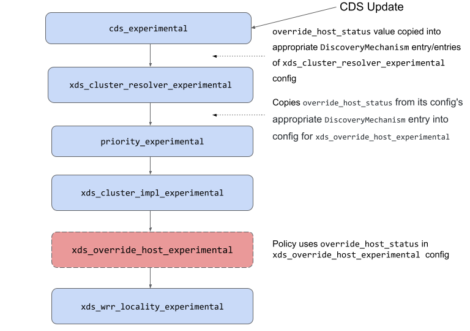

A55: xDS-Based Stateful Session Affinity for Proxyless gRPC
----
* Author(s): Sanjay Pujare (@sanjaypujare)
* Approver: markdroth
* Status: In Review
* Implemented in: <language, ...>
* Last updated: 2022-08-17
* Discussion at: https://groups.google.com/g/grpc-io/c/F84rRVNgml4

## Abstract

This design specifies a mechanism to implement session affinity where backend
services maintain a local state per "session" and RPCs of a session are always
routed to the same backend (as long as it is in a valid state) that is
assigned to that session. The valid state for a backend typically includes
the [`HEALTHY` and `DRAINING` states][eds-health-status] with special semantics
for the `DRAINING` state. This specification is based on and is compatible
with [stateful session persistence][envoy-ssp] that is implemented in Envoy.
See Envoy PRs [17848][], [18207][].


## Background

Some users of proxyless gRPC need to use "stateful session affinity" in gRPC.
In this usage scenario, backend services maintain local state for RPC sessions
and once a particular "session" is assigned to a particular backend (by the
load-balancer), all future RPCs of that session must be routed to the same
backend.

This can be achieved by using HTTP cookies in the following manner.
A gRPC client application sends the first RPC in a session without
a cookie in the RPC. gRPC routes that RPC to some backend B1 based on the
configured LB policy. When gRPC receives the response for that first RPC from
B1, it attaches a configured cookie to the response before delivering the
response to the client application. The cookie encodes some identifying
information about B1 (for example its IP-address). The client application
saves the cookie and uses that cookie in all future RPCs of that session
(e.g. by using a separate cookie jar for each session). gRPC uses the
cookie and gets the encoded backend information to route the RPC to the
same backend B1 if it is still reachable.

With stateful session affinity, session draining of backends is an important
requirement. In this use-case, the user wants to stop or restart service
backends (let's say to optimize resources or to perform upgrades). However a
terminating backend first needs to "drain" all assigned sessions before
exiting. In this state - let's call it `DRAINING` - the terminating backend is
only sent RPCs of its existing assigned sessions and no new traffic is sent.
Once all assigned sessions have finished (or a timeout triggers), the backend
application exits at which point the backend is now removed from the endpoints
list (EDS). This design includes support for session draining.

### Related Proposals: 

* [A27: xDS-Based Global Load Balancing][A27]
* [A42: xDS Ring Hash LB Policy][A42]

## Proposal

The goal of this design is to make it consistent with the Envoy implementation
so it will interoperate with it. For example, one can create an xDS
configuration for Envoy and the exact same configuration will work with
proxyless gRPC. Similarly, an application using some cookie implementation
that works with Envoy will continue to work with proxyless gRPC without any
modifications.

The design involves the following 5 parts.

### `XdsClient` to Include Endpoint Health Status

The `EdsUpdate` struct from the `XdsClient` will be enhanced to include the
[endpoint health status][eds-health-status] for each endpoint. `XdsClient`
will also be modified to include endpoints in `DRAINING` state in the
`EdsUpdate` reported to the watchers.

### Listener and Route Configuration through xDS

The feature is enabled and configured using the
[cookie based stateful session extension][cookie-ext] which
is an [http-filter][] in the `HttpConnectionManager` for the target service.
A sample configuration is as follows:

```textproto
{ // HttpConnectionManager
  http_filters: [
    {
      name: "envoy.filters.http.stateful_session"
      typed_config: {
        "@type": "type.googleapis.com/envoy.extensions.filters.http.stateful_session.v3.StatefulSession"
        session_state: {
          name: "envoy.http.stateful_session.cookie"
          typed_config: {
            "@type": "type.googleapis.com/envoy.extensions.http.stateful_session.cookie.v3.CookieBasedSessionState"
            cookie: {
              name: "global-session-cookie"
              path: "/Package1.Service2/Method3"
              ttl: "120s"
            }
          }
        }
      }
    }
  ]
}
```

`name` is the name of the cookie used in this feature.

`path` is the path for which this cookie is applied. **Note:** Stateful
session affinity will not work if the cookie's path does not match the
request's path. For example, if a given route matches requests with path
`/service/foo` but the corresponding per-route filter config specifies a
cookie path of `/service/bar`, then the cookie will never be set.

`ttl` is the time-to-live for the cookie. It is set on the cookie but will
not be enforced by gRPC.

This new filter will be added to the HTTP Filter Registry and processed as
described in [A39: xDS HTTP Filter Support][A39]. Specifically when this filter
is present in the configuration, gRPC will create the appropriate client filter
(aka interceptor in Java/Go) and install it in the channel to process data
plane RPCs. We call this filter `CookieBasedStatefulSessionFilter`. It will
copy the 3 configuration values - `name`, `ttl`  and `path` -  into the filter
object. Validation and processing are further described in
[Stateful session][stateful-session].

Note that
[StatefulSessionPerRoute][stateful-session-per-route] *will* be supported as
[Filter Config Overrides][filter_config_override]. For example, let's say
the top level config (in `HttpConnectionManager.http_filters`) contains certain
`StatefulSession` configuration. This configuration can either be
overridden or disabled by a
[StatefulSessionPerRoute][stateful-session-per-route] config for a particular
virtual host or route through a merged configuration as described in
[A39 Filter Config Overrides][filter_config_override].

The filter is described in more detail in the section
[`CookieBasedStatefulSessionFilter` Processing][filter-section].

### Load Balancer Configuration Containing `override_host_status`

Even with stateful session affinity enabled, gRPC will only send an RPC to a
valid backend (host) as defined by
[`common_lb_config.override_host_status`][or-host-status]. When the backend
state is invalid, gRPC will use the configured load balancing policy to pick
the backend.

As described above the `XdsClient` will be modified to include endpoints with
the health status `DRAINING` in addition to `HEALTHY` or `UNKNOWN` and will
include the health status in the update. As a result, gRPC will only consider
`UNKNOWN`, `HEALTHY` or `DRAINING` states that are specified in
[`common_lb_config.override_host_status`][or-host-status] and ignore all
other values. We considered the alternative of NACKing (i.e. rejecting)
the CDS update when unsupported values are present, however it was rejected
because of the difficulty in using such configuration in mixed deployments.

The `override_host_status` value is included in the new policy
`xds_override_host_experimental` config (called
`OverrideHostLoadBalancingPolicyConfig` described below) and this
config will be embedded in the `DiscoveryMechanism` inner message of the
`xds_cluster_resolver_experimental` config.

Also note that [common_lb_config][] field is incompatible with the new
[load_balancing_policy][] field used for custom LB policies (see
[A52: gRPC xDS Custom Load Balancer Configuration][grfc_a52]) which means
custom LB policies and stateful session affinity features will be incompatible
with each other. This will need to be fixed eventually to be able to use these
two features together. Until that happens, we assume the default value
for the [`common_lb_config.override_host_status`][or-host-status] field
when one is using the new [load_balancing_policy][] field so the user is still
able to use the feature.

### `CookieBasedStatefulSessionFilter` Processing

A channel configured for stateful session affinity will have the
`CookieBasedStatefulSessionFilter` installed (interceptor in Java/Go).
This filter will process incoming RPCs and set an appropriate LB pick value
which will be passed to the Load Balancing Policy's Pick method.

When an RPC arrives on a configured channel, the Config Selector processes it
as described in [A31: gRPC xDS Config Selector Design][A31]. This includes the
`CookieBasedStatefulSessionFilter` which is installed as one of the filters in
the channel. Note that the filter maintains a context for an RPC and processes
both the outgoing request and incoming response of the RPC within that context.
Also note that the filter is initialized with 3 configuration values - `name`,
`ttl`  and `path` as described above.

The filter performs the following steps:

* If the incoming RPC “path” does not match the `path` configuration value,
skip any further processing (including response processing) and just pass the
RPC through (to the next filter). For example if the `path` configuration
value is `/Package1.Service2` and the RPC method is
`/Package2.Service1/Method3` then just pass the RPC through. Note, for path
matching the rules described in [rfc6265 section-5.1.4][rfc6265-path-match]
will apply.

* Search the RPC headers (metadata) for header(s) named `Cookie` and get the
set of all the cookies present. If the set does not contain a cookie whose
name matches the `name` configuration value of the filter, then pass the RPC
through. If you find more than one cookie with that `name` then log a local
warning and pass the RPC through. Otherwise get the value of that cookie and
base64-decode the value to get the `override-host` for the RPC. This value
should be a syntactically valid IP:port address: if not, then log a local
warning and pass the RPC through. For a valid `override-host` value, set it
in the RPC context as the value of `upstreamAddress` state variable which
will be used in the response processing of that RPC.

* In case of a valid `override-host` value, pass this value as a
"pick-argument" to the Load Balancer's pick method as described in [A31][].
For example,

    * in Java use `CallOptions` to pass this value.

    * in Go pass it via `Context`.

    * In C-core, this will be via the `GRPC_CONTEXT_SERVICE_CONFIG_CALL_DATA`
      call context element whose API will be extended to allow the
      filter to add a new call element.

* In the response path - if the filter was not skipped based on the RPC
  path - get the value of `upstreamAddress`. Also get the peer address for the
  RPC; let’s call it `hostAddress` here. For example, in Java you get the peer
  address through the `Grpc.TRANSPORT_ATTR_REMOTE_ADDR` attribute of the
  current ClientCall. If `upstreamAddress` is not set or `upstreamAddress` and
  `hostAddress` are different, then create a cookie using our Cookie config
  which has the `name`, `ttl` and `path` values. Set the value of the cookie
  to be the base64-encoded string value of `hostAddress`. Add this Cookie to
  the response headers. The logic in pseudo-code is:

```C++
  if (!upstreamAddress.has_value() || hostAddress != upstreamAddress) {
    String encoded_address = base64_encode(hostAddress);
    Create a Cookie from our cookie configuration;
    Set cookie's value as encoded_address;
    Add the cookie header to the response;
  }
```

### LB Policy for Stateful Session Affinity

After the `CookieBasedStatefulSessionFilter` has passed the `override-host`
value to the Load Balancer as a "pick-argument", the Load Balancer uses
this value to route the RPC appropriately. The required logic will be
implemented in a new and separate LB policy at an appropriate place in the
hierarchy.

RPC load reporting happens in the `xds_cluster_impl_experimental` policy and
we do want all RPCs to be included in the load reports. Hence the new policy
needs to be just below the `xds_cluster_impl_experimental` as its child policy.
Note that the new policy will be beneath the `priority_experimental` policy,
which means that if we pick a host for a session while we are failed over to a
lower priority and then a higher priority comes back online, we will switch
hosts at that point and this behavior is different from Envoy.

Let's call the new policy `xds_override_host_experimental`. This policy
contains subchannel management, endpoint management, and RPC routing logic as
follows:

* maintain a map - let's call it `address_map`. The key is (IP:port)
  and the value is the tuple
  `[subchannel, EDS health-status, list of other equivalent addresses]`.
  When a host (endpoint) has multiple addresses (e.g. IPv6 vs IPv4 or due to
  multiple network interfaces) they are said to be equivalent addresses.
  Whenever we get an updated list of addresses from the resolver, we create an
  entry in the map for each address, and populate the list of equivalent
  addresses and EDS health-status. The subchannel is based on subchannel
  creation/destruction or connection/disconnection from the child policy. The
  equivalent address list computation on each resolver update is performed as
  shown in the following pseudo-code:

```
// Find the transitive closure of all EAGs.
eags_to_process = [set([eag,health_status]) for eag in resolver_update]
completed_eag_sets = []   // each entry is a tuple [eag, health_status]
all_addresses = set()
while not eags_to_process.empty():
  current_eag, current_health_status = eags_to_process.pop_front()
  for eag in eags_to_process:
    if eag.intersects(current_eag):  // If they have any elements in common
      add elements from eag to current_eag
      remove eag from eags_to_process
  completed_eag_sets.push_back([current_eag, current_health_status])
  add elements from current_eag to all_addresses
// Now completed_eag_sets contains the sets we want.
// Use that to update the LB policy's map.
// First, update the equivalent addresses for every address in the update.
for entry in completed_eag_sets:
  for address in entry.eag:
    lb_policy.address_map[address].equivalent_addresses = entry.eag
    lb_policy.address_map[address].health_status = entry.health_status
// Now remove equivalencies for any address not found in the current update.
for address, entry in lb_policy.address_map:
  if address not in all_addresses:
    entry.equivalent_addresses.clear()
```

* whenever a new subchannel is created (by the child policy that is
  routing an RPC - see below), update the entry in `address_map` (for
  the subchannel address i.e. the peer address as the key) with the new
  subchannel value updated in the tuple
  `[subchannel, health-status, equivalent addresses]`.

    * in Java and Go, we may have to wait for subchannel to be `READY` in order
      to know which specific address the subchannel is connected to before we
      add it to the map.

    * in C-core and Node, LB policies create a new subchannel for every address
      every time there is a new address list. In the map, we will just replace
      an existing entry with the most recent subchannel created for a given
      address i.e. the new subchannel created will replace the older one for
      that address.

* whenever a subchannel is shut down, remove the associated entries from
  `address_map`.

    * this can be achieved by wrapping a subchannel to intercept subchannel
      shutdown and the wrapper is returned by `createSubchannel`.

* the policy's subchannel picker pseudo-code is as follows. `policy_config`
  is the `OverrideHostLoadBalancingPolicyConfig` object for this policy.

```
if override_host is set in pick arguments:
  entry = lb_policy.address_map[override_host]
  if entry found:
    idle_subchannel = None
    found_connecting = False
    if entry.subchannel is set AND
     entry.health_status is in policy_config.override_host_status:
      if entry.subchannel.connectivity_state == READY:
        return entry.subchannel as pick result
      elif entry.subchannel.connectivity_state == IDLE:
        idle_subchannel = entry.subchannel
      elif entry.subchannel.connectivity_state == CONNECTING:
        found_connecting = True
    // Java-only, for now: check equivalent addresses
    for address in entry.equivalent_addresses:
      other_entry = lb_policy.address_map[address]
      if other_entry.subchannel is set AND
       other_entry.health_status is in policy_config.override_host_status:
        if other_entry.subchannel.connectivity_state == READY:
          return other_entry.subchannel as pick result
        elif other_entry.subchannel.connectivity_state == IDLE:
          idle_subchannel = other_entry.subchannel
        elif other_entry.subchannel.connectivity_state == CONNECTING:
          found_connecting = True
    // No READY subchannel found.  If we found an IDLE subchannel,
    // trigger a connection attempt and queue the pick until that attempt
    // completes.
    if idle_subchannel is not None:
      hop into control plane to trigger connection attempt for idle_subchannel
      return queue as pick result
    // No READY or IDLE subchannels.  If we found a CONNECTING
    // subchannel, queue the pick and wait for the connection attempt
    // to complete.
    if found_connecting:
      return queue as pick result
// override_host not set or did not find a matching subchannel,
// so delegate to the child picker
return child_picker.Pick()
```

In the above logic we prefer a subchannel in the `READY` state for a different
equivalent address instead of waiting for the subchannel for the original
`overrideHost` address to become `READY` (from one of `IDLE`, `CONNECTING`
or `TRANSIENT_FAILURE` states) because we assume that the equivalent address
is pointing to the same host thereby maintaining session affinity with the
pick.

If we do not find a `READY` subchannel, and find an `IDLE` one, we trigger a
connection attempt on that subchannel and return queue as the pick result
(i.e. the RPC stays buffered). If we instead find a `CONNECTING` subchannel,
we just return queue as the pick result i.e. the RPC stays buffered until the
connection attempt completes. If we do not find a subchannel, we just delegate
to the child policy.

Note that we unconditionally create the `xds_override_host_experimental` policy
as the child of `xds_cluster_impl_experimental` even if the feature is not
configured (in which case, it will be a no-op). A new config
for the `xds_override_host_experimental` policy will be defined as follows:

```proto
// Configuration for the override_host LB policy.
message OverrideHostLoadBalancingPolicyConfig {
  enum HealthStatus {
    UNKNOWN = 0;
    HEALTHY = 1;
    DRAINING = 3;
  }

  // valid health status for hosts that are considered when using
  // `xds_override_host_experimental` policy
  // Default is [UNKNOWN, HEALTHY]
  repeated HealthStatus override_host_status = 1;

  repeated LoadBalancingConfig child_policy = 2;
}
```

The `xds_cluster_resolver_experimental` config will be modified so that the
`DiscoveryMechanism` inner message contains an additional
`override_host_status` field of the type
`OverrideHostLoadBalancingPolicyConfig`. In this context,
the `child_policy` field of `OverrideHostLoadBalancingPolicyConfig` will be
ignored.

`cds_experimental` policy will copy the
[`common_lb_config.override_host_status`][or-host-status] value it gets
in the CDS update from the `XdsClient` to the appropriate `DiscoveryMechanism`
entry's `override_host_status` field in the config of the
`xds_cluster_resolver_experimental` policy. If the field is unset,
we treat it the same as if it was explicitly set to the default set which is
[`UNKNOWN`, `HEALTHY`].

The `xds_cluster_resolver_experimental` LB policy will copy the
`override_host_status` value from its config's appropriate `DiscoveryMechanism`
entry into the config for the `xds_override_host_experimental` policy. The
diagram below shows how the configuration is passed down the hierarchy all the
way from `cds_experimental` to `xds_override_host_experimental`.

One of the existing policies (`xds_wrr_locality_experimental`,
or `ring_hash_experimental`) is created as the child policy of
`xds_override_host_experimental` as shown in the diagram below.



To propagate [`common_lb_config.override_host_status`][or-host-status] the
following changes are required:

* CDS update message will be modified to include the `override_host_status`
field.

* the [`XdsClient`][grpc-client-arch] will parse
[`common_lb_config.override_host_status`][or-host-status] and copy the value
in its CDS update to the watchers.

* `cds_experimental` policy (which receives the CDS update) will copy the
value of `override_host_status` into the appropriate `DiscoveryMechanism`
entry's `override_host_status` field in the config of the
`xds_cluster_resolver_experimental` policy.

## Rationale

The stateful session affinity requirement is not satisfied by the
[ring-hash LB policy][A42] because any time a backend host is removed or
added, the hash mapping of 1/N client sessions gets affected (where N is the
total number of backends) which would lead to dropped requests in some cases
which is unacceptable.

This feature avoids the problem by using HTTP cookies as described above.

## Implementation

The design will be implemented in gRPC C++, Java and Go.
Wrapped languages should be able to use the feature provided they can do
cookie management in their client code.

Cookies are rarely used with gRPC so the implementations should also
include a recipe for cookie management. This could involve illustrative
examples using cookie jar implementations which are available in various
languages such as Java, Go and Node.js. Wherever possible the
implementations may also include a reference implementation (which could
be interceptor based) that does cookie management using cookie jars. If
based on interceptors, the interceptor is instantiated for a session
and it processes the `Set-Cookie` header in a response to save the cookie,
and uses that cookie in subsequent requests.


[envoy-ssp]: https://docs.google.com/document/d/1IU4b76AgOXijNa4sew1gfBfSiOMbZNiEt5Dhis8QpYg/edit#heading=h.sobqsca7i45e
[17848]: https://github.com/envoyproxy/envoy/pull/17848
[18207]: https://github.com/envoyproxy/envoy/pull/18207
[A27]: https://github.com/grpc/proposal/blob/master/A27-xds-global-load-balancing.md
[A39]: https://github.com/grpc/proposal/blob/master/A39-xds-http-filters.md
[A42]: https://github.com/grpc/proposal/blob/master/A42-xds-ring-hash-lb-policy.md
[A31]: https://github.com/grpc/proposal/blob/master/A31-xds-timeout-support-and-config-selector.md#new-functionality-in-grpc
[cookie-ext]: https://www.envoyproxy.io/docs/envoy/v1.22.0/api-v3/extensions/http/stateful_session/cookie/v3/cookie.proto.html
[http-filter]: https://github.com/grpc/proposal/blob/master/A39-xds-http-filters.md
[stateful-session]: https://www.envoyproxy.io/docs/envoy/v1.22.0/configuration/http/http_filters/stateful_session_filter#config-http-filters-stateful-session
[stateful-session-per-route]: https://www.envoyproxy.io/docs/envoy/v1.22.0/api-v3/extensions/filters/http/stateful_session/v3/stateful_session.proto#extensions-filters-http-stateful-session-v3-statefulsessionperroute
[or-host-status]: https://github.com/envoyproxy/envoy/blob/15d8b93608bc5e28569f8b042ae666a5b09b87e9/api/envoy/config/cluster/v3/cluster.proto#L615
[filter-section]: #cookiebasedstatefulsessionfilter-processing
[rfc-6265]: https://www.rfc-editor.org/rfc/rfc6265.html
[grpc-client-arch]: https://github.com/grpc/proposal/blob/master/A27-xds-global-load-balancing.md#grpc-client-architecture
[filter_config_override]: https://github.com/grpc/proposal/blob/master/A39-xds-http-filters.md#filter-config-overrides
[rfc6265-path-match]: https://www.rfc-editor.org/rfc/rfc6265#section-5.1.4
[common_lb_config]: https://github.com/envoyproxy/envoy/blob/15d8b93608bc5e28569f8b042ae666a5b09b87e9/api/envoy/config/cluster/v3/cluster.proto#L1014
[load_balancing_policy]: https://github.com/envoyproxy/envoy/blob/15d8b93608bc5e28569f8b042ae666a5b09b87e9/api/envoy/config/cluster/v3/cluster.proto#L1069
[grfc_a52]: https://github.com/grpc/proposal/blob/master/A52-xds-custom-lb-policies.md
[eds-health-status]: https://www.envoyproxy.io/docs/envoy/latest/api-v3/config/core/v3/health_check.proto#envoy-v3-api-enum-config-core-v3-healthstatus
