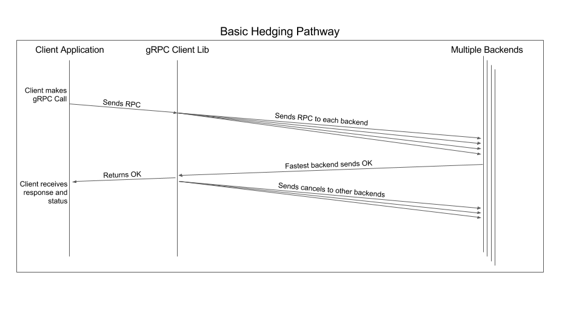

gRPC Retry Design
----
* Author(s): [Noah Eisen](https://github.com/ncteisen) and [Eric Gribkoff](https://github.com/ericgribkoff)
* Approver: a11r
* Status: Ready for Implementation
* Implementation: In progress for all language stacks
* Last updated: 2017-09-13
* Discussion at: https://groups.google.com/forum/#!topic/grpc-io/zzHIICbwTZE

Table of Contents
----
  * [Abstract](#abstract)
  * [Background](#background)
  * [Proposal](#proposal)
     * [Overview](#overview)
     * [Detailed Design](#detailed-design)
        * [Retry Policy Capabilities](#retry-policy-capabilities)
           * [Maximum Number of Retries](#maximum-number-of-retries)
           * [Exponential Backoff](#exponential-backoff)
           * [Retryable Status Codes](#retryable-status-codes)
        * [Hedging Policy](#hedging-policy)
        * [Throttling Retry Attempts and Hedged RPCs](#throttling-retry-attempts-and-hedged-rpcs)
        * [Pushback](#pushback)
        * [Limits on Retries and Hedges](#limits-on-retries-and-hedges)
        * [Summary of Retry and Hedging Logic](#summary-of-retry-and-hedging-logic)
     * [Retry Internals](#retry-internals)
        * [Where Retries Occur](#where-retries-occur)
        * [When Retries are Valid](#when-retries-are-valid)
        * [Memory Management (Buffering)](#memory-management-buffering)
        * [Transparent Retries](#transparent-retries)
        * [Exposed Retry Metadata](#exposed-retry-metadata)
        * [Disabling Retries](#disabling-retries)
        * [Retry and Hedging Statistics](#retry-and-hedging-statistics)
     * [Configuration Language](#configuration-language)
        * [Retry Policy](#retry-policy)
        * [Hedging Policy](#hedging-policy-1)
        * [Throttling Configuration](#throttling-configuration)
        * [Integration with Service Config](#integration-with-service-config)

## Abstract

gRPC client library will automatically retry failed RPCs according to a policy set by the service owner.

## Background

Currently, gRPC does not retry failed RPCs. All failed RPCs are immediately returned to the application layer by the gRPC client library.

Many teams have implemented their own retry logic wrapped around gRPC like [Veneer Toolkit](https://github.com/googleapis/toolkit) and [Cloud Bigtable](https://github.com/GoogleCloudPlatform/cloud-bigtable-client).

## Proposal

### Overview

gRPC will support two configurable retry policies. The [service configuration](https://github.com/grpc/grpc/blob/master/doc/service_config.md) (which will soon be [published via DNS](https://github.com/grpc/proposal/pull/5)) may choose from a retry policy (retry failed RPCs) or a hedging policy (aggressively send the same RPC multiple times in parallel). An individual RPC may be governed by a retry policy or a hedge policy, but not both.

Retry policy capabilities are as follows. Each has a detailed description below.
* [Maximum number of retry attempts](#maximum-number-of-retries)
* [Exponential backoff](#exponential-backoff)
* [Set of retryable status codes](#retryable-status-codes)

The hedging policy has the following parameters. See details [here](#hedging-policy).
* Maximum number of hedged requests
* Delay between hedged requests
* Set of non-fatal status codes

Additionally, gRPC provides a mechanism to throttle retry attempts and hedged RPCs when the ratio of failures to successes exceeds a threshold. See [detailed description of throttling](#throttling-retry-attempts-and-hedged-rpcs).

We also provide a mechanism for servers to explicitly signal clients to retry after a settable delay. See [detailed description of server pushback](#pushback).

In some cases, gRPC can guarantee that a request has never been seen by the server application logic. These cases will be transparently retried by gRPC, as detailed [here](#transparent-retries).

Lastly, information about number of retry attempts will be exposed to the client and server applications through metadata. Find more details [here](#exposed-retry-metadata).


[Link to SVG file](A6_graphics/basic_retry.svg)

### Detailed Design

#### Retry Policy Capabilities

Retry policies support configuring the maximum number of retries, the parameters for exponential backoff, and the set of retryable status codes, as follows:

```
"retryPolicy": {
  "maxAttempts": 4,
  "initialBackoff": "0.1s",
  "maxBackoff": "1s",
  "backoffMultiplier": 2,
  "retryableStatusCodes": [
    "UNAVAILABLE"
  ]
}
```
Each of these configuration options is detailed in its own section below.

##### Maximum Number of Retries

`maxAttempts` specifies the maximum number of RPC attempts, including the original request.

gRPC's call deadline applies across all attempts for a given RPC. For example, if the specified deadline for an RPC is July 23 9:00:00pm PDT the operation will fail after that time regardless of how many attempts were configured or attempted.


[Link to SVG file](A6_graphics/too_many_attempts.svg)

##### Exponential Backoff

The `initialBackoff`, `maxBackoff`, and `backoffMultiplier` parameters determine the randomized delay before retry attempts.

The initial retry attempt will occur at `random(0, initialBackoff)`. In general, the `n`-th attempt will occur at `random(0, min(initialBackoff*backoffMultiplier**(n-1), maxBackoff))`.

##### Retryable Status Codes

When gRPC receives a non-OK response status from a server, this status is checked against the set of retryable status codes in `retryableStatusCodes` to determine if a retry attempt should be made.

In general, only status codes that indicate the service did not process the request should be retried. However, a more aggressive set of parameters can be specified when the service owner knows that a method is idempotent, or safe to be processed more than once by the server. For example, if an RPC to a delete user method fails with an `INTERNAL` error code, it's possible that the user was already deleted before the failure occurred. If the method is idempotent then retrying the call should have no adverse effects. However, it is entirely possible to implement a non-idempotent delete method that has adverse side effects if called multiple times, and such a method should not be retried unless the error codes guarantee the original RPC was not processed. It is up to the service owner to pick the correct set of retryable status codes given the semantics of their service. gRPC retries do not provide a mechanism to specifically mark a method as idempotent.

##### Validation of retryPolicy

If `retryPolicy` is specified in a service config choice, the following validation rules apply:
1. `maxAttempts` MUST be specified and MUST be a JSON integer value greater than 1. Values greater than 5 are treated as 5 without being considered a validation error.
2. `initialBackoff` and `maxBackoff` MUST be specified, MUST follow the JSON representaion of [proto3 Duration type](https://developers.google.com/protocol-buffers/docs/proto3#json), and MUST have a duration value greater than 0.
3. `backoffMultiplier` MUST be specified and MUST be a JSON number greater than 0.
4. `retryableStatusCodes` MUST be specified as a JSON array of status codes and be non-empty. Each status code MUST be a valid gRPC status code and specified in the integer form or the case-insensitive string form (eg. [14], ["UNAVAILABLE"] or ["unavailable"]).

#### Hedging Policy

Hedging enables aggressively sending multiple copies of a single request without waiting for a response. Because hedged RPCs may be be executed multiple times on the server side, typically by different backends, it is important that hedging is only enabled for methods that are safe to execute multiple times without adverse affect.

Hedged requests are configured with the following parameters:

```
"hedgingPolicy": {
  "maxAttempts": 4,
  "hedgingDelay": "0.5s",
  "nonFatalStatusCodes": [
    "UNAVAILABLE",
    "INTERNAL",
    "ABORTED"
  ]
}
```

When a method has chosen a `hedgingPolicy`, the original RPC is sent immediately, as with a standard non-hedged call. After `hedgingDelay` has elapsed without a successful response, the second RPC will be issued. If neither RPC has received a response after `hedgingDelay` has elapsed again, a third RPC is sent, and so on, up to `maxAttempts`. In the above configuration, after 1ms there would be one outstanding RPC (the original), after 501ms there would be two outstanding RPCs (the original and the first hedged RPC), after 1001ms there would be three outstanding RPCs, and after 1501ms there would be four. As with retries, gRPC call deadlines apply to the entire chain of hedged requests. Once a deadline has passed, the operation fails regardless of in-flight RPCS, and regardless of the hedging configuration.

The implementation will ensure that the listener returned to the client application forwards its calls (such as `onNext` or `onClose`) to all outstanding hedged RPCs.

When a non-error response is received (in response to any of the hedged requests), all outstanding hedged requests are canceled and the response is returned to the client application layer.

If a non-fatal status code is received from a hedged request, then the next hedged request in line is sent immediately, shortcutting its hedging delay. If any other status code is received, all outstanding RPCs are canceled and the error is returned to the client application layer.

If all instances of a hedged RPC fail, there are no additional retry attempts. Essentially, hedging can be seen as retrying the original RPC before a failure is even received.

If server pushback that specifies not to retry is received in response to a hedged request, no further hedged requests should be issued for the call.

Hedged requests should be sent to distinct backends, if possible. To facilitate this, the gRPC client will maintain a list of previously used backend addresses for each hedged RPC. This list will be passed to the gRPC client's local load-balancing policy. The load balancing policy may use this information to send the hedged request to an address that was not previously used. If all available backend addresses have already been used, the load-balancing policy's response is implementation-dependent.

##### Validation of hedgingPolicy

If `hedgingPolicy` is specified in a service config choice, the following validation rules apply:
1. `maxAttempts` MUST be specified and MUST be a JSON integer value greater than 1. Values greater than 5 are treated as 5 without being considered a validation error.
2. `hedgingDelay` is an optional field but if specified MUST follow the JSON representation of proto3 Duration type.
3. `nonFatalStatusCodes` is an optional field but if specified MUST be specified as a JSON array of status codes. Each status code MUST be a valid gRPC status code and specified in the integer form or the case-insensitive string form (eg. [14], ["UNAVAILABLE"] or ["unavailable"]).



[Link to SVG file](A6_graphics/basic_hedge.svg)

#### Throttling Retry Attempts and Hedged RPCs

gRPC prevents server overload due to retries and hedged RPCs by disabling these policies when the client’s ratio of failures to successes passes a certain threshold. The throttling is done per server name. Retry throttling may be configured as follows:

```
"retryThrottling": {
  "maxTokens": 10,
  "tokenRatio": 0.1
}
```

Throttling may only be specified per server name, rather than per method or per service.

For each server name, the gRPC client maintains a `token_count` variable which is initially set to `maxTokens` and can take values between `0` and `maxTokens`. Every outgoing RPC (regardless of service or method invoked) will effect `token_count` as follows:
* Every failed RPC will decrement the `token_count` by 1.
* Every successful RPC will increment the `token_count` by `tokenRatio`.

If `token_count` is less than or equal to the threshold, defined to be `(maxTokens / 2)`, then RPCs will not be retried until `token_count` rises over the threshold.

Throttling also applies to hedged RPCs. The first outgoing RPC will always be sent, but subsequent hedged RPCs will only be sent if `token_count` is greater than the threshold.

Neither retry attempts or hedged RPCs block when `token_count` is less than or equal to the threshold. Retry attempts are canceled and the failure returned to the client application. The hedged request is cancelled, and if there are no other already-sent hedged RPCs the failure is returned to the client application.

The only RPCs that are counted as failures for the throttling policy are RPCs that fail with a status code that qualifies as a [retryable](#retryable-status-codes) or [non-fatal status code](#hedging-policy), or that receive a pushback response indicating not to retry. This avoids conflating server failure with responses to malformed requests (such as the `INVALID_ARGUMENT` status code).

##### Validation of retryThrottling

If `retryThrottling` is specified in a service config, the following validation rules apply:
1. `maxTokens` MUST be specified and MUST be a JSON integer value in the range (0, 1000].
2. `tokenRatio` MUST be specified and MUST be a JSON floating point greater than 0. Decimal places beyond 3 are ignored. (eg. 0.5466 is treated as 0.546.)

#### Pushback

Servers may explicitly pushback by setting metadata in their response to the client. The pushback can either tell the client to retry after a given delay or to not retry at all. If the client has already exhausted its `maxAttempts`, the call will not be retried even if the server says to retry after a given delay.

Pushback may also be received to a hedged request. If the pushback says not to retry, no further hedged requests will be sent. If the pushback says to retry after a given delay, the next hedged request (if any) will be issued after the given delay has elapsed.

A new metadata key, `"grpc-retry-pushback-ms"`, will be added to support server pushback. The value is to be an ASCII encoded signed 32-bit integer with no unnecessary leading zeros that represents how many milliseconds to wait before sending a retry. If the value for pushback is negative or unparseble, then it will be seen as the server asking the client not to retry at all.

When a client receives an explicit pushback response from a server, and it is appropriate to retry the RPC, it will retry after exactly that delay.  For subsequent retries, the delay period will be reset to the `initialBackoff` setting and scale according to the [Exponential Backoff](#exponential-backoff) section above, unless an explicit pushback response is received again.

#### Limits on Retries and Hedges

`maxAttempts` in both `retryPolicy` and `hedgingPolicy` have, by default, a client-side maximum value of 5. This client-side maximum value can be changed by the client through the use of channel arguments. Service owners may specify a higher value for these parameters, but higher values will be treated as equal to the maximum value by the client implementation. This mitigates security concerns related to the service config being transferred to the client via DNS.

#### Summary of Retry and Hedging Logic
There are five possible types of server responses. The list below enumerates the behavior of retry and hedging policies for each type of response. In all cases, if the maximum number of retry attempts or the maximum number of hedged requests is reached, no further RPCs are sent. Hedged RPCs are returned to the client application when all outstanding and pending requests have either received a response or been canceled.

1. OK
    1. Retry policy: Successful response, return success to client application
    2. Hedging policy: Successful response, cancel previous and pending hedges

2. Fatal Status Code
    1. Retry policy: Don't retry, return failure to client application
    2. Hedging policy: Cancel previous and pending hedges

3. Retryable/Non-Fatal Status Code without Server Pushback
    1. Retry policy: Retry according to policy
    2. Hedging policy: Immediately send next scheduled hedged request, if any. Subsequent hedged requests will resume at `hedgingDelay`

4. Pushback: Don't Retry
    1. Retry policy: Don't retry, return failure to client application
    2. Hedging policy: Don’t send any more hedged requests.

5. Pushback: Retry in *n* ms
    1. Retry policy: Retry in *n* ms. If this attempt also fails, retry delay will reset to initial backoff for the following retry (if applicable)
    2. Hedging policy: Send next hedged request in *n* ms. Subsequent hedged requests will resume at `n + hedgingDelay`


[Link to SVG file](A6_graphics/StateDiagram.svg)

### Retry Internals

#### Where Retries Occur

The retry policy will be implemented in-between the channel and the load balancing policy. That way every retry gets a chance to be sent out on a different subchannel than it originally failed on.


[Link to SVG file](A6_graphics/WhereRetriesOccur.svg)

#### When Retries are Valid

In certain cases it is not valid to retry an RPC. These cases occur when the RPC has been *committed*, and thus it does not make sense to perform the retry.

An RPC becomes *committed* in two scenarios:

1. The client receives [Response-Headers](https://github.com/grpc/grpc/blob/master/doc/PROTOCOL-HTTP2.md#responses).
2. The client’s outgoing message has overflowed the gRPC client library’s buffer.

The reasoning behind the first scenario is that the Response-Headers include initial metadata from the server. The metadata (or its absence) it is transmitted to the client application. This may fundamentally change the state of the client, so we cannot safely retry if a failure occurs later in the RPC’s life.

gRPC servers should delay the Response-Headers until the first response message or until the application code chooses to send headers. If the application code closes the stream with an error before sending headers or any response messages, gRPC servers should send the error in Trailers-Only.

To clarify the second scenario, we define an *outgoing message* as everything the client sends on its connection to the server. For unary and server streaming calls, the outgoing message is a single message. For client and bidirectional streaming calls, the outgoing message is the entire message stream issued by the client after opening the connection. The gRPC client library buffers outgoing messages, and as long as the entirety of the outgoing message is in the buffer, it can be resent and retried. But as soon as the outgoing message grows too large to buffer, the gRPC client library cannot replay the entire stream of messages, and thus retries are not valid.

#### Memory Management (Buffering)

The gRPC client library will support application-configured limits for the amount of memory used for retries. It is suggested that the client sets `retry_buffer_size_in_bytes` to limit the total amount of memory used to buffer retryable or hedged RPCs. The client should also set `per_rpc_buffer_limit_in_bytes` to limit the amount of memory used by any one RPC (to prevent a single large RPC from using the whole buffer and preventing retries of subsequent smaller RPCs). These limits are configured by the client, rather than coming from the service config.

RPCs may only be retried when they are contained in the buffer. New RPCs which do not fit in the available buffer space (either due to the total available buffer space, or due to the per-RPC limit) will not be retryable, but the original RPC will still be sent.

After the RPC response has been returned to the client application layer, the RPC is removed from the buffer.

Client streaming RPCs will take up additional buffer space with each subsequent message, so additional buffering policy is needed. When the application sends a message on an RPC that causes the RPC to exceed the buffer limit, the RPC becomes committed, meaning that we choose one attempt to continue and stop all others.

For retriable RPCs, when an RPC becomes committed, the client will continue with the currently in-flight attempt but will not make any subsequent attempts, even if the current attempt fails with a retryable status and there are retry attempts remaining.

For hedged RPCs, when an RPC becomes committed, the client will continue the currently in-flight attempt on which the maximum number of messages have already been sent. All other currently in-flight attempts will be immediately cancelled, and no subsequent attempts will be started.

Once we have committed to a particular attempt, any messages that have already been sent on the that attempt can be immediately freed from the buffer, and each subsequent message that is replayed can be freed as soon as it is sent. The new message sent by the application (which caused the RPC to exceed the buffer limit) will never be added to the buffer in the first place; it will stay pending until all previous messages have been replayed, and then it will be sent immediately without buffering.

When an RPC is evicted from the buffer, pending hedged requests should be canceled immediately. Implementations must avoid potential scheduling race conditions when canceling pending requests concurrently with incoming responses to already sent hedges, and ensure that failures are relayed to the client application logic when no more hedged requests will be possible and all outstanding requests have returned.

#### Transparent Retries

RPC failures can occur in three distinct ways:

1. The RPC never leaves the client.
2. The RPC reaches the server, but has never been seen by the server application logic.
3. The RPC is seen by the server application logic, and fails.


[Link to SVG file](A6_graphics/WhereRPCsFail.svg)

The last case is handled by the configurable retry policy that is the main focus of this document. The first two cases are retried automatically by the gRPC client library, **regardless** of the retry configuration set by the service owner. We are able to do this because these request have not made it to the server application logic, and thus are always safe to retry.

In the first case, in which the RPC never leaves the client, the client library can transparently retry until a success occurs, or the RPC's deadline passes.

If the RPC reaches the gRPC server library, but has never been seen by the server application logic (the second case), the client library will immediately retry it once. If this fails, then the RPC will be handled by the configured retry policy. This extra caution is needed because this case involves extra load on the wire.

Since retry throttling is designed to prevent server application overload, and these transparent retries do not make it to the server application layer, they do not count as failures when deciding whether to throttle retry attempts.

Similarly, transparent retries do not count toward the limit of configured RPC attempts (`maxAttempts`).


[Link to SVG file](A6_graphics/transparent.svg)

#### Exposed Retry Metadata

Both client and server application logic will have access to data about retries via gRPC metadata. Upon seeing an RPC from the client, the server will know if it was a retry, and moreover, it will know the number of previously made attempts. Likewise, the client will receive the number of retry attempts made when receiving the results of an RPC.

The header name for exposing the metadata will be `"grpc-previous-rpc-attempts"` to give clients and servers access to the attempt count. This value represents the number of preceding retry attempts. Thus, it will not be present on the first RPC, will be 1 for the second RPC, and so on. The value for this field will be an integer.

#### Disabling Retries

Clients cannot override retry policy set by the service config. However, retry support can be disabled entirely within the gRPC client library. This is designed to enable existing libraries that wrap gRPC with their own retry implementation (such as Veneer Toolkit) to avoid having retries taking place at the gRPC layer and within their own libraries.

Eventually, retry logic should be taken out of the wrapping libraries, and only exist in gRPC. But allowing the retries to be disabled entirely will make that rollout process easier.

#### Retry and Hedging Statistics

gRPC will treat each retry attempt or hedged RPC as a distinct RPC with regards to the current per-RPC metrics. For example, when an RPC fails with a retryable status code and a retry attempt is made, the original request and the retry attempt will be recorded as two separate RPCs.

Additionally, to present a clearer picture of retry attempts, we add three additional per-method metrics:

1. Total number of retry attempts made
2. Total number of retry attempts which failed
3. A histogram of retry attempts made:
    1. The number of retry attempts will be classified into the following buckets:
        1. \>=1, >=2, >=3, >=4, >=5, >=10, >=100, >=1000
    2. Each retry attempt increments the count in exactly bucket. For example:
        1. The 1st retry attempt adds one to the ">=1" count
        2. The 2nd retry attempt adds one to the ">=2" count, leaving the count for ">=1" unchanged.
        3. The 5th through 9th retry attempts each add one to the ">=5" count.
        4. The 10th through 99th retry attempts each add one to the ">=10" count.

For hedged requests, we record the same stats as above, treating the first hedged request as the initial RPC and subsequent hedged requests as retry attempts.

### Configuration Language

Retry and hedging configuration is set as part of the service config, which is transmitted to the client during DNS resolution. Like other aspects of the service config, retry or hedging policies can be specified per-method, per-service, or per-server name.

Service owners must choose between a retry policy or a hedging policy. Unless the service owner specifies a policy in the configuration, retries and hedging will not be enabled. The retry policy and hedging policy each have their own set of configuration options, detailed below.

The parameters for throttling retry attempts and hedged RPCs when failures exceed a certain threshold are also set in the service config. Throttling applies across methods and services on a particular server, and thus may only be configured per-server name.

#### Retry Policy

This is an example of a retry policy and its associated configuration. It implements exponential backoff with a maximum of four RPC attempts (1 original RPC, and 3 retries), only retrying RPCs when an `UNAVAILABLE` status code is received.

```
"retryPolicy": {
  "maxAttempts": 4,
  "initialBackoff": "0.1s",
  "maxBackoff": "1s",
  "backoffMultiplier": 2,
  "retryableStatusCodes": [
    "UNAVAILABLE"
  ]
}
```

#### Hedging Policy

The following example of a hedging policy configuration will issue an original RPC, then up to three hedged requests for each RPC, spaced out at 500ms intervals, until either: one of the requests receives a valid response, all fail, or the overall call deadline is reached. Analogously to `retryableStatusCodes` for the retry policy, `nonFatalStatusCodes` determines how hedging behaves when a non-OK response is received.

```
"hedgingPolicy": {
  "maxAttempts": 4,
  "hedgingDelay": "0.5s",
  "nonFatalStatusCodes": [
    "UNAVAILABLE",
    "INTERNAL",
    "ABORTED"
  ]
}
```

The following example issues four RPCs simultaneously:

```
"hedgingPolicy": {
  "maxAttempts": 4,
  "hedgingDelay": "0s",
  "nonFatalStatusCodes": [
    "UNAVAILABLE",
    "INTERNAL",
    "ABORTED"
  ]
}
```

#### Throttling Configuration
Throttling configuration applies to all services and methods on a given server, and so can only be set per-server name. The following configuration throttles retry attempts and hedged RPCs when the client's ratio of failures to successes exceeds ~10%.

```
"retryThrottling": {
  "maxTokens": 10,
  "tokenRatio": 0.1
}
```

#### Integration with Service Config

The retry policy is transmitted to the client through the service config mechanism. The following is what the JSON configuration file would look like:

```
{
  "loadBalancingPolicy": string,

  "methodConfig": [
    {
      "name": [
        {
          "service": string,
          "method": string,
        }
      ],

      // Only one of retryPolicy or hedgingPolicy may be set. If neither is set,
      // RPCs will not be retried or hedged.

      "retryPolicy": {
        // The maximum number of RPC attempts, including the original RPC.
        //
        // This field is required and must be two or greater.
        "maxAttempts": number,

        // Exponential backoff parameters. The initial retry attempt will occur at
        // random(0, initialBackoff). In general, the nth attempt since the last
        // server pushback response (if any), will occur at random(0,
        //   min(initialBackoff*backoffMultiplier**(n-1), maxBackoff)).
        // The following two fields take their form from:
        // https://developers.google.com/protocol-buffers/docs/proto3#json
        // They are representations of the proto3 Duration type. Note that the
        // numeric portion of the string must be a valid JSON number.
        // They both must be greater than zero.
        "initialBackoff": string,  // Required. Long decimal with "s" appended
        "maxBackoff": string,  // Required. Long decimal with "s" appended
        "backoffMultiplier": number  // Required. Must be greater than zero.

        // The set of status codes which may be retried.
        //
        // Status codes are specified in the integer form or the case-insensitive
        // string form (eg. [14], ["UNAVAILABLE"] or ["unavailable"])
        //
        // This field is required and must be non-empty.
        "retryableStatusCodes": []
      }

      "hedgingPolicy": {
        // The hedging policy will send up to maxAttempts RPCs.
        // This number represents the all RPC attempts, including the
        // original and all the hedged RPCs.
        //
        // This field is required and must be two or greater.
        "maxAttempts": number,

        // The original RPC will be sent immediately, but the maxAttempts-1
        // subsequent hedged RPCs will be sent at intervals of every hedgingDelay.
        // Set this to "0s", or leave unset, to immediately send all maxAttempts RPCs.
        // hedgingDelay takes its form from:
        // https://developers.google.com/protocol-buffers/docs/proto3#json
        // It is a representation of the proto3 Duration type. Note that the
        // numeric portion of the string must be a valid JSON number.
        "hedgingDelay": string,

        // The set of status codes which indicate other hedged RPCs may still
        // succeed. If a non-fatal status code is returned by the server, hedged
        // RPCs will continue. Otherwise, outstanding requests will be canceled and
        // the error returned to the client application layer.
        //
        // Status codes are specified in the integer form or the case-insensitive
        // string form (eg. [14], ["UNAVAILABLE"] or ["unavailable"])
        //
        // This field is optional.
        "nonFatalStatusCodes": []
      }

      "waitForReady": bool,
      "timeout": string,
      "maxRequestMessageBytes": number,
      "maxResponseMessageBytes": number
    }
  ]

  // If a RetryThrottlingPolicy is provided, gRPC will automatically throttle
  // retry attempts and hedged RPCs when the client’s ratio of failures to
  // successes exceeds a threshold.
  //
  // For each server name, the gRPC client will maintain a token_count which is
  // initially set to maxTokens, and can take values between 0 and maxTokens.
  //
  // Every outgoing RPC (regardless of service or method invoked) will change
  // token_count as follows:
  //
  //   - Every failed RPC will decrement the token_count by 1.
  //   - Every successful RPC will increment the token_count by tokenRatio.
  //
  // If token_count is less than or equal to maxTokens / 2, then RPCs will not
  // be retried and hedged RPCs will not be sent.
  "retryThrottling": {
    // The number of tokens starts at maxTokens. The token_count will always be
    // between 0 and maxTokens.
    //
    // This field is required and must be in the range (0, 1000].  Up to 3
    // decimal places are supported
    "maxTokens": number,

    // The amount of tokens to add on each successful RPC. Typically this will
    // be some number between 0 and 1, e.g., 0.1.
    //
    // This field is required and must be greater than zero. Up to 3 decimal
    // places are supported.
    "tokenRatio": number
  }
}
```
