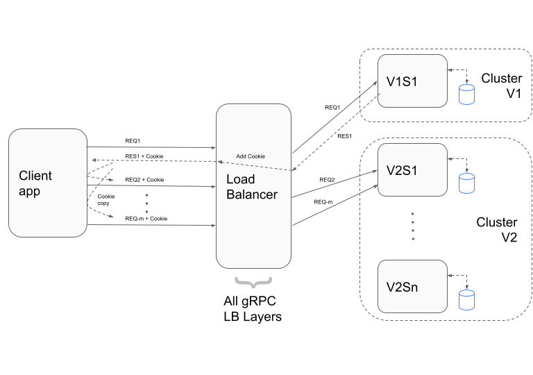
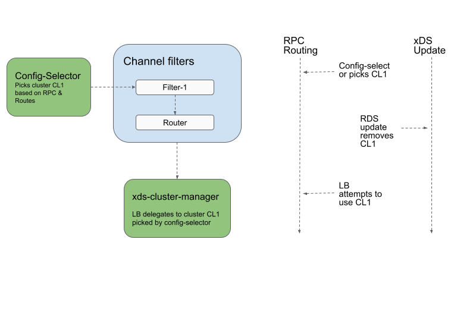
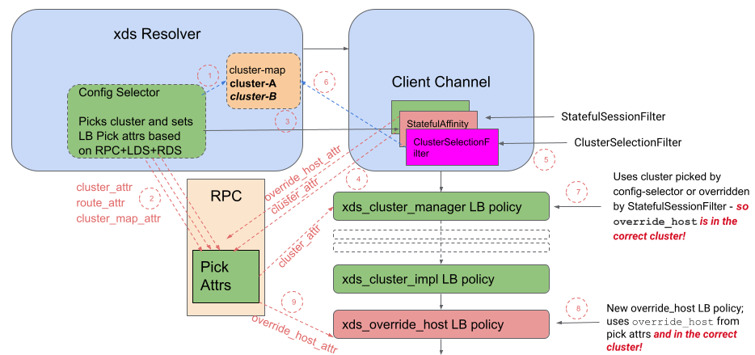

A60: xDS-Based Stateful Session Affinity for Weighted Clusters
----
* Author(s): Sanjay Pujare (@sanjaypujare)
* Approver: markdroth
* Status: In Review
* Implemented in: <language, ...>
* Last updated: 2023-03-19
* Discussion at: 

## Abstract

This design is an enhancement of
[A55: xDS-Based Stateful Session Affinity for Proxyless gRPC][A55] which
specified a mechanism to implement stateful session affinity. This enhancement
enables the feature to work where multiple clusters are used for use-cases such
as traffic splitting or canary deployment.

## Background

The stateful session affinity design specified in [A55][] has the
limitation that it does not work in cases such as traffic splitting
where RPCs of a session potentially get sent to different clusters as part of
the traffic splitting policy as shown below.



The diagram above shows the client app and the gRPC load balancer as 2 separate
logical boxes to clealy show the interaction between them although they both are
part of a single process.

Backends on the right are split into 2 clusters: `Cluster V1` and `Cluster V2`.
The first request REQ1 in the session is routed by the load balancer to
`Cluster V1` and backend `v1s1` in that cluster. Response RES1 contains a
cookie that has the address of `v1s1`. But the next request REQ2 in the session
is routed by the load balancer to `Cluster V2` because currently cluster
selection takes place inside the config selector - before any of the http
filters are run, including the [StatefulSessionFilter][]. After having selected
`Cluster V2` gRPC cannot send the REQ2 to `v1s1` and session affinity is
broken.

This proposal addresses the limitation.

### Related Proposals: 

* [A55: xDS-Based Stateful Session Affinity for Proxyless gRPC][A55]


## Proposal

We address the limitation by making the following changes to the current
stateful session affinity design.

### Include Cluster Name in the Cookie

We need to include cluster information in the cookie we generate. That way
when the cookie is received on the request path, we will extract the cluster
name and use it to pick the cluster.

We add the prefixed cluster name to the cookie value after a semicolon:

```
206.12.3.6:8080;cluster:cloud-internal-istio:cloud_mp_635862331669_807571734533927564
```

Note, although the snippet above shows clear-text content, the actual cookie
value is base64-encoded.

### Config Selector Changes

The config selector changes are necessary to allow the `StatefulSessionFilter`
to override cluster selection and also to resolve the "Cluster lifetime problem"
described below.

#### Cluster Lifetime Problem

This problem can be described as simply a race condition between the LB
processing an RPC and xDS updates changing route configuration as seen in the
following diagram.



In the diagram above you see two timelines: on the RPC routing timeline the
config selector picks cluster CL1 for the RPC and sometime later the LB attempts
to use CL1 for routing the RPC. But in the meantime -as you can see in the other
timeline on the right - an xDS update removes CL1 from the set of clusters for
the RPC’s route.

Currently this is handled by taking a ref to the CL1 object in the config
selector so that the object stays around even if the cluster is removed from the
route configuration. However with if the `StatefulSessionFilter` changes the
cluster, there is no guarantee the new cluster still exists at that point.
So we need to adjust the refs in the cluster map for proper cluster lifecycle
management.

#### Changes to Config Selector

 * Make the cluster map in config selector ref-counted. It enables
   maintaining a ref to a swapped out cluster map if an xDS update happens
   while processing an RPC.

 * config selector takes a ref to the cluster map and passes it via a new
   call-attribute (let’s say `XdsClusterMapAttribute`) to downstream entities.
   The selected cluster-name is passed - as before - but without taking a ref
   to the cluster entry.

 * config selector also exposes the currently selected route entry via a new
   call-attribute (let’s say `XdsRouteAttribute`).

   * We also make the entire route-config ref-counted by adding it to the same
     object as the cluster map.

With the above changes the config selector makes 4 values available to the
`StatefulSessionFilter` (and other filters): selected cluster, current route,
cluster-map and the entire route-config.

### `StatefulSessionFilter` Changes

#### Response Side Processing

In the filter's response processing, we set the cookie in the response, if the
corresponding request didn’t have a cookie or the actual cluster+backend that
processed the request didn’t match what the cookie had. The logic in pseudo-code
is:

```
if (!upstreamAddress.has_value() || hostAddress != upstreamAddress) {
  String clusterUsed = cluster name from XdsClusterAttributeTypeName
  String toEncode = hostAddress + ";\"" + clusterUsed + "\"";
  String encoded_address = base64_encode(toEncode);
  Create a Cookie from our cookie configuration;
  Set cookie's value as encoded_address;
  Add the cookie header to the response;
}
```

#### Request Side Processing

The filter needs to process the cluster name present in the cookie.

 * Extract cluster name from RPC’s cookie and validate it:

   * Verify the cluster name is present in the current route (remember it is
     exposed via `XdsRouteAttribute`). Route-action can only be single cluster
     or weighted-clusters and cluster should match/be present in one of those.

 * If validation succeeds, then override the cluster call-attribute (originally
   set by the config selector) with the cluster name.

 * Set the override-host value with the IP:port value from the cookie (this is
   the current logic).

### New `ClusterSelectionFilter`

Because of the changes we made to the config selector we need a new filter
to finalize cluster selection and to release refs to the cluster map and
route config. This new filter is called `ClusterSelectionFilter` and it runs
just before the Router filter. This is an internal implementation detail of
gRPC so the xDS config is not aware of this new filter. Note:

 * This is the second-last filter (retry/router filter being last).
   Specifically it has to run after the `StatefulSessionFilter`.

 * It gets the selected cluster name from `XdsClusterAttributeTypeName` and
   cluster map from `XdsClusterMapAttribute`.

 * It then takes a ref to that cluster entry from the map and releases the
   ref to the cluster map.

With this approach, `StatefulSessionFilter` is able to update the selected
cluster between when the config selector selects the cluster and when the
`ClusterSelectionFilter` takes a ref to the cluster.

### Process Diagram

The following diagram shows how the process works once this design is
implemented:



 1. An RPC comes in and config selector picks cluster-A (shown in bold).

 2. config selector sets 3 attributes to expose the cluster, current route,
    cluster map and the entire route config. Note it also takes ref to the
    cluster map and the route config.

 3. HTTP filters are invoked - specifically the stateful session affinity
    filter that is of interest to us.

 4. the stateful session affinity filter sets the override-host attribute
    and it also overwrites the cluster-attr based on the cookie contents.

 5. the new cluster selection filter is invoked.

 6. the cluster selection filter takes a ref to the new cluster - cluster-B
    (shown in bold and italics) and releases the ref to the whole map and
    the route config.

 7. Now the cluster-manager LB is invoked. It reads the cluster attribute -
    which happens to be the correct cluster.

 8. After the usual LB hierarchy processing, the override-host LB policy is
    invoked.

 9. The policy reads the override-host attribute and uses it to route the
    RPC to that host which is now in the correct cluster.

### Notes

This design mainly deals with how two existing features - stateful session
affinity and weighted clusters - should work together. As a result this feature
does not require a new API or impact any existing APIs.

### Temporary environment variable protection

[A55: xDS-Based Stateful Session Affinity for Proxyless gRPC][A55] was only
recently implemented and the implementation is still guarded by the
`GRPC_EXPERIMENTAL_XDS_ENABLE_OVERRIDE_HOST` environment variable. We will
continue to use the same environment variable to also guard this feature.
This environment variable protection will be removed once the feature has
proven stable.

These design proposes some structural or declarative changes in the source code
which cannot be guarded by a runtime environmental variable so these will be
present in the source code. These are:

* an additional variable for the ref-counted cluster map in config selector

* similarly an additinal field or variable for the ref-counted route-config

The environment variable protection will specifically achieve the following
run-time behavior changes:

* only when enabled, the variables for ref-counted cluster map and route-config
  will be set. When not enabled the old variables will be used.

* only when enabled, the config selector will set the new call-attributes for
  the cluster-map, current route entry and the route config.

* only when enabled, the `StatefulSessionFilter` will add the cluster name to
  the cookie in the response side processing.

* only when enabled, the `StatefulSessionFilter` will look for the cluster name
  in the cookie and set the cluster call-attribute in the request side processing.

* only when enabled, the new `ClusterSelectionFilter` will be added to the
  filter registry and added as the second-last filter in the filter chain.

If the environment variable is unset or not true, none of the above will be
enabled.

Once we decide to remove the environment variable protection completely i.e.
remove all code for the old behavior, we will remove the old declarations since
they will be unused/unreferenced.

## Rationale

The [A55 Rationale section][A55_Rationale] explains the rationale for why
stateful session affinity is important in certain use-cases. Users do not want
to see session affinity broken when traffic splitting with multiple clusters is
used. This feature enables the combination to work.

## Implementation

We are planning to implement the design in gRPC C-core and there are no current
plans to implement in any other language. Wrapped languages should be able to
use the feature, since there are no API changes required with this design.

[A55]: https://github.com/grpc/proposal/blob/master/A55-xds-stateful-session-affinity.md
[A55_Rationale]: https://github.com/grpc/proposal/blob/master/A55-xds-stateful-session-affinity.md#rationale
[StatefulSessionFilter]: https://github.com/grpc/proposal/blob/master/A55-xds-stateful-session-affinity.md#statefulsessionfilter-processing
