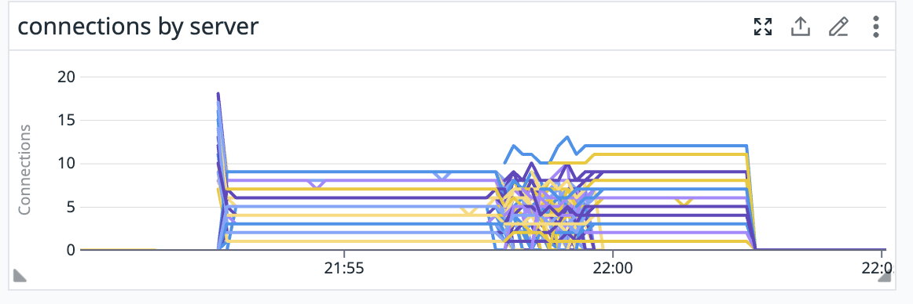
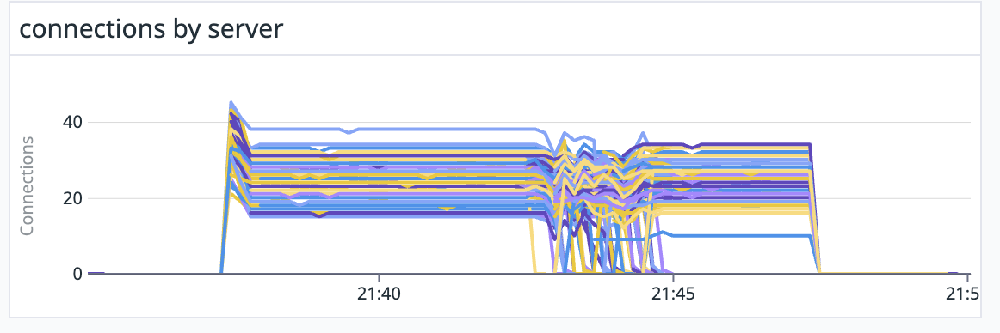
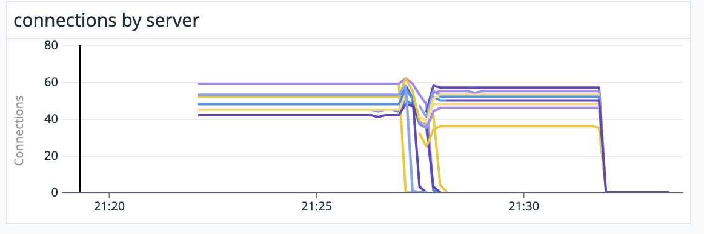
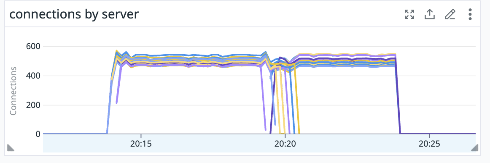
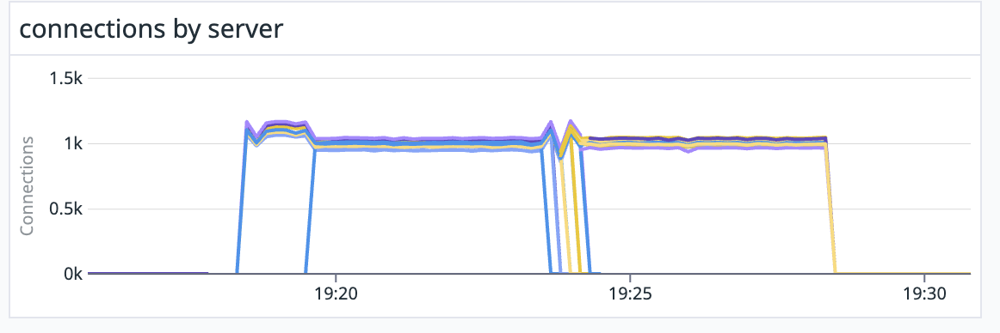

A68: Random subsetting with rendezvous hashing LB policy.
----
* Author(s): @s-matyukevich
* Approver: 
* Status: Draft
* Implemented in: PoC in Go
* Last updated: 2024-04-15
* Discussion at: https://groups.google.com/g/grpc-io/c/oxNJT1GgjEg

## Abstract

Add support for the `random_subsetting` load balancing policy.

## Background

Currently, gRPC is lacking a way to select a subset of endpoints available from the resolver and load-balance requests between them. Out of the box, users have the choice between two extremes: `pick_first` which sends all requests to one random backend, and `round_robin` which sends requests to all available backends. `pick_first` has poor connection balancing when the number of client is not much higher than the number of servers. The problem is exacerbated during rollouts because `pick_first` does not change endpoint on resolver updates if the current subchannel remains `READY`. `round_robin` results in every server having as many connections open as there are clients, which is unnecessarily costly when there are many clients, and makes local load balancing decisions (such as outlier detection) less precise.

### Related Proposals: 
* [gRFC A27: A52: gRPC xDS Custom Load Balancer Configuration](https://github.com/grpc/proposal/blob/master/A52-xds-custom-lb-policies.md)

## Proposal

Introduce a new LB policy, `random_subsetting`. This policy selects a subset of addresses and passes them to the child LB policy. It maintains 2 important properties:
* The policy tries to distribute connections among servers as equally as possible. The higher `(N_clients*subset_size)/N_servers` ratio is, the closer the resulting server connection distribution is to uniform.
* The policy minimizes the amount of connection churn generated during server scale-ups by using [rendezvous hashing](https://en.wikipedia.org/wiki/Rendezvous_hashing)

### Subsetting algorithm

* The policy receives a single configuration parameter: `subset_size`, which must be configured by the user.
* When the lb policy is initialized it also creates a random 32-byte long `salt` string. 
* After every resolver update the policy picks a new subset. It does this by implementing `rendezvous hashing` algorithm:
  * Concatenate `salt` to each address in the list.
  * For every resulting entity compute [MurmurHash3](https://en.wikipedia.org/wiki/MurmurHash) hash, which produces 128-byte output.
  * Sort all entities by hash.
  * Pick first `subset_size` values from the list.
* Pass the resulting subset to the child LB policy.
* If the number of addresses is less than `subset_size` always use all available addresses.

### Characteristics of the selected algorithm

#### Uniform connection distribution on high scale

When `(N_clients*subset_size)/N_servers` ratio is high, the resulting connection distribution between servers is close to uniform. This is because the chosen hash function is uniform and every server has equal probability to be chosen by every client. 
Though it could be done, we don't provide any mathematical guaranties about the resulting connection distribution. Any such guarantees will be probabilistic and have limited value in practice. Instead, we can give you a few samples:
* N_clients = 100, N_servers = 100, subset_size = 5

* N_clients = 100, N_servers = 100, subset_size = 25

* N_clients = 100, N_servers = 10, subset_size = 5

* N_clients = 500, N_servers = 10, subset_size = 5

* N_clients = 2000, N_servers = 10, subset_size = 5


#### Low connection churn during server rollouts

The graphs provided in the previous section prove this is the case in practice (we rollout all servers in the middle of every test, and there is no visible increase in the number of connections per server) Low connection churn during server rollouts is the primary motivation why rendezvous hashing was used as the subsetting algorithm: it guaranties that if a single server is either added or removed to the IP address list, every client will update at most 1 entry in its subset. This is because the hashes for all unaffected servers remain the same, which guarantees that the order of the servers after sorting also remains stable. The same logic applies to the situation when multiple servers got updated. 

### LB Policy Config and Parameters

The `random_subsetting` LB policy config will be as follows.

```
message LoadBalancingConfig {
    oneof policy {
        RandomSubsettingLbConfig random_subsetting = 21 [json_name = "random_subsetting"];
    }
}
message RandomSubsettingLbConfig {
    // subset_size indicates how many backends every client will be connected to.
    // Default is 20.
    google.protobuf.UInt32Value subset_size = 1;

    // The config for the child policy.
    repeated LoadBalancingConfig child_policy = 2;
}
```


### Handling Parent/Resolver Updates

When the resolver updates the list of addresses, or the LB config changes, Random subsetting LB will run the subsetting algorithm, described above, to filter the endpoint list. Then it will create a new resolver state with the filtered list of the addresses and pass it to the child LB. Attributes and service config from the old resolver state will be copied to the new one. 

### Handling Subchannel Connectivity State Notifications

Random subsetting LB will simply redirect all requests to the child LB without doing any additional processing. This also applies to all other callbacks in the LB interface, besides the one that handles resolver and config updates (which is described in the previous section). This is possible because random subsetting LB doesn't store or manage sub-connections - it acts as a simple filter on the resolver state, and that's why it can redirect all actual work to the child LB. 

### xDS Integration

Random subsetting LB won't depend on xDS in any way. People may choose to initialize it by directly providing service config. We will only provide a corresponding xDS policy wrapper to allow configuring this LB via xDS.

#### Changes to xDS API

`random_subsetting` will be added as a new LB policy.

```textproto
package envoy.extensions.load_balancing_policies.random_subsetting.v3;
message RandomSubsetting {
  google.protobuf.UInt32Value subset_size = 1;
  repeated LoadBalancingConfig child_policy = 2;
}
```

As you can see, the fields in this policy match exactly the fields in the random subsetting LB service config.

#### Integration with xDS LB Policy Registry
As described in [gRFC A52](https://github.com/grpc/proposal/blob/master/A52-xds-custom-lb-policies.md), gRPC has an LB policy registry, which maintains a list of converters. Every converter translates xDS LB policy to the corresponding service config. In order to allow using the Random subsetting LB policy via xDS, the only thing that needs to be done is providing a corresponding converter function. The function implementation will be trivial as the fields in the xDS LB policy will match exactly the fields in the service config.

## Rationale
### Alternatives Considered: Deterministic subsetting

We explored the possibility of using deterministic subsetting in https://github.com/grpc/proposal/pull/383  and got push-back on this for the reasons explained [here](https://github.com/grpc/proposal/pull/383#discussion_r1334587561)

## Implementation
DataDog will provide Go and Java implementations.

