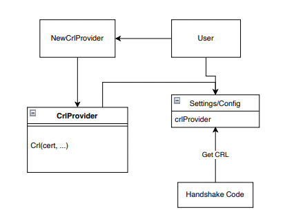
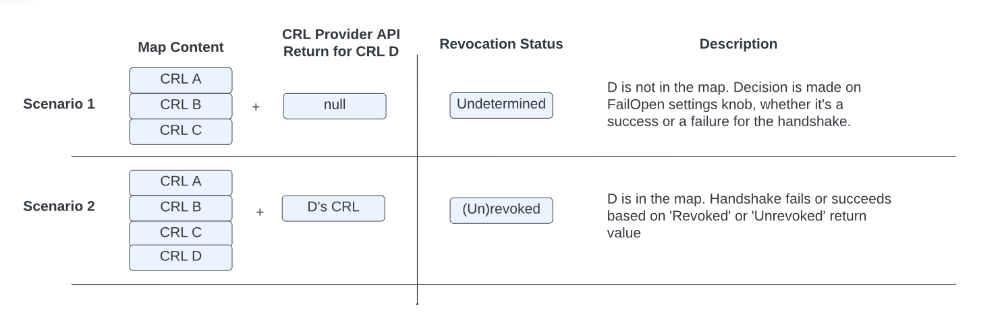
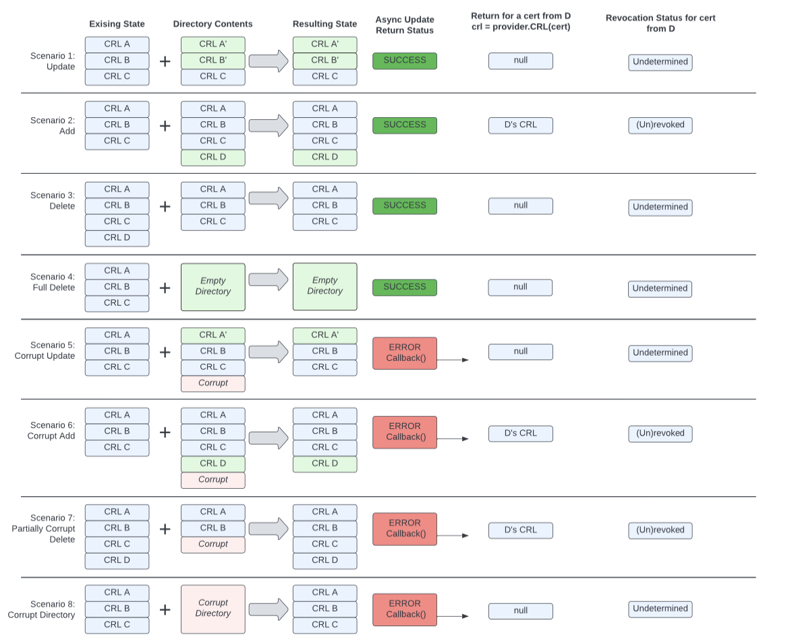
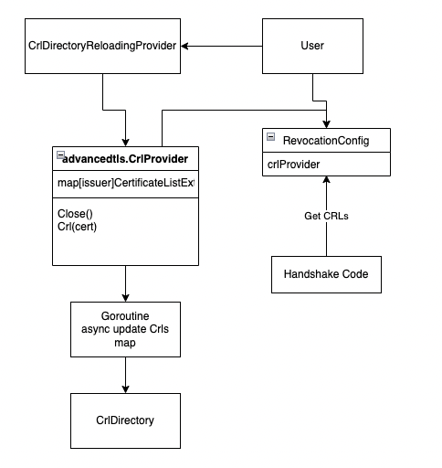

A69: Certificate Revocation List Enhancements
----
* Author(s): Gregory Cooke (@gtcooke94)
* Approver: ejona86
* Status: Draft
* Implemented in: C, Go
* Last updated: 2023-08-03
* Discussion at: https://groups.google.com/g/grpc-io/c/3o__5GhGxeg

## Abstract

gRPC has an MVP implementation for CRLs (Certificate Revocation Lists). We wish to provide a more generic and flexible interface to enable developers to implement the desired functionality for their landscape. In addition, we will provide two concrete implementations of this interface similar to Credential Reloading - a static provider and a directory reloader.


## Background

[RFC 5280](https://datatracker.ietf.org/doc/html/rfc5280) defines the desired behavior for Certificate Revocation Lists (CRLs). gRPC has an MVP implementation of this RFC for CRL handling in several languages, each with their own flavors - for example, C++ uses OpenSSL, whereas Go uses an implementation written in Go (and the stack in Java is significatly different). Providing CRL reloading as a feature allows for more internal cohesion with the ideas behind credential reloading.

### Related Proposals:

* [L46: New TLS Credentials API](https://github.com/grpc/proposal/pull/205)
* [A43: gRPC authorization API](https://github.com/grpc/proposal/blob/master/A43-grpc-authorization-api.md)

## Proposal
We seek to provide an alternate option for users to customize CRL handling. In a similar way that `CredentialReloading` is implemented, we will add a `CrlProvider` interface through which gRPC fetches CRLs. In gRPC we will implement two providers (these match what we provide for certificates as well):

1. A `StaticCrlProvider` that takes a list of strings that represent CRL file content
1. A `CrlReloaderProvider` that periodically and asynchronously reloads a local directory of CRLs.

Users can also implement the interface with whatever behaviors they specifically desire.

Following [RFC5280](https://datatracker.ietf.org/doc/html/rfc5280), during revocation checking one of three status should be returned - `RevocationUnrevoked`, `RevocationRevoked`, and `RevocationUndetermined` ([RFC5280 defines `Undetermined` in the CRL Processing section](https://datatracker.ietf.org/doc/html/rfc5280#section-6.3.3). There are many reasons a certificate can be revoked, but in the end gRPC cares about a certificate being revoked or not, thus we differentiate between `RevocationUnrevoked` and `RevocationRevoked`. The user must specify whether `RevocationUndetermined` should be treated as `RevocationRevoked` or `RevocationUnrevoked` (failing open vs. failing closed).

Assumptions:
1. There should be no direct linkage between this interface and the creation/distribution of CRLs. gRPC is a user of CRLs and credentials, not a PKI itself.
1. The CRL Providers simply provide CRLs. The actual verification will be done by other pieces of the code (these are already written).
1. We cannot know users' PKI details, so our implementations should not enforce non-X509 metadata mattering (for example, file names). A user could certainly implement their own provider that cares about filenames.
1. We will not support OSCP-style checking (OSCP is an alternative to CRLs, not another form of CRLs).



CrlProvider Interface Pseudocode:
```
public:
// Get the CRL that is associated with a cert. Provides good semantic
// consistency as most X509 APIs that try to get a CRL expect to get a cert
// passed in. In each language we may use an abstraction here that makes it easy
// to get CRL-lookup information from the certificate.
// Return value expected to be as read-only 
// Returns null if there isn't an associated CRL (as null is different than an
// empty CRL)
  CRL Crl(certficate/certificateInfo)
private:
  // Implementation for getting and storing CRLs
```

Example feature use:
```
opts = TlsOptions()
provider = CrlDirectoryReloaderProvider("/path/to/crl/directory", Duration(60 seconds))
opts.crlProvider = provider
opts.failRevocationUndetermined = false
server = Server(opts)
```

### Map Content and API Outcomes

The diagram below describes the behavior of the API and why this or that outcome is produced. Here, "Map" is a generic way to represent some in-memory representation of the CRLs in a key-value store. “CRL Provider API Return” refers to the CRL return of the `CrlProvider` in the Pseudocode above.


The pseudo code snippet below illustrates the same idea:
```
<pseudo code in the handshaker when verifying cert>

RevocationStatus GetRevocationStatus(cert, opts) {
  crl = opts.crlProvider.Crl(cert)
  revocationStatus = checkRevocation(crl, cert) // RevocationUndetermined for null CRL
  if revocationStatus is RevocationUndetermined {
      return opts.FailRevocationUndetermined ? Revoked : Unrevoked
  }
  return revocationStatus 
}
```

### Provider Implementation - Static Provider

This is a simple provider that takes in all CRLs to be used as raw strings during initialization, then returns them in the appropriate format when called. The CRLs will be stored in a mapping of a hash of the issuer to the CRL content.

### Provider Implementation - Directory Provider
This provider will periodically read CRL files in a given directory and update gRPCs internal representation of those CRLs. We expect this will be heavily used, as a directory of CRLs is very common for X509 CRL files. The CRLs will be stored in a mapping of a hash of the issuer to the CRL content - `map<issuer_hash, crl_object>`. The initial read of the directory and filling of this map will be synchronous during server startup when the provider is created. It is important for this initial read to be synchronous because we must ensure that the CRL data is loaded before the server starts up and allows handshakes to happen. The creation of this provider does _not_ fail if there is an error in the initial load. An error in the initial load will be treated just as an error in any subsequent load.

In the case that the directory and all files within are read completely during an update, we will treat the directory as the exact truth. This means if a CRL was in-memory and is no longer in the directory after the update, it will be removed in-memory.

In the case that there is an issue reading a file, we cannot be certain what exactly is happening. In particular, we enforce no naming convention on the CRL files, so if it cannot be read, we cannot know what it contains or what issuer it belongs to. We will do a best-effort safe update - for files which are read correctly, we can update those individual entries. Since we can't know the issuer if a file can't be read, it is unsafe to do deletion in this case. An overridable error callback can be passed as a parameter when instantiating the directory-based provider and will be called so the user can receive a signal that something has gone wrong with CRLs.

We will also require that users perform safe and atomic file/directory operations with their CRL files using filesystem primitives (for example, the copy-rename pattern). If users do not exercise good file management hygiene, we cannot guarantee any exact behavior. For example, if a user creates a directory and writes files one-by-one, there is a chance the directory reloader would update when only 1 file was present and this would be seen as a success (so this would overall be unspecified behavior because of bad file hygiene). If a user has needs that don't match this, they can implement the interface per their needs.

If a CRL is not found for an issuer this is fine - the verification code will return RevocationUndetermined per RFC5280, then the user will have a setting to fail-open or fail-closed indicating whether RevocationUndetermined should be treated as Unrevoked or Revoked respectively.


#### API Outcomes and Error Handling
An important note to make here is that all IO and error callbacks will happen asynchronously on a separate thread from the main grpc client/server. By design this error callback is purely informational, it is not a decision maker nor behavior adjusting callback.
This callback will be invoked at most once per update pass - if there are errors reading more than one file in a given pass, all of those errors will be returned in a single invocation of the callback.
The callback will be passed only one parameter, which is an indication of the error in a language-specific way (for example, `absl::Status` in C++).
The error text should include the list of files for which there were errors and what those errors were, but that information will not be passed in a structured way for the callback to understand those individual underlying errors.

Because CRLs involve reading/writing from the filesystem, we will have to deal with potential edge cases of bad files, bad updates, etc. From a high-level perspective, we are going to follow the [Authz Policy design patterns](https://github.com/grpc/proposal/blob/master/A43-grpc-authorization-api.md) - use existing information in case an update contains bad data. Startup behavior is not different from updates. Particularly in the case of updating CRLs, we don't want to error and crash the server if there is a bad update. However, we still want this error to be known, so we will have an optional and overridable error callback when CRLs fail to be read. This will let users tie in whatever alerting/monitoring they may want in these failure cases. This callback will be for notifications/alerting, it will not be a decision-making callback (it is expected the IO for CRLs will already be done in the background, so these errors would not be on the main path by design anyways). Users should use `RevocationUndertermined` combined with the FailOpen/FailClosed knob for decision making on uncertain CRLs.

These cases are all on a per-CRL level - a given CRL having an issue will not keep other good CRLs in an update batch to fail. The opposite behavior - failing the whole batch or dropping all the handshakes in the case of a bad CRL - might enable a DOS-type attack vector.

#### Example Behavior for a Directory Reloader:

At startup we read 3 CRL files (A, B, C) and construct a map as described above. During the handshakes, we return the CRLs from the map.
Then, a bad update happens and CRL C ends up corrupted, but A and B are good. When this directory is reloaded, the resulting map will have the newer A and B CRL, and will also include the original C CRL (as this will not see any update). In addition, the `CrlReadErrorCallback` would be invoked when CRL C fails to be read. There is no linkage between the map's CRL C and the fact that there was a read failure. It is the user's responsibility to act on file issues after being notified via the error callback.
To further expand the scenario, if the update were to also include a new issuer's CRL D that was also corrupted, grpc would have no idea that CRL D exists at all. The error callback would be invoked, then grpc would treat it just like any other missing CRL file through returning RevocationUndetermined.

The following diagram visually represents the expected values for the async update of a directory, the provider return values, and the revocation status from checking CRL D:



## Rationale
The overall alternate approach to this proposal is to continue using the x509_hash_dir style CRLs that are already implemented. The existing approach is very strict on PKI design. gRPC is not a PKI, and we should be able to support CRLs in a more generic way without prescribing an exact structure to users' PKI. The new API design here is consistent with credential reloading and should be clear to users. It provides secure, useful defaults as well as an interface for more advanced users to implement for their specific needs.

This approach adds complexity to the user facing API, and a user overriding the provider interface poorly could result in undefined or inefficient behaviors. To counteract this, we will provide generally useful implementations and good documentation on requirements if a user is writing their own implementation.

We explicitly will not be supporting OSCP-style revocation . We want to stay inside the realm of RFC5280 and X509-style CRLs, and OSCP represents a departure from that standard. Notably, the API surface for OSCP is different - for OSCP one makes a call to an external service that returns the revocation status. Rather, we expect to be given CRLs and will check the revocation status in gRPC. In addition, OSCP requires external calls during the handshake, whereas with X509 CRL files everything can done locally. Handshakes are on a path for which performance is important, so making external calls during them is an approach to avoid.


## Implementation 
### Go
CRL checking in Go is entirely dependent upon setting the `tls.config.VerifyPeerCertificate` callback function to check CRLs. Currently, the Go implementation overrides this callback and from that calls `CheckChainRevocation(...)` which takes the certificate chain to be checked and the RevocationConfig. It gets the CRL of interest by calling `FetchIssuerCrl()` - we can use our provider in that function. Then it checks the cert chain against the relevant CRLs.

We will add CRL Provider code to the advancedtls module. All CRL related code is currently in the advancedtls module, so this would keep it all in the same place.  Revocation configurations will be added to the existing configuration options in `RevocationConfig`. There will be checks to ensure a user can exclusively use the new provider options or the already-implemented X509 hash directory options. Configuring both is a mistake.
```go
// RevocationConfig contains options for CRL lookup.
type RevocationConfig struct {
	// RootDir is the directory to search for CRL files.
	// Directory format must match OpenSSL X509_LOOKUP_hash_dir(3).
	RootDir string
	// AllowUndetermined controls if certificate chains with RevocationUndetermined
	// revocation status are allowed to complete.
	AllowUndetermined bool
	// Cache will store CRL files if not nil, otherwise files are reloaded for every lookup.
	Cache Cache

  // crlProvider and RootDir/Cache cannot both be set
+ CrlProvider crlProvider
}
```

The core CrlProvider interface will look as follows. Since x509 is a built in go library, we can safely use it in our API.
```go
type CRLProvider interface {
	// Callers are expected to use the returned value as read-only.
	CRL(cert x509.Certificate) (*CertificateListExt, error)
}
```

Regarding sharing between connections - since the providers are in a high-level configuration, the same provider should be used across many individual connections and handshakes. [Here is an example of how the credential reloading provider is configured](https://github.com/grpc/grpc-go/blob/7935c4f759419cb0ab4cc50070f5487b33a19bb7/security/advancedtls/examples/credential_reloading_from_files/server/main.go#L58-L63). In this example, the server would use this provider for all connections.

#### Directory Reloader Specifics

```go
type CrlDirectoryReloadingProvider struct {
	ReloadInterval time.Duration
  CrlDirectory string
  // maps issuer hash to crl
	crls map[string]*CertificateListExt
}
func (provider *CrlDirectoryReloadingProvider) Crl(x509.Certificate) (*CertificateListExt, error) {...}

func (provider *CrlDirectoryReloadingProvider) run(ctx context.Context) {
	// golang ticker that refreshes the Crls
}
```

Reference Code:
* [IdentityCertificateOptions](https://github.com/grpc/grpc-go/blob/2aa261560586eab6795301a3670d9dfdd7308625/security/advancedtls/advancedtls.go#L115)
* [certificateListExt](https://github.com/grpc/grpc-go/blob/2aa261560586eab6795301a3670d9dfdd7308625/security/advancedtls/crl.go#L88)

### C/C++
We are still reliant upon BoringSSL actually doing handshakes, so we want need this provider to interact at some level with BoringSSL. 
```c++
 class TlsCredentialsOptions {
...
// Can't be used in conjunction with set_crl_directory, will error if both are tried
void set_crl_provider(std::shared_ptr<CrlProvider> crl_provider);
...
}

class CrlProvider {
 public:
  virtual Crl Crl(const Cert& cert) = 0;
}
```

We will add a `grpc::experimental::CrlProvider` that can be configured in `grpc::experimental::TlsChannelCredentialOptions`. This value and `set_crl_directory` cannot both be configured. The Provider will be configured in these options by the user and supplied as a pointer to grpc. Any handshake happening with a provider configured should share this provider, so the user can configure this to be shared across many connections if desired.

These will be passed down from the `TlsCreds` layer to the security connector layer, and from there to the TSI and the ssl_transport_security layer which actually constructs the handshakers and interacts with BoringSSL.

Due to constraints from supporting both OpenSSL and BoringSSL, our best option for doing the revocation checks is to treat it as post-chain building validation. We will tie into BoringSSL via the `SSL_CTX_set_cert_verify_callback`. In that callback, we will iterate over the certificate chain that has been built, fetch the CRLs for those certificates from the provider, and do the associated checks per [RFC5280 6.3.3](https://datatracker.ietf.org/doc/html/rfc5280#section-6.3.3). Specifically, here's how gRPC will handle each of the points in that section of the RFC.

* a) Not done. gRPC is not supporting distribution points. It is the responsibility of the user to implement a CrlProvider or use an existing CrlProvider
  * i) Only supporting complete direct CRLs
  * ii) Not expiring on NextUpdate - an old CRL is more secure than throwing out everything
* b) Verify issuer and scope
  * i) CRL Issuer matches certificate issuer, verify cRLSign bit on issuer
  * ii) Not supporting IDPs
* c) Not done. gRPC is not supporting delta CRLs.
* d) Not done. gRPC is not supporting reasons masks.
* e) Not done. gRPC is not supporting reasons masks.
* f) Not done. We only support direct CRLs, and the CRL is fetched for a given certificate issuer in a chain that was built of certs to our trust anchor. The issuer of a given cert (1 up in the chain) is required to be the issuer of the CRL since we are only supporting direct CRLs. Thus, these paths are by definition the same.
* g) CRL Signature Validation.
* h) Not done. gRPC is not supporting delta CRLs.
* i) Not done. gRPC is not supporting delta CRLs.
* j) Check if the given certificate is revoked by the given CRL.
* k) Not done. gRPC is not supporting removeFromCRL (we will not support un-revocation. Issue a new certificate that has not been revoked).
* l) Not done. gRPC is not supporting reasons and only cares about a certificate being revoked, unrevoked, or undetermined.

