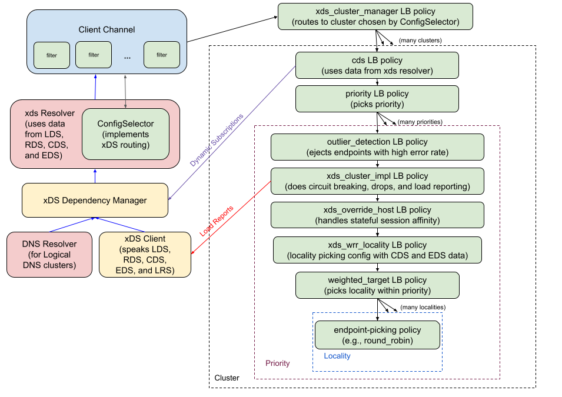

A74: xDS Config Tears
----
* Author(s): @markdroth
* Approver: @ejona86, @dfawley
* Status: {Draft, In Review, Ready for Implementation, Implemented}
* Implemented in: <language, ...>
* Last updated: 2025-03-11
* Discussion at: https://groups.google.com/g/grpc-io/c/ifcC3DbopWM

## Abstract

xDS configuration is split across four main resource types: listener,
route configuration, cluster, and endpoint.  Today, these different
resource types are watched in different parts of the gRPC channel:
the listener and route configuration are watched in the xds resolver,
whereas the cluster and endpoint resources are watched in the LB policy
tree (in the cds and xds_cluster_resolver LB policies, respectively).
This split prevents us from applying config changes to the channel in
an atomic way, meaning that we can see config tears, which can lead
to unnecessary latency and even spurious RPC failures.  This document
proposes a design to fix that problem.

## Background

The way that we currently split the xDS resource watches between the
resolver and the LB policy tree means that we cannot apply config updates
to the gRPC channel as an atomic whole.  However, there are cases where a
control plane needs to send a config change that spans multiple resources.

At minimum, this can cause us to impose unnecessary latency for RPCs.
For example, the xds resolver may apply a new route configuration that
references a new cluster, even though the client has not yet obtained
the resource for the new cluster.  As soon as the xds resolver applies
that change, the ConfigSelector will start using the new route
configuration, which means that it will start sending RPCs to the new
cluster.  However, those RPCs may be delayed until the cds LB policy
obtains the cluster resource.

In some edge cases, this can even cause us to incorrectly fail RPCs.
For example, consider a case using xDS fallback (see [A71]), where the
primary server and the fallback server use different resource names
for the cluster resources.  If the client is using the data from the
fallback server and then the primary server comes back up, the client
may see the does-not-exist notification for the cluster name from the
primary server before it sees the new route configuration that points
to the correct cluster name, thus causing us to temporarily fail RPCs
routed to that cluster.

This document proposes a design to fix this by moving all of the
resource watches into the xds resolver.

### Related Proposals: 
* [A27: xDS Global Load Balancing][A27]
* [A28: xDS Traffic Splitting and Routing][A28]
* [A29: xDS mTLS Security][A29]
* [A31: xDS Timeout Support and Config Selector Design][A31]
* [A37: xDS Aggregate and Logical DNS Clusters][A37]
* [A55: xDS-Based Stateful Session Affinity for Proxyless gRPC][A55]
* [A56: Priority LB Policy][A56]
* [A71: xDS Fallback][A71]

[A27]: A27-xds-global-load-balancing.md
[A28]: A28-xds-traffic-splitting-and-routing.md
[A29]: A29-xds-tls-security.md
[A31]: A31-xds-timeout-support-and-config-selector.md
[A37]: A37-xds-aggregate-and-logical-dns-clusters.md
[A55]: A55-xds-stateful-session-affinity.md
[A56]: A56-priority-lb-policy.md
[A71]: A71-xds-fallback.md

## Proposal

This proposal has several parts:
- We will move all resource watches into the xds resolver.
- The complete xDS config will be passed to the LB policies as an
  attribute.
- The cds LB policy will be changed to get the configuration for the
  cluster from the passed-in attribute rather than starting watches on
  the XdsClient.
- The xds_cluster_resolver LB policy will be removed completely, as
  obtaining endpoint addresses will now be done in the xds resolver.
  The code for generating the child policy configs for the priority
  policy will now be done in the cds LB policy.
- As an optimization, we will change the xds_cluster_impl and
  xds_override_host LB policies to get most of their configuration
  parameters from the passed-in attribute rather than from their JSON
  configs.
- In some implementations, this may also allow simplifying the XdsCredentials
  plumbing by leveraging the config passed to the LB policies instead of
  generating a map of mTLS configs in the cds LB policy.

Note that although all of the xDS resource watches will now be done in
the xds resolver, it will still be necessary to pass the XdsClient to
the LB policies, because the xds_cluster_impl policy needs to access the
XdsClient for load reporting.

The updated gRPC client xDS architecture is shown below.



[Link to SVG file](A74_graphics/grpc_client_architecture.svg) 

### Changes in xds Resolver

We will introduce a new subcomponent in the xds resolver called the
XdsDependencyManager, which sits in between the xds resolver and the
XdsClient.  The XdsDependencyManager will watch all xDS resources,
resolving dependencies between them, and returning a complete
configuration to the xds resolver only once all necessary dependencies
have been obtained.  For example, if the XdsDependencyManager receives an
updated route configuration that refers to a new cluster, it will start
a watch for the new cluster.  If that cluster requires a new endpoint
resource, it will start a watch for that endpoint resource.  Only once
it has all necessary resources will it return a new configuration to
the xds resolver.

The XdsDependencyManager will be passed the listener resource name when
it is instantiated, and it will immediately start a watch for that
listener resource on the XdsClient.  If the route configuration is not
inlined into the listener, the XdsDependencyManager will start a watch
for the route configuration resource.  It will also be passed the data
plane authority, which it will use to select the right virtual host from
the route configuration.

The XdsDependencyManager will get the list of clusters from the routes
in the selected virtual host and will start a watch for each of them.
It will also start watches for clusters that are determined dynamically
(see below).  For EDS clusters, the XdsDependencyManager will start a
watch for the required endpoint resource.  For logical DNS clusters
(see [A37]), the XdsDependencyManager will create a DNS resolver to
obtain endpoint addresses.  For aggregate clusters (see [A37]), the
XdsDependencyManager will resolve the dependency graph, starting watches
for dependent clusters as needed.

Note that because resolution of logical DNS clusters is moving into the
xds resolver, the xds resolver will now need to handle re-resolution
requests from LB policies.  When re-resolution is requested, the xds
resolver will trigger re-resolution for all logical DNS clusters in
the XdsDependencyManager.  Note that this does imply a behavior change,
which is that whenever there is a re-resolution request for any one
logical DNS cluster, we will trigger re-resolution for *all* logical
DNS clusters in the config tree, but this is considered acceptable.

The XdsDependencyManager will provide a watcher API similar to the one
provided by the XdsClient, with a few key differences.  The watcher
API will look like this (C++ syntax, various implementation details elided):

```c++
class Watcher {
 public:
  virtual ~Watcher() = default;

  // Called when a new xDS config is available or when there is an error
  // for the LDS or RDS resource for which we want to stop using the
  // previously seen resource, if any.
  virtual void OnUpdate(absl::StatusOr<XdsConfig> config) = 0;
};
```

The xds resolver will implement this watcher interface and pass the
watcher object to the XdsDependencyManager at instantiation time.

The updates delivered to this watcher will contain a complete xDS
configuration, including all necessary resources.  The xDS configuration
will look something like this (C++ syntax, various implementation
details elided):

```c++
struct XdsConfig {
  // Listener resource.
  XdsListenerResource listener;
  // RouteConfig resource.  Will be populated even if RouteConfig is
  // inlined into the Listener resource.
  XdsRouteConfigResource route_config;
  // Virtual host.  Points into route_config.  Will always be non-null.
  XdsRouteConfigResource::VirtualHost* virtual_host;

  struct ClusterConfig {
    // Cluster resource.
    XdsClusterResource cluster;

    // Endpoint info for EDS and LOGICAL_DNS clusters.  If there was an
    // error, endpoints will be null and resolution_note will be set.
    struct EndpointConfig {
      XdsEndpointResource endpoints;
      std::string resolution_note;
    };
    // The list of leaf clusters for an aggregate cluster.
    struct AggregateConfig {
      std::vector<absl::string_view> leaf_clusters;
    };
    std::variant<EndpointConfig, AggregateConfig> children;
  };
  // Cluster map.  A cluster will have a non-OK status if either
  // (a) there was an error and we did not already have a valid
  // resource or (b) the resource does not exist.
  std::map<std::string, absl::StatusOr<ClusterConfig>> clusters;
};
```

Note that the watcher's OnUpdate() method will be invoked with an error
only for problems with the listener and route configuration resources
that require the xds resolver to stop using the previously returned
resources, if any.  Specifically, it will be invoked with an error in
the following cases:
- When the listener or route configuration watchers see
  OnResourceDoesNotExist().
- When the listener or route configuration watchers see OnError(), if
  they did not previously see OnResourceChanged().  (If the watchers
  *did* previously see OnResourceChanged(), then the OnError() event is
  ignored by the XdsDependencyManager and not passed on to the xds
  resolver.)
- When the received listener resource is a socket listner instead of an
  API listener.
- When the received route configuration does not contain a virtual host
  matching the channel's default authority.

For cluster-specific errors, we need to retain the existing behavior,
which is that it causes a problem for the individual cluster but does
not affect traffic sent to any other cluster.  Therefore, when the
XdsDependencyManager sees an error on a cluster for which it did not
previously have data, or if it sees a does-not-exist notification on a
cluster, it will report that by returning a non-OK status for the cluster
in the XdsConfig.  Similarly, if there is a problem obtaining endpoint
data from EDS or DNS, the XdsDependencyManager will report that problem
via the cluster's resolution_note field.

The xds resolver will pass the returned XdsConfig to the LB policies via
an attribute, so that the LB policies can use the cluster data.  Note that
we cannot simply pass the data via the cds LB policy's JSON config,
because we need this to work in cases where the cluster is determined
dynamically, such as where a route uses a ClusterSpecifierPlugin, in which
case the cds LB policy's config comes from the ClusterSpecifierPlugin,
not from the xds resolver.  (We have some internal functionality that
uses this, not something that has been documented in a public gRFC.)

In order to handle such cases, the XdsDependencyManager will also
provide an API to subscribe to a particular cluster resource whose
name was not present in the route configuration.  The xds resolver
will pass the XdsDependencyManager (or an interface wrapping it, if
the implementation does not want to expose XdsDependencyManager outside
of the xds resolver) to the LB policies via an attribute, so that the
cds LB policy can use this API.  The API will return some subscription
handle that the caller can release when they are no longer interested
in the cluster subscription.

As per [gRFC A31][A31], the ConfigSelector gives each RPC a ref to the
cluster that was selected for it to ensure that the cluster is not
removed from the xds_cluster_manager LB policy config before the RPC is
done with its LB picks.  These cluster refs will also hold a
subscription for the cluster from the XdsDependencyManager, so that the
XdsDependencyManager will not stop watching the cluster resource until
the cluster is removed from the xds_cluster_manager LB policy config.

Note that in the XdsConfig, the cluster map will contain an entry for
every cluster that is either referenced in the route configuration,
referenced in an aggregate cluster, or for which a dynamic subscription
was registered.

### Changes in cds LB policy

Instead of starting a watch on the XdsClient to get the cluster data,
the cds LB policy will get its configuration by looking up the cluster
name in the XdsConfig passed to it via an attribute.

To address the case where the cluster is determined dynamically (e.g., a
route that uses a ClusterSpecifierPlugin), we will add a new field to
the cds LB policy's configuration:

```
// Set this to true for a cluster that is determined dynamically
// rather than being present in the route configuration.
bool is_dynamic = 2;
```

If that field is set to true, then the cds policy will obtain a
subscription handle from the XdsDependencyManager (or the interface
wrapping it) if it has not already done so.  This handle will not be
released until the cds policy is destroyed.

Note that when a cds LB policy obtains a dynamic subscription to a
cluster, there may be subsequent updates from the xds resolver that do not
yet include the newly subscribed-to cluster.  Therefore, the cds policy
will need to ignore updates in which the XdsConfig does not contain the
cluster.  However, this case should not occur with non-dynamic clusters,
because the xds resolver ensures that those clusters are being subscribed
to until they are removed from the LB policy config.

The code for generating the configuration for the priority policy (see
[A56]) will be moved from the xds_cluster_resolver policy into the
cds policy.  Note that this includes the heuristic we use to attempt to
minimize churn in priority child policy names as localities move between
priorities.  The cds policy will also take the endpoint information from
the XdsConfig and pass it down to the priority policy as addresses.

### Removing the xds_cluster_resolver LB Policy

The xds_cluster_resolver LB policy (introduced in [A37]) will be removed
completely, since all of its functionality is being moved elsewhere in
this design.  The XdsDependencyManager will be responsible for subscribing
to EDS resources and for creating DNS resolvers for Logical DNS clusters.
And the cds LB policy will be responsible for generating the configuration
for the priority policy.

### Changes in xds_cluster_impl and xds_override_host LB policies

Now that we are passing the XdsConfig to the LB policies via an
attribute, the xds_cluster_impl and xds_override_host LB policies can
now get the cluster's configuration from the XdsConfig rather than from
their JSON config.  This will avoid the need to populate most of the
fields in the JSON config in the cds LB policy and to parse these fields
in the xds_cluster_impl and xds_override_host policies.

In the xds_cluster_impl policy config, we will retain only the
clusterName and childPolicy fields.  All other fields are deprecated
and will no longer be used.

In the xds_override_host policy config, we will retain the childPolicy
field and add a clusterName field.  The overrideHostStatus field is
deprecated and will no longer be used.

### XdsCredentials Simplification

Because this design calls for passing the XdsConfig down to the LB
policies, some gRPC implementations may be able to leverage that to
provide some simplifications in the XdsCredentials plumbing (see [A29]).

Because the mTLS config needs to come from the leaf clusters in the
aggregate cluster graph, the cds LB policy currently needs to construct
a map from leaf cluster name to the corresponding mTLS config, and then
when the subchannel connects, it picks the config for the appropriate
underlying cluster.

However, now that we are passing down the entire XdsConfig via an
attribute, we can instead move the XdsCredentials plumbing from the cds
LB policy down to the xds_cluster_impl policy (introduced in [A37]).
The xds_cluster_impl policy already knows which leaf cluster it is for,
so it can look up the mTLS config directly and pass that down to the
subchannels, so there is no longer any need for a map.

### Temporary environment variable protection

This design does not provide any new functionality that will be enabled
by external I/O, so no environment variable guard is necessary.

## Rationale

In addition to improving reliability in the cases described about, this
design paves the way for possible future changes that would allow the
client to be resilient to bad configs from the control plane, once we
have enough observability infrastructure to make that tractable.

## Implementation

LB policy config fields are updated in
https://github.com/grpc/grpc-proto/pull/140.

Implemented in C-core in https://github.com/grpc/grpc/pull/35011.  Fixed
logical DNS re-resolution in https://github.com/grpc/grpc/pull/37211.

Java, Go, and Node will implement this in the future.

## Open issues (if applicable)

N/A
