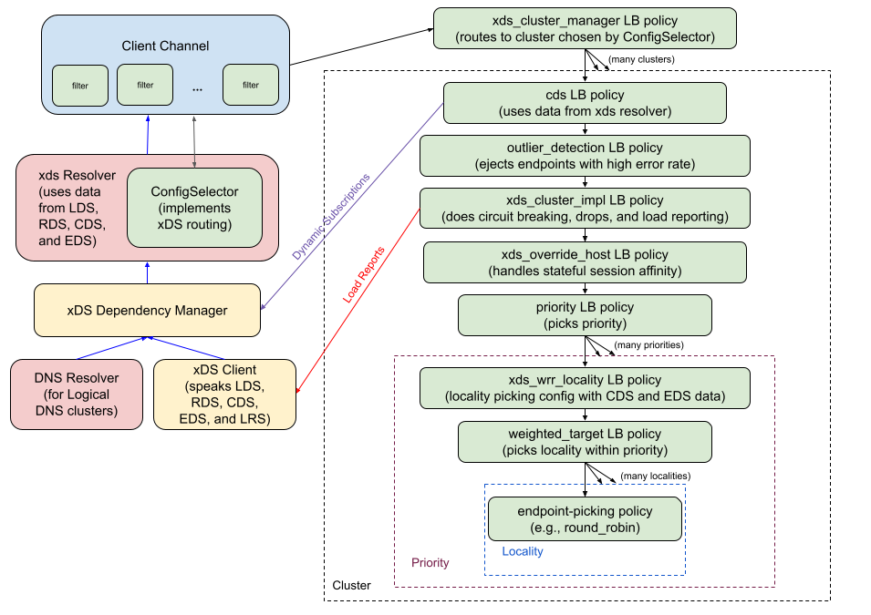
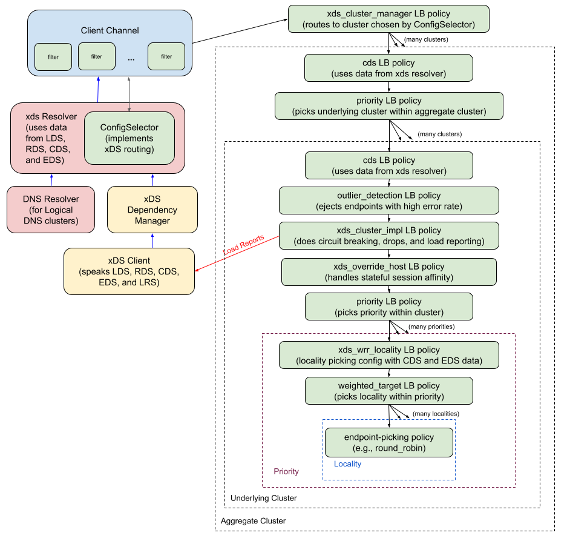

A75: xDS Aggregate Cluster Behavior Fixes
----
* Author(s): @markdroth
* Approver: @ejona86, @dfawley
* Status: {Draft, In Review, Ready for Implementation, Implemented}
* Implemented in: C-core
* Last updated: 2024-01-29
* Discussion at: https://groups.google.com/g/grpc-io/c/C1XAnRc2Z7E

## Abstract

Our original design for xDS aggregate clusters incorrectly assumed
that the intended behavior was for the LB policy to be configured at the
aggregate cluster layer, not at the underlying cluster layers.  This added
a lot of complexity.  It also forced us to impose a limitation that
features like stateful session affinity and outlier detection would work
only within a priority, rather than across all priorities in the cluster.
This design describes how we will correct these problems.

## Background

When we originally implemented xDS aggregate cluster
support in [gRFC A37][A37], we misunderstood how the feature
actually worked.  Our discussions of aggregate cluster behavior in
[envoyproxy/envoy#13134](https://github.com/envoyproxy/envoy/issues/13134)
assumed that the core idea of an aggregate cluster was that it
concatenated the priorities from the underlying clusters into a single
list, so that it could use a single LB policy defined at the aggregate
cluster layer to choose a priority from that combined list.  Note that
in Envoy, priorities are normally handled by the LB policy, so this would
have made sense as a way to use the normal logic for choosing a priority.

However, it turns out that aggregate clusters don't
actually define the LB policy in the aggregate cluster;
instead, the aggregate cluster uses a special [cluster-provided LB
policy](https://github.com/envoyproxy/envoy/blob/e556c237fc134fde8593c0f1ce13411455469c1b/api/envoy/config/cluster/v3/cluster.proto#L113)
that first chooses the underlying cluster and then delegates
to the LB policy of the underlying cluster.  This is covered in the [Envoy
documentation](https://www.envoyproxy.io/docs/envoy/latest/intro/arch_overview/upstream/aggregate_cluster#aggregate-cluster),
and you can see the Envoy implementation
of this aggregate cluster LB policy
[here](https://github.com/envoyproxy/envoy/blob/e556c237fc134fde8593c0f1ce13411455469c1b/source/extensions/clusters/aggregate/cluster.cc#L152).

This incorrectly-perceived requirement led us to a design in which each
of a cluster's priorities could have its configuration come from a
different underlying cluster.  This in turn meant that features like
outlier detection ([gRFC A50][A50]) and stateful session affinity
(gRFCs [A55] and [A60]) were designed to work only within a specific
priority rather than working across all priorities within a cluster.
This limitation is causing problems for stateful session affinity and
is likely a source of friction for outlier detection as well.

This design describes how we are going to change our aggregate cluster
implementation to solve these problems.  It also describes some changes
to the stateful session affinity design to support it working across
priorities.

### Related Proposals:
* [A37: xDS Aggregate and Logical DNS Clusters][A37]
* [A50: gRPC xDS Outlier Detection Support][A50]
* [A55: xDS-Based Stateful Session Affinity for Proxyless gRPC][A55]
* [A60: xDS-Based Stateful Session Affinity for Weighted Clusters][A60]
* [A56: Priority LB policy][A56]
* [A61: IPv4 and IPv6 Dualstack Backend Support][A61]
* [A74: xDS Config Tears (pending)][A74]

[A37]: A37-xds-aggregate-and-logical-dns-clusters.md
[A50]: A50-xds-outlier-detection.md
[A55]: A55-xds-stateful-session-affinity.md
[A56]: A56-priority-lb-policy.md
[A60]: A60-xds-stateful-session-affinity-weighted-clusters.md
[A61]: A61-IPv4-IPv6-dualstack-backends.md
[A74]: https://github.com/grpc/proposal/pull/404

## Proposal

There are two main parts to this proposal: aggregate cluster changes and
stateful session affinity changes.

### Aggregate Cluster Changes

Instead of representing an aggregate cluster as a single cluster whose
priorities come from different underlying clusters, we will instead
represent an aggregate cluster as an instance of a priority LB policy
([gRFC A56][A56]) where each child is a cds LB policy for the underlying
cluster.

This will allow us to move the outlier_detection, xds_cluster_impl, and
xds_override_host LB policies up above the priority policy that chooses
the priority within the cluster.  This will result in outlier detection
and stateful session affinity working across priorities within a cluster,
as they should.

The architecture for a non-aggregate cluster will now look like this:



[Link to SVG file](A75_graphics/grpc_client_architecture_non_aggregate.svg)

And the architecture for an aggregate cluster will now look like this:



[Link to SVG file](A75_graphics/grpc_client_architecture_aggregate.svg)

One important consequence of this change is that we will no longer be
getting the LB policy config from the aggregate cluster; instead, we
will use the LB policy configured in the underlying cluster.  However,
to avoid causing backward-compatibility problems, we will not require
the aggregate cluster to be configured with the CLUSTER_PROVIDED LB
policy the way that Envoy does; instead, we will simply ignore the LB
policy configured in the aggregate cluster.  This seems unlikely to
cause problems in practice, because Envoy's aggregate cluster
functionality probably doesn't work with anything except the
CLUSTER_PROVIDED LB policy anyway, so the LB policy in the aggregate
cluster probably doesn't provide any useful information.

The one case where this may be a problem is if there are existing
control planes being used with gRPC that set the LB policy differently
in the aggregate cluster vs. the underlying clusters and then expect the
LB policy in the aggregate cluster to be used.  In order to provide a
migration story for any such cases, we will support a temporary
mechanism to tell gRPC to use the LB policy in the aggregate cluster.
This will be enabled by setting the
`GRPC_XDS_AGGREGATE_CLUSTER_BACKWARD_COMPAT` environment variable to
`true`.  This mechanism will be supported for a couple of gRPC releases
but will be removed in the long run.

### Stateful Session Affinity Changes

In order to make SSA work across priorities, it is necessary to handle
the case where an endpoint moves between priorities.  For example, if an
endpoint was initially in priority 0 and is selected for a given session,
we want that session to continue to send traffic to that endpoint, even
if the endpoint moves to priority 1 and the priority policy continues to
send non-SSA traffic to priority 0.

Currently, the xds_override_host policy (see gRFCs [A55] and [A60])
expects the subchannels to be owned by its child policy in most cases.
The only case where it directly takes ownership of subchannels is if
they are in EDS health state DRAINING, since it filters those addresses
out of the list it passes down to the child policy and therefore does
not expect the child policy to create subchannels for those addresses.
We unconditionally retain the subchannels for all endpoints in state
DRAINING, even if they are not actually being used for a session, on the
assumption that we probably already had a connection to the endpoint,
and it's not that harmful to retain that connection until the endpoint
finishes draining and is removed from the EDS update, which should be
a relatively short amount of time.

However, now that the xds_override_host policy is being moved up above
the priority policy, the xds_override_host policy may not see subchannels
from its child policy for inactive priorities, because the priority
policy lazily creates its child policies (see [A56]).  Therefore, we
need to generalize handling of subchannels that are not owned by the
child policy such that it works for any endpoint, not just those in
state DRAINING.  And we need a mechanism to retain subchannels for only
those endpoints that are actually being used in a session, since we
don't want to hold on to connections for endpoints in a lower priority
once they are no longer needed.

To accomplish this, we will change the xds_override_host LB policy to
store a timestamp in each map entry indicating the last time the address
was used for a session.  We will then do a periodic sweep through the map
to unref any subchannel has not been used for a session in a sufficiently
long period of time, which will be configured via the `idle_timeout` field
in the CDS resource.

#### Reading the idle_timeout field in CDS

When validating the CDS resource, we will look at the
[`upstream_config`](https://github.com/envoyproxy/envoy/blob/9108a1457513cdad1881fc6177a008aa511ef242/api/envoy/config/cluster/v3/cluster.proto#L1182)
field:
- If the field is not present, we assume the default value for `idle_timeout`.
- If the field is present:
  - If the field does not contain a
    [`envoy.extensions.upstreams.http.v3.HttpProtocolOptions`](https://github.com/envoyproxy/envoy/blob/9108a1457513cdad1881fc6177a008aa511ef242/api/envoy/extensions/upstreams/http/v3/http_protocol_options.proto#L63)
    protobuf, we NACK.
  - Otherwise, we look at the
    [`common_http_protocol_options`](https://github.com/envoyproxy/envoy/blob/9108a1457513cdad1881fc6177a008aa511ef242/api/envoy/extensions/upstreams/http/v3/http_protocol_options.proto#L133)
    field:
    - If the field is not present, we assume the default value for
      `idle_timeout`.
    - If the field is present, we look at the
      [`idle_timeout`](https://github.com/envoyproxy/envoy/blob/9108a1457513cdad1881fc6177a008aa511ef242/api/envoy/config/core/v3/protocol.proto#L240)
      field:
      - If the field is unset, we assume the default value for
        `idle_timeout`.
      - Otherwise, as with all `google.protobuf.Duration` fields, we
        check the following:
        - If the `seconds` field is outside of the range [0, 315576000000],
          we NACK.
        - If the `nanos` field is outside of the range [0, 999999999],
          we NACK.
        - Otherwise, we use the specified value.

The `idle_timeout` defaults to 1 hour.

The XdsClient will return the `idle_timeout` value as a member of the
parsed CDS resource.

#### Changes in xds_override_host LB Policy

We will make the following changes in the xds_override_host policy:

- The xds_override_host policy will take ownership of any subchannel
  that the child policy does not own if needed for session affinity.
- Each entry in the subchannel map will contain a `last_used_time` field,
  which will indicate the last time at which the entry was used for a session.
  Note that this field will be updated only when the xds_override_host picker
  sees the attribute from the stateful session HTTP filter; if that filter
  is not present, then SSA is not being used for the request, and we do not
  need to retain ownership of the subchannel.
- The xds_override_host policy will have a timer that runs periodically
  to do a sweep over the subchannel map and unref any owned subchannel
  whose `last_used_time` is older than the `idle_timeout` value from the
  CDS resource.  The timer can initially be set for `idle_timeout`
  duration, and subsequent runs can dynamically determine when to run
  based on the `last_used_time` of the entries in the map, with a
  minimum of 5 seconds between runs to minimize overhead.
- When the child policy unrefs a subchannel it owns, if the entry's
  `last_used_time` is newer than the `idle_timeout`, the
  xds_override_host policy assumes ownership of the subchannel instead
  of deleting it.
- In the picker, when we iterate through the addresses in the cookie, if
  we do not find any entries with a subchannel is states READY, IDLE, or
  CONNECTING and we do find entries that do not have any subchannel, we
  will trigger creation of a subchannel for one of those entries.

The picker logic will now look like this (pseudo-code):

```
def Pick(pick_args):
  override_host_attribute = pick_args.call_attributes.get(attribute_key)
  if override_host_attribute is not None:
    entry_with_no_subchannel = None
    idle_subchannel = None
    found_connecting = False
    for address in override_host_attribute.cookie_address_list:
      entry = lb_policy.address_map[address]
      if (entry found AND
          entry.health_status is in policy_config.override_host_status):
        if entry.subchannel is set:
          if entry.subchannel.connectivity_state == READY:
            override_host_attribute.set_actual_address_list(entry.address_list)
            return entry.subchannel as pick result
          elif entry.subchannel.connectivity_state == IDLE:
            if idle_subchannel is None:
              idle_subchannel = entry.subchannel
          elif entry.subchannel.connectivity_state == CONNECTING:
            found_connecting = True
        else if entry_with_no_subchannel is None:
          entry_with_no_subchannel = entry
    # No READY subchannel found.  If we found an IDLE subchannel,
    # trigger a connection attempt and queue the pick until that attempt
    # completes.
    if idle_subchannel is not None:
      hop into control plane to trigger connection attempt for idle_subchannel
      return queue as pick result
    # No READY or IDLE subchannels.  If we found a CONNECTING
    # subchannel, queue the pick and wait for the connection attempt
    # to complete.
    if found_connecting:
      return queue as pick result
    # No READY, IDLE, or CONNECTING subchannels.  If we found an entry
    # with no subchannel, queue the pick and create a subchannel for
    # that entry.
    if entry_with_no_subchannel is not None:
      hop into control plane to create subchannel for entry_with_no_subchannel
      return queue as pick result
  # pick_args.override_addresses not set or did not find a matching subchannel,
  # so delegate to the child picker.
  result = child_picker.Pick(pick_args)
  if result.type == PICK_COMPLETE:
    entry = lb_policy.address_map[result.subchannel.address()]
    if entry found:
      override_host_attribute.set_actual_address_list(entry.address_list)
  return result
```

### Temporary environment variable protection

This design does not provide any new functionality that will be enabled
by external I/O, so no environment variable guard is necessary.

## Rationale

We considered implementing nested aggregate clusters as nested cds LB
policy instances, each with their own underlying priority policy.
However, since the XdsDependencyManager already needs to resolve the
aggregate cluster dependency graph to make sure the entire config is
loaded, it seemed fairly straightforward to pass down the flattened list
and deal with it all in a single layer.  Also, having nested priority
policies would have caused problems with the failover timers, where the
timer in the upper priority policy would fire before the lower priority
policy has had a chance to try all of its children.

## Implementation

C-core implementation:
- read connection idle_timeout field from CDS resource: https://github.com/grpc/grpc/pull/35395
- change subchannel management in xds_override_host LB policy: https://github.com/grpc/grpc/pull/35397
- aggregate cluster architecture change: https://github.com/grpc/grpc/pull/35313

The aggregate cluster changes will be implemented in Java, Go, and Node
in the future.  The stateful session affinity changes will be
implemented in those languages if/when we need to support stateful
session affinity in those languages.

## Open issues (if applicable)

N/A
