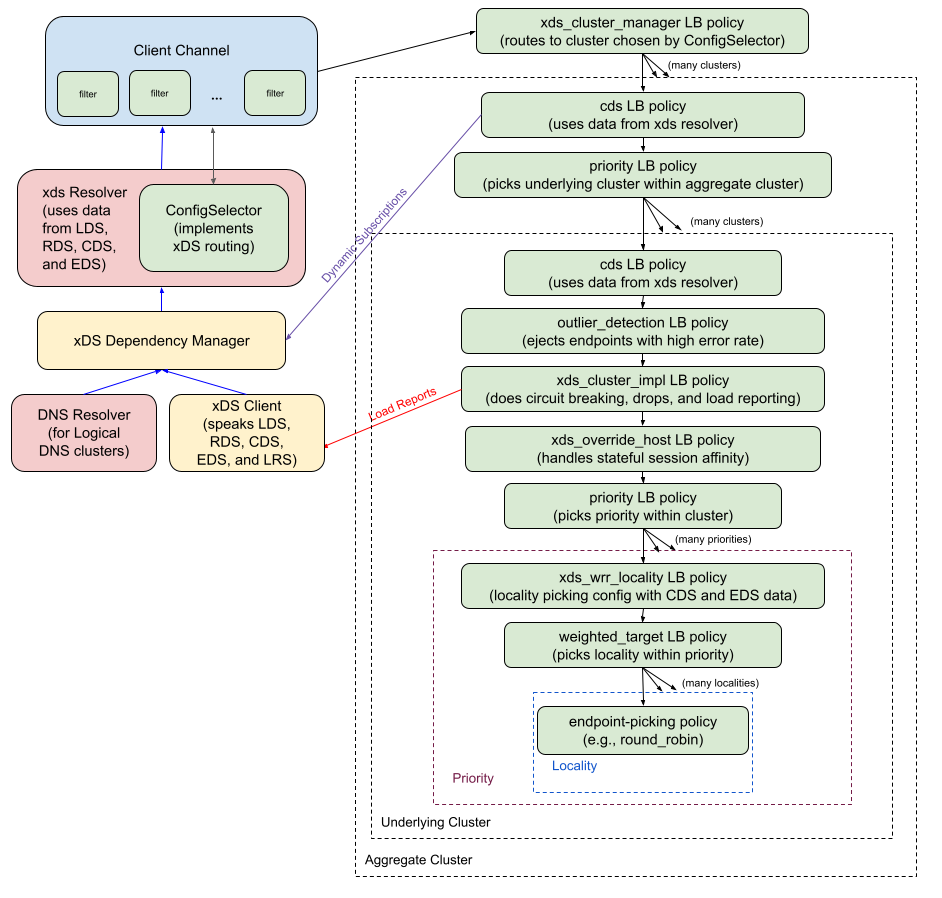

A75: xDS Aggregate Cluster Behavior Fixes
----
* Author(s): @markdroth
* Approver: @ejona86, @dfawley
* Status: {Draft, In Review, Ready for Implementation, Implemented}
* Implemented in: <language, ...>
* Last updated: 2023-12-13
* Discussion at: <google group thread> (filled after thread exists)

## Abstract

Our original design for xDS aggregate clusters incorrectly assumed
that the intended behavior was for the LB policy to be configured
at the aggregate cluster layer, not at the underlying cluster layers.
This added a lot of complexity.  It also forced us to impose a limitation
that features like stateful session affinity would work only within a
priority, rather than across all priorities in the cluster.  This design
describes how we will correct these problems.

## Background

When we originally implemented xDS aggregate cluster
support in [gRFC A37][A37], we misunderstood how the feature
actually worked.  Our discussions of aggregate cluster behavior in
[envoyproxy/envoy#13134](https://github.com/envoyproxy/envoy/issues/13134)
assumed that the core idea of an aggregate cluster was that it
concatenated the priorities from the underlying clusters into a single
list, so that it could use a single LB policy defined at the aggregate
cluster layer to choose a priority from that combined list.  Note that
in Envoy, priorities are normally handled by the LB policy, so this would
have made sense as a way to use the normal logic for choosing a priority.

However, it turns out that aggregate clusters don't
actually define the LB policy in the aggregate cluster;
instead, the aggregate cluster uses a special [cluster-provided LB
policy](https://github.com/envoyproxy/envoy/blob/e556c237fc134fde8593c0f1ce13411455469c1b/api/envoy/config/cluster/v3/cluster.proto#L113)
that first chooses the underlying cluster and then delegates
to the LB policy of the underlying cluster.  This is covered in the [Envoy
documentation](https://www.envoyproxy.io/docs/envoy/latest/intro/arch_overview/upstream/aggregate_cluster#aggregate-cluster),
and you can see the Envoy implementation
of this aggregate cluster LB policy
[here](https://github.com/envoyproxy/envoy/blob/e556c237fc134fde8593c0f1ce13411455469c1b/source/extensions/clusters/aggregate/cluster.cc#L152).

This incorrectly-perceived requirement led us to a design in which each
of a cluster's priorities could have its configuration come from a
different underlying cluster.  This in turn meant that features like
outlier detection ([gRFC A50][A50]) and stateful session affinity
(gRFCs [A55] and [A60]) were designed to work only within a specific
priority rather than working across all priorities within a cluster.
This limitation is causing problems for stateful session affinity and
is likely a source of friction for outlier detection as well.

This design describes how we are going to change our aggregate cluster
implementation to solve these problems.  It also describe some changes
to the stateful session affinity design to support it working across
priorities.

### Related Proposals: 
* [A37: xDS Aggregate and Logical DNS Clusters][A37]
* [A50: gRPC xDS Outlier Detection Support][A50]
* [A55: xDS-Based Stateful Session Affinity for Proxyless gRPC][A55]
* [A60: xDS-Based Stateful Session Affinity for Weighted Clusters][A60]
* [A56: Priority LB policy][A56]
* [A61: IPv4 and IPv6 Dualstack Backend Support][A61]
* [A74: xDS Config Tears (pending)][A74]

[A37]: A37-xds-aggregate-and-logical-dns-clusters.md
[A50]: A50-xds-outlier-detection.md
[A55]: A55-xds-stateful-session-affinity.md
[A56]: A56-priority-lb-policy.md
[A60]: A60-xds-stateful-session-affinity-weighted-clusters.md
[A61]: A61-IPv4-IPv6-dualstack-backends.md
[A74]: https://github.com/grpc/proposal/pull/404

## Proposal

There are two main parts to this proposal: aggregate cluster changes and
stateful session affinity changes.

### Aggregate Cluster Changes

Instead of representing an aggregate cluster as a single cluster whose
priorities come from different underlying clusters, we will instead
represent an aggregate cluster as an instance of a priority LB policy
([gRFC A56][A56]) where each child is a cds LB policy for the underlying
cluster.

This will allow us to move the outlier_detection, xds_cluster_impl, and
xds_override_host LB policies up above the priority policy that chooses
the priority within the cluster.  This will result in outlier detection
and stateful session affinity working across priorities within a cluster,
as they should.

The architecture for a non-aggregate cluster will now look like this:

[Link to SVG file](A75_graphics/grpc_client_architecture_non_aggregate.svg)

And the architecture for an aggregate cluster will now look like this:

[Link to SVG file](A75_graphics/grpc_client_architecture_aggregate.svg)

TODO: flesh this out:
- backwards compat story:
  - new behavior will ignore LB policy config in aggregate cluster, not
    require that it be set to CLUSTER_PROVIDED as in Envoy
    ==> another option would be to support CLUSTER_PROVIDED via the new
        LB policy config extension point rather than the old enum field.
        maybe we even stick with the legacy behavior if the enum is used?
        (but then we'd have to maintain it in the long run...)
  - for a few releases, will provide an env var to get the old behavior,
    as a transition mechanism in case of problems
- added optimization: xds_cluster_impl will get fields from XdsConfig
  passed down via attribute rather than getting them from JSON config

### Stateful Session Affinity Changes

TODO: new SSA behavior to handle endpoints in non-selected priorities
- all map entries record expiration time as now plus TTL
  (TTL is communicated from stateful session filter via the call attribute)
- when the child policy unrefs a subchannel and there are no other
  subchannels for that endpoint, we take ownership, even if it's not DRAINING
  (this may require storing pointers to the endpoint's other addresses?)
- if a cookie specifies an address for which we have no subchannel,
  create the subchannel
  (probably also need to then return that subchannel if the child policy
  requests it later?  maybe not -- subchannel pool will save us?)
- have a periodic timer that sweeps through the pool unreffing any subchannel
  that we own (not just wrapping the child) and whose expiration time is
  in the past

### Temporary environment variable protection

This design does not provide any new functionality that will be enabled
by external I/O, so no environment variable guard is necessary.

## Rationale

We considered implementing nested aggregate clusters as nested cds LB
policy instances, each with their own underlying priority policy.
However, since the XdsDependencyManager already needs to resolve the
aggregate cluster dependency graph to make sure the entire config is
loaded, it seemed fairly straightforward to pass down the flattened list
and deal with it all in a single layer.  Also, having nested priority
policies would have caused problems with the failover timers, where the
timer in the upper priority policy would fire before the lower priority
policy has had a chance to try all of its children.

## Implementation

Implemented in C-core in https://github.com/grpc/grpc/pull/35313.

The aggregate cluster changes will be implemented in Java, Go, and Node
in the future.  The stateful session affinity changes will be
implemented in those languages if/when we need to support stateful
session affinity in those languages.

## Open issues (if applicable)

N/A
