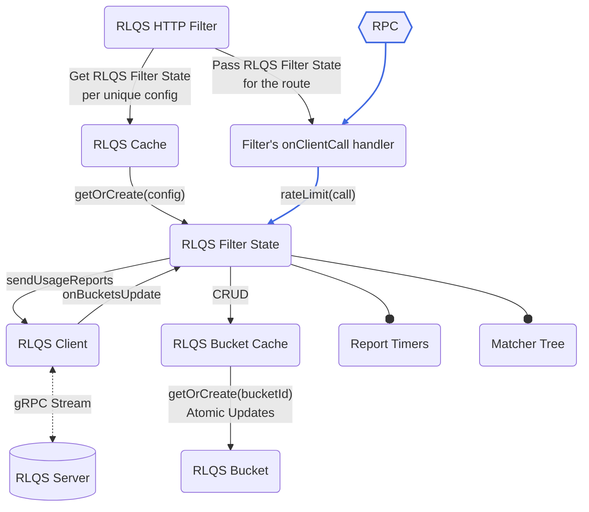
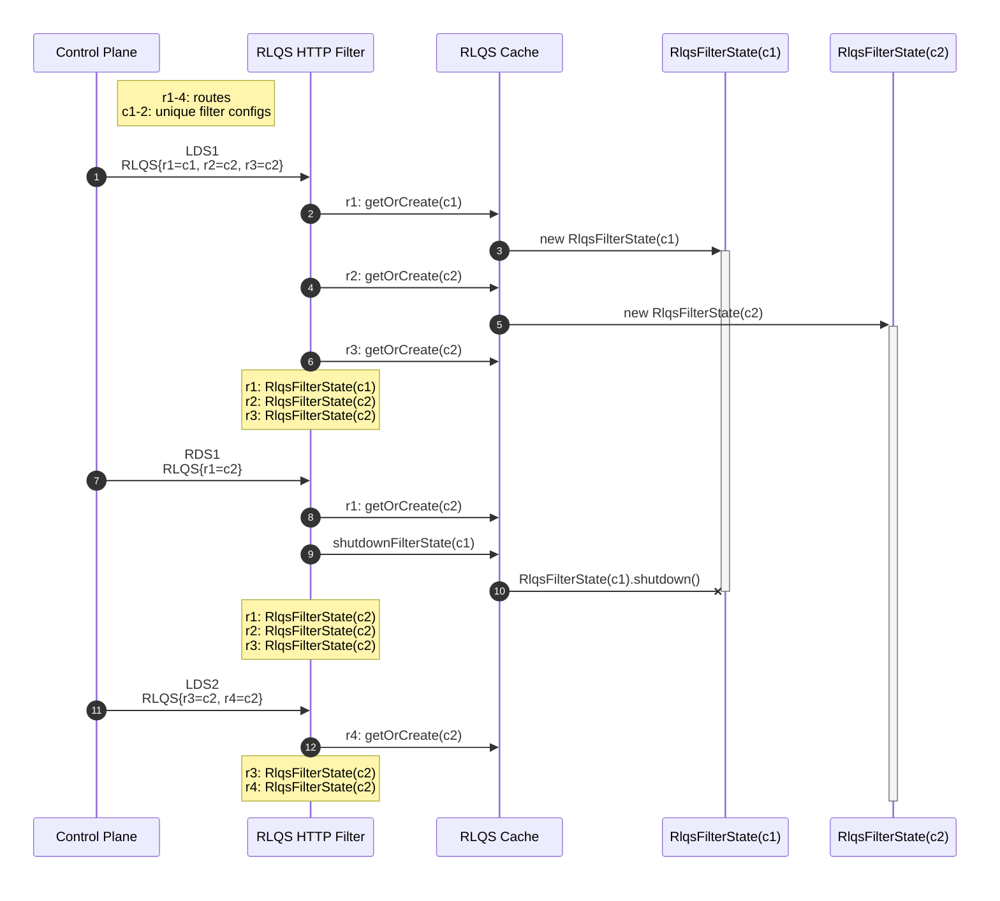

A77: xDS Server-Side Rate Limiting
======

* Author(s): Sergii Tkachenko (@sergiitk)
* Approver: Mark Roth (@markdroth)
* Status: In Review
* Implemented in:
* Last updated: 2024-11-04
* Discussion at: `TODO(sergiitk): <google group thread>`

## Abstract

We're adding support for global rate limiting to xDS-enabled gRPC servers. Users
will be able to configure per-time-unit quotas based on request metadata. Rate
Limit Quota Service will fairly distribute request quotas across participating
servers.

## Background

[Global rate limiting](https://www.envoyproxy.io/docs/envoy/latest/intro/arch_overview/other_features/global_rate_limiting)
allows mesh users to manage fair consumption of their services and prevent
misbehaving clients from overloading the services. We will
implement [quota-based rate limiting](https://www.envoyproxy.io/docs/envoy/latest/intro/arch_overview/other_features/global_rate_limiting#quota-based-rate-limiting),
where rate-limiting decisions are asynchronously offloaded
to [Rate Limiting Quota Service][rlqs_proto] (RLQS). Requests are grouped into
buckets based on their metadata, and gRPC servers periodically report bucket
usages. RLQS aggregates the data from different gRPC servers, and fairly
distributes the quota among them. This approach is best suited for
high-request-per-second applications, where a certain margin of error is
acceptable as long as expected average QPS is achieved.

To support RLQS, we'll need to implement several other xDS-related features,
which are covered in the proposal:

1. xDS Control Plane will provide RLQS connection details
   in [the filter config][rlqs_filter_proto] via [`GrpcService`] message.
2. Quota assignments will be configured
   via [`TokenBucket`](https://www.envoyproxy.io/docs/envoy/latest/api-v3/type/v3/token_bucket.proto)
   message.
3. RPCs will be matched into buckets using [Unified Matcher API].
4. One of the matching mechanisms will be [CEL](https://cel.dev/) (Common
   Expression Language).
5. RLQS filter state will persist across LDS/RDS updates using cache retention
   mechanism similar to the one implemented for [gRFC A83].

### Related Proposals:

* [A27: xDS-Based Global Load Balancing][gRFC A27]
* [A36: xDS-Enabled Servers][gRFC A36]
* [A39: xDS HTTP Filter Support][gRFC A39]
* [A41: xDS RBAC Support][gRFC A41]
* [A83: xDS GCP Authentication Filter][gRFC A83]

[gRFC A27]: A27-xds-global-load-balancing.md
[gRFC A41]: A41-xds-rbac.md
[gRFC A36]: A36-xds-for-servers.md
[gRFC A39]: A39-xds-http-filters.md
[gRFC A83]: A83-xds-gcp-authn-filter.md

[`GrpcService`]: https://www.envoyproxy.io/docs/envoy/latest/api-v3/config/core/v3/grpc_service.proto
[`GrpcService.GoogleGrpc`]: https://www.envoyproxy.io/docs/envoy/latest/api-v3/config/core/v3/grpc_service.proto#envoy-v3-api-msg-config-core-v3-grpcservice-googlegrpc
[Unified Matcher API]: https://www.envoyproxy.io/docs/envoy/latest/intro/arch_overview/advanced/matching/matching_api.html
[Envoy CEL environment]: https://www.envoyproxy.io/docs/envoy/latest/intro/arch_overview/advanced/attributes

[rlqs_proto]: https://www.envoyproxy.io/docs/envoy/latest/api-v3/service/rate_limit_quota/v3/rlqs.proto.html
[rlqs_filter_proto]: https://www.envoyproxy.io/docs/envoy/latest/api-v3/extensions/filters/http/rate_limit_quota/v3/rate_limit_quota.proto

## Proposal

### RLQS Components Overview

The diagram below shows the conceptual components of the RLQS Filter. Note that
the actual implementation may vary depending on the language.



##### RLQS HTTP Filter

The filter parses the config, combines LDS filter config with RDS overrides, and
generates the `onClientCall` handlers (aka interceptors in Java and Go, and
filters in C++).

##### RLQS Cache

RLQS Cache persists across LDS/RDS updates. It maps unique filter configs to
RLQS Filter State instances, and provides the thread safety for creating and
accessing them. Each unique filter config generates a unique RLQS Filter state,
a 1:1 mapping.

##### RLQS Filter State

RLQS Filter State contains the business logic for rate limiting, and the current
state of rate limit assignments per bucket. RLQS Filter State is what's passed
to the `onCallHandler`. It exposes the public "`rateLimit()`" method, which
takes request metadata as an argument.

##### Matching

RLQS Filter State evaluates the metadata against the matcher tree to match the
request into a bucket. The Bucket holds the Rate Limit Quota assigned by the
RLQS server (f.e. 100 requests per minute), and aggregates the number of
requests it allowed/denied. This information is used to make the rate limiting
decision.

##### Reporting

The aggregated number of requests is reported to the RLQS server at configured
intervals. The report action is triggered by the Report Timers. RLQS Client
manages a gRPC stream to the RLQS server. It's used by the filter state to send
periodic bucket usage reports, and to receive new rate limit quota assignments
to the buckets.

### Connecting to RLQS Control Plane

xDS Control Plane provides RLQS connection details in [`GrpcService`] message (
already supported by Envoy). `GrpcService` supports two modes: 

1. `GrpcService.EnvoyGrpc`, Envoy's minimal custom gRPC client implementation.
2. [`GrpcService.GoogleGrpc`], regular gRPC-cpp client.

For obvious reasons, we'll only support the `GoogleGrpc` mode.

#### Security Considerations

In [`GrpcService.GoogleGrpc`], xDS Control Plane provides the target
URI, `channel_credentials`, and `call_credentials`. If the xDS Control Plane is
compromised, the attacker could configure the xDS clients to talk to other
malicious Control Plane, leading to such potential exploits as:

1. Leaking customer's Application Default Credentials OAuth token.
2. Causing MalOut/DDoS by sending bad data from the compromised RLQS (f.e. set
   rate limit policy to `ALLOW_ALL`/`DENY_ALL`).

To prevent that, we'll introduce the allow-list to the bootstrap file introduced
in [gRFC A27]. This allow-list will be a map from the fully-qualified server
target URI to an object containing channel credentials to use.

```javascript
// The allowlist of Control Planes allowed to be configured via xDS.
"allowed_grpc_services": {
  // The key is fully-qualified server URI.
  "dns:///xds.example.org:443": {
    // The value is an object containing "channel_creds".
    "channel_creds": [
      // The format is identical to xds_servers.channel_creds.
      { 
        "type": "string containing channel cred type",
        "config": "optional JSON object containing config for the type"
      }
    ]
  }
}
```

When xDS Control Plane configures connection to another control plane
via [`GrpcService.GoogleGrpc`] message, we'll inspect the allow-list for the
matching target URI.

1. If target URI is not present, we don't create the connection to the requested
   Control Plane, and NACK the xDS resource.
2. If target URI is present, we create the connection to the requested Control
   Plane using the channel credentials provided in the bootstrap file. Transport
   security configuration provided by the TD is ignored.

> [!IMPORTANT]
> This solution is not specific to RLQS, and should be used with any
> other Control Planes configured via [`GrpcService`] message.

### Unified Matcher API

RPCs will be matched into buckets using [Unified Matcher API] — an adaptable
framework that can be used in any xDS component that needs matching features.

Envoy provides two syntactically equivalent Unified Matcher
definitions: [`envoy.config.common.matcher.v3.Matcher`](https://github.com/envoyproxy/envoy/blob/e3da7ebb16ad01c2ac7662758a75dba5cdc024ce/api/envoy/config/common/matcher/v3/matcher.proto)
and [`xds.type.matcher.v3.Matcher`](https://github.com/cncf/xds/blob/b4127c9b8d78b77423fd25169f05b7476b6ea932/xds/type/matcher/v3/matcher.proto).
We will only support the latter, which is the preferred version for all new APIs
using Unified Matcher.

For RLQS, Unified Matcher tree will be provided in the filter config. Evaluating
the tree against RPC metadata will yield `RateLimitQuotaBucketSettings`, which
contains the information needed to associate the RPC with `bucket_id` and the
default rate limiting configuration.

In this iteration the following Unified Mather extensions will be supported:

1. Inputs:
    1. [`HttpRequestHeaderMatchInput`](https://www.envoyproxy.io/docs/envoy/latest/api-v3/type/matcher/v3/http_inputs.proto#type-matcher-v3-httprequestheadermatchinput)
    2. [`HttpAttributesCelMatchInput`](https://www.envoyproxy.io/docs/envoy/latest/xds/type/matcher/v3/http_inputs.proto#envoy-v3-api-msg-xds-type-matcher-v3-httpattributescelmatchinput)
2. Custom Matchers:
    1. [`CelMatcher`](https://www.envoyproxy.io/docs/envoy/latest/xds/type/matcher/v3/cel.proto.html)

### CEL Integration

We will support request metadata matching via CEL expressions. Only Canonical
CEL and only checked expressions will be supported (`cel.expr.CheckedExpr`).

CEL evaluation environment is a set of available variables and extension
functions in a CEL program. We will match [Envoy CEL environment].

#### Supported CEL Functions

Similar to Envoy, we will
support [standard CEL functions](https://github.com/google/cel-spec/blob/c629b2be086ed6b4c44ef4975e56945f66560677/doc/langdef.md#standard-definitions)
except comprehension-style macros.

| CEL Method                                         | Description                                                                                   |
|----------------------------------------------------|-----------------------------------------------------------------------------------------------|
| `size(x)`                                          | Returns the length of a container x (string, bytes, list, map).                               |
| `x.matches(y)`                                     | Returns true if the string x is partially matched by the specified [RE2][RE2_wiki] pattern y. |
| `x.contains(y)`                                    | Returns true if the string x contains the substring y.                                        |
| `x.startsWith(y)`                                  | Returns true if the string x begins with the substring y.                                     |
| `x.endsWith(y)`                                    | Returns true if the string x ends with the substring y.                                       |
| `timestamp(x)`, `timestamp.get*(x)`, `duration`    | Date/time functions.                                                                          |
| `in`, `[]`                                         | Map/list indexing.                                                                            |
| `has(m.x)`                                         | (macro) Returns true if the map `m` has the string `"x"` as a key.                            |
| `int`, `uint`, `double`, `string`, `bytes`, `bool` | Conversions and identities.                                                                   |
| `==`, `!=`, `>`, `<`, `<=`, `>=`                   | Comparisons.                                                                                  |
| `or`, `&&`, `+`, `-`, `/`, `*`, `%`, `!`           | Basic functions.                                                                              |

[RE2_wiki]: https://en.wikipedia.org/wiki/RE2_(software)

#### Supported CEL Variables

For RLQS, only the `request` variable is supported in CEL expressions. We will
adapt [Envoy's Request Attributes](https://www.envoyproxy.io/docs/envoy/latest/intro/arch_overview/advanced/attributes#request-attributes)
for gRPC.

| Attribute           | Type                  | gRPC source                  | Envoy Description                                           |
|---------------------|-----------------------|------------------------------|-------------------------------------------------------------|
| `request.path`      | `string`              | Full method name<sup>1</sup> | The path portion of the URL.                                |
| `request.url_path`  | `string`              | Same as `request.path`       | The path portion of the URL without the query string.       |
| `request.host`      | `string`              | Authority<sup>2</sup>        | The host portion of the URL.                                |
| `request.scheme`    | `string`              | Not set                      | The scheme portion of the URL.                              |
| `request.method`    | `string`              | `POST`<sup>3</sup>           | Request method.                                             |
| `request.headers`   | `map<string, string>` | `metadata`<sup>4</sup>       | All request headers indexed by the lower-cased header name. |
| `request.referer`   | `string`              | `metadata["referer"]`        | Referer request header.                                     |
| `request.useragent` | `string`              | `metadata["user-agent"]`     | User agent request header.                                  |
| `request.time`      | `timestamp`           | Not set                      | Time of the first byte received.                            |
| `request.id`        | `string`              | `metadata["x-request-id"]`   | Request ID corresponding to `x-request-id` header value     |
| `request.protocol`  | `string`              | Not set                      | Request protocol.                                           |
| `request.query`     | `string`              | `""`                         | The query portion of the URL.                               |

##### Footnotes

**<sup>1</sup> `request.path`**

* CPP: `metadata[":path"]`
* Go: `grpc.Method(ctx)`
* Java: `"/" + serverCall.getMethodDescriptor().getFullMethodName()`

**<sup>2</sup> `request.host`**

* CPP, Go: `metadata[":authority"]`
* Java: `serverCall.getAuthority()`

**<sup>3</sup> `request.method`**\
Hard-coded to `"POST"` if unavailable and a code audit confirms the server
denies requests for all other method types.

**<sup>4</sup> `request.headers`**\
As defined in [gRFC A41], "header" field.

##### Implementation

For performance reasons, CEL variables should be resolved on demand. CEL Runtime
provides the different variable resolving approaches based on the language:

* CPP: [`BaseActivation::FindValue()`](https://github.com/google/cel-cpp/blob/9310c4910e598362695930f0e11b7f278f714755/eval/public/base_activation.h#L35)
* Go: [`Activation.ResolveName(string)`](https://github.com/google/cel-go/blob/3f12ecad39e2eb662bcd82b6391cfd0cb4cb1c5e/interpreter/activation.go#L30)
* Java: [`CelVariableResolver`](https://javadoc.io/doc/dev.cel/runtime/0.6.0/dev/cel/runtime/CelVariableResolver.html)

### Persistent Filter Cache

RLQS Filter State holds the bucket usage data, report timers and the
bidirectional stream to the RLQS server. To prevent the loss of state across
LDS/RDS updates, RLQS filter will require a cache retention mechanism similar to
the one implemented for [gRFC A83].

The scope of each RLQS Filter Cache instance will be per server instance (same
scope as the filter chain) and per filter name.

RLQS implementations will provide a mechanism for new instances of the filter to
retain the cache from previous instances. There may be multiple instances of the
RLQS Filter State, each one mapped to a unique filter config generated from LDS
config, and RDS overrides. Consider the following example that demonstrates the
lifecycle of RLQS Filter Cache.



**LDS 1**

In this example, the RLQS filter is configured for three routes: `r1`, `r2`,
and `r3`. Each unique config generates a unique RLQS Filter
State: `RlqsFilterState(c1)` for the config `c1`, and `RlqsFilterState(c2)` for
the config `c2`. After processing the first LDS update, we've generated
onCallHandlers for three routes:

1. `r1`, referencing `RlqsFilterState(c1)`.
2. `r2`, referencing `RlqsFilterState(c2)`.
3. `r3`, also referencing `RlqsFilterState(c2)`.

**RDS 1**

RDS 1 updates RLQS config for the route `r1` so it's identical to config `c2`.
We retrieve `RlqsFilterState(c2)` from the RLQS Cache and generate new
onCallHandlers for route `r2`. `RlqsFilterState(c1)` is no longer referenced by
any onCallHandler, and can be destroyed with all associated resources.

**LDS 2**

LDS 2 update removes `r1` and `r2`, and adds new route r4 with the config
identical to `c2`. While onCallHandlers for routes `r1` and `r2` are
destroyed, `RlqsFilterState(c2)` is still used by two onCallHandlers, so it's
preserved in RLQS Cache.

##### Future considerations

With this proposal, the filter state is lost if change is made to the filter
config, including updates to inconsequential fields such as deny response
status. Additional logic can be introduced to handle updates to such fields
while preserving the filter state.

### Multithreading

There are several mutex-synchronized operations executed in
latency-sensitive `onCallHandler`:

1. Inserting/reading a bucket from the bucket cache using `bucket_id`. Note
   that `bucket_id` is represented as a `Map<String, String>`, which may
   introduce complexities in efficient cache sharding for certain programming
   languages.
2. Incrementing `num_request_allowed`/`num_request_denied` bucket counters.

Each gRPC implementation needs to consider what synchronization primitives are
available in their language to minimize the thread lock time.

### Code Samples

> [!NOTE]
> Not a reference implementation. Only for flow illustration purposes.

#### On Call Handler
```java
final RlqsFilterState filterState = rlqsCache.getOrCreateFilterState(config);

return new ServerInterceptor() {
  @Override
  public <ReqT, RespT> Listener<ReqT> interceptCall(
      ServerCall<ReqT, RespT> call,
      Metadata headers, ServerCallHandler<ReqT, RespT> next) {
    // TODO: handle filter_enabled and filter_enforced

    // RlqsClient matches the request into a bucket,
    // and returns the rate limiting result.
    RlqsRateLimitResult result =
        filterState.rateLimit(HttpMatchInput.create(headers, call));

    // Allowed.
    if (result.isAllowed()) {
      return next.startCall(call, headers);
    }
    // Denied: fail the call with given Status.
    call.close(
      result.denyResponse().status(),
      result.denyResponse().headersToAdd());
    return new ServerCall.Listener<ReqT>(){};
  }
};
```

#### Bucket Matching
```java
public RlqsRateLimitResult rateLimit(HttpMatchInput input) {
  // Perform request matching. The result is RlqsBucketSettings.
  RlqsBucketSettings bucketSettings = bucketMatchers.match(input);
  // BucketId may be dynamic (f.e. based on headers).
  RlqsBucketId bucketId = bucketSettings.bucketIdForRequest(input);

  RlqsBucket bucket = bucketCache.getOrCreate(bucketId, bucketSettings, this::onNewBucket);
  return bucket.rateLimit();
}

private void onNewBucket(RlqsBucket newBucket) {
  // The report for the first RPC is sent immediately.
  scheduleImmediateReport(newBucket);
  registerReportTimer(newBucket.getReportingInterval());
}
```


### Temporary environment variable protection

During initial development, this feature will be enabled via
the `GRPC_EXPERIMENTAL_XDS_ENABLE_RLQS` environment variable. This environment
variable protection will be removed once the feature has proven stable.

## Rationale

#### Alternative protocol

[Rate Limiting Service (RLS)](https://www.envoyproxy.io/docs/envoy/latest/configuration/http/http_filters/rate_limit_filter)
is another Global Rate Limiting solution supported by Envoy. While it's best
suited for precise cases, where even a single request over the limit must be
throttled, this approach performs synchronous (blocking) per-HTTP-request rate
limit check.

#### xDS-configured Control Plane Trust

The problem with a compromised xDS Control Plane configuring a connection to a
malicious RLQS server may be solved holistically by signing xDS messages
cryptographically. This feature would solve multiple problems in the same class,
but it's out-of-scope of RLQS.

The proposed solution with the change to the bootstrap file was designed to be
compatible with such future protocol extension.

## Implementation

* The initial implementation will be in Java.
* C-core, Python, Go are TBD.
