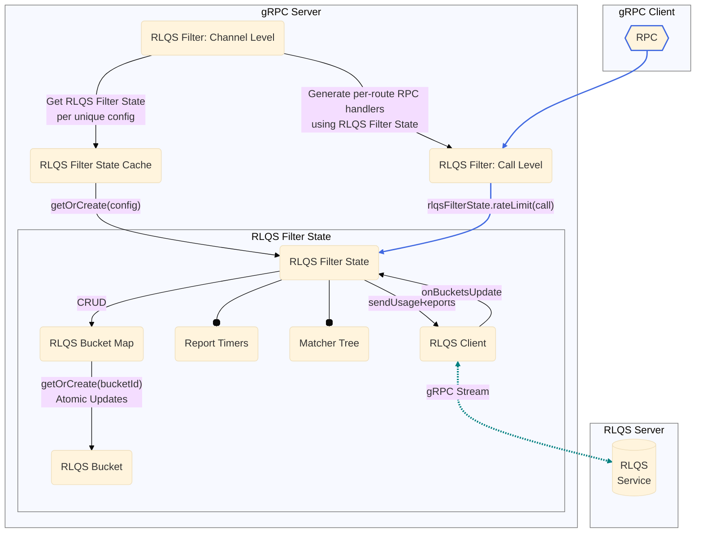

A77: xDS Server-Side Rate Limiting
======

* Author(s): Sergii Tkachenko (@sergiitk)
* Approver: Mark Roth (@markdroth)
* Status: In Review
* Implemented in:
* Last updated: 2025-10-03
* Discussion at:
  - [ ] TODO(sergiitk): insert google group thread

## Abstract

We're adding support for global rate limiting to xDS-enabled gRPC servers. Users
will be able to configure per-time-unit quotas based on request metadata. Rate
Limit Quota Service will fairly distribute request quotas across participating
servers.

## Background

[Global rate limiting](https://www.envoyproxy.io/docs/envoy/latest/intro/arch_overview/other_features/global_rate_limiting)
allows mesh users to manage fair consumption of their services and prevent
misbehaving clients from overloading the services. We will implement
[quota-based rate limiting](https://www.envoyproxy.io/docs/envoy/latest/intro/arch_overview/other_features/global_rate_limiting#quota-based-rate-limiting),
where rate-limiting decisions are asynchronously offloaded to
[Rate Limiting Quota Service][rlqs_proto] (RLQS). Requests are grouped
into buckets based on their metadata, and gRPC servers periodically report
bucket usages. RLQS aggregates the data from different gRPC servers, and fairly
distributes the quota among them. This approach is best suited for
high-request-per-second applications, where a certain margin of error is
acceptable as long as expected average QPS is achieved.

To support RLQS, we'll need to implement several other xDS-related features,
which are covered in the proposal:

1.  xDS Control Plane will provide RLQS connection details in
    [the filter config][RateLimitQuotaFilterConfig] via GrpcService message as
    described in [A102].
2.  Quota assignments will be configured via [`TokenBucket`] message.
3.  RPCs will be matched into buckets using [Unified Matcher API].
4.  One of the matching mechanisms will be [CEL](https://cel.dev/) (Common
    Expression Language).
5.  RLQS Filter State will persist across LDS/RDS updates using cache retention
    mechanism described in [A83].

### Related Proposals

* [gRFC A27: xDS-Based Global Load Balancing][A27]
* [gRFC A36: xDS-Enabled Servers][A36]
* [gRFC A39: xDS HTTP Filter Support][A39]
* [gRFC A41: xDS RBAC Support][A41]
* [gRFC A83: xDS GCP Authentication Filter][A83]
* [gRFC A102: xDS GrpcService Support][A102]

[A27]: A27-xds-global-load-balancing.md
[A41]: A41-xds-rbac.md
[A36]: A36-xds-for-servers.md
[A39]: A39-xds-http-filters.md
[A83]: A83-xds-gcp-authn-filter.md
[A102]: https://github.com/grpc/proposal/pull/510
[G1]: G1-true-binary-metadata.md

[RateLimitQuotaFilterConfig]: #ratelimitquotafilterconfig
[RateLimitQuotaOverride]: #ratelimitquotaoverride
[Config: Bucket Matchers]: #config-bucket-matchers
[Config: `RateLimitQuotaBucketSettings`]: #config-ratelimitquotabucketsettings
[Config: `RateLimitStrategy`]: #config-ratelimitstrategy
[Config: `HeaderValueOption`]: #config-headervalueoption
[Config: `RuntimeFractionalPercent`]: #config-runtimefractionalpercent

[RLQS xDS HTTP Filter: Channel Level]: #rlqs-xds-http-filter-channel-level
[RLQS Buckets and Multithreading]: #rlqs-buckets-and-multithreading
[Connecting to RLQS Control Plane]: #connecting-to-rlqs-control-plane

[Unified Matcher API]: https://www.envoyproxy.io/docs/envoy/latest/intro/arch_overview/advanced/matching/matching_api.html
[Unified Matcher API Support]: #unified-matcher-api-support
[Unified Matcher: Filter Integration]: #unified-matcher-filter-integration
[Unified Matcher: Input Extensions]: #unified-matcher-input-extensions
[Unified Matcher: Matching Extensions]: #unified-matcher-matching-extensions
[Unified Matcher: `Matcher`]: #unified-matcher-matcher
[Unified Matcher: `OnMatch`]: #unified-matcher-onmatch
[Unified Matcher: `MatcherList`]: #unified-matcher-matcherlist
[Unified Matcher: `MatcherTree`]: #unified-matcher-matchertree
[Unified Matcher: `HttpRequestHeaderMatchInput`]: #unified-matcher-httprequestheadermatchinput
[Unified Matcher: `HttpAttributesCelMatchInput`]: #unified-matcher-httpattributescelmatchinput
[Unified Matcher: `StringMatcher`]: #unified-matcher-stringmatcher
[Unified Matcher: `CelMatcher`]: #unified-matcher-celmatcher

[`cel.expr.CheckedExpr`]: https://github.com/google/cel-spec/blob/master/proto/cel/expr/checked.proto
[CEL Integration]: #cel-integration
[CEL Runtime Restrictions]: #cel-runtime-restrictions
[Supported CEL Variables]: #supported-cel-variables

[On Data Plane RPC]: #on-data-plane-rpc
[On RLQS Server Response]: #on-rlqs-server-response
[On Report Timers]: #on-report-timers
[On Sending Usage Reports]: #on-sending-usage-reports

[`TokenBucket`]: https://github.com/envoyproxy/envoy/blob/7ebdf6da0a49240778fd6fed42670157fde371db/api/envoy/type/v3/token_bucket.proto
[`TypedExtensionConfig`]: https://github.com/cncf/xds/blob/b4127c9b8d78b77423fd25169f05b7476b6ea932/xds/core/v3/extension.proto#L14

[gRPC Status Codes]: https://grpc.github.io/grpc/core/md_doc_statuscodes.html
[`google.rpc.Status`]: https://github.com/googleapis/googleapis/blob/7a87bf05880470b360f42e2b7f9ff5b28fa6cbe0/google/rpc/status.proto
[`google.protobuf.Duration`]: https://developers.google.com/protocol-buffers/docs/reference/google.protobuf#google.protobuf.Duration

[rlqs_proto]: https://github.com/envoyproxy/envoy/blob/7ebdf6da0a49240778fd6fed42670157fde371db/api/envoy/service/rate_limit_quota/v3/rlqs.proto

## Proposal

### Filter Configuration

The RLQS Filter API is defined in
[rate_limit_quota.proto](https://github.com/envoyproxy/envoy/blob/7ebdf6da0a49240778fd6fed42670157fde371db/api/envoy/extensions/filters/http/rate_limit_quota/v3/rate_limit_quota.proto).

#### `RateLimitQuotaFilterConfig`

We will support the following fields in the
[`RateLimitQuotaFilterConfig`](https://github.com/envoyproxy/envoy/blob/7ebdf6da0a49240778fd6fed42670157fde371db/api/envoy/extensions/filters/http/rate_limit_quota/v3/rate_limit_quota.proto#L37)
message:

-   [`rlqs_server`](https://github.com/envoyproxy/envoy/blob/7ebdf6da0a49240778fd6fed42670157fde371db/api/envoy/extensions/filters/http/rate_limit_quota/v3/rate_limit_quota.proto#L39):
    This field must be present. Inside of it, GrpcService as described in
    [Connecting to RLQS Control Plane] and [A102].
-   [`domain`](https://github.com/envoyproxy/envoy/blob/7ebdf6da0a49240778fd6fed42670157fde371db/api/envoy/extensions/filters/http/rate_limit_quota/v3/rate_limit_quota.proto#L44):
    This field must be present and non-empty.
-   [`bucket_matchers`](https://github.com/envoyproxy/envoy/blob/7ebdf6da0a49240778fd6fed42670157fde371db/api/envoy/extensions/filters/http/rate_limit_quota/v3/rate_limit_quota.proto#L115):
    This field must be present. Inside of it, there must be a valid matchers
    structure as described in [Config: Bucket Matchers].
-   [`filter_enabled`](https://github.com/envoyproxy/envoy/blob/7ebdf6da0a49240778fd6fed42670157fde371db/api/envoy/extensions/filters/http/rate_limit_quota/v3/rate_limit_quota.proto#L121):
    Specifies the fraction of requests for which the rate limiting is enabled.
    When not present, the filter is enabled for all requests (100%). Otherwise,
    the fraction is determined from [Config: `RuntimeFractionalPercent`].
-   [`filter_enforced`](https://github.com/envoyproxy/envoy/blob/7ebdf6da0a49240778fd6fed42670157fde371db/api/envoy/extensions/filters/http/rate_limit_quota/v3/rate_limit_quota.proto#L132):
    Specifies the fraction of requests for which the rate limiting is enforced.
    When not present, the filter is enforced for all requests (100%). Otherwise,
    the fraction is determined from [Config: `RuntimeFractionalPercent`].
-   [`request_headers_to_add_when_not_enforced`](https://github.com/envoyproxy/envoy/blob/7ebdf6da0a49240778fd6fed42670157fde371db/api/envoy/extensions/filters/http/rate_limit_quota/v3/rate_limit_quota.proto#L137):
    If present, must be a list of [Config: `HeaderValueOption`]. Must not
    contain more than 10 items.

#### `RateLimitQuotaOverride`

We will support the following fields in the
[`RateLimitQuotaOverride`](https://github.com/envoyproxy/envoy/blob/7ebdf6da0a49240778fd6fed42670157fde371db/api/envoy/extensions/filters/http/rate_limit_quota/v3/rate_limit_quota.proto#L143)
message:

-   [`domain`](https://github.com/envoyproxy/envoy/blob/7ebdf6da0a49240778fd6fed42670157fde371db/api/envoy/extensions/filters/http/rate_limit_quota/v3/rate_limit_quota.proto#L44):
    If non-empty, overrides the domain value provided on the less specific
    definition. This value overrides the `domain` specified in the channel-level
    filter configuration.
-   [`bucket_matchers`](https://github.com/envoyproxy/envoy/blob/7ebdf6da0a49240778fd6fed42670157fde371db/api/envoy/extensions/filters/http/rate_limit_quota/v3/rate_limit_quota.proto#L115):
    If present, this field must contain a valid matchers structure as described
    in [Config: Bucket Matchers]. It fully overrides the `bucket_matchers`
    provided of the less specific definition.

#### Config: Bucket Matchers

RPCs are matched into buckets using the [Unified Matcher API] — an adaptable
framework for xDS components requiring matching features. For details on general
parsing and validation of the Unified Matcher, see
[Unified Matcher API Support].

The `bucket_matchers` field in the filter config will contain a Unified Matcher
restricted to the protocol-specific types, packed as a [`TypedExtensionConfig`].

Evaluating the tree against RPC metadata yields
[Config: `RateLimitQuotaBucketSettings`], which contains the information needed
to associate the RPC with `bucket_id` and the default rate limiting
configuration.

Filter-specific Unified Matcher configuration per
[Unified Matcher: Filter Integration]:

-   Supported protocol-specific actions:
    1.  [Config: `RateLimitQuotaBucketSettings`].
-   Supported [Unified Matcher: Input Extensions]:
    1.  [Unified Matcher: `HttpRequestHeaderMatchInput`].
    2.  [Unified Matcher: `HttpAttributesCelMatchInput`].
-   Supported [Unified Matcher: Matching Extensions].
    1.  [Unified Matcher: `StringMatcher`], input effectively restricted to
        `HttpRequestHeaderMatchInput`.
    1.  [Unified Matcher: `CelMatcher`], input effectively restricted to
        `HttpAttributesCelMatchInput`.
-   Filter-specific default no-match behavior:
    -   The RPC is allowed by default and not reported to the RLQS server.

Any other types are considered invalid and will result in gRPC NACKing the xDS
resource.

#### Config: `RateLimitQuotaBucketSettings`

We will support the following fields in the
[`RateLimitQuotaBucketSettings`](https://github.com/envoyproxy/envoy/blob/7ebdf6da0a49240778fd6fed42670157fde371db/api/envoy/extensions/filters/http/rate_limit_quota/v3/rate_limit_quota.proto#L169)
message:

-   [`bucket_id_builder`](https://github.com/envoyproxy/envoy/blob/7ebdf6da0a49240778fd6fed42670157fde371db/api/envoy/extensions/filters/http/rate_limit_quota/v3/rate_limit_quota.proto#L348):
    If present, must be a valid `BucketIdBuilder` message. This is used to
    construct a `BucketId` for each request, which may involve dynamic values
    from request metadata. If not set, requests are not reported to the RLQS
    server and are handled according to `no_assignment_behavior`.
    -   `bucket_id_builder`: A map from string to
        [`ValueBuilder`](https://github.com/envoyproxy/envoy/blob/7ebdf6da0a49240778fd6fed42670157fde371db/api/envoy/extensions/filters/http/rate_limit_quota/v3/rate_limit_quota.proto#L265).
        Must contain at least one entry. In addition to the specification, gRPC
        will restrict the total number of key-value pairs to 30.
        -   `ValueBuilder` can be a static
            [`string_value`](https://github.com/envoyproxy/envoy/blob/7ebdf6da0a49240778fd6fed42670157fde371db/api/envoy/extensions/filters/http/rate_limit_quota/v3/rate_limit_quota.proto#L272)
            or a dynamic
            [`custom_value`](https://github.com/envoyproxy/envoy/blob/7ebdf6da0a49240778fd6fed42670157fde371db/api/envoy/extensions/filters/http/rate_limit_quota/v3/rate_limit_quota.proto#L276).
            For `custom_value`, the initial implementation will support a
            [`TypedExtensionConfig`] containing a
            [Unified Matcher: `HttpRequestHeaderMatchInput`].
-   [`reporting_interval`](https://github.com/envoyproxy/envoy/blob/7ebdf6da0a49240778fd6fed42670157fde371db/api/envoy/extensions/filters/http/rate_limit_quota/v3/rate_limit_quota.proto#L398):
    Must be present. A [`google.protobuf.Duration`] specifying the interval for
    reporting quota usage. Must be greater than 100ms. Note that gRPC will apply
    a best-effort approach to report at the configured interval, and may report
    earlier or later in certain situations. See [On Report Timers] for details.
-   [`deny_response_settings`](https://github.com/envoyproxy/envoy/blob/7ebdf6da0a49240778fd6fed42670157fde371db/api/envoy/extensions/filters/http/rate_limit_quota/v3/rate_limit_quota.proto#L407):
    If not set, RPCs will be denied as specified in the default value of
    `grpc_status`. If present, must be a valid
    [`DenyResponseSettings`](https://github.com/envoyproxy/envoy/blob/7ebdf6da0a49240778fd6fed42670157fde371db/api/envoy/extensions/filters/http/rate_limit_quota/v3/rate_limit_quota.proto#L227)
    message:
    -   `grpc_status`: A [`google.rpc.Status`] for
        [gRPC responses][gRPC Status Codes]. Defaults to `UNAVAILABLE`.
    -   `response_headers_to_add`: A list of up to 10
        [Config: `HeaderValueOption`] to add to the deny response.
-   [`no_assignment_behavior`](https://github.com/envoyproxy/envoy/blob/7ebdf6da0a49240778fd6fed42670157fde371db/api/envoy/extensions/filters/http/rate_limit_quota/v3/rate_limit_quota.proto#L413):
    If not set, all requests are allowed. If set, must be a valid
    [`NoAssignmentBehavior`](https://github.com/envoyproxy/envoy/blob/7ebdf6da0a49240778fd6fed42670157fde371db/api/envoy/extensions/filters/http/rate_limit_quota/v3/rate_limit_quota.proto#L172)
    message.
    -   `fallback_rate_limit`: Must be present and valid
        [Config: `RateLimitStrategy`] to apply.
-   [`expired_assignment_behavior`](https://github.com/envoyproxy/envoy/blob/7ebdf6da0a49240778fd6fed42670157fde371db/api/envoy/extensions/filters/http/rate_limit_quota/v3/rate_limit_quota.proto#L422):
    Specifies behavior when a quota assignment expires and cannot be refreshed.
    If not set, the bucket is abandoned when its quota expires.
    -   [`expired_assignment_behavior_timeout`](https://github.com/envoyproxy/envoy/blob/7ebdf6da0a49240778fd6fed42670157fde371db/api/envoy/extensions/filters/http/rate_limit_quota/v3/rate_limit_quota.proto#L206):
        A [`google.protobuf.Duration`] that limits how long this behavior is
        applied. Must be a positive duration if set. If not set, it defaults to
        zero and the bucket is abandoned immediately.
    -   One of the following must be set:
        -   [`fallback_rate_limit`](https://github.com/envoyproxy/envoy/blob/7ebdf6da0a49240778fd6fed42670157fde371db/api/envoy/extensions/filters/http/rate_limit_quota/v3/rate_limit_quota.proto#L216):
            A [Config: `RateLimitStrategy`] to apply.
        -   [`reuse_last_assignment`](https://github.com/envoyproxy/envoy/blob/7ebdf6da0a49240778fd6fed42670157fde371db/api/envoy/extensions/filters/http/rate_limit_quota/v3/rate_limit_quota.proto#L222):
            Reuses the rate limit strategy specified in the last known quota
            assignment, effectively extending it by
            `expired_assignment_behavior_timeout`. If a quota has never been
            assigned to te bucket, the bucket is abandoned immediately.

The following fields will be ignored by gRPC:

-   `DenyResponseSettings.http_status`
-   `DenyResponseSettings.http_body`

#### Config: `RateLimitStrategy`

We will support the following fields in the
[`RateLimitStrategy`](https://github.com/envoyproxy/envoy/blob/7ebdf6da0a49240778fd6fed42670157fde371db/api/envoy/type/v3/ratelimit_strategy.proto#L22)
message:

-   `strategy`: One of the following must be present and valid:
    -   [`blanket_rule`](https://github.com/envoyproxy/envoy/blob/7ebdf6da0a49240778fd6fed42670157fde371db/api/envoy/type/v3/ratelimit_strategy.proto#L67):
        An
        [`BlanketRule`](https://github.com/envoyproxy/envoy/blob/7ebdf6da0a49240778fd6fed42670157fde371db/api/envoy/type/v3/ratelimit_strategy.proto#L24)
        enum that can be `ALLOW_ALL` or `DENY_ALL`. Defaults to `ALLOW_ALL` when
        the field is defined, but its value is not specified.
    -   [`requests_per_time_unit`](https://github.com/envoyproxy/envoy/blob/7ebdf6da0a49240778fd6fed42670157fde371db/api/envoy/type/v3/ratelimit_strategy.proto#L72):
        This field allows to specify the rate limit without mandating a specific
        algorithm. gRPC language implementation may choose an algorithm best
        suitable to their language, or use a [`TokenBucket`] of an equivalent
        rate. The rate limit parameters are specified in a
        [`RequestsPerTimeUnit`](https://github.com/envoyproxy/envoy/blob/7ebdf6da0a49240778fd6fed42670157fde371db/api/envoy/type/v3/ratelimit_strategy.proto#L43)
        message:
        -   [`requests_per_time_unit`](https://github.com/envoyproxy/envoy/blob/7ebdf6da0a49240778fd6fed42670157fde371db/api/envoy/type/v3/ratelimit_strategy.proto#L54):
            Must be present. If set to `0`, all requests are denied.
        -   [`time_unit`](https://github.com/envoyproxy/envoy/blob/7ebdf6da0a49240778fd6fed42670157fde371db/api/envoy/type/v3/ratelimit_strategy.proto#L52):
            Must be a valid
            [`RateLimitUnit`](https://github.com/envoyproxy/envoy/blob/7ebdf6da0a49240778fd6fed42670157fde371db/api/envoy/type/v3/ratelimit_unit.proto#L16)
            enum value. Ignored if `requests_per_time_unit` is `0`.
    -   [`token_bucket`](https://github.com/envoyproxy/envoy/blob/7ebdf6da0a49240778fd6fed42670157fde371db/api/envoy/type/v3/ratelimit_strategy.proto#L37):
        A [`TokenBucket`] message containing configuration for a
        [Token Bucket](https://en.wikipedia.org/wiki/Token_bucket) rate-limiting
        algorithm:
        -   [`max_tokens`](https://github.com/envoyproxy/envoy/blob/7ebdf6da0a49240778fd6fed42670157fde371db/api/envoy/type/v3/token_bucket.proto#L26):
            Must be present and greater than 0.
        -   [`tokens_per_fill`](https://github.com/envoyproxy/envoy/blob/7ebdf6da0a49240778fd6fed42670157fde371db/api/envoy/type/v3/token_bucket.proto#L30):
            Must be greater than 0. Defaults to 1.
        -   [`fill_interval`](https://github.com/envoyproxy/envoy/blob/7ebdf6da0a49240778fd6fed42670157fde371db/api/envoy/type/v3/token_bucket.proto#L35):
            Must be present and contain a positive [`google.protobuf.Duration`].
            In addition to the specification, gRPC will reject values less than
            100ms second.

#### Config: `HeaderValueOption`

We will support the following fields in the
[`HeaderValueOption`](https://github.com/envoyproxy/envoy/blob/7ebdf6da0a49240778fd6fed42670157fde371db/api/envoy/config/core/v3/base.proto#L429)
proto:

-   [`header`](https://github.com/envoyproxy/envoy/blob/7ebdf6da0a49240778fd6fed42670157fde371db/api/envoy/config/core/v3/base.proto#L458):
    Must be present.
    -   [`key`](https://github.com/envoyproxy/envoy/blob/7ebdf6da0a49240778fd6fed42670157fde371db/api/envoy/config/core/v3/base.proto#L404):
        Value length must be in the range `[1, 16384)`. Must be a valid HTTP/2
        header name.
    -   [`value`](https://github.com/envoyproxy/envoy/blob/7ebdf6da0a49240778fd6fed42670157fde371db/api/envoy/config/core/v3/base.proto#L415):
        Specifies the header value. Must be shorter than 16384 bytes. Must be a
        valid HTTP/2 header value. Not used if `key` ends in `-bin` and
        `raw_value` is set.
    -   [`raw_value`](https://github.com/envoyproxy/envoy/blob/7ebdf6da0a49240778fd6fed42670157fde371db/api/envoy/config/core/v3/base.proto#L422):
        Used only if `key` ends in `-bin`. Must be shorter than 16384 bytes.
        Will be base64-encoded on the wire, unless the pure binary metadata
        extension from [gRFC G1: True Binary Metadata][G1] is used.
-   [`append_action`](https://github.com/envoyproxy/envoy/blob/7ebdf6da0a49240778fd6fed42670157fde371db/api/envoy/config/core/v3/base.proto#L476):
    Must be of the
    [`HeaderAppendAction`](https://github.com/envoyproxy/envoy/blob/7ebdf6da0a49240778fd6fed42670157fde371db/api/envoy/config/core/v3/base.proto#L434)
    values:
    -   `APPEND_IF_EXISTS_OR_ADD` (default)
    -   `ADD_IF_ABSENT`
    -   `OVERWRITE_IF_EXISTS_OR_ADD`
    -   `OVERWRITE_IF_EXISTS`
-   [`keep_empty_value`](https://github.com/envoyproxy/envoy/blob/7ebdf6da0a49240778fd6fed42670157fde371db/api/envoy/config/core/v3/base.proto#L480)
-   All other fields are ignored.

The following fields will be ignored by gRPC:

-   `append`: Deprecated in favor of `append_action`.

#### Config: `RuntimeFractionalPercent`

We will support the following fields in the
[RuntimeFractionalPercent](https://github.com/envoyproxy/envoy/blob/7ebdf6da0a49240778fd6fed42670157fde371db/api/envoy/config/core/v3/base.proto#L643)
proto:

-   [`default_value`](https://github.com/envoyproxy/envoy/blob/7ebdf6da0a49240778fd6fed42670157fde371db/api/envoy/config/core/v3/base.proto#L648):
    This field must be present. If the denominator specified is less than the
    numerator, the final fractional percentage is capped at 1 (100%). The
    fraction specified with:
    -   [`numerator`](https://github.com/envoyproxy/envoy/blob/7ebdf6da0a49240778fd6fed42670157fde371db/api/envoy/type/v3/percent.proto#L52):
        Non-negative integer, 0 by default.
    -   [`denominator`](https://github.com/envoyproxy/envoy/blob/7ebdf6da0a49240778fd6fed42670157fde371db/api/envoy/type/v3/percent.proto#L56):
        Must be one of the
        [`DenominatorType`](https://github.com/envoyproxy/envoy/blob/7ebdf6da0a49240778fd6fed42670157fde371db/api/envoy/type/v3/percent.proto#L34)
        values:
        -   `HUNDRED` (default)
        -   `TEN_THOUSAND`
        -   `MILLION`
-   All other fields are ignored.

The following fields will be ignored by gRPC:

- `runtime_key`: gRPC does not have Envoy's concept of runtime settings.

### RLQS Components

#### RLQS Components Overview

The diagram below shows the conceptual components of the RLQS Filter. Note that
the actual implementation may vary depending on the language.



#### RLQS xDS HTTP Filter: Channel Level

In order to retain filter state across LDS/RDS updates, the actual logic for the
RLQS filter will be moved into a separate object called RLQS Filter State, which
will be stored in the persistent filter state mechanism described in [A83].
The key in the persistent filter state will be the RLQS xDS HTTP filter config,
which ensures that two RLQS filter instances with the same config will share
filter state but two RLQS filter instances with different configs will each have
their own filter state.

Channel-level RLQS xDS HTTP Filter object will include the following data
members:

-   RLQS Filter State Cache: from filter config, initialized at instantiation,
    retained across LDS/RDS updates. A 1:1 mapping between unique RLQS Filter
    Config instances and corresponding unique RLQS Filter State instances.

Pseudo-code:

```java
final class RlqsFilter implements Filter {
  private final ConcurrentMap<RlqsFilterConfig, RlqsFilterState>
      filterStateCache = new ConcurrentHashMap<>();
  // ...

  @Override
  public ServerInterceptor buildServerInterceptor(
      FilterConfig config, @Nullable FilterConfig overrideConfig) {
    // Parse the filter config.
    RlqsFilterConfig.Builder rlqsConfigBuilder = parseRlqsConfig(config);

    // Merge with per-route overrides if provided.
    if (overrideConfig instanceof RlqsConfigOverride rlqsConfigOverride) {
      // Only domain and matchers can be overridden.
      if (!rlqsConfigOverride.domain().isEmpty()) {
        rlqsConfigBuilder.domain(rlqsConfigOverride.domain());
      }
      if (rlqsConfigOverride.bucketMatchers() != null) {
        rlqsConfigBuilder.bucketMatchers(rlqsConfigOverride.bucketMatchers());
      }
    }

    // Get or Create RLQS Filter Config from persistent filter state.
    RlqsFilterState rlqsFilterState = filterStateCache.computeIfAbsent(
      rlqsConfigBuilder.build(),
      (cfg) -> new RlqsFilterState(cfg, getRlqsServerInfo(cfg.rlqsService()))
    );
    return new RlqsServerInterceptor(rlqsFilterState);
  }
}
```

###### Future considerations

This proposal uses the entire RLQS Filter Config to identify the corresponding
unique Filter State. As a result, a Filter State will be recreated even if only
inconsequential fields, such as the deny response status, are changed. If this
becomes a problem, additional logic should be introduced to exclude such fields
when comparing Filter Config objects.

#### RLQS xDS HTTP Filter: Call Level

When processing a data plane RPC for a given route, the filter passes the RPC
metadata to the corresponding RLQS Filter State instance for evaluation. Based
on the evaluation result, the filter either allows the RPC to proceed, or denies
it with a specific gRPC status. The evaluation result may also contain a list of
HTTP headers to add to the original request, or the deny response.

Call-level RLQS xDS HTTP Filter object will include the following data members:

-   RLQS Filter State instance corresponding route's RLQS Filter Config:
    implementation-dependent.

Pseudo-code:

```java
private static class RlqsServerInterceptor implements ServerInterceptor {
  private final RlqsFilterState rlqsFilterState;

  public RlqsServerInterceptor(RlqsFilterState rlqsFilterState) {
    this.rlqsFilterState = rlqsFilterState;
  }

  @Override
  public <ReqT, RespT> ServerCall.Listener<ReqT> interceptCall(
      ServerCall<ReqT, RespT> call, Metadata headers,
      ServerCallHandler<ReqT, RespT> next) {
    // RlqsClient matches the request into a bucket,
    // and returns the rate limiting result.
    RlqsRateLimitResult result =
        rlqsFilterState.rateLimit(HttpMatchInput.create(headers, call));

    if (result.isAllowed()) {
      // TODO: append request_headers_to_add_when_not_enforced
      return next.startCall(call, headers);
    }

    // Denied: fail the call with given Status.
    call.close(
      result.denyResponse().status(),
      result.denyResponse().headersToAdd());
    return new ServerCall.Listener<ReqT>(){};
  }
}
```

#### RLQS Filter State

RLQS Filter State manages the runtime state and logic for a unique RLQS Filter
Config. It's responsible for matching data plane RPCs to buckets, managing the
lifecycle of those buckets, and communicating with the RLQS server to report
usage and receive quota assignments. Filter state instances are persisted across
LDS/RDS updates, see [RLQS xDS HTTP Filter: Channel Level].

RLQS Filter State object will include the following data members:

-   Matcher Tree: From filter config, initialized at instantiation, constant.
    Used to identify the RLQS Bucket for each data plane RPC.
-   RLQS Bucket Map: Accessed on each data plane RPC, when we get a response
    from the RLQS server, and when report timers fire.
-   RLQS Client: Accessed when we get the first data plane RPC for a given
    bucket and when a report timer fires. Notifies RLQS Filter State of
    responses received from the RLQS server.
-   Report Timers: Initialized at instantiation. Used to schedule periodic
    bucket usage reports to the RLQS server. See [On Report Timers] for details.

Pseudo-code for RLQS Filter State RPC rate limiting:

```java
final class RlqsFilterState {
  private final RlqsClient rlqsClient;
  private final Matcher<HttpMatchInput, RlqsBucketSettings> bucketMatchers;
  private final RlqsBucketCache bucketCache;
  private final ScheduledExecutorService scheduler;
  private final ConcurrentMap<Long, ScheduledFuture<?>>
      timers = new ConcurrentHashMap<>();
  // ...

  public RlqsRateLimitResult rateLimit(HttpMatchInput input) {
    // Perform request matching. The result is RlqsBucketSettings.
    RlqsBucketSettings bucketSettings = bucketMatchers.match(input);
    // BucketId may be dynamic (f.e. based on headers).
    RlqsBucketId bucketId = bucketSettings.bucketIdForRequest(input);
    // Get or create RLQS Bucket.
    RlqsBucket bucket = bucketCache.getOrCreate(
        bucketId, bucketSettings, this::onNewBucket);
    return bucket.rateLimit();
  }

  private void onNewBucket(RlqsBucket newBucket) {
    // The report for the first RPC is sent immediately.
    scheduleImmediateReport(newBucket);
    registerReportTimer(newBucket.getReportingInterval());
  }

  private void scheduleImmediateReport(RlqsBucket newBucket) {
    // Do not block data plane RPC on sending the report.
    scheduler.schedule(
       () -> rlqsClient.sendUsageReports(newBucket.snapshotAndResetUsage()),
       1, TimeUnit.MICROSECONDS);
  }

  private void registerReportTimer(final long intervalMillis) {
    // TODO: bound / roundup the report interval for better grouping.
    timers.computeIfAbsent(intervalMillis, k -> newTimer(intervalMillis));
  }
}
```

#### RLQS Bucket Map

The RLQS Bucket Map class is responsible for storing and managing the lifecycle
of RLQS Buckets. It provides a thread-safe way to access and update buckets,
ensuring that only one instance of a RLQS bucket exists for a given `bucket_id`.
RLQS Bucket Map allows to retrieve all buckets that need to be reported to the
RLQS server at a given reporting interval. Depending on implementation, this
component may be inlined into RLQS Filter State.

RLQS Bucket Map object will include the following data members:

-   Bucket Map: Initialized empty at instantiation, thread-safe.
    -   Entries retrieved on each data plane RPC and when report timers fire.
    -   Entries inserted when we get the first data plane RPC for a given
        bucket, or when instructed by the RLQS Server.
    -   Entries deleted either by RLQS server via `abandon_action`, or on report
        timers if a bucket's active assignment expires.
-   Buckets Per Interval Map: Initialized empty at instantiation, thread-safe.
    Used to track the buckets per discovered report intervals.
    -   Entries retrieved when a report timer fires.
    -   Entries inserted and deleted in lock step with Buckets Map updates.

##### RLQS Bucket

The RLQS Bucket tracks the current rate limiting assignment and the quota
usage for a specific bucket, identified by a `bucket_id`. It uses this data to
determine whether to allow or deny a request. The bucket also provides a
thread-safe mechanism to snapshot and reset its quota usage when building usage
reports.

RLQS Bucket object will include the following data members:

-   `bucket_id`: From filter config and RPC metadata, constant, initialized at
    bucket creation. A unique identifier for the bucket.
-   "No Assignment" and "Expired Assignment" strategies: Initialized at first
    RPC for the bucket from filter config, constant. Fallback rate limiting
    strategies.
-   Active Assignment: Initialized at first RPC for the bucket from filter
    config, updated on RLQS server responses. The current rate limiting strategy
    to apply to requests, and associated expiration timestamps.
-   Request Counters: Initialized at 0, updated on data plane RPCs, reset on
    report timers and RLQS server responses. Tracks the number allowed/denied
    requests for the bucket.

##### RLQS Buckets and Multithreading

There are several mutex-synchronized operations on RLQS buckets that are
executed during latency-sensitive data plane RPC processing:

1. Inserting/reading a bucket from the RLQS Bucket Map using `bucket_id`. Note
   that `bucket_id` is represented as a `Map<String, String>`, which may
   introduce complexities in efficient cache sharding for certain programming
   languages.
2. Incrementing `num_request_allowed`/`num_request_denied` bucket counters.

Each gRPC implementation needs to consider what synchronization primitives are
available in their language to minimize the thread lock time.

#### RLQS Client

The RLQS Client is responsible for communication with the Rate Limit Quota
Service (RLQS) server. It manages a gRPC stream to the RLQS server, used for
sending periodic bucket usage reports and receiving new rate limit quota
assignments. The client handles reconnects and manages the lifecycle of the
stream.

RLQS Client object will include the following data members:

-   gRPC Channel: From filter config, initialized at instantiation, constant. A
    channel to the RLQS server.
-   gRPC Stream: Initialized at instantiation, replaced any time the stream
    fails (with backoff). Accessed when we get the first data plane RPC for a
    given bucket and when a report timer fires. A bidirectional gRPC stream to
    the RLQS server.
-   Buckets Update Callback: Provided by RLQS Filter state at instantiation,
    constant, accessed on responses from the RLQS server. A callback to notify
    the RLQS Filter State of updates to quota assignments.

### Handling Events

#### On LDS/RDS Updates

When receiving an LDS/RDS update, the RLQS filter will perform the following
steps for each route:

1.  Parse the [filter config][RateLimitQuotaFilterConfig] and
    [per-route overrides][RateLimitQuotaOverride] into an internal RLQS Filter
    Config object.
    1.  Invalid filter configuration results in gRPC NACKing the xDS resource.
2.  Retrieve the corresponding RLQS Filter State from the RLQS Filter State
    Cache, creating it if it doesn't exist.
3.  Generate new data plane RPC handler using the retrieved RLQS Filter State.

Once all routes are parsed, the RLQS filter will release from the RLQS Filter
State Cache all RLQS Filter State instances no longer referenced by any data
plane RPC handlers.

#### On Data Plane RPC

When processing each data plane RPC, the RLQS Filter will ask the RLQS Filter
State for a rate-limit decision for the RPC. The RLQS Filter State uses the
matcher tree from the filter config to determine which bucket to use for the
RPC. It then looks for that RLQS Bucket in the RLQS Bucket Map, creating it if
it doesn't already exist.

If a new bucket has been created, the RPC is rate-limited according to bucket's
default configuration. Then the filter schedules a report on the RLQS stream
informing the server of the bucket's creation as described in
[On Sending Usage Reports], and registers the report timers for bucket's
reporting interval.

If the bucket exists, the RPC is rate-limited according to its active quota
assignment and usage counters. The bucket increments corresponding bucket usage
counter.

#### On RLQS Server Response

TODO(sergiitk): Add detailed response parsing and validation

When receiving an RLQS Server Response, the RLQS Client passes parsed response
to the RLQS Filter State. The RLQS Filter State iterates through the bucket
assignments in the response, and updates the corresponding buckets in the RLQS
Bucket Map as described in
[`RateLimitQuotaResponse.QuotaAssignmentAction`](https://github.com/envoyproxy/envoy/blob/7ebdf6da0a49240778fd6fed42670157fde371db/api/envoy/service/rate_limit_quota/v3/rlqs.proto#L106-L139).

If a bucket has a new rate limit assignment, the bucket's active assignment is
updated and an immediate bucket usage report is sent, see
[On Sending Usage Reports]. Otherwise, only the assignment expiration is
updated.

Buckets marked to be abandoned are purged from the cache as described in
[`RateLimitQuotaResponse.AbandonAction`](https://github.com/envoyproxy/envoy/blob/7ebdf6da0a49240778fd6fed42670157fde371db/api/envoy/service/rate_limit_quota/v3/rlqs.proto#L169-L199).

#### On Report Timers

-   TODO(sergiitk): implementation-focused description so that other impl
    approaches allowed
-   TODO(sergiitk): add details on scalability requirements
-   TODO(sergiitk): Are there requirements in terms of when exactly we
    reschedule the timer, and how that interacts with flow control on the RLQS
    stream?

When a report timer fires, the RLQS Filter State retrieves all buckets with the
corresponding reporting interval from the RLQS Bucket Map. For each bucket, the
filter snapshots the current usage counters, and resets them as described in
[On Sending Usage Reports]. The filter then sends the snapshot to RLQS server
using RLQS Client.

If a bucket's active assignment has expired, the bucket is removed from the
cache. If there are no more buckets with the given reporting interval, the
corresponding timer is removed.

#### On Sending Usage Reports

When preparing bucket reports, the implementer should keep in mind that bucket
usage counters may be updated concurrently by other threads, see
[RLQS Buckets and Multithreading].

One potential approach is preserving the current state of the bucket in a
snapshot and immediately resetting the usage counters. The snapshot would
contain time delta between the new and previous snapshot creation times, and the
number of allowed/denied requests. The pseudo-code for this approach may look
something like this:

```java
  private final AtomicLong numRequestsAllowed = new AtomicLong();
  private final AtomicLong numRequestsDenied = new AtomicLong();
  private final AtomicLong lastSnapshotTimeNanos = new AtomicLong(-1);

  public RlqsBucketUsage snapshotAndResetUsage() {
    long snapAllowed = numRequestsAllowed.get();
    long snapDenied = numRequestsDenied.get();
    long snapTime = nanoTimeNow();

    // Reset stats.
    numRequestsAllowed.addAndGet(-snapAllowed);
    numRequestsDenied.addAndGet(-snapDenied);

    long lastSnapTime = lastSnapshotTimeNanos.getAndSet(snapTime);
    // First snapshot.
    if (lastSnapTime < 0) {
      lastSnapTime = snapTime;
    }
    // RlqsBucketUsage snapshots the current bucket state, and will later be transformed
    // to the report sent to RLQS Server.
    return RlqsBucketUsage.create(bucketId, snapAllowed, snapDenied, snapTime - lastSnapTime);
  }
```

The `RateLimitQuotaUsageReports` message is sent to the RLQS server via the
`StreamRateLimitQuotas` RPC defined in [rlqs.proto][rlqs_proto]. Each message
contains usage reports for one or more buckets.

The following fields will be populated in the
[`RateLimitQuotaUsageReports`](https://github.com/envoyproxy/envoy/blob/7ebdf6da0a49240778fd6fed42670157fde371db/api/envoy/service/rate_limit_quota/v3/rlqs.proto#L66):

-   [`domain`](https://github.com/envoyproxy/envoy/blob/7ebdf6da0a49240778fd6fed42670157fde371db/api/envoy/service/rate_limit_quota/v3/rlqs.proto#L96):
    Populated from the `domain` field in the [RateLimitQuotaFilterConfig]. This
    field is only sent in the first `RateLimitQuotaUsageReports` message on a
    new gRPC stream to the RLQS server. Subsequent messages on the same stream
    will omit this field.
-   [`bucket_quota_usages`](https://github.com/envoyproxy/envoy/blob/7ebdf6da0a49240778fd6fed42670157fde371db/api/envoy/service/rate_limit_quota/v3/rlqs.proto#L100):
    A list of
    [`BucketQuotaUsage`](https://github.com/envoyproxy/envoy/blob/7ebdf6da0a49240778fd6fed42670157fde371db/api/envoy/service/rate_limit_quota/v3/rlqs.proto#L72)
    messages, each representing the usage report for a specific bucket. Each
    `BucketQuotaUsage` message will have the following fields populated:
    -   [`bucket_id`](https://github.com/envoyproxy/envoy/blob/7ebdf6da0a49240778fd6fed42670157fde371db/api/envoy/service/rate_limit_quota/v3/rlqs.proto#L74):
        Populated from the `bucket_id` of the `RlqsBucket`. This identifies the
        bucket for which the usage is being reported.
    -   [`time_elapsed`](https://github.com/envoyproxy/envoy/blob/7ebdf6da0a49240778fd6fed42670157fde371db/api/envoy/service/rate_limit_quota/v3/rlqs.proto#L77):
        A [`google.protobuf.Duration`] representing the time difference between
        the current time and the last usage report was sent for this specific
        `bucket_id`.
    -   [`num_requests_allowed`](https://github.com/envoyproxy/envoy/blob/7ebdf6da0a49240778fd6fed42670157fde371db/api/envoy/service/rate_limit_quota/v3/rlqs.proto#L83):
        The number of requests allowed for this bucket since the last report.
        This comes from the `Request Counters` in the `RlqsBucket`.
    -   [`num_requests_denied`](https://github.com/envoyproxy/envoy/blob/7ebdf6da0a49240778fd6fed42670157fde371db/api/envoy/service/rate_limit_quota/v3/rlqs.proto#L86):
        The number of requests denied for this bucket since the last report.
        This also comes from the `Request Counters` in the `RlqsBucket`.

Usage reports are sent in following scenarios:

1.  **On New Bucket Creation**: When the first RPC for a new `bucket_id` is
    processed, an immediate report is scheduled to inform the RLQS server of the
    new bucket subscription, see [On Data Plane RPC].
2.  **On Report Timers**: When a report timer fires, see [On Report Timers].
3.  **Replacing the assignment**: When bucket's active assignment is replaced,
    as described in [On RLQS Server Response].

### Integrations

#### Connecting to RLQS Control Plane

xDS Control Plane provides RLQS connection details in
[`GrpcService.GoogleGrpc`](https://github.com/envoyproxy/envoy/blob/7ebdf6da0a49240778fd6fed42670157fde371db/api/envoy/config/core/v3/grpc_service.proto#L68)
message as specified in [A102].

#### Unified Matcher API Support

[Unified Matcher API] is an adaptable framework that can be used in any xDS
component that needs matching features.

Envoy provides two syntactically equivalent Unified Matcher definitions:
[`envoy.config.common.matcher.v3.Matcher`](https://github.com/envoyproxy/envoy/blob/e3da7ebb16ad01c2ac7662758a75dba5cdc024ce/api/envoy/config/common/matcher/v3/matcher.proto)
and
[`xds.type.matcher.v3.Matcher`](https://github.com/cncf/xds/blob/b4127c9b8d78b77423fd25169f05b7476b6ea932/xds/type/matcher/v3/matcher.proto),
which is the preferred version for all new APIs using Unified Matcher. If
`envoy.config.common.matcher.v3.Matcher` is provided, we will interpret it as is
`xds.type.matcher.v3.Matcher`.

In this iteration the following Unified Mather extensions will be supported:

1.  Inputs:
    1.  [Unified Matcher: `HttpRequestHeaderMatchInput`]
    2.  [Unified Matcher: `HttpAttributesCelMatchInput`]
2.  Matchers:
    1.  [Unified Matcher: `StringMatcher`] (standard matcher)
    1.  [Unified Matcher: `CelMatcher`]

#### Unified Matcher: Filter Integration

When implementing Unified Matcher API, a filter must define the following:

-   Supported protocol-specific actions (see [Unified Matcher: `OnMatch`]).
-   Supported [Unified Matcher: Input Extensions].
-   Supported [Unified Matcher: Matching Extensions], including any additional
    limitations on their inputs.
-   Filter-specific default no-match behavior (f.e. xDS resource NACK).

##### Unified Matcher: `Matcher`

While the Unified Matcher API allows for matcher trees of arbitrary depth, gRPC
will reject any matcher definition with a tree depth greater than 100, NACKing
the xDS resource.

We will support the following fields in the
[`xds.type.matcher.v3.Matcher`](https://github.com/cncf/xds/blob/b4127c9b8d78b77423fd25169f05b7476b6ea932/xds/type/matcher/v3/matcher.proto#L22)
message:

-   `matcher_type`: One of the following must be present and valid:
    -   [`matcher_list`](https://github.com/cncf/xds/blob/b4127c9b8d78b77423fd25169f05b7476b6ea932/xds/type/matcher/v3/matcher.proto#L126):
        A valid [Unified Matcher: `MatcherList`] message.
    -   [`matcher_tree`](https://github.com/cncf/xds/blob/b4127c9b8d78b77423fd25169f05b7476b6ea932/xds/type/matcher/v3/matcher.proto#L129):
        A valid [Unified Matcher: `MatcherTree`] message.
-   [`on_no_match`](https://github.com/cncf/xds/blob/b4127c9b8d78b77423fd25169f05b7476b6ea932/xds/type/matcher/v3/matcher.proto#L135):
    Specifies the action executed if no match is found in the `matcher_list` or
    `matcher_tree`. If set, must be a valid [Unified Matcher: `OnMatch`].
    If not set, refer to filter's default no-match behavior.

##### Unified Matcher: `OnMatch`

We will support the following fields in the
[`xds.type.matcher.v3.Matcher.OnMatch`](https://github.com/cncf/xds/blob/b4127c9b8d78b77423fd25169f05b7476b6ea932/xds/type/matcher/v3/matcher.proto#L24)
message:

-   `on_match`: One of the following must be present and valid:
    -   [`matcher`](https://github.com/cncf/xds/blob/b4127c9b8d78b77423fd25169f05b7476b6ea932/xds/type/matcher/v3/matcher.proto#L33):
        A nested [Unified Matcher: `Matcher`] for more complex, tree-like
        matching logic.
    -   [`action`](https://github.com/cncf/xds/blob/b4127c9b8d78b77423fd25169f05b7476b6ea932/xds/type/matcher/v3/matcher.proto#L36):
        A [`TypedExtensionConfig`] containing a protocol-specific action to
        take.

The following fields will be ignored by gRPC:

-   `keep_matching`: Not supported in the initial implementation, may be added
    later.

##### Unified Matcher: `MatcherList`

We will support the following fields in the
[`xds.type.matcher.v3.Matcher.MatcherList`](https://github.com/cncf/xds/blob/b4127c9b8d78b77423fd25169f05b7476b6ea932/xds/type/matcher/v3/matcher.proto#L43)
message:

-   [`matchers`](https://github.com/cncf/xds/blob/b4127c9b8d78b77423fd25169f05b7476b6ea932/xds/type/matcher/v3/matcher.proto#L96):
    A list of
    [`Matcher.MatcherList.FieldMatcher`](https://github.com/cncf/xds/blob/b4127c9b8d78b77423fd25169f05b7476b6ea932/xds/type/matcher/v3/matcher.proto#L87)
    messages. Must contain at least 1 item.
    -   [`predicate`](https://github.com/cncf/xds/blob/b4127c9b8d78b77423fd25169f05b7476b6ea932/xds/type/matcher/v3/matcher.proto#L89):
        Must be set and contain a valid
        [`Matcher.MatcherList.Predicate`](https://github.com/cncf/xds/blob/b4127c9b8d78b77423fd25169f05b7476b6ea932/xds/type/matcher/v3/matcher.proto#L45)
        message.
        -   `match_type`: One of the following must be present and valid:
            -   [`single_predicate`](https://github.com/cncf/xds/blob/b4127c9b8d78b77423fd25169f05b7476b6ea932/xds/type/matcher/v3/matcher.proto#L73):
                A
                [`Matcher.MatcherList.Predicate.SinglePredicate`](https://github.com/cncf/xds/blob/b4127c9b8d78b77423fd25169f05b7476b6ea932/xds/type/matcher/v3/matcher.proto#L47)
                message. The return type of the input must match the input type
                of the matcher.
                -   [`input`](https://github.com/cncf/xds/blob/b4127c9b8d78b77423fd25169f05b7476b6ea932/xds/type/matcher/v3/matcher.proto#L50):
                    A valid [`TypedExtensionConfig`]. Must be present and
                    contain one of the input extensions
                    [supported by the filter][Unified Matcher: Filter Integration].
                    Must have return type compatible with the `matcher`.
                -   `matcher`: One of the following must be present and valid:
                    -   [`value_match`](https://github.com/cncf/xds/blob/b4127c9b8d78b77423fd25169f05b7476b6ea932/xds/type/matcher/v3/matcher.proto#L56):
                        A valid [Unified Matcher: `StringMatcher`]. Only
                        compatible with `input` that returns a string.
                    -   [`custom_match`](https://github.com/cncf/xds/blob/b4127c9b8d78b77423fd25169f05b7476b6ea932/xds/type/matcher/v3/matcher.proto#L60):
                        A valid [`TypedExtensionConfig`] containing one of the
                        matching extensions
                        [supported by the filter][Unified Matcher: Filter Integration].
                        Must have input type compatible with the `input`. Must
                        return a boolean indicating the status of the match.
            -   [`or_matcher`](https://github.com/cncf/xds/blob/b4127c9b8d78b77423fd25169f05b7476b6ea932/xds/type/matcher/v3/matcher.proto#L76):
                A
                [`Matcher.MatcherList.Predicate.PredicateList`](https://github.com/cncf/xds/blob/b4127c9b8d78b77423fd25169f05b7476b6ea932/xds/type/matcher/v3/matcher.proto#L65)
                message.
                -   [`predicate`](https://github.com/cncf/xds/blob/b4127c9b8d78b77423fd25169f05b7476b6ea932/xds/type/matcher/v3/matcher.proto#L66):
                    A list of `Matcher.MatcherList.Predicate` messages. Must
                    contain at least 2 items. Returns true if any of them are
                    true.
            -   [`and_matcher`](https://github.com/cncf/xds/blob/b4127c9b8d78b77423fd25169f05b7476b6ea932/xds/type/matcher/v3/matcher.proto#L79):
                A
                [`Matcher.MatcherList.Predicate.PredicateList`](https://github.com/cncf/xds/blob/b4127c9b8d78b77423fd25169f05b7476b6ea932/xds/type/matcher/v3/matcher.proto#L65)
                message.
                -   [`predicate`](https://github.com/cncf/xds/blob/b4127c9b8d78b77423fd25169f05b7476b6ea932/xds/type/matcher/v3/matcher.proto#L66):
                    A list of `Matcher.MatcherList.Predicate` messages. Must
                    contain at least 2 items. Returns true if all of them are
                    true.
            -   [`not_matcher`](https://github.com/cncf/xds/blob/b4127c9b8d78b77423fd25169f05b7476b6ea932/xds/type/matcher/v3/matcher.proto#L82):
                A nested `Matcher.MatcherList.Predicate` message. Returns the
                inverted result of predicate evaluation.
    -   [`on_match`](https://github.com/cncf/xds/blob/b4127c9b8d78b77423fd25169f05b7476b6ea932/xds/type/matcher/v3/matcher.proto#L92):
        Must be set and contain a valid [Unified Matcher: `OnMatch`] message.

##### Unified Matcher: `MatcherTree`

We will support the following fields in the
[`xds.type.matcher.v3.Matcher.MatcherTree`](https://github.com/cncf/xds/blob/b4127c9b8d78b77423fd25169f05b7476b6ea932/xds/type/matcher/v3/matcher.proto#L99)
message:

-   [`input`](https://github.com/cncf/xds/blob/b4127c9b8d78b77423fd25169f05b7476b6ea932/xds/type/matcher/v3/matcher.proto#L106):
    A valid [`TypedExtensionConfig`]. Must be present and contain one of the
    input extensions
    [supported by the filter][Unified Matcher: Filter Integration]. Must have
    return type compatible with the `matcher`.
-   `tree_type`: One of the following must be present and valid:
    -   [`exact_match_map`](https://github.com/cncf/xds/blob/b4127c9b8d78b77423fd25169f05b7476b6ea932/xds/type/matcher/v3/matcher.proto#L114):
        A
        [`Matcher.MatcherTree.MatchMap`](https://github.com/cncf/xds/blob/b4127c9b8d78b77423fd25169f05b7476b6ea932/xds/type/matcher/v3/matcher.proto#L101)
        message. Only compatible with `input` that returns a string.
        -   [`map`](https://github.com/cncf/xds/blob/b4127c9b8d78b77423fd25169f05b7476b6ea932/xds/type/matcher/v3/matcher.proto#L102):
            A map from a string to a valid [Unified Matcher: `OnMatch`] message.
            Must contain at least 1 pair.
    -   [`prefix_match_map`](https://github.com/cncf/xds/blob/b4127c9b8d78b77423fd25169f05b7476b6ea932/xds/type/matcher/v3/matcher.proto#L117):
        A
        [`Matcher.MatcherTree.MatchMap`](https://github.com/cncf/xds/blob/b4127c9b8d78b77423fd25169f05b7476b6ea932/xds/type/matcher/v3/matcher.proto#L101)
        message. Only compatible with `input` that returns a string.
        -   [`map`](https://github.com/cncf/xds/blob/b4127c9b8d78b77423fd25169f05b7476b6ea932/xds/type/matcher/v3/matcher.proto#L102):
            A map from a string to a valid [Unified Matcher: `OnMatch`] message.
            Must contain at least 1 pair.
    -   [`custom_match`](https://github.com/cncf/xds/blob/b4127c9b8d78b77423fd25169f05b7476b6ea932/xds/type/matcher/v3/matcher.proto#L120):
        A valid [`TypedExtensionConfig`] containing one of the matching
        extensions
        [supported by the filter][Unified Matcher: Filter Integration]. Must
        have input type compatible with the `input`. Must return a boolean
        indicating the status of the match.

##### Unified Matcher: Input Extensions

###### Unified Matcher: `HttpRequestHeaderMatchInput`

Returns a `string` containing the value of the header with name specified in
`header_name`.

We will support the following fields in the
[`envoy.type.matcher.v3.HttpRequestHeaderMatchInput`](https://github.com/envoyproxy/envoy/blob/7ebdf6da0a49240778fd6fed42670157fde371db/api/envoy/type/matcher/v3/http_inputs.proto#L22)
message:

-   [`header_name`](https://github.com/cncf/xds/blob/b4127c9b8d78b77423fd25169f05b7476b6ea932/xds/type/matcher/v3/matcher.proto#L106):
    Must be present. Value length must be in the range `[1, 16384)`. Must be a
    valid HTTP/2 header name.

###### Unified Matcher: `HttpAttributesCelMatchInput`

Returns a language-specific interface that allows to access request RPC metadata
as defined in [Supported CEL Variables].

We will support the following fields in the
[`xds.type.matcher.v3.HttpAttributesCelMatchInput`](https://github.com/cncf/xds/blob/b4127c9b8d78b77423fd25169f05b7476b6ea932/xds/type/matcher/v3/http_inputs.proto#L22)
message:

-   no fields.

##### Unified Matcher: Matching Extensions

###### Unified Matcher: `StringMatcher`

Compatible with [Unified Matcher: Input Extensions] that return a `string`.

We will support the following fields in the
[`xds.type.matcher.v3.StringMatcher`](https://github.com/cncf/xds/blob/b4127c9b8d78b77423fd25169f05b7476b6ea932/xds/type/matcher/v3/string.proto#L19)
message:

-   `match_pattern`: One of the following must be present and valid:
    -   [`exact`](https://github.com/cncf/xds/blob/b4127c9b8d78b77423fd25169f05b7476b6ea932/xds/type/matcher/v3/string.proto#L28):
        The input string must match exactly. An empty string is a valid value.
    -   [`prefix`](https://github.com/cncf/xds/blob/b4127c9b8d78b77423fd25169f05b7476b6ea932/xds/type/matcher/v3/string.proto#L36):
        The input string must have this prefix. Must be non-empty.
    -   [`suffix`](https://github.com/cncf/xds/blob/b4127c9b8d78b77423fd25169f05b7476b6ea932/xds/type/matcher/v3/string.proto#L44):
        The input string must have this suffix. Must be non-empty.
    -   [`contains`](https://github.com/cncf/xds/blob/b4127c9b8d78b77423fd25169f05b7476b6ea932/xds/type/matcher/v3/string.proto#L55):
        The input string must contain this substring. Must be non-empty.
-   [`ignore_case`](https://github.com/cncf/xds/blob/b4127c9b8d78b77423fd25169f05b7476b6ea932/xds/type/matcher/v3/string.proto#L65):
    If `true`, the matching is case-insensitive.

The following are not supported by gRPC in the initial implementation and will
result in xDS resource NACK:

-   `safe_regex`
-   `custom`

###### Unified Matcher: `CelMatcher`

Compatible with [Unified Matcher: `HttpAttributesCelMatchInput`].

Performs a match by evaluating a Common Expression Language (CEL) expression.
See [CEL Integration] for details.

We will support the following fields in the
[`xds.type.matcher.v3.CelMatcher`](https://github.com/cncf/xds/blob/b4127c9b8d78b77423fd25169f05b7476b6ea932/xds/type/matcher/v3/cel.proto#L30)
message:

-   [`expr_match`](https://github.com/cncf/xds/blob/b4127c9b8d78b77423fd25169f05b7476b6ea932/xds/type/matcher/v3/cel.proto#L32):
    Must be present and contain a valid
    [`xds.type.v3.CelExpression`](https://github.com/cncf/xds/blob/b4127c9b8d78b77423fd25169f05b7476b6ea932/xds/type/v3/cel.proto#L26)
    message.
    -   [`cel_expr_checked`](https://github.com/cncf/xds/blob/b4127c9b8d78b77423fd25169f05b7476b6ea932/xds/type/v3/cel.proto#L49):
        Must be present and contain a valid [`cel.expr.CheckedExpr`] message.
        This message will be converted into a native CEL Abstract Syntax Tree
        (AST) using the language-specific CEL library. The AST's output (return)
        type must be boolean. The resulting CEL program must also be validated
        to conform to [CEL Runtime Restrictions]. If any of these conversion or
        validation steps fail, gRPC will NACK the xDS resource.
-   [`description`](https://github.com/cncf/xds/blob/b4127c9b8d78b77423fd25169f05b7476b6ea932/xds/type/matcher/v3/cel.proto#L36):
    An optional string. May be ignored or used for testing/debugging.

The following fields will be ignored by gRPC:

-   `CelExpression.parsed_expr` - deprecated, only Canonical CEL is supported.
-   `CelExpression.checked_expr` - deprecated, only Canonical CEL is supported.
-   `CelExpression.cel_expr_parsed` - only Checked CEL expressions are
    supported.

#### CEL Integration

We will support request metadata matching via CEL expressions. Only Canonical
CEL and only checked expressions will be supported [`cel.expr.CheckedExpr`].

CEL evaluation environment is a set of available variables and extension
functions in a CEL program. We will match
[Envoy CEL environment](https://www.envoyproxy.io/docs/envoy/latest/intro/arch_overview/advanced/attributes)
and CEL interpreter configuration.

##### CEL Runtime Restrictions

Certain CEL features can lead to superlinear time complexity or memory
exhaustion. To ensure consistent behavior with Envoy and maintain security,
gRPC will configure the CEL runtime
[similar to Envoy](https://github.com/envoyproxy/envoy/blob/c57801c2afbe26dd6fad7f5ce764f267d07fbd04/source/extensions/filters/common/expr/evaluator.cc#L17-L23):

```c
// Disables comprehension expressions, e.g. exists(), all().
options.enable_comprehension = false;

// Limits the maximum program size for RE2 regex to 100.
options.regex_max_program_size = 100;

// Disables string() overloads.
options.enable_string_conversion = false;

// Disables string concatenation overload.
options.enable_string_concat = false;

// Disables list concatenation overload.
options.enable_list_concat = false;
```

##### Supported CEL Functions

Similar to Envoy, we will
support [standard CEL functions](https://github.com/google/cel-spec/blob/c629b2be086ed6b4c44ef4975e56945f66560677/doc/langdef.md#standard-definitions)
except comprehension-style macros.

| CEL Method                                         | Description                                                                                   |
|----------------------------------------------------|-----------------------------------------------------------------------------------------------|
| `size(x)`                                          | Returns the length of a container x (string, bytes, list, map).                               |
| `x.matches(y)`                                     | Returns true if the string x is partially matched by the specified [RE2][RE2_wiki] pattern y. |
| `x.contains(y)`                                    | Returns true if the string x contains the substring y.                                        |
| `x.startsWith(y)`                                  | Returns true if the string x begins with the substring y.                                     |
| `x.endsWith(y)`                                    | Returns true if the string x ends with the substring y.                                       |
| `timestamp(x)`, `timestamp.get*(x)`, `duration`    | Date/time functions.                                                                          |
| `in`, `[]`                                         | Map/list indexing.                                                                            |
| `has(m.x)`                                         | (macro) Returns true if the map `m` has the string `"x"` as a key.                            |
| `int`, `uint`, `double`, `string`, `bytes`, `bool` | Conversions and identities.                                                                   |
| `==`, `!=`, `>`, `<`, `<=`, `>=`                   | Comparisons.                                                                                  |
| `or`, `&&`, `+`, `-`, `/`, `*`, `%`, `!`           | Basic functions.                                                                              |

[RE2_wiki]: https://en.wikipedia.org/wiki/RE2_(software)

##### Supported CEL Variables

In the initial implementation only the `request` variable is supported in CEL
expressions. We will adapt
[Envoy's Request Attributes](https://www.envoyproxy.io/docs/envoy/latest/intro/arch_overview/advanced/attributes#request-attributes)
for gRPC.

| Attribute           | Type                  | gRPC source                  | Envoy Description                                           |
|---------------------|-----------------------|------------------------------|-------------------------------------------------------------|
| `request.path`      | `string`              | Full method name             | The path portion of the URL.                                |
| `request.url_path`  | `string`              | Same as `request.path`       | The path portion of the URL without the query string.       |
| `request.host`      | `string`              | Authority                    | The host portion of the URL.                                |
| `request.scheme`    | `string`              | Not set                      | The scheme portion of the URL.                              |
| `request.method`    | `string`              | `POST`<sup>1</sup>           | Request method.                                             |
| `request.headers`   | `map<string, string>` | `metadata`<sup>2</sup>       | All request headers indexed by the lower-cased header name. |
| `request.referer`   | `string`              | `metadata["referer"]`        | Referer request header.                                     |
| `request.useragent` | `string`              | `metadata["user-agent"]`     | User agent request header.                                  |
| `request.time`      | `timestamp`           | Not set                      | Time of the first byte received.                            |
| `request.id`        | `string`              | `metadata["x-request-id"]`   | Request ID corresponding to `x-request-id` header value     |
| `request.protocol`  | `string`              | Not set                      | Request protocol.                                           |
| `request.query`     | `string`              | `""`                         | The query portion of the URL.                               |

###### Footnotes

**<sup>1</sup> `request.method`**\
Hard-coded to `"POST"` if unavailable and a code audit confirms the server
denies requests for all other method types.

**<sup>2</sup> `request.headers`**\
As defined in [A41], "header" field.

###### CEL Variable Implementation Details

For performance reasons, CEL variables should be resolved on demand. CEL Runtime
provides the different variable resolving approaches based on the language:

* CPP: [`BaseActivation::FindValue()`](https://github.com/google/cel-cpp/blob/9310c4910e598362695930f0e11b7f278f714755/eval/public/base_activation.h#L35)
* Go: [`Activation.ResolveName(string)`](https://github.com/google/cel-go/blob/3f12ecad39e2eb662bcd82b6391cfd0cb4cb1c5e/interpreter/activation.go#L30)
* Java: [`CelVariableResolver`](https://javadoc.io/doc/dev.cel/runtime/0.6.0/dev/cel/runtime/CelVariableResolver.html)

### Temporary Environment Variable Protection

During initial development, this feature will be enabled via
the `GRPC_EXPERIMENTAL_XDS_ENABLE_RLQS` environment variable. This environment
variable protection will be removed once the feature has proven stable.

## Rationale

#### Alternative protocol

[Rate Limiting Service (RLS)](https://www.envoyproxy.io/docs/envoy/latest/configuration/http/http_filters/rate_limit_filter)
is another Global Rate Limiting solution supported by Envoy. While it's best
suited for precise cases, where even a single request over the limit must be
throttled, this approach performs synchronous (blocking) per-HTTP-request rate
limit check.

#### xDS-configured Control Plane Trust

The problem with a compromised xDS Control Plane configuring a connection to a
malicious RLQS server may be solved holistically by signing xDS messages
cryptographically. This feature would solve multiple problems in the same class,
but it's out-of-scope of RLQS.

The proposed solution with the change to the bootstrap file was designed to be
compatible with such future protocol extension.

## Implementation

* The initial implementation will be in Java.
* C-core, Python, Go are TBD.
