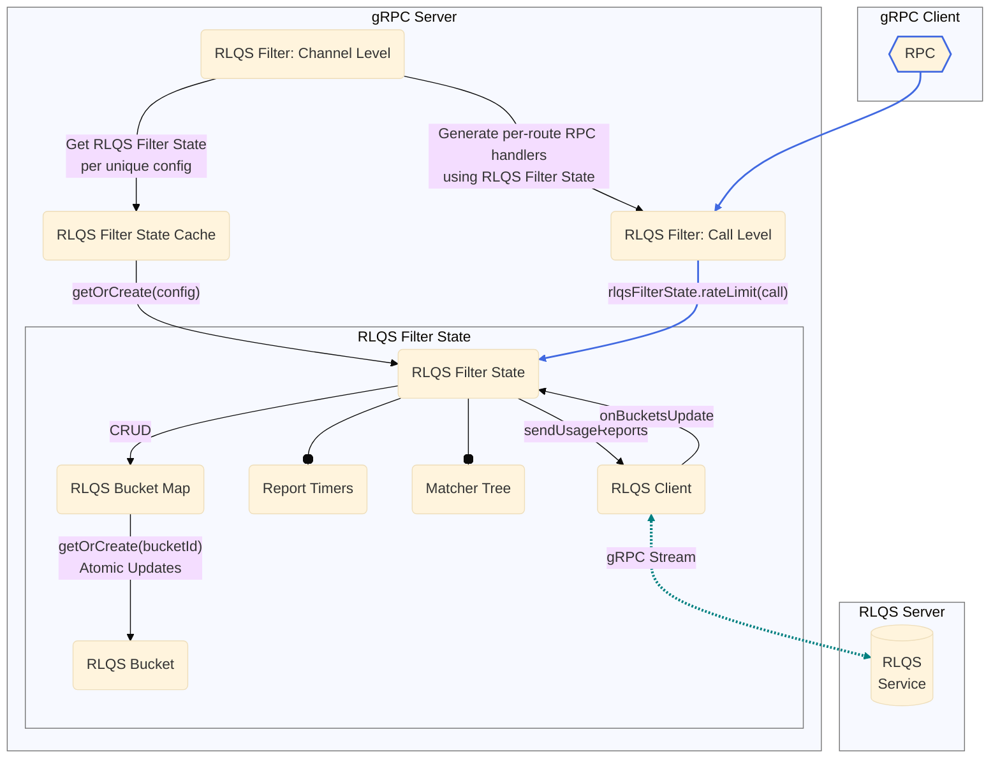

A77: xDS Server-Side Rate Limiting
======

* Author(s): Sergii Tkachenko (@sergiitk)
* Approver: Mark Roth (@markdroth)
* Status: In Review
* Implemented in:
* Last updated: 2025-04-29
* Discussion at:
  - [ ] TODO(sergiitk): insert google group thread

## Abstract

We're adding support for global rate limiting to xDS-enabled gRPC servers. Users
will be able to configure per-time-unit quotas based on request metadata. Rate
Limit Quota Service will fairly distribute request quotas across participating
servers.

## Background

[Global rate limiting](https://www.envoyproxy.io/docs/envoy/latest/intro/arch_overview/other_features/global_rate_limiting)
allows mesh users to manage fair consumption of their services and prevent
misbehaving clients from overloading the services. We will
implement [quota-based rate limiting](https://www.envoyproxy.io/docs/envoy/latest/intro/arch_overview/other_features/global_rate_limiting#quota-based-rate-limiting),
where rate-limiting decisions are asynchronously offloaded
to [Rate Limiting Quota Service][rlqs_proto] (RLQS). Requests are grouped into
buckets based on their metadata, and gRPC servers periodically report bucket
usages. RLQS aggregates the data from different gRPC servers, and fairly
distributes the quota among them. This approach is best suited for
high-request-per-second applications, where a certain margin of error is
acceptable as long as expected average QPS is achieved.

To support RLQS, we'll need to implement several other xDS-related features,
which are covered in the proposal:

1. xDS Control Plane will provide RLQS connection details
   in [the filter config][rlqs_filter_proto] via [`GrpcService`] message.
2. Quota assignments will be configured
   via [`TokenBucket`](https://www.envoyproxy.io/docs/envoy/latest/api-v3/type/v3/token_bucket.proto)
   message.
3. RPCs will be matched into buckets using [Unified Matcher API].
4. One of the matching mechanisms will be [CEL](https://cel.dev/) (Common
   Expression Language).
5. RLQS Filter State will persist across LDS/RDS updates using cache retention
   mechanism described in [gRFC A83].

### Related Proposals

* [A27: xDS-Based Global Load Balancing][gRFC A27]
* [A36: xDS-Enabled Servers][gRFC A36]
* [A39: xDS HTTP Filter Support][gRFC A39]
* [A41: xDS RBAC Support][gRFC A41]
* [A83: xDS GCP Authentication Filter][gRFC A83]

[gRFC A27]: A27-xds-global-load-balancing.md
[gRFC A41]: A41-xds-rbac.md
[gRFC A36]: A36-xds-for-servers.md
[gRFC A39]: A39-xds-http-filters.md
[gRFC A83]: A83-xds-gcp-authn-filter.md

[RLQS xDS HTTP Filter: Channel Level]: #rlqs-xds-http-filter-channel-level

[`GrpcService`]: https://www.envoyproxy.io/docs/envoy/latest/api-v3/config/core/v3/grpc_service.proto
[`GrpcService.GoogleGrpc`]: https://www.envoyproxy.io/docs/envoy/latest/api-v3/config/core/v3/grpc_service.proto#envoy-v3-api-msg-config-core-v3-grpcservice-googlegrpc
[Unified Matcher API]: https://www.envoyproxy.io/docs/envoy/latest/intro/arch_overview/advanced/matching/matching_api.html
[Envoy CEL environment]: https://www.envoyproxy.io/docs/envoy/latest/intro/arch_overview/advanced/attributes

[rlqs_proto]: https://www.envoyproxy.io/docs/envoy/latest/api-v3/service/rate_limit_quota/v3/rlqs.proto.html
[rlqs_filter_proto]: https://www.envoyproxy.io/docs/envoy/latest/api-v3/extensions/filters/http/rate_limit_quota/v3/rate_limit_quota.proto

## Proposal

### RLQS Components Overview

The diagram below shows the conceptual components of the RLQS Filter. Note that
the actual implementation may vary depending on the language.



#### RLQS xDS HTTP Filter: Channel Level

In order to retain filter state across LDS/RDS updates, the actual logic for the
RLQS filter will be moved into a separate object called RLQS Filter State, which
will be stored in the persistent filter state mechanism described in [gRFC A83].
The key in the persistent filter state will be the RLQS xDS HTTP filter config,
which ensures that two RLQS filter instances with the same config will share
filter state but two RLQS filter instances with different configs will each have
their own filter state.

Channel-level RLQS xDS HTTP Filter object will include the following data
members:

-   RLQS Filter State Cache: from filter config, initialized at instantiation,
    retained across LDS/RDS updates. A 1:1 mapping between unique RLQS Filter
    Config instances and corresponding unique RLQS Filter State instances.

Pseudo-code:

```java
final class RlqsFilter implements Filter {
  private final ConcurrentMap<RlqsFilterConfig, RlqsFilterState>
      filterStateCache = new ConcurrentHashMap<>();
  // ...

  @Override
  public ServerInterceptor buildServerInterceptor(
      FilterConfig config, @Nullable FilterConfig overrideConfig) {
    // Parse the filter config.
    RlqsFilterConfig.Builder rlqsConfigBuilder = parseRlqsConfig(config);

    // Merge with per-route overrides if provided.
    if (overrideConfig instanceof RlqsConfigOverride rlqsConfigOverride) {
      // Only domain and matchers can be overriden.
      if (!rlqsConfigOverride.domain().isEmpty()) {
        rlqsConfigBuilder.domain(rlqsConfigOverride.domain());
      }
      if (rlqsConfigOverride.bucketMatchers() != null) {
        rlqsConfigBuilder.bucketMatchers(rlqsConfigOverride.bucketMatchers());
      }
    }

    // Get or Create RLQS Filter Config from persistent filter state.
    RlqsFilterState rlqsFilterState = filterStateCache.computeIfAbsent(
      rlqsConfigBuilder.build(),
      (cfg) -> new RlqsFilterState(cfg, getRlqsServerInfo(cfg.rlqsService()))
    );
    return new RlqsServerInterceptor(rlqsFilterState);
  }
}
```

##### Future considerations

This proposal uses the entire RLQS Filter Config to identify the corresponding
unique Filter State. As a result, a Filter State will be recreated even if only
inconsequential fields, such as the deny response status, are changed. If this
becomes a problem, additional logic should be introduced to exclude such fields
when comparing Filter Config objects.

#### RLQS xDS HTTP Filter: Call Level

When processing a data plane RPC for a given route, the filter passes the RPC
metadata to the corresponding RLQS Filter State instance for evaluation. Based
on the evaluation result, the filter either allows the RPC to proceed, or denies
it with a specific gRPC status. The evaluation result may also contain a list of
HTTP headers to add to the original request, or the deny response.

Call-level RLQS xDS HTTP Filter object will include the following data members:

-   RLQS Filter State instance corresponding route's RLQS Filter Config:
    implementation-dependent.

Pseudo-code:

```java
private static class RlqsServerInterceptor implements ServerInterceptor {
  private final RlqsFilterState rlqsFilterState;

  public RlqsServerInterceptor(RlqsFilterState rlqsFilterState) {
    this.rlqsFilterState = rlqsFilterState;
  }

  @Override
  public <ReqT, RespT> ServerCall.Listener<ReqT> interceptCall(
      ServerCall<ReqT, RespT> call, Metadata headers,
      ServerCallHandler<ReqT, RespT> next) {
    // RlqsClient matches the request into a bucket,
    // and returns the rate limiting result.
    RlqsRateLimitResult result =
        rlqsFilterState.rateLimit(HttpMatchInput.create(headers, call));

    if (result.isAllowed()) {
      // TODO: append request_headers_to_add_when_not_enforced
      return next.startCall(call, headers);
    }

    // Denied: fail the call with given Status.
    call.close(
      result.denyResponse().status(),
      result.denyResponse().headersToAdd());
    return new ServerCall.Listener<ReqT>(){};
  }
}
```

#### RLQS Filter State

RLQS Filter State manages the runtime state and logic for a unique RLQS Filter
Config. It's responsible for matching data plane RPCs to buckets, managing the
lifecycle of those buckets, and communicating with the RLQS server to report
usage and receive quota assignments. Filter state instances are persisted across
LDS/RDS updates, see [RLQS xDS HTTP Filter: Channel Level].

RLQS Filter State object will include the following data members:

-   Matcher Tree: From filter config, initialized at instantiation, constant.
    Used to identify the RLQS Bucket for each data plane RPC.
-   RLQS Bucket Map: Accessed on each data plane RPC, when we get a response
    from the RLQS server, and when report timers fire.
-   RLQS Client: Accessed when we get the first data plane RPC for a given
    bucket and when a report timer fires. Notifies RLQS Filter State of
    responses received from the RLQS server.
-   Report Timers Map: Initialized at instantiation. Used to track discovered
    reporting intervals and their execution handlers.
    -   Entries inserted we get the first data plane RPC for a given bucket and
        there's no key for bucket reporting interval.
    -   Entries deleted when there's more buckets with given reporting interval
        in RLQS Bucket Map.

Pseudo-code for RLQS Filter State RPC rate limiting:

```java
final class RlqsFilterState {
  private final RlqsClient rlqsClient;
  private final Matcher<HttpMatchInput, RlqsBucketSettings> bucketMatchers;
  private final RlqsBucketCache bucketCache;
  private final ScheduledExecutorService scheduler;
  private final ConcurrentMap<Long, ScheduledFuture<?>>
      timers = new ConcurrentHashMap<>();
  // ...

  public RlqsRateLimitResult rateLimit(HttpMatchInput input) {
    // Perform request matching. The result is RlqsBucketSettings.
    RlqsBucketSettings bucketSettings = bucketMatchers.match(input);
    // BucketId may be dynamic (f.e. based on headers).
    RlqsBucketId bucketId = bucketSettings.bucketIdForRequest(input);
    // Get or create RLQS Bucket.
    RlqsBucket bucket = bucketCache.getOrCreate(
        bucketId, bucketSettings, this::onNewBucket);
    return bucket.rateLimit();
  }

  private void onNewBucket(RlqsBucket newBucket) {
    // The report for the first RPC is sent immediately.
    scheduleImmediateReport(newBucket);
    registerReportTimer(newBucket.getReportingInterval());
  }

  private void scheduleImmediateReport(RlqsBucket newBucket) {
    // Do not block data plane RPC on sending the report.
    scheduler.schedule(
       () -> rlqsClient.sendUsageReports(newBucket.snapshotAndResetUsage()),
       1, TimeUnit.MICROSECONDS)
  }

  private void registerReportTimer(final long intervalMillis) {
    // TODO: bound / roundup the report interval for better grouping.
    timers.computeIfAbsent(intervalMillis, k -> newTimer(intervalMillis));
  }
}
```

#### RLQS Bucket Map

The RLQS Bucket Map class is responsible for storing and managing the lifecycle
of RLQS Buckets. It provides a thread-safe way to access and update buckets,
ensuring that only one instance of a RLQS bucket exists for a given `bucket_id`.
RLQS Bucket Map allows to retrieve all buckets that need to be reported to the
RLQS server at a given reporting interval. Depending on implementation, this
component may be inlined into RLQS Filter State.

RLQS Bucket Map object will include the following data members:

-   Bucket Map: Initialized empty at instantiation, thread-safe.
    -   Entries retrieved on each data plane RPC and when report timers fire.
    -   Entries inserted when we get the first data plane RPC for a given
        bucket, or when instructed by the RLQS Server.
    -   Entries deleted either by RLQS server via `abandon_action`, or on report
        timers if a bucket's active assignment expires.
-   Buckets Per Interval Map: Initialized empty at instantiation, thread-safe.
    Used to track the buckets per discovered report intervals.
    -   Entries retrieved when a report timer fires.
    -   Entries inserted and deleted in lock step with Buckets Map updates.

##### RLQS Bucket

The RLQS Bucket tracks the current rate limiting assignment and the quota
usage for a specific bucket, identified by a `bucket_id`. It uses this data to
determine whether to allow or deny a request. The bucket also provides a
thread-safe mechanism to snapshot and reset its quota usage when building usage
reports.

RLQS Bucket object will include the following data members:

-   `bucket_id`: From filter config and RPC metadata, constant, initialized at
    bucket creation. A unique identifier for the bucket.
-   "No Assignment" and "Expired Assignment" strategies: Initialized at first
    RPC for the bucket from filter config, constant. Fallback rate limiting
    strategies.
-   Active Assignment: Initialized at first RPC for the bucket from filter
    config, updated on RLQS server responses. The current rate limiting strategy
    to apply to requests, and associated expiration timestamps.
-   Request Counters: Initialized at 0, updated on data plane RPCs, reset on
    report timers and RLQS server responses. Tracks the number allowed/denied
    requests for the bucket.

##### RLQS Buckets and Multithreading

There are several mutex-synchronized operations on RLQS buckets that are
executed during latency-sensitive data plane RPC processing:

1. Inserting/reading a bucket from the RLQS Bucket Map using `bucket_id`. Note
   that `bucket_id` is represented as a `Map<String, String>`, which may
   introduce complexities in efficient cache sharding for certain programming
   languages.
2. Incrementing `num_request_allowed`/`num_request_denied` bucket counters.

Each gRPC implementation needs to consider what synchronization primitives are
available in their language to minimize the thread lock time.

#### RLQS Client

The RLQS Client is responsible for communication with the Rate Limit Quota
Service (RLQS) server. It manages a gRPC stream to the RLQS server, used for
sending periodic bucket usage reports and receiving new rate limit quota
assignments. The client handles reconnects and manages the lifecycle of the
stream.

RLQS Client object will include the following data members:

-   gRPC Channel: From filter config, initialized at instantiation, constant. A
    channel to the RLQS server.
-   gRPC Stream: Initialized at instantiation, replaced any time the stream
    fails (with backoff). Accessed when we get the first data plane RPC for a
    given bucket and when a report timer fires. A bidirectional gRPC stream to
    the RLQS server.
-   Buckets Update Callback: Provided by RLQS Filter state at instantiation,
    constant, accessed on responses from the RLQS server. A callback to notify
    the RLQS Filter State of updates to quota assignments.

### Handling Events

#### On LDS/RDS Updates

When receiving an LDS/RDS update, the RLQS filter will perform the following 
steps for each route:

1.  Parse the new filter config and per-route overrides into an internal RLQS
    Filter Config object.
2.  Retrieve the corresponding RLQS Filter State from the RLQS Filter State
    Cache, creating it if it doesn't exist.
3.  Generate new data plane RPC handler using the retrieved RLQS Filter State.

Once all routes are parsed, the RLQS filter will release from the RLQS Filter
State Cache all RLQS Filter State instances no longer referenced by any data
plane RPC handlers.

#### On Data Plane RPC

When processing each data plane RPC, the RLQS Filter will ask the RLQS Filter
State for a rate-limit decision for the RPC. The RLQS Filter State uses the
matcher tree from the filter config to determine which bucket to use for the
RPC. It then looks for that RLQS Bucket in the RLQS Bucket Map, creating it if
it doesn't already exist.

If a new bucket has been created, the RPC is rate-limited according to bucket's
default configuration. Then the filter schedules a report on the RLQS stream
informing the server of the bucket's creation, and registers the report timers
for bucket's reporting interval.

If the bucket exists, the RPC is rate-limited according to its active quota
assignment and usage counters. The bucket increments corresponding bucket usage
counter.

#### On RLQS Server Response

When receiving an RLQS Server Response, the RLQS Client passes parsed response
to the RLQS Filter State. The RLQS Filter State iterates through the bucket
assignments in the response, and updates the corresponding buckets in the RLQS
Bucket Map. Buckets marked to be abandoned are purged from the cache.

If a bucket has a new rate limit assignment, the bucket's active assignment is
updated and bucket usage counters are reset. Otherwise, only the assignment
expiration is updated.

#### On Report Timers

When a report timer fires, the RLQS Filter State retrieves all buckets with the
corresponding reporting interval from the RLQS Bucket Map. For each bucket, the
filter snapshots the current usage counters, and resets them. The filter then
sends the snapshot to RLQS server using RLQS Client.

If a bucket's active assignment has expired, the bucket is removed from the
cache. If there are no more buckets with the given reporting interval, the
corresponding timer is removed.

### Integrations

#### Connecting to RLQS Control Plane

xDS Control Plane provides RLQS connection details in [`GrpcService`] message (
already supported by Envoy). `GrpcService` supports two modes:

1. `GrpcService.EnvoyGrpc`, Envoy's minimal custom gRPC client implementation.
2. [`GrpcService.GoogleGrpc`], regular gRPC-cpp client.

For obvious reasons, we'll only support the `GoogleGrpc` mode.

##### Security Considerations

In [`GrpcService.GoogleGrpc`], the xDS Control Plane provides the target URI,
`channel_credentials`, and `call_credentials`. If the xDS Control Plane is
compromised, an attacker could configure the xDS clients to talk to other
malicious Control Planes. This could lead to potential exploits such as leaking
customer's Application Default Credentials OAuth token.

To prevent that, we'll introduce an allow-list to the bootstrap file introduced
in [gRFC A27]. This allow-list will be a map from a fully-qualified server
target URI to an object containing channel credentials to use for that target.

```json5
// The allowlist of Control Planes allowed to be configured via xDS.
"allowed_grpc_services": {
  // The key is fully-qualified server URI.
  "dns:///xds.example.org:443": {
    // The value is an object containing "channel_creds".
    "channel_creds": [
      // The format is identical to xds_servers.channel_creds.
      {
        "type": "string containing channel cred type",
        "config": "optional JSON object containing config for the type"
      }
    ]
  }
}
```

When xDS Control Plane configures connection to another control plane
via [`GrpcService.GoogleGrpc`] message, we'll inspect the allow-list for the
matching target URI.

1. If target URI is not present, we don't create the connection to the requested
   Control Plane, and NACK the xDS resource.
2. If target URI is present, we create the connection to the requested Control
   Plane using the channel credentials provided in the bootstrap file. Transport
   security configuration provided by the TD is ignored.

> [!IMPORTANT]
> This solution is not specific to RLQS, and should be used with any
> other Control Planes configured via [`GrpcService`] message.

#### Unified Matcher API

RPCs will be matched into buckets using [Unified Matcher API] — an adaptable
framework that can be used in any xDS component that needs matching features.

Envoy provides two syntactically equivalent Unified Matcher
definitions: [`envoy.config.common.matcher.v3.Matcher`](https://github.com/envoyproxy/envoy/blob/e3da7ebb16ad01c2ac7662758a75dba5cdc024ce/api/envoy/config/common/matcher/v3/matcher.proto)
and [`xds.type.matcher.v3.Matcher`](https://github.com/cncf/xds/blob/b4127c9b8d78b77423fd25169f05b7476b6ea932/xds/type/matcher/v3/matcher.proto).
We will only support the latter, which is the preferred version for all new APIs
using Unified Matcher.

For RLQS, Unified Matcher tree will be provided in the filter config. Evaluating
the tree against RPC metadata will yield `RateLimitQuotaBucketSettings`, which
contains the information needed to associate the RPC with `bucket_id` and the
default rate limiting configuration.

In this iteration the following Unified Mather extensions will be supported:

1. Inputs:
    1. [`HttpRequestHeaderMatchInput`](https://www.envoyproxy.io/docs/envoy/latest/api-v3/type/matcher/v3/http_inputs.proto#type-matcher-v3-httprequestheadermatchinput)
    2. [`HttpAttributesCelMatchInput`](https://www.envoyproxy.io/docs/envoy/latest/xds/type/matcher/v3/http_inputs.proto#envoy-v3-api-msg-xds-type-matcher-v3-httpattributescelmatchinput)
2. Custom Matchers:
    1. [`CelMatcher`](https://www.envoyproxy.io/docs/envoy/latest/xds/type/matcher/v3/cel.proto.html)

#### CEL Integration

We will support request metadata matching via CEL expressions. Only Canonical
CEL and only checked expressions will be supported (`cel.expr.CheckedExpr`).

CEL evaluation environment is a set of available variables and extension
functions in a CEL program. We will match [Envoy CEL environment].

##### Supported CEL Functions

Similar to Envoy, we will
support [standard CEL functions](https://github.com/google/cel-spec/blob/c629b2be086ed6b4c44ef4975e56945f66560677/doc/langdef.md#standard-definitions)
except comprehension-style macros.

| CEL Method                                         | Description                                                                                   |
|----------------------------------------------------|-----------------------------------------------------------------------------------------------|
| `size(x)`                                          | Returns the length of a container x (string, bytes, list, map).                               |
| `x.matches(y)`                                     | Returns true if the string x is partially matched by the specified [RE2][RE2_wiki] pattern y. |
| `x.contains(y)`                                    | Returns true if the string x contains the substring y.                                        |
| `x.startsWith(y)`                                  | Returns true if the string x begins with the substring y.                                     |
| `x.endsWith(y)`                                    | Returns true if the string x ends with the substring y.                                       |
| `timestamp(x)`, `timestamp.get*(x)`, `duration`    | Date/time functions.                                                                          |
| `in`, `[]`                                         | Map/list indexing.                                                                            |
| `has(m.x)`                                         | (macro) Returns true if the map `m` has the string `"x"` as a key.                            |
| `int`, `uint`, `double`, `string`, `bytes`, `bool` | Conversions and identities.                                                                   |
| `==`, `!=`, `>`, `<`, `<=`, `>=`                   | Comparisons.                                                                                  |
| `or`, `&&`, `+`, `-`, `/`, `*`, `%`, `!`           | Basic functions.                                                                              |

[RE2_wiki]: https://en.wikipedia.org/wiki/RE2_(software)

##### Supported CEL Variables

For RLQS, only the `request` variable is supported in CEL expressions. We will
adapt [Envoy's Request Attributes](https://www.envoyproxy.io/docs/envoy/latest/intro/arch_overview/advanced/attributes#request-attributes)
for gRPC.

| Attribute           | Type                  | gRPC source                  | Envoy Description                                           |
|---------------------|-----------------------|------------------------------|-------------------------------------------------------------|
| `request.path`      | `string`              | Full method name<sup>1</sup> | The path portion of the URL.                                |
| `request.url_path`  | `string`              | Same as `request.path`       | The path portion of the URL without the query string.       |
| `request.host`      | `string`              | Authority<sup>2</sup>        | The host portion of the URL.                                |
| `request.scheme`    | `string`              | Not set                      | The scheme portion of the URL.                              |
| `request.method`    | `string`              | `POST`<sup>3</sup>           | Request method.                                             |
| `request.headers`   | `map<string, string>` | `metadata`<sup>4</sup>       | All request headers indexed by the lower-cased header name. |
| `request.referer`   | `string`              | `metadata["referer"]`        | Referer request header.                                     |
| `request.useragent` | `string`              | `metadata["user-agent"]`     | User agent request header.                                  |
| `request.time`      | `timestamp`           | Not set                      | Time of the first byte received.                            |
| `request.id`        | `string`              | `metadata["x-request-id"]`   | Request ID corresponding to `x-request-id` header value     |
| `request.protocol`  | `string`              | Not set                      | Request protocol.                                           |
| `request.query`     | `string`              | `""`                         | The query portion of the URL.                               |

###### Footnotes

**<sup>1</sup> `request.path`**

* CPP: `metadata[":path"]`
* Go: `grpc.Method(ctx)`
* Java: `"/" + serverCall.getMethodDescriptor().getFullMethodName()`

**<sup>2</sup> `request.host`**

* CPP, Go: `metadata[":authority"]`
* Java: `serverCall.getAuthority()`

**<sup>3</sup> `request.method`**\
Hard-coded to `"POST"` if unavailable and a code audit confirms the server
denies requests for all other method types.

**<sup>4</sup> `request.headers`**\
As defined in [gRFC A41], "header" field.

##### Implementation

For performance reasons, CEL variables should be resolved on demand. CEL Runtime
provides the different variable resolving approaches based on the language:

* CPP: [`BaseActivation::FindValue()`](https://github.com/google/cel-cpp/blob/9310c4910e598362695930f0e11b7f278f714755/eval/public/base_activation.h#L35)
* Go: [`Activation.ResolveName(string)`](https://github.com/google/cel-go/blob/3f12ecad39e2eb662bcd82b6391cfd0cb4cb1c5e/interpreter/activation.go#L30)
* Java: [`CelVariableResolver`](https://javadoc.io/doc/dev.cel/runtime/0.6.0/dev/cel/runtime/CelVariableResolver.html)

### Temporary environment variable protection

During initial development, this feature will be enabled via
the `GRPC_EXPERIMENTAL_XDS_ENABLE_RLQS` environment variable. This environment
variable protection will be removed once the feature has proven stable.

## Rationale

#### Alternative protocol

[Rate Limiting Service (RLS)](https://www.envoyproxy.io/docs/envoy/latest/configuration/http/http_filters/rate_limit_filter)
is another Global Rate Limiting solution supported by Envoy. While it's best
suited for precise cases, where even a single request over the limit must be
throttled, this approach performs synchronous (blocking) per-HTTP-request rate
limit check.

#### xDS-configured Control Plane Trust

The problem with a compromised xDS Control Plane configuring a connection to a
malicious RLQS server may be solved holistically by signing xDS messages
cryptographically. This feature would solve multiple problems in the same class,
but it's out-of-scope of RLQS.

The proposed solution with the change to the bootstrap file was designed to be
compatible with such future protocol extension.

## Implementation

* The initial implementation will be in Java.
* C-core, Python, Go are TBD.
