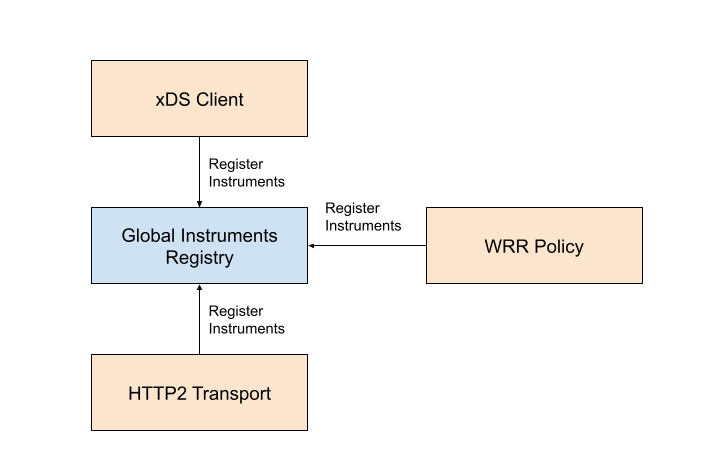
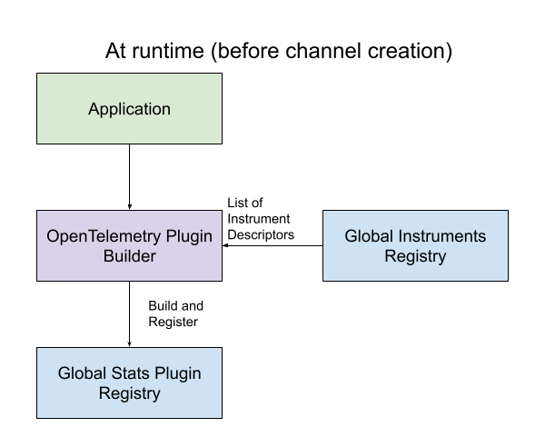
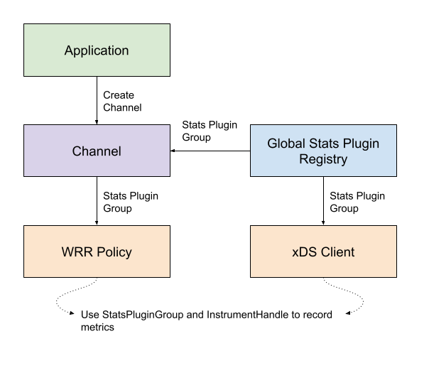

## A79: Non-per-call Metrics Architecture

*   Author(s): Yash Tibrewal (@yashykt), Vindhya Ningegowda (@dnvindhya), Yijie Ma (@yijiem)
*   Approver: Mark Roth (@markdroth)
*   Status: Final
*   Implemented in: Core, C++
*   Last updated: 2024-03-27
*   Discussion at: https://groups.google.com/g/grpc-io/c/VfZOj7940Dc

## Abstract

Describe a cross-language architecture for collecting non-per-call metrics.

## Background

[A66: OpenTelemetry Metrics](A66-otel-stats.md) is a spec for gRPC to collect
client/server per-attempt/call metrics for OpenTelemetry. It details an
architecture that uses a CallTracer approach to record various per-call metrics
like latency and message sizes. This approach works for per-attempt/call metrics
but does not work so well for non-per-call metrics such as xDS metrics, load
balancing policy metrics, resolver metrics, and transport metrics which are not
necessarily tied to a particular call. This calls for a newer architecture that
allows to collect such metrics.

### Related Proposals:

*   [A66: OpenTelemetry Metrics](A66-otel-stats.md)
*   [A71: xDS Fallback](A71-xds-fallback.md)
*   [A78: gRPC OTel Metrics for WRR, Pick First and XdsClient](https://github.com/grpc/proposal/pull/419)

## Proposal

### Overall Goals / Requirements

*   Support non-per-call metrics -
    [A78: gRPC OTel Metrics for WRR, Pick First and XdsClient](https://github.com/grpc/proposal/pull/419)
    defines metrics for WRR, Pick-First and XdsClient components. In the future,
    we would want to record metrics for other components as well. Additionally,
    third-party plugins to gRPC (custom load balancing policies/resolvers) might
    want to use the same architecture to record metrics as well. (Note that
    supporting metrics for third-party plugins through this architecture is not
    an immediate requirement and proposed APIs would start off as
    internal/experimental, but we might want to make the API public in the
    future.)
*   Channel-scoped stats plugins - Applications should be able to register stats
    plugins such that metrics for only certain channels are recorded on those
    plugins. There can be multiple stats plugins registered as well.
*   gRPC/Third-party plugins control the metric instrument definition - As gRPC
    library/component writers, we want to be in control of the metric definition
    that gRPC provides, irrespective of the stats plugin used. OpenTelemetry is
    the only supported stats plugin as of now, but that might change in the
    future. Third-party plugins to gRPC that choose to use this architecture
    would be responsible for the definitions of metrics exported by their
    plugins.
*   Stats plugins should be able to enable/disable recorded metrics - gRPC has
    many components that would want to record metrics. Not all of those metrics
    will be interesting to stats plugins. Stats plugin writers should allow
    users to configure which metrics are enabled/disabled.

### Proposed Architecture

#### Global Instruments Registry

A new `GlobalInstrumentsRegistry` is added. Any metric instrument that needs to
be recorded has to register its descriptor to this registry.

Instrument Descriptor -

*   Name (string) - The name of the instrument
*   Description (string) - The description of the instrument
*   Unit (string) - The unit for the recordings, e.g. `s` (seconds), `By`
    (bytes). Follow
    [OpenTelemetry conventions](https://opentelemetry.io/docs/specs/semconv/general/metrics/#instrument-units)
    for consistency.
*   Type - Implementation defined instrument type, e.g. Long Counter, Double
    Histogram.
*   Set of Label Keys (set of strings) - These determine the set of labels that
    will be present with each recording/measurement.
*   Set of Optional Label Keys (set of strings) - This is an additional set of
    labels that stats plugins can choose to either record or throw away based on
    user configuration. This is useful in cases where certain labels might be
    deemed not useful for the majority of the cases, and hence shouldn't be
    recorded by default. (OpenTelemetry allows users to create
    [custom views](https://opentelemetry.io/docs/specs/otel/metrics/sdk/#view)
    that can filter labels, but in the absence of custom views, the view takes
    the entire set of labels provided by the instrumentation library.) gRPC
    reserves the right to add optional labels (including existing optional
    labels) to existing metrics.

On registering an instrument, a `GlobalInstrumentHandle` is returned. The
suggested implementation of this handle is an index that allows stats plugins to
quickly look up the corresponding instrument when a measurement is being
recorded.

When registering an instrument, a hint is provided as to whether stats plugins
should consider that instrument on-by-default or off-by-default. The rationale
being that component/plugin writers would have the best judgment on whether a
metric should be enabled by default or not, especially if collecting the
measurement is expensive.

Instrument descriptors are expected to be registered at static initialization
time (initialization before main). Implementations can optionally provide the
ability to register instruments dynamically as well (in/after main). For
example, third-party plugins to gRPC that register instruments might be
dynamically loaded. Even if dynamic registration of instruments is supported,
implementations can choose to add constraints such that newly registered
instruments are only used by stats plugins that are registered thereafter.

If multiple instrument descriptors are registered with the same name, it is
considered an error and should result in a panic. This behavior might be relaxed
in the future, for example, if the same instrument is registered again, we could
return the previously registered instrument. This would be useful in cases where
a library is dynamically loaded and unloaded multiple times during the lifetime
of the process.



##### Core

C++, Python and other wrapped languages will use this API.

```c++
// A global registry of instruments(metrics). This API is designed to be used
// to register instruments (Counter, Histogram, and Gauge) as part of program
// startup, before the execution of the main function (during dynamic
// initialization time). Using this API after the main function begins may
// result into missing instruments. This API is thread-unsafe.
//
// The registration of instruments is done through the templated
// RegistrationBuilder API and gets back a handle with an opaque type. At
// runtime, the handle should be used with the StatsPluginGroup API to record
// metrics for the instruments.
//
// At dynamic initialization time:
//   const auto kMetricHandle =
//       GlobalInstrumentsRegistry::RegisterUInt64Counter(
//           "name",
//           "description",
//           "unit", /*enable_by_default=*/false)
//           .Labels(kLabel1, kLabel2, kLabel3)
//           .OptionalLabels(kOptionalLabel1, kOptionalLabel2)
//           .Build();
//
// At runtime time:
//   stats_plugin_group.AddCounter(kMetricHandle, 1,
//       {"label_value_1", "label_value_2", "label_value_3"},
//       {"optional_label_value_1", "optional_label_value_2"});
//
class GlobalInstrumentsRegistry {
 public:
  enum class ValueType {
    kUndefined,
    kInt64,
    kUInt64,
    kDouble,
  };
  enum class InstrumentType {
    kUndefined,
    kCounter,
    kHistogram,
    kCallbackGauge,
  };
  using InstrumentID = uint32_t;
  struct GlobalInstrumentDescriptor {
    ValueType value_type;
    InstrumentType instrument_type;
    InstrumentID index;
    bool enable_by_default;
    absl::string_view name;
    absl::string_view description;
    absl::string_view unit;
    std::vector<absl::string_view> label_keys;
    std::vector<absl::string_view> optional_label_keys;
  };
  struct GlobalInstrumentHandle {
    // This is the index for the corresponding registered instrument that
    // StatsPlugins can use to uniquely identify an instrument in the current
    // process. Though this is not guaranteed to be stable between different
    // runs or between different versions.
    InstrumentID index;
  };

  template <ValueType V, InstrumentType I, size_t M, size_t N>
  struct TypedGlobalInstrumentHandle : public GlobalInstrumentHandle {};

  template <ValueType V, InstrumentType I, std::size_t M, std::size_t N>
  class RegistrationBuilder {
   public:
    template <typename... Args>
    RegistrationBuilder<V, I, sizeof...(Args), N> Labels(Args&&... args);
    template <typename... Args>
    RegistrationBuilder<V, I, M, sizeof...(Args)> OptionalLabels(
        Args&&... args);
    TypedGlobalInstrumentHandle<V, I, M, N> Build();
  };

  // Creates instrument in the GlobalInstrumentsRegistry.
  static RegistrationBuilder<ValueType::kUInt64, InstrumentType::kCounter, 0, 0>
  RegisterUInt64Counter(absl::string_view name, absl::string_view description,
                        absl::string_view unit, bool enable_by_default);
  static RegistrationBuilder<ValueType::kDouble, InstrumentType::kCounter, 0, 0>
  RegisterDoubleCounter(absl::string_view name, absl::string_view description,
                        absl::string_view unit, bool enable_by_default);
  static RegistrationBuilder<ValueType::kUInt64, InstrumentType::kHistogram, 0,
                             0>
  RegisterUInt64Histogram(absl::string_view name, absl::string_view description,
                          absl::string_view unit, bool enable_by_default);
  static RegistrationBuilder<ValueType::kDouble, InstrumentType::kHistogram, 0,
                             0>
  RegisterDoubleHistogram(absl::string_view name, absl::string_view description,
                          absl::string_view unit, bool enable_by_default);
  static RegistrationBuilder<ValueType::kInt64, InstrumentType::kCallbackGauge,
                             0, 0>
  RegisterCallbackInt64Gauge(absl::string_view name,
                             absl::string_view description,
                             absl::string_view unit, bool enable_by_default);
  static RegistrationBuilder<ValueType::kDouble, InstrumentType::kCallbackGauge,
                             0, 0>
  RegisterCallbackDoubleGauge(absl::string_view name,
                              absl::string_view description,
                              absl::string_view unit, bool enable_by_default);

  static void ForEach(
      absl::FunctionRef<void(const GlobalInstrumentDescriptor&)> f);
  static const GlobalInstrumentDescriptor& GetInstrumentDescriptor(
      GlobalInstrumentHandle handle);
  static absl::optional<GlobalInstrumentsRegistry::GlobalInstrumentHandle>
  FindInstrumentByName(absl::string_view name);
};
```

##### Java

```java
/**
 * Registry for metric instruments (also known as metric descriptors).
 */
@Internal
public class MetricInstrumentRegistry {

  // Returns a default MetricInstrumentRegistry instance
  public static MetricInstrumentRegistry getInstance();

  // Returns a list of registered metric descriptors.
  public List<MetricDescriptor> getMetricInstruments();

  // Register and return a long counter metric descriptor for recording long
  // counter values.
  public LongCounterDescriptor registerLongCounter(
      String name, String description, String unit, List<String> labelKeys,
      List<String> optionalLabelKeys, boolean isEnabledByDefault);

  // Register and return a double histogram metric descriptor for recording
  // double histogram values.
  public DoubleHistogramDescriptor registerDoubleHistogram(
      String name, String description, String unit, List<Double> bucketBoundaries,
      List<String> labelKeys, List<String> optionalLabelKeys,
      boolean isEnabledByDefault);
}

interface MetricDescriptor {
  long getIndex();
  String getName();
  String getDescription();
  String getUnit();
  Collection<String> getLabelKeys();
  Collection<String> getOptionalLabelKeys();
  boolean getDefaultState();
}

class LongCounterDescriptor implements MetricDescriptor {
  String name;
  String description;
  String unit;
  List<String> labelKeys;
  List<String> optionalLabelKeys;
  boolean isEnabledByDefault;
}

class DoubleHistogramDescriptor implements MetricDescriptor {
  String name;
  String description;
  String unit;
  List<Double> bucketBoundaries;
  List<String> labelKeys;
  List<String> optionalLabelKeys;
  boolean isEnabledByDefault;
}
```

##### Go

(To be filled.)

#### Global Stats Plugin Registry

A global stats plugin registry is added. This registry keeps track of all stats
plugins that have been registered globally.

The application will use a stats plugin builder (e.g.
`OpenTelemetryPluginBuilder`) to register a stats plugin to the registry. On
creation, stats plugins should query the global instruments registry to get the
list of instrument descriptors. Based on these descriptors and the stats
plugin's configuration, backing instruments (e.g., `OpenTelemetry Instruments`)
will be created. For java, backing instruments will be lazily created.
Implementations can choose an alternative form of representation for the global
stats plugin registry. For example, gRPC Go might choose to register global
stats plugin through global dial options.



##### Scoping Stats Plugins for Channels

To allow stats plugins to scope themselves to a certain set of channels,
implementations can choose one of two approaches.

In the first approach, stats plugins provide a scope filter that applications
can configure. Based on the channel's configuration, a stats plugin can decide
whether it is interested in the channel. At channel creation time, the channel's
canonical target and the default authority is provided to the stats plugin to
make this decision. (The default authority provided is derived from the target
unless an override was specified on the channel.) Various gRPC components use
this list of interested stats plugins (`StatsPluginGroup`) to record metrics.



In the second approach, stats plugins that are to be scoped to a channel are
registered with the corresponding channel directly, instead of the global stats
plugin registry. On channel creation time, stats plugins from the registry are
combined with the list of stats plugins registered directly on the channel to
form the complete list of stats plugins for this channel.

There is a known issue with this approach. There are certain components like
XdsClient instances that are not 1:1 to the channel but instead to the channel's
target. (As per [A71: xDS Fallback](A71-xds-fallback.md), multiple channels with
the same xDS target will use the same XdsClient instance.) If there are multiple
xDS enabled channels to the same target (with potentially different stats
plugins), the XdsClient will use the stats plugins provided by the first channel
created with that target while ignoring the stats plugins passed to the second
channel.

Implementations can also choose to implement both approaches.

##### Core

```c++
// The StatsPlugin interface.
class StatsPlugin {
 public:
  // A general-purpose way for stats plugin to store per-channel or per-server
  // state.
  class ScopeConfig {
   public:
    virtual ~ScopeConfig() = default;
  };

  virtual ~StatsPlugin() = default;

  // Whether this stats plugin is enabled for the channel specified by \a scope.
  // Returns true and a channel-specific ScopeConfig which may then be used to
  // configure the ClientCallTracer in GetClientCallTracer().
  virtual std::pair<bool, std::shared_ptr<ScopeConfig>> IsEnabledForChannel(
      const experimental::StatsPluginChannelScope& scope) const = 0;
  // Whether this stats plugin is enabled for the server specified by \a args.
  // Returns true and a server-specific ScopeConfig which may then be used to
  // configure the ServerCallTracer in GetServerCallTracer().
  virtual std::pair<bool, std::shared_ptr<ScopeConfig>> IsEnabledForServer(
      const ChannelArgs& args) const = 0;
  // Gets a scope config for the client channel specified by \a scope. Note that
  // the stats plugin should have been enabled for the channel.
  virtual std::shared_ptr<StatsPlugin::ScopeConfig> GetChannelScopeConfig(
      const experimental::StatsPluginChannelScope& scope) const = 0;
  // Gets a scope config for the server specified by \a args. Note that the
  // stats plugin should have been enabled for the server.
  virtual std::shared_ptr<StatsPlugin::ScopeConfig> GetServerScopeConfig(
      const ChannelArgs& args) const = 0;

  // Adds \a value to the uint64 counter specified by \a handle. \a label_values
  // and \a optional_label_values specify attributes that are associated with
  // this measurement and must match with their corresponding keys in
  // GlobalInstrumentsRegistry::RegisterUInt64Counter().
  virtual void AddCounter(
      GlobalInstrumentsRegistry::GlobalInstrumentHandle handle, uint64_t value,
      absl::Span<const absl::string_view> label_values,
      absl::Span<const absl::string_view> optional_label_values) = 0;
  // Adds \a value to the double counter specified by \a handle. \a label_values
  // and \a optional_label_values specify attributes that are associated with
  // this measurement and must match with their corresponding keys in
  // GlobalInstrumentsRegistry::RegisterDoubleCounter().
  virtual void AddCounter(
      GlobalInstrumentsRegistry::GlobalInstrumentHandle handle, double value,
      absl::Span<const absl::string_view> label_values,
      absl::Span<const absl::string_view> optional_label_values) = 0;
  // Records a uint64 \a value to the histogram specified by \a handle. \a
  // label_values and \a optional_label_values specify attributes that are
  // associated with this measurement and must match with their corresponding
  // keys in GlobalInstrumentsRegistry::RegisterUInt64Histogram().
  virtual void RecordHistogram(
      GlobalInstrumentsRegistry::GlobalInstrumentHandle handle, uint64_t value,
      absl::Span<const absl::string_view> label_values,
      absl::Span<const absl::string_view> optional_label_values) = 0;
  // Records a double \a value to the histogram specified by \a handle. \a
  // label_values and \a optional_label_values specify attributes that are
  // associated with this measurement and must match with their corresponding
  // keys in GlobalInstrumentsRegistry::RegisterDoubleHistogram().
  virtual void RecordHistogram(
      GlobalInstrumentsRegistry::GlobalInstrumentHandle handle, double value,
      absl::Span<const absl::string_view> label_values,
      absl::Span<const absl::string_view> optional_label_values) = 0;
  // Adds a callback to be invoked when the stats plugin wants to
  // populate the corresponding metrics (see callback->metrics() for list).
  virtual void AddCallback(RegisteredMetricCallback* callback) = 0;
  // Removes a callback previously added via AddCallback().  The stats
  // plugin may not use the callback after this method returns.
  virtual void RemoveCallback(RegisteredMetricCallback* callback) = 0;
  // Returns true if instrument \a handle is enabled.
  virtual bool IsInstrumentEnabled(
      GlobalInstrumentsRegistry::GlobalInstrumentHandle handle) const = 0;

  // Gets a ClientCallTracer associated with this stats plugin which can be used
  // in a call.
  virtual ClientCallTracer* GetClientCallTracer(
      const Slice& path, bool registered_method,
      std::shared_ptr<ScopeConfig> scope_config) = 0;
  // Gets a ServerCallTracer associated with this stats plugin which can be used
  // in a call.
  virtual ServerCallTracer* GetServerCallTracer(
      std::shared_ptr<ScopeConfig> scope_config) = 0;
};

// A global registry of stats plugins. It has shared ownership to the registered
// stats plugins. This API is supposed to be used during runtime after the main
// function begins. This API is thread-safe.
class GlobalStatsPluginRegistry {
 public:
  // A stats plugin group object is how the code in gRPC normally interacts with
  // stats plugins. They got a stats plugin group which contains all the stats
  // plugins for a specific scope and all operations on the stats plugin group
  // will be applied to all the stats plugins within the group.
  class StatsPluginGroup {
   public:
    // Adds a stats plugin and a scope config (per-channel or per-server) to the
    // group.
    void AddStatsPlugin(std::shared_ptr<StatsPlugin> plugin,
                        std::shared_ptr<StatsPlugin::ScopeConfig> config);
    // Adds a counter in all stats plugins within the group. See the StatsPlugin
    // interface for more documentation and valid types.
    template <std::size_t M, std::size_t N>
    void AddCounter(
        GlobalInstrumentsRegistry::TypedGlobalInstrumentHandle<
            GlobalInstrumentsRegistry::ValueType::kUInt64,
            GlobalInstrumentsRegistry::InstrumentType::kCounter, M, N>
            handle,
        uint64_t value, std::array<absl::string_view, M> label_values,
        std::array<absl::string_view, N> optional_values);
    template <std::size_t M, std::size_t N>
    void AddCounter(
        GlobalInstrumentsRegistry::TypedGlobalInstrumentHandle<
            GlobalInstrumentsRegistry::ValueType::kDouble,
            GlobalInstrumentsRegistry::InstrumentType::kCounter, M, N>
            handle,
        double value, std::array<absl::string_view, M> label_values,
        std::array<absl::string_view, N> optional_values);
    // Records a value to a histogram in all stats plugins within the group. See
    // the StatsPlugin interface for more documentation and valid types.
    template <std::size_t M, std::size_t N>
    void RecordHistogram(
        GlobalInstrumentsRegistry::TypedGlobalInstrumentHandle<
            GlobalInstrumentsRegistry::ValueType::kUInt64,
            GlobalInstrumentsRegistry::InstrumentType::kHistogram, M, N>
            handle,
        uint64_t value, std::array<absl::string_view, M> label_values,
        std::array<absl::string_view, N> optional_values);
    template <std::size_t M, std::size_t N>
    void RecordHistogram(
        GlobalInstrumentsRegistry::TypedGlobalInstrumentHandle<
            GlobalInstrumentsRegistry::ValueType::kDouble,
            GlobalInstrumentsRegistry::InstrumentType::kHistogram, M, N>
            handle,
        double value, std::array<absl::string_view, M> label_values,
        std::array<absl::string_view, N> optional_values);
    // Returns true if any of the stats plugins in the group have enabled \a
    // handle.
    bool IsInstrumentEnabled(
        GlobalInstrumentsRegistry::GlobalInstrumentHandle handle) const;

    // Registers a callback to be used to populate callback metrics.
    // The callback will update the specified metrics.  The callback
    // will be invoked no more often than min_interval.  Multiple callbacks may
    // be registered for the same metrics, as long as no two callbacks report
    // data for the same set of labels in which case the behavior is undefined.
    //
    // The returned object is a handle that allows the caller to control
    // the lifetime of the callback; when the returned object is
    // destroyed, the callback is de-registered.  The returned object
    // must not outlive the StatsPluginGroup object that created it.
    template <typename... Args>
    GRPC_MUST_USE_RESULT std::unique_ptr<RegisteredMetricCallback>
    RegisterCallback(absl::AnyInvocable<void(CallbackMetricReporter&)> callback,
                     Duration min_interval, Args... args);

    // Adds all available client call tracers associated with the stats plugins
    // within the group to \a call_context.
    void AddClientCallTracers(const Slice& path, bool registered_method,
                              Arena* arena);
    // Adds all available server call tracers associated with the stats plugins
    // within the group to \a call_context.
    void AddServerCallTracers(Arena* arena);
  };

  // Registers a stats plugin with the global stats plugin registry.
  static void RegisterStatsPlugin(std::shared_ptr<StatsPlugin> plugin);

  // The following functions can be invoked to get a StatsPluginGroup for
  // a specified scope.
  static StatsPluginGroup GetStatsPluginsForChannel(
      const experimental::StatsPluginChannelScope& scope);
  static StatsPluginGroup GetStatsPluginsForServer(const ChannelArgs& args);
};
```

##### Java

```java
/**
 * Metrics Plugin measures (also known as backing instruments) are initialised
 * with empty list of measures on metrics plugin creation and are lazily
 * initialised.
 */
@Internal
interface MetricsPlugin {

  /** Returns set of metrics enabled by the plugin. */
  public Set<String> getEnabledMetrics();

  /** Returns optional labels configured by the plugin. */
  public List<String> getOptionalLabels();

  /**
   * Update list of plugin specific measures based on registered metric
   * descriptors in MetricInstrumentRegistry.
   */
  protected void updateMeasures(MetricInstrumentRegistry registry);

  /** Returns list of plugin specific measures. */
  public List<Object> getMetricsMeasures();

  /** Records a value for a long counter measure. */
  default void recordLongCounter(MetricDescriptor counterDescriptor, Long value,
      List<String> labelValues, List<String> optionalLabelValues) {}

  /** Records a value for double histogram measure. */
  default void recordDoubleHistogram(MetricDescriptor histogramDescriptor,
      Double value, List<String> labelValues, List<String> optionalLabelValues)
  {}
}

public final class OpenTelemetryModule {

  /**
   * Register plugin globally.
   *
   * Please note as an initial offering only one of the plugins can be
   * registered globally. Any subsequent call to registerGlobal() will throw an
   * exception. The restriction to register only one plugin as global will be
   * removed in the future once the underlying APIs are stable.
   */
  public void registerGlobal();

  /** Register plugin for @param builder channel. */
  public void configureChannelBuilder(ManagedChannelBuilder builder);
}

/**
 * MetricRecorder will provide APIs for gRPC components to record metric values.
 * MetricsRecorder abstracts away the complexity of handling multiple metrics
 * plugin from individual gRPC components.
 */
@Internal
public interface MetricsRecorder {

  /**
   * Records a value for a long counter metric.
   *
   * @param counterDescriptor The descriptor of the counter metric.
   * @param value The value to record.
   * @param labelValues  Required labels for identifying the metric.
   * @param optionalLabelValues Additional labels to provide more context.
   */
  default void recordLongCounter(LongCounterDescriptor counterDescriptor, Long
      value, List<String> labelValues, List<String> optionalLabelValues) {}

  /**
   * Records a value for a double histogram metric.
   *
   * @param histogramDescriptor The descriptor of the histogram metric.
   * @param value The value to record.
   * @param labelValues  Required labels for identifying the metric.
   * @param optionalLabelValues Additional labels to provide more context.
   */
  default void recordDoubleHistogram(DoubleHistogramDescriptor histogramDescriptor,
      Double value, List<String> labelValues, List<String> optionalLabelValues)
  {}
}

```

##### Go

(To be filled)

### Metric Instrument Naming Conventions

gRPC metrics follow the same general
[guidelines](https://opentelemetry.io/docs/specs/semconv/general/metrics/#general-guidelines)
as OpenTelemetry. The following additional guidelines apply -

*   Metrics defined by gRPC should go under the `grpc.` namespace.
*   Third-party plugins to gRPC should NOT use the `grpc.` namespace.
*   Newer metrics should follow the same style as existing metrics.
*   Metrics from load-balancing policies should be nested under `grpc.lb.`, e.g.
    `grpc.lb.pick_first.`.
*   Metrics from resolvers should be nested under `grpc.resolver.`, e.g.
    `grpc.resolver.dns.`.
*   Metrics from transports should be nested under `grpc.transport.`, e.g.,
    `grpc.transport.http2.`

### Metric Stability Guidelines and Guarantees

From a stability perspective, metrics exported by gRPC will be in one of the
following categories -

*   Experimental, off by default
*   Stable, off by default
*   Stable, on by default

Experimental metrics should always be off-by-default. gRPC reserves the right to
change or remove these metrics. Documentation for the given metric determines
whether the metric is experimental or non-experimental. An alternative approach
of using an `experimental` namespace was considered, but not preferred since
de-experimentalization of the metric would result in disruption of the
corresponding metrics data (timeseries).

New metrics should start as experimental. Once they are stable, they can
optionally be made on-by-default. The distinction between on-by-default and
off-by-default metrics allows gRPC to support metrics that may be desirable in
some cases but too expensive to collect by default.

### Changes to gRPC OpenTelemetry Plugin

Optional Labels - Users should be able to configure gRPC OpenTelemetry plugins
to record the additional optional labels. One suggested approach of implementing
this is for the plugin instance to store a bit set for each instrument where
each bit denotes whether the plugin should record the label in the corresponding
position of the set of optional labels.

API to enable/disable metrics - Users should be able to override the default
behavior.

Channel Scoped OpenTelemetry Plugins - API should be provided based on the
approach chosen from the
[Scoping Stats Plugins for Channels](#scoping-stats-plugins-for-channels)
section.

#### C++

The following API will be added to `OpenTelemetryPluginBuilder` introduced in
[A66: OpenTelemetry Metrics](A66-otel-stats.md).

```c++
class OpenTelemetryPluginBuilder {
  using ChannelScope = grpc_core::StatsPlugin::ChannelScope;
  // Adds all entries in \a optional_label_keys to the set of optional labels
  // recorded across all metrics.
  OpenTelemetryPluginBuilderImpl& AddOptionalLabels(
      absl::Span<const absl::string_view> optional_label_keys);
  // Set scope filter to choose which channels are recorded by this plugin.
  // Server-side recording remains unaffected.
  OpenTelemetryPluginBuilder& SetChannelScope(
      absl::AnyInvocable<bool(ChannelScope /*scope*/) const> scope_filter);
  // Enable/Disable metrics.
  OpenTelemetryPluginBuilder& EnableMetrics(
      absl::flat_hash_set<absl::string_view> metrics);
  OpenTelemetryPluginBuilder& DisableMetrics(
      absl::flat_hash_set<absl::string_view> metrics);
  OpenTelemetryPluginBuilder& DisableAllMetrics();
};
```

#### Java

The following APIs will be added to `OpenTelemetryModule` introduced in
[A66: OpenTelemetry Metrics](A66-otel-stats.md)

```java
public final class OpenTelemetryModule {

  /** Register plugin globally. */
  public void registerGlobal();

  /** Register plugin for specific channel. */
  public void configureChannelBuilder(ManagedChannelBuilder builder);

  public static class Builder {
    /**
     * Adds optionalLabelKey to all the metrics that can provide value for the
     * optionalLabelKey. */
    public void addOptionalLabel(String optionalLabelKey);

    /**
     * Enables metrics specified in the set along with metrics that are enabled
     * by default.
     */
    public Builder enableMetrics(Collection<String> enableMetrics);

    /** Disable metrics specified in the set. */
    public Builder disableMetrics(Collection<String> disableMetrics);

    /** Disable all metrics. */
    public Builder disableAllMetrics();
  }
}
```

#### Go

(To be filled)

## Rationale

An alternate approach to record non-per-call metrics would be to extend the
existing event based per-attempt/call architecture from
[A66: OpenTelemetry Metrics](A66-otel-stats.md). Following the footsteps of a
`CallTracer`, a `ChannelTracer` could be used to record events from various gRPC
components. Instead of registering an instrument descriptor for metrics they
want to record, components would instead have call-outs to the `ChannelTracer`
on various interesting events. This approach has two major issues.

1.  The stats plugin defines the metrics schema and every metric would need to
    be implemented in every supported stats plugin. The stats plugin
    implementation of the `ChannelTracer` would also need to know about events
    from all possible gRPC components so that it can record metrics for those
    components. This would not work for third-party plugins. (Note that one
    major reason the `CallTracer` architecture was chosen for per-attempt/call
    metrics was that it allowed us to batch and report multiple metrics together
    at the end of the call resulting in better performance compared to reporting
    metrics separately. In the future, if the non-per-call metrics architecture
    adds support for batching metrics, we would be able to use it for the
    per-call metrics as well.)
2.  The event data propagated along with the event call-out would need to be
    encoded in some extensible format (e.g. JSON) which would result in an
    encoding-decoding cost on every event.

## Implementation

Implementations for the architecture plugin are planned in Core, Java and Go.

*   Core - https://github.com/grpc/grpc/pull/33650 implements this architecture.
    (API is still non-stable.)
*   Java - TBD but assumed to be implemented by @DNVindhya.
*   Go - TBD but assumed to be implemented by @zasweq.

Changes to the gRPC OpenTelemetry plugin would be made in C++, Java, Go and
Python.

*   C++ - Implemented by @yashykt/@yijiem in
    [#36070](https://github.com/grpc/grpc/pull/36070),
    [#36183](https://github.com/grpc/grpc/pull/36183) and
    [#36189](https://github.com/grpc/grpc/pull/36189).
*   Java - TBD but assumed to be implemented by @DNVindhya.
*   Go - TBD but assumed to be implemented by @zasweq.
*   Python - TBD but assumed to be implemented by @XuanWang-Amos.
