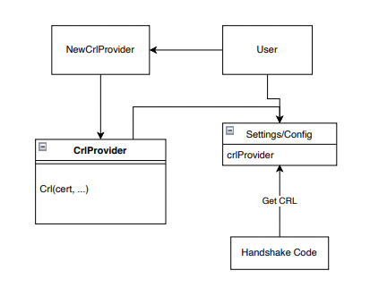
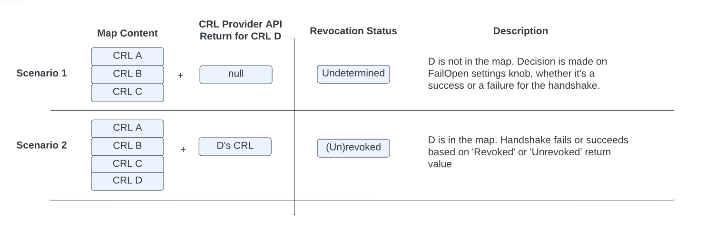
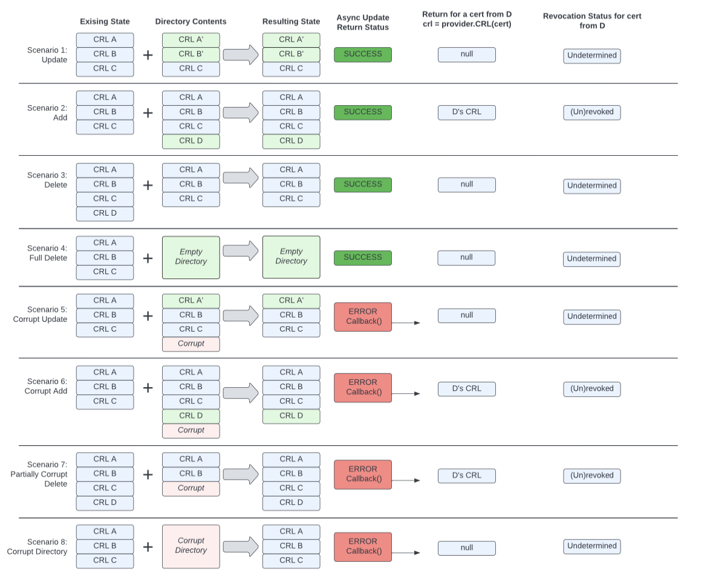
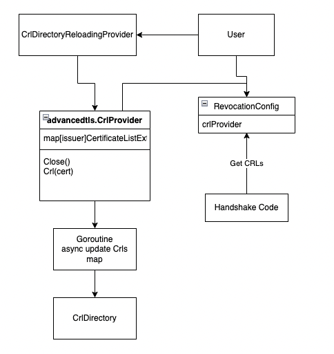

AXX: Certificate Revocation List Enhancements
----
* Author(s): Gregory Cooke (@gtcooke94, @gregorycooke)
* Approver: TODO 
* Status: TODO
* Implemented in: C, Go
* Last updated: TODO
* Discussion at: TODO

## Abstract

gRPC has an MVP implementation for CRLs (Certificate Revocation Lists). We wish to provide a more generic interface. In addition, we will provide two concrete implementations of this interface similar to Credential Reloading - a static provider and a directory reloader.


## Background

[RFC 5280](https://datatracker.ietf.org/doc/html/rfc5280) defines the desired behavior for Certificate Revocation Lists (CRLs). gRPC has an MVP implementation of this RFC for CRL handling in several languages, each with their own flavors - for example, C++ uses OpenSSL, whereas Go uses an implementation written in Go (and the stack in Java is significatly different). There are mismatches and deficiencies between the current Go and C++ implementations. Providing CRL reloading as a feature allows for more internal cohesion with the ideas behind credential reloading.

### Related Proposals:

* [L46: New TLS Credentials API](https://github.com/grpc/proposal/pull/205)

## Proposal
We seek to provide an alternate option for users to customize CRL handling. In a similar way that `CredentialReloading` is implemented, we will add a `CrlProvider`` interface through which gRPC fetches CRLs. In gRPC we will implement two providers (these match what we provide for certificates as well):

1. A `StaticCrlProvider` that takes a list of strings that represent CRL file content
1. A `CrlReloaderProvider` that periodically and asynchronously reloads a directory of CRLs.

Users can also implement the interface with whatever behaviors they specifically desire.

Per RFC5280, during revocation checking one of three status should be returned - `RevocationUnrevoked`, `RevocationRevoked`, and `RevocationUndetermined`. The user must specify whether `RevocationUndetermined` should be treated as `RevocationRevoked` or `RevocationUnrevoked` (failing open vs. failing closed).

Assumptions:
1. There should be no direct linkage between this interface and the creation/distribution of CRLs. gRPC is a user of CRLs and credentials, not a PKI itself.
1. The CRL Providers simply provide CRLs. The actual verification will be done by other pieces of the code (these are already written).
1. We will not support OSCP-style checking (OSCP is an alternative to CRLs, not another form of CRLs).



CrlProvider Interface Pseudocode:
```
public:
// Get the CRL that is associated with a cert. Provides good semantic
// consistency as most X509 APIs that try to get a CRL expect to get a cert
// passed in. In each language we may use an abstraction here that makes it easy
// to get CRL-lookup information from the certificate.
// Expected to use as read-only 
// Returns null if there isn't an associated CRL (as null is different than an
// empty CRL)
  CRL Crl(certficate/certificateInfo)
private:
  // Implementation for getting and storing CRLs
```

Example feature use:
```
opts = TlsOptions()
provider = CrlDirectoryReloaderProvider("/path/to/crl/directory", Duration(60 seconds))
opts.provider = provider
server = Server(opts)
```

### Map Content and API Outcomes

The diagram below describes the behavior of the API and why this or that outcome is produced. Here, "Map" is a generic way to represent some in-memory representation of the CRLs in a key-value store. “CRL Provider API Return” refers to the CRL return of the `CrlProvider` in the Pseudocode above.


The pseudo code snippet below illustrates the same idea:
```
<pseudo code in the handshaker when verifying cert>

RevocationStatus GetRevocationStatus(cert, crlProvider, settings) {
  crl = crlProvider.Crl(cert)
  revocationStatus = checkRevocation(crl, cert) // RevocationUndetermined for null CRL
  if revocationStatus is RevocationUndetermined {
      return settings.FailOpen ? Unrevoked : Revoked
  }
  return revocationStatus 
}
```

### Provider Implementation - Static Provider

This is a simple provider that takes in all CRLs to be used as raw strings during initialization, then returns them in the appropriate format when called. The CRLs will be stored in a mapping of a hash of the issuer to the CRL content.

### Provider Implementation - Directory Provider
This provider will periodically read CRL files in a given directory and update gRPCs internal representation of those CRLs. We expect this will be heavily used, as a directory of CRLs is very common for X509 CRL files. The CRLs will be stored in a mapping of a hash of the issuer to the CRL content - `map<issuer_hash, crl_object>`.
In the case that the directory and all files within are read completely during an update, we will treat the directory as the exact truth. This means if a CRL was in-memory and is no longer in the directory after the update, it will be removed in-memory.
In the case that there is an issue reading a file, we cannot be certain what exactly is happening. In particular, we enforce no naming convention on the CRL files, so if it cannot be read, we cannot know what it contains or what issuer it belongs to. We will do a best-effort safe update - for files which are read correctly, we can update those individual entries. Since we can't know the issuer if a file can't be read, it is unsafe to do deletion in this case. An overridable error callback will be called so the user can receive a signal that something has gone wrong with CRLs.
We will also require that users perform safe and atomic file/directory operations with their CRL files using filesystem primitives (for example, the copy-rename pattern). If users do not exercise good file management hygiene, we cannot guarantee any exact behavior. For example, if a user creates a directory and writes files one-by-one, there is a chance the directory reloader would update when only 1 file was present and this would be seen as a success (so this would overall be unspecified behavior because of bad file hygiene).
If a CRL is not found for an issuer this is fine - the verification code will return RevocationUndetermined per RFC5280, then the user will have a setting to fail-open or fail-closed indicating whether RevocationUndetermined should be treated as Unrevoked or Revoked respectively.

#### API Outcomes and Error Handling
Because CRLs involve reading/writing from the filesystem, we will have to deal with potential edge cases of bad files, bad updates, etc. From a high-level perspective, we are going to follow the Authz Policy design patterns - use existing information in case an update contains bad data. Startup behavior is not different from updates. Particularly in the case of updating CRLs, we don't want to error and crash the server if there is a bad update. However, we still want this error to be known, so we will have an optional and overridable error callback when CRLs fail to be read. This will let users tie in whatever alerting/monitoring they may want in these failure cases. This callback will be for notifications/alerting, it will not be a decision-making callback (it is expected the IO for CRLs will already be done in the background, so these errors would not be on the main path by design anyways). Users should use `RevocationUndertermined` combined with the FailOpen/FailClosed knob for decision making on uncertain CRLs.

These cases are all on a per-CRL level - a given CRL having an issue will not keep other good CRLs in an update batch to fail. The opposite behavior - failing the whole batch or dropping all the handshakes in the case of a bad CRL - might enable a DDOS-type attack vector.

Example behavior for a directory reloader:

At startup we read 3 CRL files (A, B, C) and construct a map as described above. During the handshakes, we return the CRLs from the map.
Then, a bad update happens and CRL C ends up corrupted, but A and B are good. When this directory is reloaded, the resulting map will have the newer A and B CRL, but the older C CRL (as this will not see any update). In addition, the CrlReadErrorCallback would be invoked when CRL C fails to be read. There is no linkage between the map's CRL C and the fact that there was a read failure. It is the user's responsibility to act on file issues after being notified via the error callback.
To further expand the scenario, if the update were to also include a new issuer's CRL D that was also corrupted, grpc would have no idea that CRL D exists at all. The error callback would be invoked, then grpc would treat it just like any other missing CRL file through returning RevocationUndetermined.

The following diagram visually represents the expected values for the async update of a directory, the provider return values, and the revocation status from checking CRL D:



## Rationale
The overall alternate approach to this proposal is to continue using the x509_hash_dir style CRLs that are already implemented. The existing approach is very strict on PKI design. gRPC is not a PKI, and we should be able to support CRLs in a more generic way without prescribing an exact structure to users' PKI. The new API design here is consistent with credential reloading and should be clear to users. It provides secure, useful defaults as well as an interface for more advanced users to implement for their specific needs.

This approach adds complexity to the user facing API, and a user overriding the provider interface poorly could result in undefined or inefficient behaviors. To counteract this, we will provide generally useful implementations and good documentation on requirements if a user is writing their own implementation.

We explicitly will not be supporting OSCP-style revocation . We want to stay inside the realm of RFC5280 and X509-style CRLs, and OSCP represents a departure from that standard. Notably, the API surface for OSCP is different - for OSCP one makes a call to an external service that returns the revocation status. Rather, we expect to be given CRLs and will check the revocation status in gRPC. In addition, OSCP requires external calls during the handshake, whereas with X509 CRL files everything can done locally.


## Implementation 
### Go
CRL checking in Go is entirely dependent upon setting the `tls.config.VerifyPeerCertificate` callback function to check CRLs. Currently, the Go implementation overrides this callback and from that calls `CheckChainRevocation(...)` which takes the certificate chain to be checked and the RevocationConfig. It gets the CRL of interest by calling `FetchIssuerCrl()` - we can use our provider in that function. Then it checks the cert chain against the relevant CRLs.

We will add CRL Provider code to the advancedtls module. All CRL related code is currently in the advancedtls module, so this would keep it all in the same place.  Revocation configurations will be added to the existing configuration options in `RevocationConfig`. There will be checks to ensure a user can exclusively use the new provider options or the already-implemented X509 hash directory options. Configuring both is a mistake.
```go
// RevocationConfig contains options for CRL lookup.
type RevocationConfig struct {
	// RootDir is the directory to search for CRL files.
	// Directory format must match OpenSSL X509_LOOKUP_hash_dir(3).
	RootDir string
	// AllowUndetermined controls if certificate chains with RevocationUndetermined
	// revocation status are allowed to complete.
	AllowUndetermined bool
	// Cache will store CRL files if not nil, otherwise files are reloaded for every lookup.
	Cache Cache

  // crlProvider and RootDir/Cache cannot both be set
+ CrlProvider crlProvider
}
```

The core CrlProvider interface will look as follows. Since x509 is a built in go library, we can safely use it in our API.
```go
type CRLProvider interface {
	// Callers are expected to use the returned value as read-only.
	CRL(cert x509.Certificate) (*CertificateListExt, error)

	// Close cleans up resources allocated by the Provider.
	Close()
}
```

Regarding sharing between connections - since the providers are in a high-level configuration, the same provider should be used across many individual connections and handshakes. [Here is an example of how the credential reloading provider is configured](https://github.com/grpc/grpc-go/blob/master/security/advancedtls/examples/credential_reloading_from_files/server/main.go#L63). In this example, the server would use this provider for all connections.

#### Directory Reloader Specifics

```go
type CrlDirectoryReloadingProvider struct {
	ReloadInterval time.Duration
	CrlDirectory string
     // maps issuer hash to crl
	crls map[string]*CertificateListExt
}
func (provider *CrlDirectoryReloadingProvider) Crl(x509.Certificate) (*CertificateListExt, error) {...}

func (provider *CrlDirectoryReloadingProvider) run(ctx context.Context) {
	// golang ticker that refreshes the Crls
}
```

Reference Code:
* [IdentityCertificateOptions](https://github.com/grpc/grpc-go/blob/2aa261560586eab6795301a3670d9dfdd7308625/security/advancedtls/advancedtls.go#L115)
* [certificateListExt](https://github.com/grpc/grpc-go/blob/2aa261560586eab6795301a3670d9dfdd7308625/security/advancedtls/crl.go#L88)

### C/C++
We are still reliant upon BoringSSL actually doing handshakes, so we still want to feed the CRLs into BoringSSL, just in a more customized way than the current hash_dir lookup. From a grpc code level perspective, all we have to do is configure BoringSSL to load CRLs in our customized way. Looking at BoringSSL code, we can [see here](https://github.com/google/boringssl/blob/e4acd6cb568214b1c7db4e59ce54ea2e1deae1f5/crypto/x509/x509_vfy.c#L834) that if there is a `ctx->get_crl` function, that is called and that is how CRLs are retrieved. Otherwise, it goes into default behaviors. We can set this function with [X509_STORE_set_get_crl](https://www.openssl.org/docs/manmaster/man3/X509_STORE_set_get_crl.html), which:

> "sets the function to get the crl for a given certificate x. When found, the crl must be assigned to *crl. This function must return 0 on failure and 1 on success. If no function to get the issuer is provided, the internal default function will be used instead."

 We will set this function to get the CRL from the CRLProvider if it is configured. We will add a `grpc::experimental::CrlProvider` that can be configured in `grpc::experimental::TlsChannelCredentialOptions`. This value and `set_crl_directory` cannot both be configured. The Provider will be configured in these options by the user and supplied as a pointer to grpc. Its lifetime needs to be managed by the user, and any handshake happening with a provider configured should share this provider, so the user can configure this to be shared across many connections if desired. 

 ```c++
 class TlsCredentialsOptions {
...
// Can't be used in conjunction with set_crl_directory, will error if both are tried
void set_crl_provider(std::shared_ptr<CrlProvider> crl_provider);
...
}

class CrlProvider {
 public:
  virtual Crl Crl(const Cert& cert) = 0;
}
```

The above will be a passthrough to `grpc_tls_credentials_options` and `grpc_tls_crl_provider` in src/core/lib/security. These are used in the tls_security_connector layer, which then feeds to the ssl_transport_security layer which actually constructs the handshakers and configures BoringSSL.

The footprint of the TlsCredentialProvider is more complex than needed for the scope of our CRL work, largely because we are supporting X509 CRL files and not something that needs to make calls such as OSCP. Thus, we can look at the footprint of the custom tls CertificateVerifier to inform how these user-facing options cascade through the code - the provider will have an API that takes a certificate and returns the CRL content. This function will be wrapped by another function that is supplied to X509_STORE_set_get_crl and will be called synchronously when a CRL is needed during verification. It is expected that this CRL will be there, ready to return and we will not have to do any blocking operations like IO or network calls.

There is already plumbing in these spots for the `crl_directory`, so it shouldn't be too difficult to plumb this around.

Currently, the code that consumes the crl_directory and configures BoringSSL looks like this, in ssl_transport_security.cc:

```C
      if (options->crl_directory != nullptr &&
          strcmp(options->crl_directory, "") != 0) {
        gpr_log(GPR_INFO, "enabling server CRL checking with path %s",
                options->crl_directory);
        X509_STORE* cert_store = SSL_CTX_get_cert_store(impl->ssl_contexts[i]);
        X509_STORE_set_verify_cb(cert_store, verify_cb);
        if (!X509_STORE_load_locations(cert_store, nullptr,
                                       options->crl_directory)) {
          gpr_log(GPR_ERROR, "Failed to load CRL File from directory.");
        } else {
          X509_VERIFY_PARAM* param = X509_STORE_get0_param(cert_store);
          X509_VERIFY_PARAM_set_flags(
              param, X509_V_FLAG_CRL_CHECK | X509_V_FLAG_CRL_CHECK_ALL);
          gpr_log(GPR_INFO, "enabled server CRL checking.");
        }
      }
```

We'll further add if/else conditionals in this block to use `options->crl_provider` if it has a value, and instead of `X509_STORE_load_locations` we will call `X509_STORE_set_get_crl`, and that will be a function built to pull a given issuer's CRL from the provider. By design of the user-facing options structure, it will not be valid to have both the crl_provider and the crl_directory set. We may eventually deprecate the crl_directory setting entirely and replace the behavior it provides with a concrete provider implementation.
We will also provide a periodic directory watcher implementation of this interface that will take in a directory then periodically and asynchronously reload all CRLs in this directory in a thread-safe manner through the provider/distributor/watcher chain. This code will look very similar to FileWatcherCertificateProvider (a CredentialProvider that asynchronously reloads a given key/cert pair and root cert).
