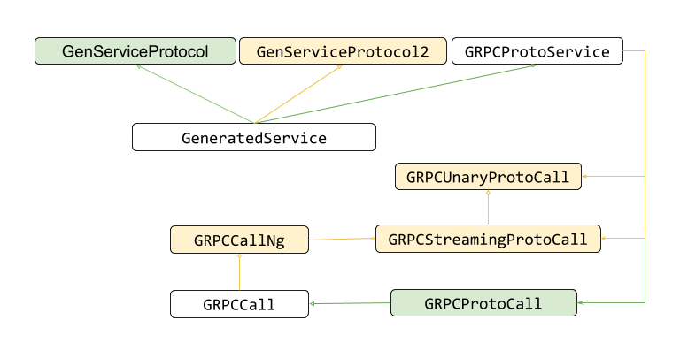

Proposal to A New gRPC Objective-C API
----
* Author(s): muxi
* Approver: srini100
* Status: Final
* Implemented in: Objective-C
* Last updated: 2019-01-04
* Discussion at: https://groups.google.com/forum/#!topic/grpc-io/Dmbfq416NTo

## Abstract

This document proposes a new Objective-C API which fixes some long lasting issues of the current API.

## Background

gRPC Objective-C API has been used by multiple users for a while. During this time gRPC team received feedback of the limitations and issues related to the API, and also see some issues. Some of these issues makes adoption of gRPC Objective-C less favourable to some potential users. 

### Global configurations
Current gRPC Objective-C API requires users to configure gRPC calls in multiple different ways. One way is to configure with a private method to GRPCCall. Configurations following this method includes response dispatch queue, call idempotency, etc:
```objectivec
@class GRPCCall
- (void)setResponseDispatchQueue:...
@end
```
Another way of configuration is using global method of GRPCCall that configure corresponding parameters for each "host" (i.e. remote address). All calls to the same host has to use the same parameters. Most parameters follow this convention of configuration, including Cronet, channel args, OAuth2 credentials, etc:
```objectivec
@class GRPCCall
+ (void)setSomeConfiguration:... forHost:(NSString *)host;
@end
```

The issue with the above convention is that there is no isolation between different users of gRPC Objective-C in a single process. For example, if two libraries depend on gRPC, one would like to enable Cronet while the other one does not, when an app depends on both of these libraries their configuration would conflict with each other.

### GRXLibrary
The original purpose of GRXLibrary is to develop a gRPC-independent library following reactive programming pattern, which provides intuitive tools for users to extend the behavior of gRPC. For example, one expected use case was to use the GRXMappingWriter to make message conversion in the middle of a chain of writers before it is passed to the call.

However in the past we found not many users interested in taking advantage of the extensibility of GRXLibrary. When the user wants to modify something, they tend to wrap the service classes rather than inserting a writer in the middle. On the other hand, GRXLibrary objects introduced quite some issues ([#6113](https://github.com/grpc/grpc/pull/6113), [#8131](https://github.com/grpc/grpc/pull/8131), [#10533](https://github.com/grpc/grpc/pull/10533), [#10957](https://github.com/grpc/grpc/pull/10957), and more). The state transitions and concurrency design in the library is not straight forward too.

### Channel Caching
In current gRPC Objective-C library, if two calls are to the same remote host, they share the channel and all channel configurations. This may not meet the needs for some users who, for example, would like different channel args or a new underlying TCP connection for the call.

## Proposal
The objective of the proposed API is to introduce a new set of Objective-C APIs that
* Isolate configurations between gRPC calls
* Allow inheritance of default configuration from service (GRPCProtoService) to call
    * The users should be allowed to overwrite the default service configs for each call
* Does not require user to use GRXLibrary, but rather using the call itself to send/receive message
* Allow the old APIs to continue working so that current users do not get broken
* Continue to support both proto and non-proto usage of the library
* Achieve better channel caching based on signature from a richer set of configurations

### Design Overview
The key change proposed is to aggregate all configurations related to gRPC calls in a single object GRPCCallOptions. Each gRPC user creates and tweaks their own GRPCCallOptions instance to configure the calls. This strategy provides satisfactory configuration isolation among users in the same process.

The class GRPCCallOptions include options for both channels and calls in order to hide the concept of channel from users. Internally, these parameters are processed separately by call (GRPCCall) and channel (GRPCChannel) objects.

To follow gRPC's concept of channel and take advantage of reusing a channel, gRPC iOS internally caches channels and reuse them whenever possible. When a call finishes, its channel is cached and can be accessed by signature, which is the hash of the channel's remote host, credentials, and channel args. If another call's options have the same signature, the cached channel is reused.

In order to keep backwards compatibility and stability of the current API, the new API is designed to wrap the current API, with both APIs exposed to our users. A completely new implementation may be developed for the new API in the future when the current API is deprecated.

#### Example Usage of the proposed APIs
Example usage of proto-based unary call:
```objectivec
// Service scoped options
GRPCMutableCallOptions *options = [[GRPCMutableCallOptions alloc] init];
options.initialMetadata = …;
options.someParameter = …;

// Make service to a host. `options` is specified as the default configs for all
// the calls generated by this service.
GeneratedService *service =
    [GeneratedService serviceWithHost:... callOptions:options];

// Call scoped options; may be used to overwrite the default options
GRPCMutableCallOptions *alternativeOptions = service.options;
alternativeOptions.someParameter = kSomeAlternativeValue
alternativeOptions.initialMetadata =
    [[alternativeOptions.initialMetadata mutableCopy] addObject:];
SomeCallRequest *message = [SomeCallRequest message];

// Start a call with alternativeOptions overwritting the default options derived
// from the service. We assume `self` implements the protocol
// @GRPCProtoResponseHandler to receive responses and pass it to the call.
GRPCUnaryProtoCall call = [service someUnaryCallWithMessage:message
                                            responseHandler:self
                                                callOptions:alternativeOptions];
[call start];
...
// Optional cancellation of the call
[call cancel];
```

Example usage of proto based streaming call:
```objectivec

// Service scoped options (omitted, same as the example above)
...

// Make service to a host.
GeneratedService *service =
    [GeneratedService serviceWithHost:... callOptions:options];

// Call scoped options (omitted, same as the example above)
...

// Start a call
GRPCStreamingProtoCall *call =
    [service someStreamingCallWithHandler:self
                                  callOptions:alternativeOptions];
[call start];
// Write a proto message to the call
SomeCallRequest *message = [SomeCallRequest message];
[call writeMessage:messgae];
...
[call finish];

// Optional cancellation of the call (called before finish)
[call cancel];
```

Example usage of non-proto-based call:
```objectivec
GRPCMutableCallOptions *options = [[GRPCMutableCallOptions alloc] init];
options.initialMetadata = …;
options.someParameter = …;

// GRPCRequestOptions is typically generated by service. When using GRPCCall
// directly, the user has to specify it
GRPCRequestOptions *request = [[GRPCRequestOpitons alloc] init];
request.host = ...;
request.path = ...;
GRPCCall2 *call = [[GRPCCall2 alloc] initWithRequestOptions:requestOptions responseHandler:self callOptions:options ];
[call start];

// Write raww data to the call
NSData *data = ...;
[call writeWithData:data];
...
[call finish];

// Optional cancellation of the call (called before finish)
[call cancel];
```

### Design Details
A figure of the relationships of the main gRPC Objective-C classes exposed as part of the APIs are as below:



The green items are classes and relationships that already exist in gRPC and is not changed. The yellow items are new classes for the new API. The white items have both legacy and new components.

#### GeneratedServiceProtocol2
This interface is generated by code generator. Each method corresponds to an RPC call. User can implement this interface with their own implementation.
```objectivec
@protocol SomeService2 <NSObject>

- (GRPCUnaryProtoCall *)someUnaryCallWithMessage:(RequestType *)message
      responseHandler:(id<GRPCProtoResponseHandler>)callbacks
          callOptions:(GRPCCallOptions *)callOptions;

- (GRPCStreamingProtoCall *)someStreamingCallWithCallbacks:
                                (id<GRPCProtoResponseHandler>)callbacks
                            callOptions:(GRPCCallOptions *)callOptions;

@end
```

#### GeneratedService
The same generated service implementation as gRPC currently have, except that it also implements methods in GeneratedServiceProtocol2.
```objectivec
@interface SomeService : GRPCProtoService<SomeService, SomeService2>

...

@end
```

GRPCProtoService
GRPCProtoService is the glue between a generated service and the proto calls. It provides RPCToMethod method to convert a method of a generated service into a gRPC call with parameters to the host and the path.

The new GRPCProtoService class keeps the same old API to take care of methods in GeneratedService. Two more overloaded RPCToMethod methods are also added in to return the new call objects.

*Users are expected to use the generated code to call these functions rather than directly using this interface*
```objectivec
@interface GRPCProtoService : NSObject

- (instancetype)initWithHost:(NSString *)host
                 packageName:(NSString *)packageName
                 serviceName:(NSString *)serviceName
                 callOptions:(GRPCCallOptions *)callOptions
                             NS_DESIGNATED_INITIALIZER;

// For old APIs
- (GRPCProtoCall *)RPCToMethod:(NSString *)method
                requestsWriter:(GRXWriter *)requestsWriter
            responsesWriteable:(id<GRXWriteable>)responsesWriteable;

// For new APIs
// For unary calls
- (GRPCProtoCall2 *)RPCToMethod:(NSString *)method
                         message:(id)message
                 responseHandler:(id<GRPCProtoResponseHandler>)callbacks
                     callOptions:(GRPCCallOptions *)callOptions;
                   responseClass:(Class)responseClass;
// For streaming calls
- (GRPCProtoCall2 *)RPCToMethod:(NSString *)method
                 responseHandler:(id<GRPCProtoResponseHandler>)callbacks;
                     callOptions:(GRPCCallOptions *)callOptions;
                   responseClass:(Class)responseClass;

@end
```

#### GRPCUnaryProtoCall
This object wraps GRPCStreamingProtoCall to make unary calls.
```objectivec
@interface GRPCUnaryProtoCall : NSObject

// Initialize and start the call. Users are expected to use the generated code to call the initializer rather than directly using this interface
- (instancetype)initWithRequestOptions:(GRPCRequestOptions *)requestOptions
                               message:(GPBMessage *)message
                       responseHandler:(id<GRPCProtoResponseHandler>)callbacks
                           callOptions:(GRPCCallOptions *)callOptions;
                         responseClass:(Class)responseClass;

- (void)start;

- (void)cancel;
@end
```

#### GRPCStreamingProtoCall
This object uses GRPCCall2 to make calls, but apply protobuf serialization/deserialization to messages sent and received. A GRPCStreamingProtoCall object is returned to the user and allows the user to write messages to the server or cancel the call.
```objectivec
@interface GRPCStreamingProtoCall : NSObject

// Initialize and start the call. Users are expected to use the generated code to call the initializer rather than directly using this interface
- (instancetype)initWithRequestOptions:(GRPCRequestOptions *)requestOptions
                     responseHandler:(id<GRPCProtoResponseHandler>)callbacks
                           callOptions:(GRPCCallOptions *)callOptions;
                         responseClass:(Class)responseClass;
- (void)start;
- (void)cancel;
- (void)writeWithMessage:(GPBMessage *)message;
- (void)finish;

@end
```

#### GRPCCallOptions
Object that aggregates the configurations related to gRPC calls. It includes two categories of options; one for individual calls and one for channels. The options for channel will affect the underlying channel to be used for this particular call.
```objectivec
@interface GRPCCallOptions : NSObject<NSCopying, NSMutableCopying>

// Call configurations
@property(readonly) NSString *serverAuthority;
@property(readonly) NSTimeInterval timeout;
@property(copy, readonly) NSString *oauth2AccessToken;
@property(readonly) id<GRPCAuthorizationProtocol> authTokenProvider;

// Channel configurations; affects channel signature
@property(copy, readonly) NSString *userAgentPrefix;
@property(readonly) NSUInteger responseSizeLimit;
@property(readonly) GRPCCompressAlgorithm compressAlgorithm;
@property(readonly) BOOL enableRetry;
@property(readonly) NSTimeInterval keepaliveInterval;
@property(readonly) NSTimeInterval keepaliveTimeout;
@property(readonly) NSTimeInterval connectMinTimeout;
@property(readonly) NSTimeInterval connectInitialBackoff;
@property(readonly) NSTimeInterval connectMaxBackoff;
@property(copy, readonly) NSDictionary *additionalChannelArgs;
@property(copy, readonly) NSString *pemRootCert;
@property(copy, readonly) NSString *pemPrivateKey;
@property(copy, readonly) NSString *pemCertChain;
@property(readonly) GRPCTransportType transportType;
@property(copy, readonly) NSString *hostNameOverride;
@property(readonly) id logContext;
@property(copy, readonly) NSString *channelPoolDomain;
@property(readonly) NSUInteger channelId;

@end

@interface GRPCMutableCallOptions : GRPCCallOptions<NSCopying, NSMutableCopying>

@property(readwrite) NSString *serverAuthority;
@property(readwrite) NSTimeInterval timeout;
@property(copy, readwrite) NSString *oauth2AccessToken;
@property(readwrite) id<GRPCAuthorizationProtocol> authTokenProvider;
@property(copy, readwrite) NSDictionary *initialMetadata;
@property(copy, readwrite) NSString *userAgentPrefix;
@property(readwrite) NSUInteger responseSizeLimit;
@property(readwrite) GRPCCompressAlgorithm compressAlgorithm;
@property(readwrite) BOOL enableRetry;
@property(readwrite) NSTimeInterval keepaliveInterval;
@property(readwrite) NSTimeInterval keepaliveTimeout;
@property(readwrite) NSTimeInterval connectMinTimeout;
@property(readwrite) NSTimeInterval connectInitialBackoff;
@property(readwrite) NSTimeInterval connectMaxBackoff;
@property(copy, readwrite) NSDictionary *additionalChannelArgs;
@property(copy, readwrite) NSString *pemRootCert;
@property(copy, readwrite) NSString *pemPrivateKey;
@property(copy, readwrite) NSString *pemCertChain;
@property(readwrite) GRPCTransportType transportType;
@property(copy, readwrite) NSString *hostNameOverride;
@property(readwrite) id logContext;
@property(copy, readwrite) NSString *channelPoolDomain;
@property(readwrite) NSUInteger channelId;

@end
```

#### GRPCCall2
New API for a gRPC call. For now it wraps GRPCCall and uses that to make the actual call. In the future when the old API is to be deprecated, a new implementation can be written under the hood.
```objectivec
// Call parameters that should be typically provided by the generated code
@interface GRPCRequestOptions
@property(copy, readwrite) NSString *host;
@property(copy, readwrite) NSString *path;
@property(readwrite) GRPCCallSafety safety;
@end

// The protocol that allows a class to process the responses from the servers.
@protocol GRPCResponseHandler
// The dispatch queue to be used for issuing the responses.
@property (readonly)dispatch_queue_t dispatchQueue;

@optional
- (void)receivedInitialMetadata:(NSDictionary *)initialMetadata;
- (void)receivedMessage:(id)message;
- (void)closedWithTrailingMetadata:(NSDictionary *)trailingMetadata error:(NSError *)error;

@end

@interface GRPCCall2 : NSObject

- (instancetype)init NS_UNAVAILABLE;
- (instancetype)initWithRequestOptions:(GRPCRequestOptions *)requestOptions
                       responseHandler:(id<GRPCResponseHandler>)callbacks
                           callOptions:(GRPCCallOptions *)callOptions NS_DESIGNATED_INITIALIZER;

- (instancetype)initWithRequestOptions:(GRPCRequestOptions *)requestOptions
                       responseHandler:(id<GRPCResponseHandler>)callbacks

- (void)start;
- (void)cancel;

- (void)writeWithData:(NSData *)data;
- (void)finish;

// Allows user to acquire the original parameters passed to the call
@property(atomic, readonly, copy) GRPCCallOptions *options;
@property(atomic, readonly, copy) GRPCRequestOptions *request;

@end
```

#### GRPCCall
GRPCCall was the main class representing a gRPC call. In the new design, GRPCCall keeps mostly of its current interface to keep backwards compatibility. One additional interface is added to GRPCCall to pass in the configurations with the callOptions parameter. If the parameter is nil, the call uses the legacy global settings instead. Otherwise, it uses the configurations specified in callOptions.
```objectivec
@interface GRPCCall : GRXWriter

- (instancetype)initWithHost:(NSString *)host
                        path:(NSString *)path
                  callSafety:(GRPCCallSafety)safety
              requestsWriter:(GRXWriter *)requestsWriter
                 callOptions:(GRPCCallOptions *)callOptions;

...

@end
```

### Other related changes

#### GRPCChannel
GRPCChannel class has been a simple wrapper around the gRPC core's channel. In the new design, its global methods also manages the channel cache. We also refactor out creation of the channels to factory classes.
```objectivec
// GRPCChannel.h
@interface GRPCChannel : NSObject

// Obtain a channel to a particular host based on @c options.
// The returned channel may be a newly created channel or a channel in the cache.
+ (nullable instancetype)channelWithHost:(NSString*)host
                                 Options:(GRPCCallOptions*)options
- (nullable grpc_call *)unmanagedCallWithPath:(nonnull NSString *)path
                              completionQueue:(nonnull GRPCCompletionQueue *)queue
                                  callOptions:(nonnull GRPCCallOptions *)callOptions;

@end
```
```objectivec
// GRPCChannel.m
// Configurations and signature for a channel
@interface GRPCChannelConfiguration
@property(atomic, copy, readwrite) NSString* host;
@property(atomic, strong, readwrite) GRPCCallOptions *options;

@property(readonly) id<GRPCChannelFactory> channelFactory;
@property(readonly) NSMutableDictionary *channelArgs;

- (nullable instancetype)initWithHost:(NSString*)host
                          callOptions:(GRPCCallOptions*)callOptions;

@end

// Channel pool imprementation
static NSMutableDictionary *kChannelPool;
@implementation GRPCChannel

- (nullable instancetype)initWithConfiguration:(GRPCChannelConfiguration *)config {
  ...
}

+ (nullable instancetype)channelWithHost:(NSString*)host 
                                 Options:(GRPCCallOptions*)options {
  // Grab channel from cache or create a new one
  GRPCChannelConfiguration* channelConfig =
      [[GRPCChannelConfiguration alloc] initWithHost:host Options:options];
  GRPCChannel* channel = kChannelPool[channelOptions];
  if (channel == nil) {
    channel = [[GRPCChannel alloc] initWithConfiguration:channelConfig];
    kChannelPool[channelConfig] = channel;
  }
  return channel;

@end
```

#### GRPCHost
Since GRPCChannel manages channel cache, the only reason GRPCHost still exists is for backwards compatibility. Parameters set with the old configuration convention are all stored in GRPCHost and hashed with host name, which is the same as the current design.

When a call starts, if there's not a specified callOptions parameter, the call will fetch the parameters stored in GRPCHost pool based on its remote host name, then generate GPRCCallOption object based on these parameters.

## Rationale

### New API wrapping the current API
There were a few options to introduce the new API while maintaining backwards compatibility, including
* Wrap the old implementation with the new API;
* Write an implementation for the new API, and wrap it with the old API;
* Write an implementation for the new API while keep the old implementation.

We chose the former approach since the current implementation is stable and is sufficient for the use cases supported by the new API. When the current API is deprecated, new implementation can be developed for the API.

## Implementation

A prototype of the implementation is currently available in #16190. @muxi will further polish the implementation to make it work for production.
