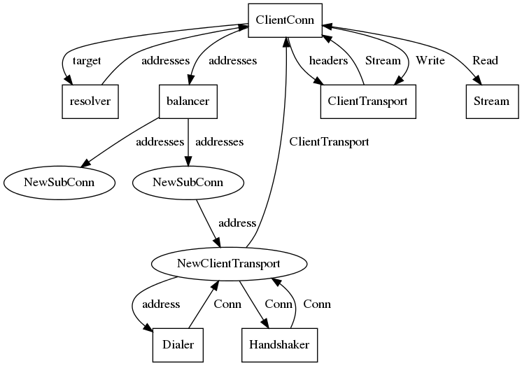

L37: Go Custom Transports
----
* Author(s): dfawley
* Approver: a11r
* Status: Draft
* Implemented in: Go
* Last updated: 2018-09-20
* Discussion at: https://groups.google.com/forum/#!topic/grpc-io/TIGVcfQ_Ipg

## Abstract

Create an API to allow custom client and server transports in grpc-go.

## Background

grpc-go currently supports only a single, hardcoded HTTP/2 transport layer.
However, the gRPC semantics and API can be transmitted by alternate means,
e.g. HTTP/1.1.  Some environments, like WebAssembly, can't support grpc-go's
full transport, but could support an alternate version of it.  It is also
possible to create different types of connections besides raw byte transports,
for example an in-process transport capable of copying messages instead of
serializing and deserializing.

Several grpc-go github issues have been filed requesting this feature; all have
been consolidated to [a canonical
issue](https://github.com/grpc/grpc-go/issues/906).

## Proposal

The main goal of this proposal is to allow for users to inject custom transports
for clients and servers.  Some additional design goals of this proposal:

1. Transport and stream APIs should expose only gRPC semantics as defined in the
   [Call Semantics Specification](https://github.com/grpc/grpc/pull/15460) and
   hide HTTP/2 semantics and grpc wire protocol semantics).
1. Transports should be message-based, not byte-based, to facilitate an
   in-process transport that uses `proto.Clone()` for efficiency.
   - Note that retry support requires byte-based support from all transports,
     because we need to cache multiple sent messages, which our streaming API
     does not make possible without serialization.
1. Unexpected asynchronous events should be delivered by callbacks, not
   channels.  Channels may be more idiomatic for Go, but require a goroutine to
   monitor them, which leads to worse performance (in the case of streams) and
   more complex code.  See [#2219](https://github.com/grpc/grpc-go/pull/2219)
   which simplifies our transport monitoring by using callbacks.  Sending and
   receiving data should remain synchronous to mirror grpc's external API.
1.  The  API  for  creating  connections will  be  based  upon  transports,  not
   `net.Conn`s. How to connect (e.g.  `net.Dial`) is an implementation detail of
   the  transport.  Likewise, credentials  handshaking  must  happen within  the
   transport.
1. No stable external APIs may be changed (one experimental API must be
   changed).

This feature consists of the following components:

1. (Client) Allow resolvers and balancers to specify different address types.
1. (Client) Define a method for selecting which transport to use for each
   address type.
1. (Server) Define a new API for serving with *transport* listeners instead of
   `net.Listener`s.
1. (Client and Server) Design a simple API for transports and streams.

### Client Address Types

The following diagram shows how grpc-go currently creates a transport and
streams within the transport on the client-side.



[Link to SVG file](L37_graphics/client_diagram.svg)

First the target given to `grpc.Dial` is passed to the resolver with the scheme
identified by the target.  This converts the name into a list of addresses.
These addresses are then given to the load balancer, which creates `SubConn`s
containing these addresses.  The `SubConn` manages itself and creates
`ClientTransport`s using the addresses by calling a hard-coded constructor.

Rather than using a hard-coded constructor, the `resolver` package's `Address`
struct will be extended to contain a string field to indicate the type of the
address.  There is already a `Type` field to indicate whether addresses are
gRPCLB servers or backend addresses.  To avoid confusion, this will be renamed
to `ServerType`, and the new field will be named `TransportType`.

Summary of API changes proposed:

- `resolver.Address`: rename `Type` to `ServerType`; add `TransportType string`

### Client Transport Selection

When the `SubConn` receives an `Address` from the balancer, it will look up the
`TransportType` name in a global registry similar to the registries for
resolvers and balancers.  This will reference a `client.TransportBuilder`
(defined below) that allows the `SubConn` to create a transport for the address.

Summary of API changes proposed:

- In the new `transport/client` package, include `Register` and `Get` methods,
  defined below.

### Server Transport Listeners

grpc-go currently requires `net.Listener`s to be passed to `grpc.Serve` in order
to begin serving RPCs.  This must be changed, as some types of transports will
not be backed by a traditional `net.Conn`.  Instead, a new
`Server.ServeTransport` function will be defined that listens for new `Stream`s.
The user is responsible for managing connections within the transport listener.

Summary of API changes proposed:

- New function in `grpc` package:
  ```go
  // ServeTransport accepts incoming Streams from the TransportListener,
  // creating a new service goroutine for each and handling them using the
  // registered handlers.  ServeTransport returns when all listeners and streams
  // have been stopped.  Returns the error from tl.  tl will be closed if the
  // Server was already stopped.
  func (s *Server) ServeTransport(tl *server.TransportListener) error
  ```

### Transport and Stream APIs

The current `ClientTransport` and `Stream` API communicates with the `Stream` by
calling `Read` on the `Stream` but `Write` on the `Transport` (passing in the
`Stream`).  There are also some shared responsibilities of managing transports
and streams between the transport and the grpc layer.  This design attempts to
correct some of these problems and also provide an API surface that aligns with
the [Call Semantics Specification](https://github.com/grpc/grpc/pull/15460).

The following package structure (under `google.golang.org/grpc/`) will be
created:

- `transport`: Definition of types shared between client and server
- `transport/client`: Definition of client-side transport and stream
- `transport/server`: Definition of server-side transport and stream

```go
package transport

// OutgoingMessage is a message to be sent by gRPC.
type OutgoingMessage interface {
	// Marshal marshals to a byte buffer and returns information about the
	// encoding, or an error.  Repeated calls to Marshal must always return the
	// same values.
	Marshal() ([]byte, *MessageInfo, error)
}

// IncomingMessage is a message to be received by gRPC.
type IncomingMessage interface {
	// Unmarshal unmarshals from the scatter-gather byte buffer given.
	Unmarshal([][]byte, *MessageInfo) error
}

// MessageInfo contains details about how a message is encoded.
type MessageInfo struct {
	// Encoding is the message's content-type encoding (e.g. "proto").
	Encoding string
	// Compressor is the compressor's name or the empty string if compression
	// is disabled.
	Compressor string
}
```


```go
package client

// TransportBuilder constructs Transports connected to addresses.
type TransportBuilder interface {
	// Build connects to the address provided.  It must return a Transport that
	// is ready to accept new streams or an error.
	Build(context.Context, resolver.Address, TransportMonitor, TransportBuildOptions) (Transport, error)
}

type TransportBuildOptions struct {
	// Options contains opaque Transport configuration.
	// May contain: PerRPCCredentials, TransportCredentials,
    // keepalive.ClientParameters, etc.
	Options []interface{}
}

// A TransportMonitor is a monitor for client-side transports.
type TransportMonitor interface {
	// OnError reports that the Transport has closed due to the error provided.
	// Existing streams may or may not continue.
	//
	// Once called, no further calls in the TransportMonitor are valid.
	OnError(error)
}

// A Transport is a client-side gRPC transport.
type Transport interface {
	// NewStream begins a new Stream on the Transport.  Blocks until sufficient
	// stream quota is available, if applicable.  If the Transport is closed,
	// returns an error.
	NewStream(context.Context, NewStreamOptions) (Stream, error)

	// GracefulClose closes the Transport.  Outstanding and pending Streams
	// created by NewStream continue uninterrupted and this function blocks
	// until the Streams are finished.  Close may be called concurrently.
	GracefulClose()

	// Close closes the Transport.  Outstanding and pending Streams created by
	// NewStream are canceled.
	Close()

	// Info returns information about the transport's current state.
	Info() TransportInfo
}

// TransportInfo contains information about the transport's current state.  All
// information is optional.
type TransportInfo struct {
	RemoteAddr net.Addr // the address of the server (typically an IP/port).
	IsSecure   bool // if set, WithInsecure is not required and Per-RPC Credentials are allowed.
	AuthInfo   credentials.AuthInfo
}

// NewStreamOptions defines information used to begin a new stream.
type NewStreamOptions struct {
	Method           string      // required: remote server's RPC method
	Authority        string      // for transports supporting virtual hosting
	Metadata         metadata.MD // optional
	MaxRecvMsgSize   *int        // if non-nil, maximum size for a received message

    Options          []interface{} // stream-specific options, e.g. content sub-type
}

// Stream defines all necessary RPC functions.
type Stream interface {
	// SendMsg queues the message m to be sent by the Stream and returns true
	// unless the Stream terminates before queuing the message.
	SendMsg(m transport.OutgoingMessage, opts StreamSendMsgOptions) bool

	// RecvHeader blocks until the Stream receives the server's header and then
	// returns it.  Returns nil if the Stream terminated without a valid
	// header.  Repeated calls must return the same header.
	RecvHeader() *ServerHeader

	// RecvMsg receives the next message on the Stream into m and returns true
	// unless the Stream terminates before a full message is received.
	RecvMsg(m transport.IncomingMessage) bool

	// RecvTrailer blocks until the Stream receives the server's trailer and
	// then returns it.  Returns a synthesized trailer containing an
	// appropriate status if the RPC terminates before receiving a trailer from
	// the server.  Repeated calls must return the same trailer.
	//
	// If all messages have not be retrieved from the stream before calling
	// RecvTrailer, subsequent calls to RecvMsg should immediately fail.  This
	// is to prevent the status in the trailer from changing as a result of
	// parsing the messages.
	RecvTrailer() Trailer

	// Cancel unconditionally cancels the RPC.  Queued messages may or may not
    // be sent.  If the stream does not already have a status, the one provided
	// (which must be non-nil) is used.
	Cancel(*status.Status)

	// Info returns information about the stream's current state.
	Info() StreamInfo
}

// StreamSendMsgOptions defines options used by Stream.SendMsg.
type StreamSendMsgOptions struct {
	CloseSend bool          // set if this is the final outgoing message on the stream.
	Options   []interface{} // E.g. whether to compress this message.
}

// Trailer defines the information in the server's trailer.
type Trailer struct {
	Status   *status.Status
	Metadata metadata.MD
}

// ServerHeader contains header data sent by the server.
type ServerHeader struct {
	Metadata metadata.MD
}

// StreamInfo contains information about the stream's current state.
//
// All information is optional.  Fields not supported by a Stream returning
// this struct should be nil.  If a transport does not support all features,
// some grpc features (e.g. transparent retry or grpclb load reporting) may not
// work properly.
type StreamInfo struct {
	// DataReceived is true iff the client received any data for this stream
	// from the server (e.g. partial header bytes), false if the stream ended
	// without receiving any data, or nil if data may still be received.
	DataReceived *bool

	// Unprocessed is true if the server has confirmed the application did not
	// process this stream*, false if the server sent a response indicating the
	// application may have processed the stream, or nil if it is uncertain.
	//
	// In HTTP/2, this is true if a RST_STREAM with REFUSED_STREAM is received
	// or if a GOAWAY including this stream's ID is received.
	Unprocessed *bool
}

func Register(name string, ctb TransportBuilder)

func Get(name string) TransportBuilder  // May be moved to internal.
```

```go
package server

// TransportListener provides Streams to be handled by grpc.
type TransportListener interface {
	// Accept blocks until a new Stream is created.  Returns an error when the
	// listener should stop being used.
	Accept() (Stream, error)

	// GracefulClose causes the TransportListener to stop accepting new
	// incoming streams, and returns when all outstanding streams have
	// completed.  Pending and future calls to Accept should return a non-nil
	// error.
	GracefulClose()

	// Close immediately closes all outstanding connections and streams.
	// Pending and future calls to Accept should return a non-nil error.
	Close()
}

// Header defines the fields set in the client header.
type ClientHeader struct {
	MethodName string
	Metadata   metadata.MD
}

// Trailer defines the information contained in the server's trailer.
type Trailer struct {
	Status   status.Status
	Metadata metadata.MD
}

// Stream defines all necessary RPC functions.
type Stream interface {
	// RecvHeader returns the client's header.
	RecvHeader() ClientHeader

	// RecvMsg receives the next message on the Stream into m and returns true
	// unless the Stream terminates before a full message is received.
	RecvMsg(m transport.IncomingMessage) bool
	// SendHeader immediately sends the header to the client.  Returns true
    // unless the Stream has encountered an error.
	SendHeader(Header) bool
	// SendMsg queues the message m to be sent by the Stream and returns true
	// unless the Stream terminates before queuing the message.
	SendMsg(m transport.OutgoingMessage, opts StreamSendMsgOptions) bool
	// Close terminates the RPC and sends the trailer provided.  All subsequent
	// operations on the Stream except Info should fail.
	Close(Trailer)

	// Info returns information about the stream's current state.
	Info() StreamInfo
}

// Header contains header data sent by the server.
type Header struct {
	Metadata metadata.MD
}

// StreamInfo contains information about the stream's current state.  All
// information is optional.
type StreamInfo struct {
	// RemoteAddr is the address of the client (typically an IP/port).
	RemoteAddr string
}
```


## Rationale

Alternatives considered:

- Hardcode other transports, like the in-memory transport.

  This does not allow users the flexibility of implementing their own transports
  and requires grpc-go to maintain many separate transports.

- Require byte-based transports.

  This does not allow for a more efficient in-memory transport that is capable
  of copying proto messages rather than serializing and deserializing.

- Inject the client `TransportBuilder` directly into the `ClientConn`, rather
  than allowing the resolver and balancer to influence it.

  This would have a simpler API, however, it would require each `ClientConn` to
  use only a single transport.  The proposed design enables a `ClientConn` with
  different types of connections.

- Configure transports per-`ClientConn` instead of globally.

  The proposed approach matches how we handle balancers and resolvers.  In
  addition, the current design does not preclude the ability to support
  per-`ClientConn` transport configuration if a need is encountered.

## Implementation

The client-side implementation will be completed first, with the server-side
implementation being made in a subsequent change.  The existing HTTP/2 transport
will be refactored to support the new API, while the old, internal API will be
eliminated.  All existing external APIs will remain unchanged, except as noted
above, but will be implemented using the new API.
