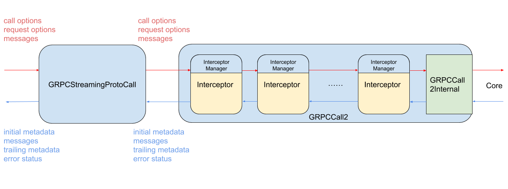

gRPC Objective-C Interceptor
----
* Author(s): mxyan
* Approver: psrini
* Status: In Review
* Implemented in: Objective-C
* Last updated: 2019-04-18
* Discussion at: https://groups.google.com/forum/#!topic/grpc-io/7QGmsQW86Ss

## Abstract

Proposes the interceptor architecture and API for gRPC Objective-C.

## Background

gRPC interceptor has been a popular utility for users making HTTP requests.
gRPC Objective-C library has received a number of requests to add support of
this feature to gRPC. The old gRPC Objective-C library API was not flexiable enough to support interceptor API. With the [new API](https://github.com/grpc/proposal/blob/master/L38-objc-api-upgrade.md), now it is possible to add in this support.

### Use cases
The use cases for interceptor is wide; a few examples include:
* Log RPCs
* Collect metrics
* Obtain/Refresh access tokens
* Create test stub
* ...

### Requirements

Requirements of interceptor API are
* Allows access to headers, messages, and trailers
* Allows access to call destination, paths, verbs, and call configuration parameters
* Supports Bi-di streaming
* Allows short-circuiting calls (interceptor can terminate the call)
* Allows interceptors to specify their own dispatch queue
* Scope interceptors separately without direct access to each other's states
* Allows state sharing between interceptors when initiated by the interceptor author

Some optional requirements that we may not implement at the initial stage
* Global interceptor
* Interception of non-serialized protobuf message

### Related Proposals: 
The interceptor API is built based on the proposals [L38: Proposal to A New gRPC Objective-C API](https://github.com/grpc/proposal/blob/master/L38-objc-api-upgrade.md) and [L49: gRPC Objective-C Flow Control](https://github.com/grpc/proposal/blob/c28ba74bbacc8c1fb5d269f48d89b06c51d21f44/L49-objc-flow-control.md).

## Proposal

### Interceptor Chain
We structure the interceptors as a chain of objects that are similar to gRPC calls but pass requests and responses from one to the next:



Each interceptor in the chain conforms to a request interface and a response interface. The request interface is related to controling the logic of a gRPC call, including start/finish/cancel the call, write data, request receiving more data (for flow control purpose), etc. The response interface allows components in lower layer to issue response callbacks. We reuse `GRPCResponseHandler` protocol of `GRPCCall2` interface for this purpose.

```objectivec
@protocol GRPCInterceptorInterface<NSObject>

/** The queue on which all request methods of this interceptor should be dispatched on */
@property(readonly) dispatch_queue_t requestDispatchQueue;

- (void)startWithRequestOptions:(GRPCRequestOptions *)requestOptions
                    callOptions:(GRPCCallOptions *)callOptions;

- (void)writeData:(id)data;

- (void)finish;

- (void)cancel;

- (void)receiveNextMessages:(NSUInteger)numberOfMessages;

@end
```

```objectivec
@protocol GRPCResponseHandler<NSObject>

@required

@property(atomic, readonly) dispatch_queue_t dispatchQueue;

@optional

- (void)didReceiveInitialMetadata:(nullable NSDictionary *)initialMetadata;

- (void)didReceiveData:(id)data;

- (void)didCloseWithTrailingMetadata:(nullable NSDictionary *)trailingMetadata
                               error:(nullable NSError *)error;

- (void)didWriteData;

@end
```

An interceptor manager object accompanies each interceptor and manages forwarding the requests/callbacks along the chain in both directions by providing corresponding methods. The interceptor managers are created by gRPC upon call start when the chain of interceptors are created. They are then passed to interceptor factory to create the corresponding interceptor object.

```objectivec

@interface GRPCInterceptorManager : NSObject

- (nullable instancetype)initWithNextInerceptor:
                             (id<GRPCInterceptorInterface>)nextInterceptor;

/** Set the previous interceptor in the chain. Can only be set once. Not thread safe */
- (void)setPreviousInterceptor:(id<GRPCResponseHandler>)previousInterceptor;

/** Indicate shutdown of the interceptor; release the reference to other interceptors */
- (void)shutDown;

// Methods to forward GRPCInterceptorInterface calls to the next interceptor

/** Notify the next interceptor in the chain to start the call and pass arguments */
- (void)startNextInterceptorWithRequestOptions:...
                               responseHandler:...
                                   callOptions:...;

/** Pass a message to be sent to the next interceptor in the chain */
- (void)writeNextInterceptorWithData:(id)data;

/** Notify the next interceptor in the chain to finish the call */
- (void)finishNextInterceptor;

/** Notify the next interceptor in the chain to cancel the call */
- (void)cancelNextInterceptor;

/** Notify the next interceptor in the chain to receive more messages */
- (void)receiveNextInterceptorMessages:(NSUInteger)numberOfMessages;

// Methods to forward GRPCResponseHandler callbacks to the previous object

/** Forward initial metadata to the previous interceptor in the chain */
- (void)forwardPreviousInterceptorWithInitialMetadata:
            (NSDictionary *)initialMetadata;

/** Forward a received message to the previous interceptor in the chain */
- (void)forwardPreviousIntercetporWithData:(id)data;

/** Forward call close and trailing metadata to the previous interceptor in the chain */
- (void)forwardPreviousInterceptorCloseWithTrailingMetadata:
            (NSDictionary *)trailingMetadata
                                                      error:(NSError *)error;

/** Forward write completion to the previous interceptor in the chain */
- (void)forwardPreviousInterceptorDidWriteData;

@end

```

### Interceptor lifetime and scope
The interceptors' life time is identical to a call's life time. When a gRPC call is started, GRPCCall2 object initiates allocation and initialization of all the interceptors from the factories. Then the call start process is kicked of by calling startWithRequestOptions: of the first interceptor.

When a call finishes, an interceptor should call the shutDown method of its interceptor manager to dereference the neighbor interceptors in the chain so that they can get released.

The proposed gRPC interceptors are scoped to a single call. Making interceptors that span their state across multiple calls is possible by implementing corresponding logic in the interceptor factory. The details are out of scope of this proposal.

### Default Interceptors
In order to maintain API stability, an interceptor implementation must inherit from a base class GRPCInterceptor provided by gRPC that implements default behaviors for each method in the interceptor interfaces (directly forwarding the corresponding method call to the next interceptor).

```objectivec
@interface GRPCInterceptor : NSObject<GRPCInterceptorInterface, GRPCResponseHandler>

- (nullable instancetype)initWithInterceptorManager:(GRPCInterceptorManager *)interceptorManager
                               requestDispatchQueue:(dispatch_queue_t)requestDispatchQueue
                              responseDispatchQueue:(dispatch_queue_t)responseDispatchQueue NS_DESIGNATED_INITIALIZER;

// Default implementation of GRPCInterceptorInterface

- (void)startWithRequestOptions:(GRPCRequestOptions *)requestOptions
                    callOptions:(GRPCCallOptions *)callOptions;
- (void)writeData:(id)data;
- (void)finish;
- (void)cancel;
- (void)receiveNextMessages:(NSUInteger)numberOfMessages;

// Default implementation of GRPCResponeHandler

- (void)didReceiveInitialMetadata:(nullable NSDictionary *)initialMetadata;
- (void)didReceiveData:(id)data;
- (void)didCloseWithTrailingMetadata:(nullable NSDictionary *)trailingMetadata
                               error:(nullable NSError *)error;
- (void)didWriteData;

// Deprecated method
- (void)didReceiveRawMessage:(NSData *)message;

@end
```

We deprecate the current `didReceiveRawMessage:(NSData *)message` method of GRPCResponseHandler to allow possible enhancement of moving [de-]serialization inside GRPCCall2 interface (see corresponding details in Open Issuse section). The deprecated method will continue to work with current user unless they add an interceptor to their call, at which point of time they will need to simply switch from the old interface (`didReceiveRawMessage:`) to the new interface (`didReceiveData:`) without change in implementation.

### Configurations
The chain of interceptors is configured by adding interceptor factories in GRPCCallOptions. The order of the interceptors follows the order of interceptor factories in the interceptorFactories array.

```objectivec
@protocol GRPCInterceptorFactory

- (GRPCInterceptor *)createInterceptorWithInterceptorManager:
                         (GRPCInterceptorManager *)interceptorManager;

@end

@interface GRPCCallOptions

// Some properties that already exist
...

// An array of interceptor factories. When a call starts, interceptors are created
// by these factories and chained together with the same order as the factories in
// this array. This parameter should not be modified by any interceptor and will
// not take effect if done so.
@property(readwrite) NSArray *interceptorFactories;

@end
```

### GRPCCall2 interface
GRPCCall2, the interface that current gRPC ObjC users interacts with, becomes a simple wrapper that forwards messages to/from the first interceptor in the chain. The only additional check that we perform in a GRPCCall2 instance is a simple check of whether the chain of interceptors are already initialized.

All concrete call logics are handled by GRPCCall2Internal, which is a special interceptor that do not chain to another interceptor. This strategy maintains compatibility to the current users of GRPCCall2.

## Implementation

The prototype of this design proposal is close to completion and will be published by @muxi soon.

## Open issues

### Intercept protobuf message
The current interceptor design does not allow intercepting protobuf message. Since the interceptors are behind the GRPCCall2 object, any message seen by interceptors are raw data.

This problem makes it difficult for an interceptor that would like, e.g., to change a protobuf field in the request. One solution is to have the interceptor deserialize the message in the interceptor, modify it, serialize it again, then pass it on. Such an approach works but is inefficient.

A possible enhancement to solve this problem is to introduce the concept of serializer to GRPCCall2 interface. It can be an object conforming to a serializer interface and passed along with callOptions.

```objectivec

@protocol <GRPCMarshaller>

- (NSData *)serializeData:(id)data;

- (id)deserializeData:(NSData *)Data;

@end

@interface GRPCMutableCallOptions

// Properties that already exist
@property id<GRPCMarshaller> marshaller;

@end
```
After all the alternations in the interceptors, GRPCCall2Internal object uses the serializer to transform the data before passing it to core.

Though there are some potential use cases for this feature, it can be implemented independent of the proposal above.

### Interceptor Dispatch Queues
Since each interceptor is stateful, multiple requests or responses issued to an interceptor should be processed in order. That requires the dispatch queues of an interceptor to be serial queue. This requirement currently seems reasonable for us, because multiple calls can each have their own dispatch queue so that the same class of interceptors for different calls can still run concurrently. On the other hand, if serialized process is required across all interceptors of the same class, they will be able to use the same dispatch queue provided by their interceptor factory on initialization.

In case we have to support concurrent queue in the future, the following alternation may be used to achieve the goal transparently to the users and the interceptor developers:
* Each interceptor manager maintains two serial queues, targeting at request and response dispatch queue of the corresponding interceptor respectively;
* Instead of issuing requests and responses directly to the next/previous interceptor in the chain, the interceptor managers issue events to the next/previous interceptor manager in the chain;
* The next/previous intreceptor manager issues the event onto their own serial queue. Because of the queue target, requests/responses will be run on the (concurrent) queues provided by the interceptor, but their orders are preserved.
