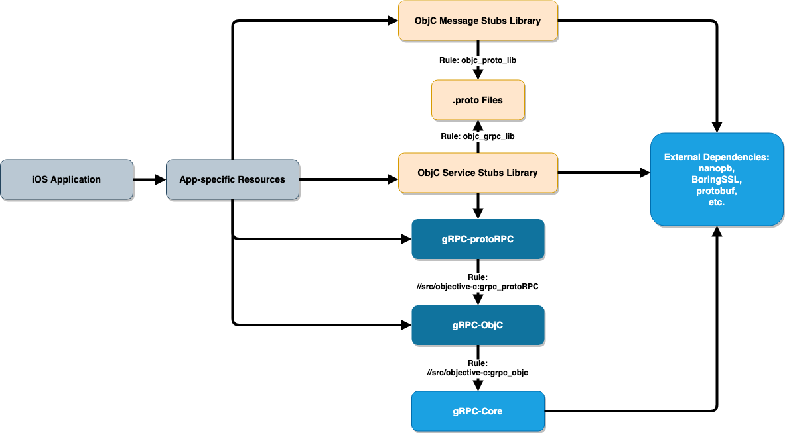

gRPC Objective-C Bazel Build Support
----
* Author: tonyzhehaolu
* Approver: a11r
* Status: Draft
* Implemented in: Bazel and Starlark
* Last updated: Today's date
* Discussion at: ???

## Abstract

Proposes a set of Bazel rules for building iOS applications with gRPC Objective-C library.

## Background

The gRPC Objective-C library so far only supports installation via Cocoapods. Requests for Bazel support are continually raised.

In addition to the available native rules (`objc_library` and `proto_library`), `objc_proto_lib` and `objc_grpc_lib` need to be created because the native `objc_proto_library` is actually [not usable](https://github.com/bazelbuild/bazel/issues/7348). Some other rules are also needed in order to compile the actual library.

### Related Proposals: 
`objc_proto_lib` and `objc_grpc_lib` are built upon the implementation of the `generate_cc` rule defined in [generate_cc.bzl](https://github.com/grpc/grpc/blob/bazel_test/bazel/generate_cc.bzl). There doesn't seem to be a proposal for that, though.

## Proposal

### Dependency Graph

According to the dependencies in an iOS application that uses gRPC Objc library (shown below), we created two `objc_library` rules in the `src/objective-c` package within the `com_github_grpc_grpc` workspace: `grpc_objc` and `grpc_objc_protoRPC`.

* Rule `//src/objective-c:grpc_objc` compiles all the files in `GRPCClient/` and `RxLibrary/`. It is dependent on a ready rule `//:grpc` which compiles core gRPC. It is publicly visible so that the user-written Objective-C code can depend on it.
* `//src/objective-c:grpc_protoRPC` does the `ProtoRPC/` directory. It is also made publicly visible so that the generated service stubs can be compiled depending on this rule. Users do not need to manually add this label to `deps`, though.
* The Objective-C stubs are generated *and compiled* into native Bazel `objc_library`'s via `objc_proto_lib` and `objc_grpc_lib`. Details about these two custom rules are discussed in the upcoming sections.
* Although the "app-specific resources" depend on multiple libraries in the graph, users only need to add `objc_grpc_lib`'s and `objc_grpc_lib`'s they themselves defined. This is because the dependency on gRPC-protoRPC and gRPC-ObjC are carries by `objc_grpc_lib`.
* All the necessary external dependencies are loaded with `grpc_deps()` in `//bazel:grpc_deps.bzl` and are hidden from the users.

### Rules for Compiling `.proto` Files

`objc_proto_lib` and `objc_grpc_lib` are implemented almost identically.

## Rationale

[A discussion of alternate approaches and the trade offs, advantages, and disadvantages of the specified approach.]

## Implementation

[A description of the steps in the implementation, who will do them, and when.  If a particular language is going to get the implementation first, this section should list the proposed order.]

## Open issues (if applicable)

[A discussion of issues relating to this proposal for which the author does not  know the solution. This section may be omitted if there are none.]