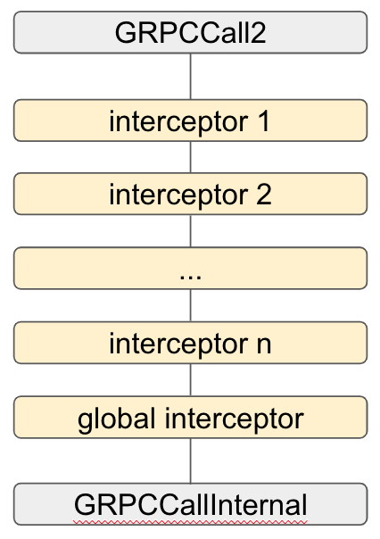

Title
----
* Author(s): muxi
* Approver: psrini
* Status: In Review
* Implemented in: Objective-C
* Last updated: 2019-06-17
* Discussion at: https://groups.google.com/forum/#!topic/grpc-io/tRKcPcfQKi4

## Abstract

This proposal is about global interceptor for gRPC Objective-C library.

## Background
Global interceptor refers to interceptors that run across all the calls in the same process, despite whether it is explicitly added to a particular call in its call options. It is a powerful feature for use cases such as global logging. The feature has been implemented in gRPC libraries of other languages.


### Related Proposals: 
* L50 - gRPC Objective-C Interceptor

## Proposal

### Global interceptor interface

The proposed gRPC Objective-C library's global interceptor interface is as follows:

```objectivec
@interface GRPCCall2 (Interceptor)

/**
 * Register a global interceptor's factory in the current process. Only one interceptor can be
 * registered in a process. If another one attempts to be registered, an exception will be raised.
 */
+ (void)registerGlobalInterceptor:(nonnull id<GRPCInterceptorFactory>)interceptorFactory;

/**
 * Get the global interceptor's factory.
 */
+ (nullable id<GRPCInterceptorFactory>)globalInterceptorFactory;

@end
```

Users register a global interceptor with the `registerGloablInterceptor` method. Each process has a single global interceptor entry. The global interceptor may only be registered for once. Registering a second global interceptor will trigger an exception.

### Interceptor chain with global interceptor

Once a global interceptor is registered, the global interceptor will be inserted at the very end of the interceptor chain of all calls in the same process.

<p align="center">
  
</p>

## Rationale

Global interceptor is a powerful feature that resulted in abuse by some users in other gRPC libraries in the past. As a result most gRPC languages have imposed the one-global-interceptor policy. The policy helps identify the source of abusive use of global interceptor. gRPC Objective-C library follows the same rule. Making the global interceptor the last one in a chain also follows the general practice from gRPC library of other languages.

## Implementation

Implementation will be completed by mxyan@.
