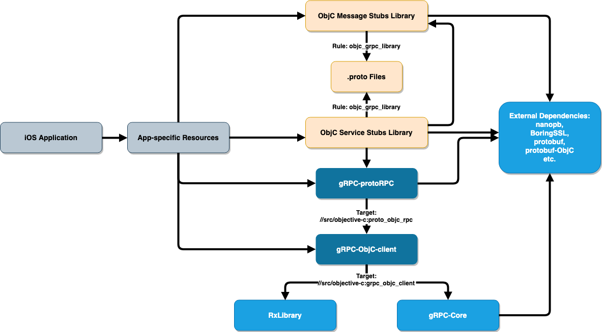
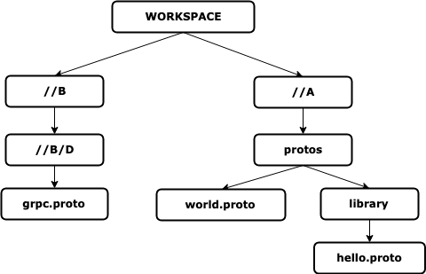
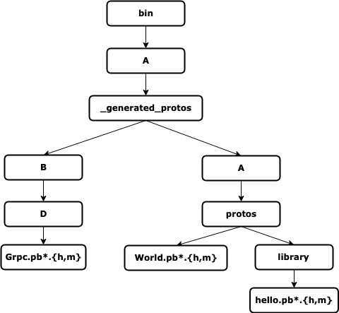

gRPC Objective-C Bazel Build Support
----
* Author: tonyzhehaolu
* Approver: mxyan
* Status: Draft
* Implemented in: Bazel and Starlark
* Last updated: Jul 11, 2019
* Discussion at: ???

## Abstract

Proposes a set of Bazel rules for building iOS applications with gRPC Objective-C library.


## Background

The gRPC Objective-C library so far only supports installation via Cocoapods. Requests for Bazel support are continually raised.

In addition to the available native rules (`objc_library` and `proto_library`), `objc_proto_grpc_library` (indicating that this is a working version of `objc_proto_library` written by the gRPC authors) and `objc_grpc_library` (indicating that it generates the service stubs) need to be created because the native `objc_proto_library` is actually [not usable](https://github.com/bazelbuild/bazel/issues/7348). Some other rules are also needed in order to compile the actual library from `.proto` files.

### Related Proposals
`objc_proto_grpc_library` and `objc_grpc_library` are built upon the implementation of the `generate_cc` rule defined in [generate_cc.bzl](https://github.com/grpc/grpc/blob/bazel_test/bazel/generate_cc.bzl). There doesn't seem to be a proposal for that, though.


## Proposal

For now, assume that the `WORKSPACE` root is the gRPC repository.

### Dependency Graph

According to the dependencies in an iOS application that uses gRPC Objc library (shown below), we created two `objc_library` targets in the `src/objective-c` package within the `com_github_grpc_grpc` workspace: `grpc_objc_client` and `grpc_objc_rpc`.



* Target `//src/objective-c:grpc_objc_client` compiles all the files in `GRPCClient/` and `RxLibrary/`. It is dependent on a ready rule `//:grpc` which compiles core gRPC. It is publicly visible so that any application-specific Objective-C code can depend on it. It is only necessary when the app does not use protocol buffers (which means the service stub libraries, plus all that they are dependent on, are not included) - it is a rare case.
* `//src/objective-c:grpc_objc_rpc` does the `ProtoRPC/` directory. It is also made publicly visible so that the generated service stubs can be compiled depending on this rule. Users do not need to manually add this label to `deps`, though.
* The Objective-C stubs are generated *and compiled* into native Bazel `objc_library` targets via `objc_proto_grpc_library` and `objc_grpc_library`. Details about these two custom rules are discussed in the upcoming sections.
* Although "app-specific resources" depend on multiple libraries in the graph, users only need to add `objc_proto_grpc_library`'s and `objc_grpc_library`'s they defined. This is because the dependency on gRPC-protoRPC and gRPC-ObjC-client are carried along by those two rules.
* All the necessary external dependencies are loaded with `grpc_deps()` in `//bazel:grpc_deps.bzl` and are hidden from users.

### Rules for Compiling `.proto` Files

The gist of these custom rules is to run protobuf compiler and Objective-C plugin on provided `.proto` files with `ctx.action.run`. Those executables are available from `@com_google_protobuf//:protoc` and `@com_github_grpc_grpc//:grpc_objective_c_plugin`.

We use the native `proto_library` rule as a manager for `.proto` files (i.e. their package paths and dependencies). They wrap the `.proto` files and are passed into `objc_proto_grpc_library` and `objc_grpc_library` as `deps`.

`objc_proto_grpc_library` takes in as `deps` a list of `proto_library` targets and geneates the message stubs (excluding the service ones) for these targets and all their transitively dependent protos.

`objc_grpc_library`, in addition to `proto_library` targets, takes in a list of file names of `.proto` files as `srcs`. The list of `.proto` files should all contain service stubs; otherwise Bazel will complain about certain `.pbrpc.{h,m}` files not being generated. `objc_grpc_library`, in addition to message stubs, generates services stubs for a `.proto` file if and only if the `.proto` file is listed in `srcs`.

As a result of compiling every `.proto` files in the dependency chain, the app-specific code only needs to depend on the one or the few `objc_(proto_)grpc_library`'s at the bottom of the dependency graph.

For both rules, it is also possible to tell that [well known protos](https://github.com/protocolbuffers/protobuf/tree/master/src/google/protobuf) are required in the dependency, by passing `True` for the field `use_well_known_protos`.

In terms of the execution of `protoc`, the command is similar to that in a [podspec](https://github.com/grpc/grpc/blob/0803c79411597f58eae0b12b4eb272c506b8cdbb/examples/objective-c/helloworld/HelloWorld.podspec) (all `.proto` targets in `deps`, including their transitive dependencies, are provided as inputs, and their directory from the `WORKSPACE` root are added to `-I` flags programmatically). The output directory is set to `//bazel-out/<*product type specific*>/bin/<package name>/_generated_protos/` so that bazel is able to locate the generated files.

Generated files in the directory above follow the same hierarchy as the `.proto` files. Consider this project where we are building from package `//A`:



The resulting structure in `bin` will be:



Lastly, three other targets are created to split the files into `hdrs`, `srcs` (potentially empty, since there might be no service stubs), and `non_arc_srcs`. They will be fed into a `objc_library` rule.

When `#import`-ing `.proto` and `.pb*.{h,m}` files, always use their *absolute paths* from the `WORKSPACE` root.


### Example

Consider the hierarchy from the above section and further suppose that `world.proto` imports both `hello.proto` and `grpc.proto`. Also suppose that `grpc.proto` and `world.proto` have service stubs defined which we would like to use.

Note that the correct import statements in `world.proto` should be:
```
#import "A/protos/library/hello.proto"
#import "B/D/grpc.proto"
```

Configure `WORKSPACE` as instructed in this [tutorial](https://docs.bazel.build/versions/master/tutorial/ios-app.html) and also load `grpc_deps` for binding external git repositories such as `@com_google_protobuf`:
```
git_repository(
    name = "com_github_grpc_grpc",
    remote = "https://github.com/grpc/grpc.git",
    branch = "master"
)

load("@com_github_grpc_grpc//bazel:grpc_deps.bzl", "grpc_deps")

grpc_deps()
```

The `BUILD` file for this sample project can be written similar to the following snippet. Assume that this is the `BUILD` file for package `//A` and there is a `proto_library` target defined in package `//B` for `grpc.proto`, named `grpc_proto`.
```
load("@build_bazel_rules_apple//apple:ios.bzl", "ios_application")
load(
    "@com_github_grpc_grpc//bazel:grpc_objc_library.bzl", 
    # we don't need "objc_proto_grpc_library" because world.proto has services defined 
    "objc_grpc_library",
)

proto_library(
    name = "world_proto",
    srcs = ["protos/world.proto"],
    deps = [
        ":hello_proto",
        "//B:grpc_proto"
    ]
)
proto_library(
    name = "hello_proto",
    srcs = ["protos/library/hello.proto"]
)
objc_grpc_library(
    name = "world_grpc_objc",
    srcs = [
        "protos/world.proto",
        "//B/D/grpc.proto", # since we need the service stubs from these two files
    ],
    deps = [":world_proto"]
)

# app-specific library below
objc_library(
    name = "exampleObjCLibrary",
    ...
    deps = [":world_grpc_objc"]
)
ios_application(
    ...
    deps = [":exampleObjCLibrary"]
)
```
Again, import the geneated stubs in the app-specific source files as:
```
#import "A/proto/Hello.pbrpc.h"
#import "B/D/Grpc.pbrpc.h"
```


## Implementation

The implementation is almost done by tonyzhehaolu.


## Open Issues

The way to specify which `.proto` files (in rule `objc_grpc_library`) need to be compiled also for service stubs is open for discussion. For now, if the `.proto` file resides within the package root, it's referred to with a path relative to the package root (`protos/world.proto`); otherwise, it's referred to with an absolute path from the `WORKSPACE` root (`//B/D/grpc.proto`). 
