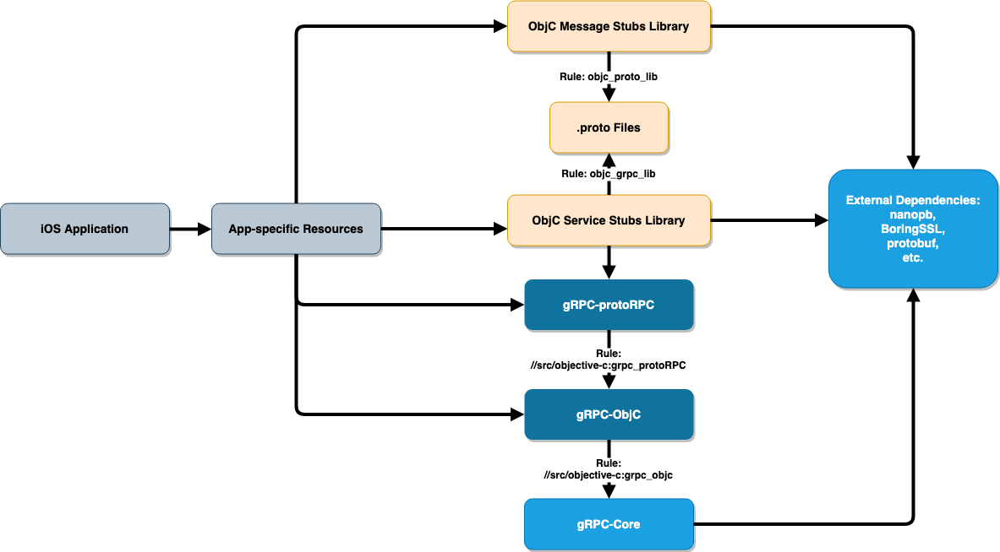

gRPC Objective-C Bazel Build Support
----
* Author: tonyzhehaolu
* Approver: mxyan
* Status: Draft
* Implemented in: Bazel and Starlark
* Last updated: Today's date
* Discussion at: ???

## Abstract

Proposes a set of Bazel rules for building iOS applications with gRPC Objective-C library.


## Background

The gRPC Objective-C library so far only supports installation via Cocoapods. Requests for Bazel support are continually raised.

In addition to the available native rules (`objc_library` and `proto_library`), `objc_proto_lib` and `objc_grpc_lib` need to be created because the native `objc_proto_library` is actually [not usable](https://github.com/bazelbuild/bazel/issues/7348). Some other rules are also needed in order to compile the actual library.

### Related Proposals
`objc_proto_lib` and `objc_grpc_lib` are built upon the implementation of the `generate_cc` rule defined in [generate_cc.bzl](https://github.com/grpc/grpc/blob/bazel_test/bazel/generate_cc.bzl). There doesn't seem to be a proposal for that, though.


## Proposal

For now, assume that the WORKSPACE root is the gRPC repository.

### Dependency Graph

According to the dependencies in an iOS application that uses gRPC Objc library (shown below), we created two `objc_library` rules in the `src/objective-c` package within the `com_github_grpc_grpc` workspace: `grpc_objc` and `grpc_objc_protoRPC`.



* Rule `//src/objective-c:grpc_objc` compiles all the files in `GRPCClient/` and `RxLibrary/`. It is dependent on a ready rule `//:grpc` which compiles core gRPC. It is publicly visible so that any application-specific Objective-C code can depend on it. It is only necessary when the app does not use protocol buffers (which means the service stub libraries, plus all that they are dependent on, are not included) - it is a rare case.
* `//src/objective-c:grpc_protoRPC` does the `ProtoRPC/` directory. It is also made publicly visible so that the generated service stubs can be compiled depending on this rule. Users do not need to manually add this label to `deps`, though.
* The Objective-C stubs are generated *and compiled* into native Bazel `objc_library`'s via `objc_proto_lib` and `objc_grpc_lib`. Details about these two custom rules are discussed in the upcoming sections.
* Although "app-specific resources" depend on multiple libraries in the graph, users only need to add `objc_grpc_lib`'s and `objc_grpc_lib`'s they defined. This is because the dependency on gRPC-protoRPC and gRPC-ObjC are carried by `objc_grpc_lib`.
* All the necessary external dependencies are loaded with `grpc_deps()` in `//bazel:grpc_deps.bzl` and are hidden from the users.
* The app-specific code does need to depend on `//:gRPCCertificates`, which is essentially a `.pem` file.

### Rules for Compiling `.proto` Files

The gist of these custom rules is to run protobuf compiler and Objective-C plugin on provided `.proto` files with `ctx.action.run`. They are available from `@com_google_protobuf//:protoc` and `@com_github_grpc_grpc//:grpc_objective_c_plugin`.

We use the native `proto_library` rule as a manager for `.proto` files (i.e. their package paths and dependencies). They wrap the proto files and are passed into `objc_proto_lib` and `objc_grpc_lib` as `srcs`. As a result of using `proto_library`, proto files must not reside in a upper-level directory to the `BUILD` file.

Due to naming rules within the protobuf compiler, we first need to convert file names into camel case in order to correctly declare all the output files. File extensions are either `.pbobjc.h/.m` or `.pbrpc.h/.m`, give the pair of files that will be compiled (Messages or Services, respectively) as a boolean parameter.

The ObjC plugin is one of the arguments. The precise arguments is formatted by the libary function `get_plugin_args` provided in `//bazel:protobuf.bzl`.

If the proto files are depend on any of the "well known" proto files like `empty.proto` defined in `@com_google_protobuf//google/protobuf/`, this external rule `@com_google_protobuf//:well_known_protos` is needed in order to add those files into arguments.

Outputs will be generated in directories managed by Bazel. They will be further splitted into two groups - one for `hdrs` and the other for `srcs`/`non_arc_srcs` - and then passed into a native `objc_library` rule for the final compiled library. Note that one `objc_proto/grpc_lib` might need to depend on others as well.

### Example

Suppose a very simple HelloWorldClient project with a single proto file `//HelloWorld/hello.proto` with both messages and services. Assume that it depends on one of the well known protos.

Configure `WORKSPACE` as instructed in this [tutorial](https://docs.bazel.build/versions/master/tutorial/ios-app.html) and also load `grpc_deps`:
```
git_repository(
    name = "com_github_grpc_grpc",
    remote = "https://github.com/grpc/grpc.git",
    branch = "master"
)
load("@com_github_grpc_grpc//bazel:grpc_deps.bzl", "grpc_deps")
grpc_deps()
```

And here is the `BUILD` file:
```
load("@build_bazel_rules_apple//apple:ios.bzl", "ios_application")
load(
    "@com_github_grpc_grpc//bazel:grpc_objc_library.bzl", 
    "objc_proto_lib", 
    "objc_grpc_lib",
)
proto_library(
    name = "hello_proto",
    srcs = ["HelloWorld/hello.proto"]
)
objc_proto_lib(
    name = "hello_proto_objc",
    srcs = [":hello_proto"],
    use_well_known_protos = True
)
objc_grpc_lib(
    name = "hello_grpc_objc",
    srcs = [":hello_proto"],
    deps = [":hello_proto_objc"],
    use_well_knonw_protos = True
)
# app-specific library below
objc_library(
    name = "HelloWorldLibrary",
    ...
    deps = [
        ":hello_proto_objc",
        ":hello_grpc_objc",
        "@com_github_grpc_grpc//:gRPCCertificates"
    ]
)
ios_application(
    ...
    deps = [":HelloWorldLibrary"]
)
```
Import the `hello.proto` stubs like:
```
#import <HelloWorld/Hello.pbobjc.h>
```


## Implementation

The implementation is almost complete. Simple use cases like the one above are already functional.


## Open issues

For the time being, the paths of `.proto` files are really significant. For instance, in the official route guide [example](https://github.com/grpc/grpc/tree/master/examples) by gRPC authors, the proto files are organized in `//proto/route_guide.proto`. With the current implementation, the import path will be `#import<proto/RouteGuide.pbrpc.h>`. It should be better if we can set it to `#import<RouteGuide/RouteGuide.pbrpc.h>`. This is plausible but still being experimented. It will not break the existing API, but at most add an argument in `objc_proto_lib` and `objc_grpc_lib`.

If the `proto_library` is compiled on its own, Bazel might complain that some symbols are not defined, which is not resolvable without breaking our custom rules. We are thinking about using only file names as `srcs` instead of `proto_library` targets.