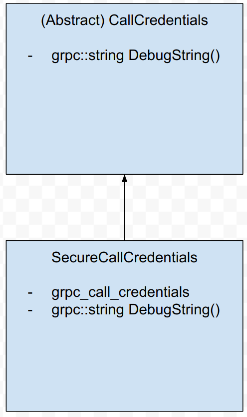
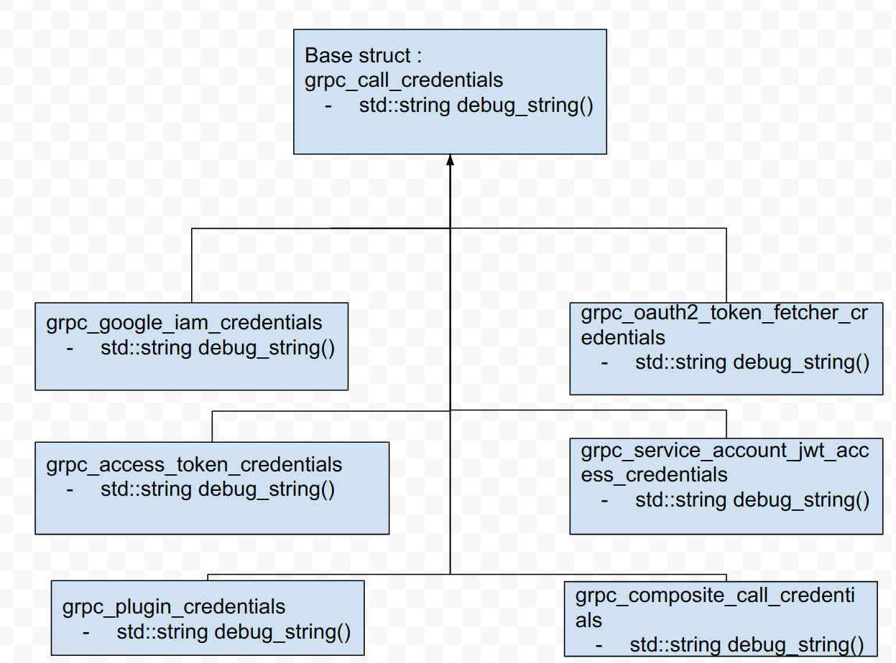
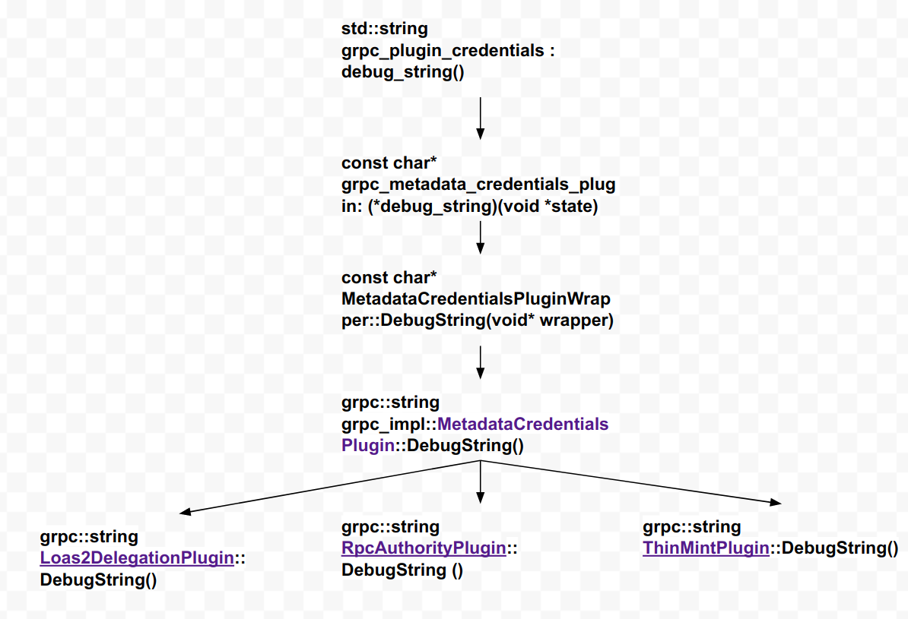

Title
----
* Author(s): mhaidry
* Approver: chwarr, jiagtaoli2016, vjpai, markdroth,
* Status: In review
* Implemented in: cpp
* Last updated: 02/18/2020
* Discussion : https://groups.google.com/g/grpc-io/c/eqA-G6eLE5Y

## Abstract

Implement a DebugString method for the CallCredentials class that returns a
string sharing details about credentials based on the type of credentials being
used on the RPC.

## Background

This feature satisfies requests from internal google users who would wish to
get a debug string from the CallCredentials class

### Related Proposals: 
None

## Proposal
Add an abstract DebugString method to the CallCredentials class and plumb the
implementation of the method to all credential types. The output string depends
on the kind of credential that is being parsed. The virtual method in the base
class will have a default implementation so that it does not break any other
custom credentials.

## Rationale

This provides a way to the user to learn more about the credentials they have
set for a RPC. It may help with debugging any credentials related issues while
sending the RPC. The design will also try to make sure that most of the
computation and memory allocations is done during the DebugString method so that
there is no default performance hits on the RPC.

## Implementation

### CallCredentials and SecureCallCredentials
CallCredentials is the primary abstract class. Here we will add a virtual
DebugString() method that returns an empty string by default.

SecureCallCredentials inherits CallCredentials and will have an implementation
that relies on its underlying grpc_call_credentials structure to get the
debug string contents

### C Call credentials and its derived classes
The base C struct grpc_call_credentials will provide a helper debug_string().
This will again be a virtual function that returns an empty string by default.
We will discuss how every derived grpc_call_credentials struct will implement
the debug_string method.  For now we will exclude grpc_plugin_credentials and
grpc_composite_call_credentials. They will be discussed in separate sections

### GRPC Oauth2 Token fetcher credentials (`grpc_oauth2_token_fetcher_credentials`)
Return that the token is present/absent and the token expiration time.

### GRPC Google IAM credentials (`grpc_google_iam_credentials`)
Return that the token is present/absent and the authority selector.

### GRPC Service Account JWT Credentials (`grpc_service_account_jwt_access_credentials`)
Return the token expiration date.

### GRPC Access Token Credentials (`grpc_access_token_credentials`)
Return that the token is present/absent.

### GRPC Plugin Credentials (`grpc_plugin_credentials`)
The grpc plugin credentials, as the name suggests, uses plugins to extract
auth metadata from a different kind of credentials.
The extraction and other actions are achieved by maintaining callbacks in the
plugin. To support a debug string we will similarly add callbacks to return a
debug string and then the underlying plugin will determine how to populate
that string.

To do this we need demonstrate the flow of how a callback is invoked by the
plugin

* The grpc_plugin_credentials composes a grpc_metadata_credentials_plugin
that has all the callbacks to interact with the Credential type.
* We add a grpc_metadata_credentials::`(*debug_string)(void *state)`
callback where state translates to the MetadataCredentialsPlugin class.
* The MetadataCredentialsPluginWrapper provides the translation to refer to
the C++ MetadataCredentialsPlugin class from the C Core grpc_plugin_credentials.
We add a DebugString method here, as well as the logic of routing to the
MetadataCredentialsPlugin’s DebugString() method. This method is then passed as
the callback to the C Core grpc_plugin_credentials class.
* Next step of course is to have a DebugString() method in the
MetadataCredentialsPlugin class. The MetadataCredentialsPlugin is again a base
class and all plugins that convert one particular type of Credentials to
CallCredentials are derived from this class. The DebugString implementation
returns an empty string by default.
* Then we implement the debug string for the
respective classes derived from MetadataCredentialsPlugin.

### GRPC Composite Call Credentials (`grpc_composite_call_credentials`)

The GRPC Composite call credentials maintains a list of CallCredentials.
This means that the debug string for this struct would need to be a
concatenation of the CallCredentials this class composes. Also since any of the
items in the list could be a Composite Call Credential, we would need to recurse
through them and concatenate it with the parent’s debug string. Since this could
be unbounded and would lead to multiple memory allocations and the pain of
concatenating and passing strings.

### Tests
We will need to add end2end tests for all of the above credential types.
The tests will sit in.
`//test/cpp/end2end:credentials_debug_string_test`

