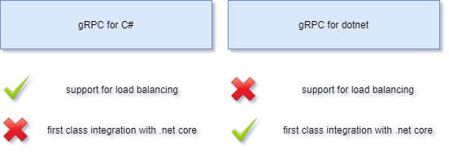
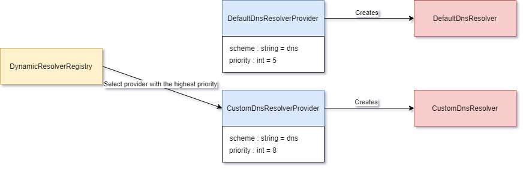
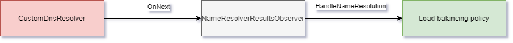
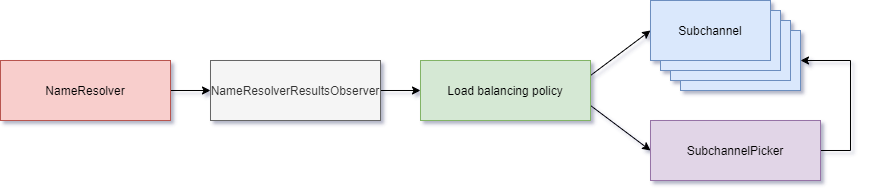
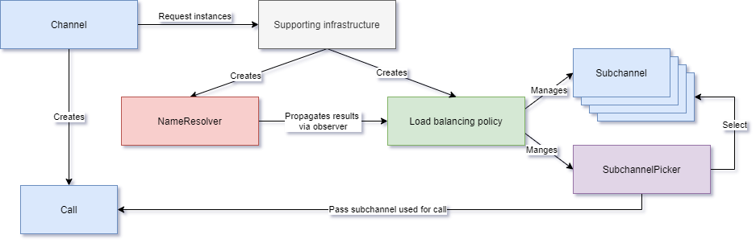

L66: gRPC for .NET load balancing support
----
* Author(s): Paweł Wichary
* Approver: a11r
* Status: Draft
* Implemented in: C#
* Last updated: 2020-06-08
* Discussion at: (filled after thread exists)

## Abstract

gRPC in the .NET world is available via two separate implementations. One of those named gRPC for dotnet is missing some key elements in the area of load balancing and the ability to react to changing infrastructure. 

This document describes the process of porting load balancing behavior from other gRPC implementations to gRPC for .NET (aka gRPC for dotnet).

## Background - Current state of gRPC in the .NET world

There are currently two official implementations of gRPC in the .NET world (https://grpc.io/blog/grpc-on-dotnetcore/): 

- gRPC for C# - the wrapper for the native gRPC C-core implementation, 
- gRPC for dotnet - the new implementation written entirely in C# with no native dependencies and based on the newly released .NET Core 3.0.

The implementations are meant to coexist side-by-side and each has its advantages in terms of available features, integrations, supported platforms, maturity and performance. 

Former implementation in the C language is not a part of this proposal as it leverages load balancing capabilities from the core library. Latter implementation, developed in .NET Core is missing some key elements in the area of load balancing, which is a topic of this proposal.

Why even bother with gRPC for dotnet? gRPC was presented by Microsoft as an alternative for WCF technology used in the .NET world and an alternative for existing communication tools. Some developers will try to adopt gRPC technology and it will be the easiest for them to start with the gRPC for dotnet as it has first-class integration with the .NET Core framework. 

## Background - Load balancing in gRPC Java

Load balancing in gRPC Java has a rich history and is based on the latest gRFC guidelines. Java and C# languages are constructed around the same paradigms and share a similar goal of being general-purpose programming languages. We will consider Java load balancing as a reference for this work.

### Main elements of load balancing

gRPC team while working on Java implementation has designed an API for load balancing. This API is still considered experimental. However, it has been successfully used since gRPC Java 1.2.0, up to the current release (1.29.0). The API has been evolving several times to satisfy generally agreed requirements.

Java API documentation is available here: https://grpc.github.io/grpc-java/javadoc/io/grpc/LoadBalancer.html

Main elements of this API are:
- Name resolver,
- Name resolution listener,
- Load balancer (aka load balancing policy),
- Subchannels,
- Subchannel picker,
- Supporting classes (eg. factories, data transfer objects, reflection based registries). 

In order to understand the way those elements are correlated, it is important to understand how gRPC Java works. A high overview will be described as an introduction to porting implementation to gRPC for dotnet.

Managed channels are created per specified URI target eg. service.googleapis.com. They are responsible for aggregating core components, managing subchannels and calling supporting classes. 

When a new channel is created, the URI and the scheme is defined. The scheme is used to specify how channels should search for physical addresses. The default scheme used in gRPC java is dns://, that implies using the DNS system during name resolution. Managed channel delegates the work of creating name resolver to supporting classes.

The way the name resolver does its job is abstracted by the API. The default behavior can be easily replaced by writing a new resolver and associated provider (aka factory) with higher priority. Selecting between providers is handled by the supporting infrastructure.

After the resolver is started, a managed channel attaches a listener that reacts to any observed change. Notification can be triggered anytime, but in most cases it occurs on request or periodically. Anytime a listener observes, a change it’s role is to call a load balancer (aka load balancing policy) and delegate further processing.

NOTE: Name resolvers and observers are also responsible for forming an object with the configuration used in policies. This object is commonly named as ServiceConfig, this proposal aims for establishing API and trivial policies like pick_first and round_robin that do not require full blast service config implementation. We suggest little increments with the possibility of extension to reduce the scope of this proposal.

Load balancing policies contain the main balancing logic that focuses on maintaining subchannels accordingly to the resolution results and creating subchannel pickers. Subchannels maintain physical connections (aka transports) for sending new RPCs. Picker on the other hand does actual load balancing when a new call is requested. A high-level overview of the end-to-end process was presented below.

Channel and subchannels are exposing meaningful information about their state using a state machine with five states: IDLE, CONNECTING, READY, TRANSIENT_FAILURE and SHUTDOWN. This information can be used while writing custom policies. It is up to the policy implementation how to handle states transitions eg. policy may keep the channel in READY state as long as there is at least one READY subchannel. 

Last but not least, Java API also covers topics related to concurrency management. The architecture of pluggable resolvers and policies does work on the shared state of the channel. In order to avoid races between threads and keep this state stable gRPC Java uses SynchronizationContext object. All tasks that mutate state must be queued. Context is responsible for executing tasks in recorded order from a single thread which guarantees no races. The described approach allows transport threads to work without any delays and keep implementation locking-free at a high level.

### Policies available in Java

There are four main policies implemented in gRPC Java.

- pick_first - a load balancer that provides no load-balancing over the addresses from the name resolver. The policy is walking down the address list and sticking to the first that works. This is the channel's default behavior that can be configured by the channel's options or a ServiceConfig.
- round_robin - a load balancer that provides round-robin load-balancing over the addresses from the name resolver.
- grpclb - a load balancer that implements grpclb protocol, which was defined by the gRPC team as an implementation of look-aside load-balancing. The protocol has never been promoted from the experimental phase. Moreover, it has been marked as deprecated in favor of xDS (https://groups.google.com/d/msg/grpc-io/0yGihF-EFQo/A4QKdXffBwAJ). 
- xDS - a load balancer that implements a suite of APIs that are evolving into an industry-standard that will be used to configure a variety of data plane software. xDS is a complete solution that affects both name resolving and load balancing. xDS policy communicates with cluster manager in order to obtain server addresses and delegates load balancing to child policies eg. a weighted round-robin. (detailed description of xDS https://github.com/grpc/proposal/blob/master/A27-xds-global-load-balancing.md)

### Related Proposals: 

N/A

### Related Documentation:

- https://github.com/grpc/grpc/blob/master/doc/connection-backoff.md
- https://github.com/grpc/grpc/blob/master/doc/connectivity-semantics-and-api.md
- https://github.com/grpc/grpc/blob/master/doc/load-balancing.md
- https://github.com/grpc/grpc/blob/master/doc/naming.md
- https://github.com/grpc/grpc/blob/master/doc/statuscodes.md
- https://github.com/grpc/grpc/blob/master/doc/wait-for-ready.md

## Proposal - changes in gRPC for dotnet

We suggest that implementing load balancing capabilities in gRPC dotnet should derive from work that has already been done in Java space. This approach will use proven solutions and create a stable environment for further development. Moreover, the resulting implementation will be interoperable with Java and other languages.

We propose to port gRPC Java load balancing API along with DnsNameResolver, PickFirstLoadBalancer (pick_first) and RoundRobinLoadBalancer (round_robin).

Porting new features to gRPC dotnet will aim for backward compatibility and will try to minimize impact on performance. Proposed changes are mostly additive and will be connected with the existing code base via channel and existing mechanism of creating new calls.

### General approach

The initial work will be focused on implementing the API, which will be used later. The API will be based on interfaces created in Java, but building an idiomatic C# implementation will be prioritized over exact interface parity with the Java implementation. 

Supporting classes are going to be developed along with the API and most of this work will focus on implementing structures like factories, dynamic registries and data transfer objects.

Then a concrete implementation of name resolver and load balancing policies will be introduced. In order to minimize the scope of this proposal, we have selected essentials such as DnsNameResolver, PickFirstPolicy and RoundRobinPolicy. Those elements allow us to create a load balancing flow.

Last but not least, new implementations will be wired with the existing codebase.

### Approach to the process of porting Java API

In order to simplify future work with ported types, we propose basic naming conventions. 

- The rule of thumb is using names from the Java world and modify them accordingly to match gRPC for dotnet and C# standards. 
- The gRPC for dotnet repository follows the naming prefixing convention, which implies that public and internal types are prefixed with “Grpc”. Ported types will follow this convention eg. ConnectivityState.java will be named GrpcConnectivityState.cs.
- The C# language follows the interface prefixing convention, which implies that interfaces are prefixed with a capital “i” letter. Ported types will follow this convention as well eg. BackoffPolicy.java which is an interface will be named IGrpcBackoffPolicy.cs.
- There may be exceptions if better naming alternatives emerge eg. Listener2 class in Java will be named GrpcNameResolutionObserver in C#.

The complete list of all ported types and their counterparts are going to be listed in the pull request.

### Skipping non-essential features

Changes introduced by this proposal will have a significant size. To reduce complexity, we propose to descope some non-essential features proposed in https://github.com/grpc/proposal/blob/master/A2-service-configs-in-dns.md and https://github.com/grpc/proposal/blob/master/A24-lb-policy-config.md. We will skip resolving TXT records and further parsing it into ServiceConfig. We believe that this implementation can be added in the near future.

NOTE: Any missing feature may be added when it is considered as a blocker for the proposal.

### Backwards compatibility

Current gRPC for dotnet implementation does not have a concept of subchannels, incoming RPC calls are executed immediately using the underlying HttpClient instance. Such an approach assumes that transport is always available. Any error during transmission is immediately propagated to the client application code. Proposed changes introduce some level of call buffering but will not influence this behavior from a client perspective as long as calls will honor deadlines. 

IMPORTANT: gRPC Java has a more complicated approach for handling call buffering on the occasion of a channel being not able to process it properly. Since the proposed implementation skips IDLE mode feature available in Java, call buffering is going to be simplified.

gRPC Java specifies an additional call option that allows buffering call, for this work we assume that the value of isWaitForReady is always false. Such assumptions match the default value used in java implementation (https://github.com/grpc/grpc/blob/master/doc/wait-for-ready.md) and play well with current gRPC for dotnet behavior.

An important design decision that allows for backward compatibility is based on schemes specified on the channel. gRPC for dotnet mostly uses http and https. We can take it as an advantage, by adding a new dns scheme (which is actually a default scheme in gRPC Java). Dns scheme will be a new additive change in gRPC for dotnet that will allow an easy separation between existing and new clients. In other words, if we keep existing schemes http and https behave as they used to, we will maintain backward compatibility. All applications that define a new dns scheme will be able to use incoming features.

Current gRPC for dotnet does not support load balancing, nor updating its behavior based on changing infrastructure. All new features should not be verified against backward compatibility. Any introduced change must keep already existing tests pass.

### Performance impact

An impact on performance will be considered as a high level overview, additional in-depth performance tests can be introduced later before checking in changes into the repository. 

First case assumes no failures during subchannel creation. In this case overhead of newly added features emerge right after channel creation. After subchannels and an associated picker are created the work between calls is miniscule. In the long run execution performance impact is negligible.

gRPC for dotnet (current state) with no errors

Proposed changes with an initial load balancing overhead

The second case is about covering possible failures that may appear during calls execution. gRPC for dotnet implementation is not aware of available service replicas, current implementation always sticks to the first dns A record, it finds. Such implementation has limited capabilities of scaling and self-healing. Proposed changes allow refreshing name resolution and update subchannels accordingly. 

gRPC for dotnet (current state) in face of error stops further execution

Proposed changes are aware of changing infrastructure

### Known issues

__HttpClient in .NET does not support connectivity state monitoring for underlying transports.__ 

Connectivity semantics is described here: https://github.com/grpc/grpc/blob/master/doc/connectivity-semantics-and-api.md

Why this is important: https://github.com/grpc/grpc-dotnet/issues/521#issuecomment-534208754

When HttpClient is expected to have this feature: https://github.com/dotnet/runtime/issues/1793 

__Temporary solution: Emulate connectivity state monitoring based on less granular information, derived by observing existing communication.__ 

In a nutshell we will create subchannels that have a state machine matching connectivity semantics. Existing transport implementation will get two additional pieces of code that will trigger subchannels to change state when a relevant action (success or failure) will occur. Using this information we will be able to perform essential transitions.

In order to guarantee backward compatibility in the future, we will allow only those transitions that are permitted in connectivity semantics documentation and for now, we will ignore getting into IDLE state as we descope an IDLE mode feature from this work.

Long story short: subchannel starts in IDLE state, then changes state to CONNECTING. From the CONNECTING state subchannel immediately switch to READY. From this point, the subchannel is going to switch its state to TRANSIENT_FAILURE when a failure occurs. TRANSIENT_FAILURE will switch to CONNECTING after the backoff policy delay. SHUTDOWN can be called anytime. 

NOTE: subchannels are protected from endless looping in TRANSIENT_FAILURE -> CONNECTING -> READY -> TRANSIEN_FAILURE sequence because when a transient failure occurs, re-resolution is triggered. This is not a workaround, it is an actual behavior in gRPC Java as well.

Such a solution allows porting load balancing from gRPC Java to gRPC dotnet. Moreover, in the future when HttpClient would allow us to fully monitor underlying transports we would swap emulation extension-points. All existing implementations will stay unbroken.

We are aware of the cons of this solution eg. like sending a call to the transport that has been closed a second ago. Those cons are matching the current implementation of gRPC for dotnet which assumes transport is always READY. Pros give us the ability to implement missing features today and leave an open door for further extensions.

### Possible future extensions

As this proposal opens a range of possibilities for gRPC for dotnet, like:

- Introducing better handling for ServiceConfig, 
- xDS policy support,
- Support for channelz,
- Update subchannel state management after the HttpClient introduces a new monitoring interface.

## Rationale

gRPC for dotnet is promoted by Microsoft in the .NET world, to keep up with community requirements implementation should support basic load balancing techniques that allow better resource consumption and self-healing capabilities. As gRPC aims for cross-language interoperability, porting implementation from Java is justified. 

We chose to follow the gRPC Java load balancing API because it was designed by the gRPC team, that has up-to-date knowledge of the requirements and planned changes. Moreover, a customized API design for gRPC for dotnet could lead to breaking changes in the future due to wrong assumptions in the custom design.

## Implementation

This proposal and related code were created by Paweł Wichary as a part of a self-development plan that was inspired by missing load balancing capabilities in gRPC for dotnet (https://github.com/grpc/grpc-dotnet/issues/521). Implementation in C# mentioned by this proposal is already completed and tested. Moreover, Apache 2.0 license snippets are present in each file. A pull request with implementation will be created after this proposal gets an acceptance.

The required help from the gRPC team would be to review the proposal and the code.

The implementation (gRPC for dotnet fork): https://github.com/wicharypawel/grpc-dotnet/tree/load-balancing-for-dotnet

The example (using docker and k8s): https://github.com/wicharypawel/net-core-grpc-load-balance/tree/load-balancing-proposal-examples

## Open issues (if applicable)

N/A