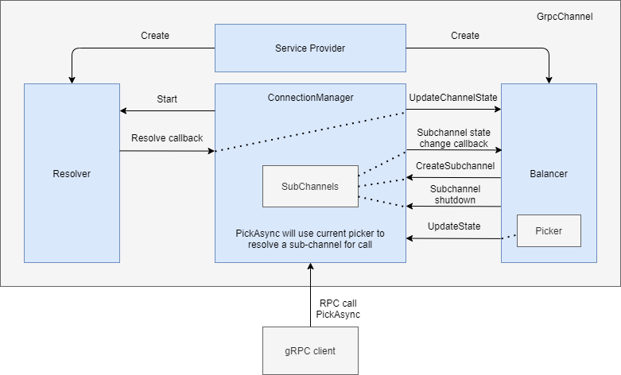

L96: .NET: Load balancing, connectivity and wait for ready in client
----
* Author(s): James Newton-King
* Approver: jtattermusch and markdroth
* Status: Approved
* Implemented in: csharp
* Last updated: 2022-03-01
* Discussion at: <google group thread> (filled after thread exists)

## Abstract

grpc-dotnet currently has no load balancing support. A channel is always created for a single address.

This documentation outlines an initial load balancing implementation for the grpc-dotnet client.

## Background

grpc-dotnet currently doesn't support any form of load balancing in the client. The changes outlined in this proposal will enable basic gRPC load balancing and some of its related features. These include:

* Name resolving. There is built-in support for resolving from DNS, and a static resolver. Can create custom resolvers.
* Load balancing strategies. Includes built-in support for pick first and round-robin load balancing. Can create custom load balancers.
* Connectivity status at subchannel and channel level
* Wait for ready

## Proposal



### Initialization

Channels are created with:

* An address
* An optional service provider
* An optional service config

Basic usage:

```csharp
var channel = GrpcChannel.ForAddress(
    "dns:///backend.default.svc.cluster.local",
    new GrpcChannelOptions { ChannelCredentials = ChannelCredentials.Insecure });
var client = new Greet.GreeterClient(channel);

var response = await client.SayHelloAsync(new HelloRequest { Name = "world" });
Console.WriteLine(response.Message);
```

With client service config:

```csharp
var channel = GrpcChannel.ForAddress(
    "dns:///backend.default.svc.cluster.local",
    new GrpcChannelOptions
    {
        ChannelCredentials = ChannelCredentials.Insecure,
        DisableResolverServiceConfig = true,
        ServiceConfig = new ServiceConfig
        {
            LoadBalancingConfigs = { new RoundRobinConfig() }
        }
    });
var client = new Greet.GreeterClient(channel);
```

With client service provider:

```csharp
var factory = new StaticResolverFactory(addr => new[]
{
    new BalancerAddress("localhost", 80),
    new BalancerAddress("localhost", 81)
});
var services = new ServiceCollection();
services.AddSingleton<ResolverFactory>(factory);

var channel = GrpcChannel.ForAddress(
    "static:///my-example-host",
    new GrpcChannelOptions
    {
        ChannelCredentials = ChannelCredentials.Insecure,
        ServiceProvider = services.BuildServiceProvider()
    });
var client = new Greet.GreeterClient(channel);
```

* Resolver is created from address scheme.
  * Existing logic allows for `http` and `https`. These schemes are special-cased to never use a resolver.
  * A collection of resolver factories are fetched from the service provider. One is selected using the address scheme, and it will create a resolver. For example, `dns` will match to `DnsResolverFactory`, creating a `DnsResolver`.
* Load balancer is created from the load balancer name in service config.
  * A collection of load balancer factories are fetched from the service provider. One is selected using the configured name (if none specified, then `pick_first` is used), creating a load balancer.
  * Load balancer is initialized with an `IChannelControlHelper` instance by the channel. The controller calls back to the channel to create subchannels and update the picker.

### Connecting

* No network activity until `GrpcChannel.ConnectAsync` is called, or the first RPC is started.
* On connect, the `ConnectionManager` starts the resolver and prompts it to run immediately.
* Resolver pushes addresses and optional service config to `ConnectionManager`.
* Load balancer is created.
  * Resolver can return a service config. If `DisableResolverServiceConfig` is not `true` then the resolver's service config is used to get load balancer policy.
  * Channel service config option is used as a fallback.
  * When no load balancer policy has been specified then a `PickFirstLoadBalancer` is created.
* Balancer uses `IChannelControlHelper` to create, remove or update subchannels as needed based on the addresses.
  * A new subchannel starts connecting when `Subchannel.RequestConnection()` is called. Subchannels shut down when disposed.
* Balancer is notified of changes in subchannel state by subscribing to `Subchannel.StateChanged` event. The balancer will create a `SubchannelPicker` based on the current state.

### Picking

Wait for ready sample:

```csharp
var channel = CreateChannel();
var client = new Greet.GreeterClient(channel);

var reply = await client.SayHelloAsync(
    new HelloRequest { Name = "world" },
    new CallOptions(waitForReady: true));

Console.WriteLine(reply.Message);
```

* `ConnectionManager.PickAsync` is called to get a ready subchannel along with the subchannel's connected address.
* The returned task is pending until there is a ready subchannel.
* A picker returns a result of one of four types:
  * Complete - Has a subchannel. If the subchannel is still in a Ready state then the current address is used for the RPC.
  * Queue - No ready subchannel is currently available.
  * Fail - Has a status with details of the failure. RPC throws an error unless `WaitForReady` is set. If `WaitForReady` is set then acts like queue.
  * Drop - Has a status with details of the drop.
* Once a pick is no longer used, i.e. the RPC using the subchannel is finished, the `PickResult.Complete()` method must be called. This is required to communicate this information to the load balancer. A load balancer may want to track the active call count for a subchannel. When a ready pick is made the load balancer can increment the call count, and then decrement it when `PickResult.Complete()` is called. Note that a successful pick might not create a gRPC call if the subchannel state changes after a pick is made and before the pick is used. In this situation `PickResult.Complete()` is still called.

### Connectivity

* Channel supports standard connectivity APIs and follows closely what `Grpc.Core` does:
  * `State` property to get `ConnectivityState`
  * `ConnectAsync()` to explicitly move to a ready state
  * `WaitForStateChangeAsync`
* Limitation of connectivity support are imposed by missing .NET APIs:
  * On .NET 5 and later only transport connectivity (i.e. can we create a TCP socket to the address) is taken into account. Missing support for validating the TLS handshake and HTTP/2 connection negotiation.
  * Older versions of .NET Core don't have transport connectivity. Have to fallback to inferring connectivity by observing whether gRPC calls fail because of socket or IO related errors.

```csharp
var channel = GrpcChannel.ForAddress(
    "dns:///backend.default.svc.cluster.local",
    new GrpcChannelOptions { ChannelCredentials = ChannelCredentials.Insecure });

await channel.ConnectAsync();
Console.WriteLine(channel.State); // Ready

var stateChangeTask = channel.WaitForStateChangeAsync(channel.State);

await channel.ShutdownAsync();

// Just for demo purposes. ShutdownAsync awaits until state is Shutdown anyway.
await stateChangeTask;

Console.WriteLine(channel.State); // Shutdown
```

## Rationale

* Goal is to support basic gRPC load balancing using DNS in Kubernetes.
* Secondary goal is to have a design in place that can be used to implement xDS in the future with minimal changes.
* All load balancing APIs will be marked as experimental.
* API design of resolver and load balancer purposefully chooses not to use static configuration. This is considered an anti-pattern in .NET. Instead, custom resolver and load balancer factories are registered with a DI container which is then hooked up to the gRPC channel using `GrpcChannelOptions.ServiceProvider`.

## Implementation

Implementation is in the grpc-dotnet repo: [PR #1286](https://github.com/grpc/grpc-dotnet/pull/1286).

Notes:
* `ConnectivityState` is added to `Grpc.Net.Common` package. All other changes are in `Grpc.Net.Client`.
* `GrpcChannelOptions` and `GrpcChannel` are existing types. Only new APIs are shown for them.

```csharp
namespace Grpc.Core {
    public enum ConnectivityState {
        Idle = 0,
        Connecting = 1,
        Ready = 2,
        TransientFailure = 3,
        Shutdown = 4,
    }
}

namespace Grpc.Net.Client {
    public sealed class GrpcChannelOptions {
        public bool DisableResolverServiceConfig { get; set; }
        public IServiceProvider? ServiceProvider { get; set; }
    }
    public sealed class GrpcChannel : ChannelBase, IDisposable {
        public Task ConnectAsync(CancellationToken cancellationToken = default);
        public ConnectivityState State { get; }
        public Task WaitForStateChangedAsync(ConnectivityState lastObservedState, CancellationToken cancellationToken = default);
    }
    public enum ConnectivityState {
        Idle = 0,
        Connecting = 1,
        Ready = 2,
        TransientFailure = 3,
        Shutdown = 4,
    }
}
    
namespace Grpc.Net.Client.Balancer {
    public sealed class LoadBalancerOptions {
        public LoadBalancerOptions(IChannelControlHelper controller, ILoggerFactory loggerFactory, IDictionary<string, object> configuration);
        public IDictionary<string, object> Configuration { get; }
        public IChannelControlHelper Controller { get; }
        public ILoggerFactory LoggerFactory { get; }
    }
    public sealed class ResolverOptions {
        public Uri Address { get; }
        public int DefaultPort { get; }
        public bool DisableServiceConfig { get; }
        public ILoggerFactory LoggerFactory { get; }
    }
    public sealed class SubchannelOptions {
        public SubchannelOptions(IReadOnlyList<BalancerAddress> addresses);
        public IReadOnlyList<BalancerAddress> Addresses { get; }
    }
    public interface IChannelControlHelper {
        Subchannel CreateSubchannel(SubchannelOptions options);
        void RefreshResolver();
        void UpdateState(BalancerState state);
    }
    public interface ISubchannelCallTracker {
        void Complete(CompletionContext context);
        void Start();
    }
    public sealed class BalancerAddress {
        public BalancerAddress(DnsEndPoint endPoint);
        public BalancerAddress(string host, int port);
        public BalancerAttributes Attributes { get; }
        public DnsEndPoint EndPoint { get; }
        public override string ToString();
    }
    public sealed class BalancerAttributes : IDictionary<string, object?>, ICollection<KeyValuePair<string, object?>>, IEnumerable<KeyValuePair<string, object?>>, IEnumerable {
        public BalancerAttributes();
        public static readonly BalancerAttributes Empty;
        int ICollection<KeyValuePair<string, object>>.Count { get; }
        bool ICollection<KeyValuePair<string, object>>.IsReadOnly { get; }
        object? IDictionary<string, object>.Item[string key] { get; set; }
        ICollection<string> IDictionary<string, object>.Keys { get; }
        ICollection<object?> IDictionary<string, object>.Values { get; }
        public void Set<TValue>(BalancerAttributesKey<TValue> key, TValue value);
        public bool TryGetValue<TValue>(BalancerAttributesKey<TValue> key, out TValue value);
        void ICollection<KeyValuePair<string, object>>.Add(KeyValuePair<string, object?> item);
        void ICollection<KeyValuePair<string, object>>.Clear();
        bool ICollection<KeyValuePair<string, object>>.Contains(KeyValuePair<string, object?> item);
        void ICollection<KeyValuePair<string, object>>.CopyTo(KeyValuePair<string, object?>[] array, int arrayIndex);
        bool ICollection<KeyValuePair<string, object>>.Remove(KeyValuePair<string, object?> item);
        void IDictionary<string, object>.Add(string key, object? value);
        bool IDictionary<string, object>.ContainsKey(string key);
        object? IDictionary<string, object>.get_Item(string key);
        bool IDictionary<string, object>.Remove(string key);
        void IDictionary<string, object>.set_Item(string key, object? value);
        bool IDictionary<string, object>.TryGetValue(string key, out object? value);
        IEnumerator<KeyValuePair<string, object?>> IEnumerable<KeyValuePair<string, object>>.GetEnumerator();
        IEnumerator IEnumerable.GetEnumerator();
    }
    public readonly struct BalancerAttributesKey<TValue> {
        public BalancerAttributesKey(string key);
        public string Key { get; }
    }
    public sealed class BalancerState {
        public BalancerState(ConnectivityState connectivityState, SubchannelPicker picker);
        public ConnectivityState ConnectivityState { get; }
        public SubchannelPicker Picker { get; }
    }
    public sealed class ChannelState {
        public IReadOnlyList<BalancerAddress>? Addresses { get; }
        public BalancerAttributes Attributes { get; }
        public LoadBalancingConfig? LoadBalancingConfig { get; }
        public Status Status { get; }
    }
    public sealed class CompletionContext {
        public CompletionContext();
        public BalancerAddress? Address { get; set; }
        public Exception? Error { get; set; }
    }
    public sealed class DnsResolverFactory : ResolverFactory {
        public DnsResolverFactory(TimeSpan refreshInterval);
        public override string Name { get; }
        public override Resolver Create(ResolverOptions options);
    }
    public abstract class LoadBalancer : IDisposable {
        protected LoadBalancer();
        public void Dispose();
        public abstract void RequestConnection();
        public abstract void UpdateChannelState(ChannelState state);
        protected virtual void Dispose(bool disposing);
    }
    public abstract class LoadBalancerFactory {
        protected LoadBalancerFactory();
        public abstract string Name { get; }
        public abstract LoadBalancer Create(LoadBalancerOptions options);
    }
    public sealed class PickContext {
        public PickContext();
        public HttpRequestMessage? Request { get; set; }
    }
    public sealed class PickFirstBalancerFactory : LoadBalancerFactory {
        public PickFirstBalancerFactory();
        public override string Name { get; }
        public override LoadBalancer Create(LoadBalancerOptions options);
    }
    public sealed class PickResult {
        public Status Status { get; }
        public Subchannel? Subchannel { get; }
        public ISubchannelCallTracker? SubchannelCallTracker { get; }
        public PickResultType Type { get; }
        public static PickResult ForDrop(Status status);
        public static PickResult ForFailure(Status status);
        public static PickResult ForQueue();
        public static PickResult ForSubchannel(Subchannel subchannel, ISubchannelCallTracker? subchannelCallTracker = null);
    }
    public abstract class PollingResolver : Resolver {
        protected PollingResolver(ILoggerFactory loggerFactory);
        protected Action<ResolverResult> Listener { get; }
        public override sealed void Refresh();
        public override sealed void Start(Action<ResolverResult> listener);
        protected override void Dispose(bool disposing);
        protected virtual void OnStarted();
        protected abstract Task ResolveAsync(CancellationToken cancellationToken);
    }
    public abstract class Resolver : IDisposable {
        protected Resolver();
        public void Dispose();
        public virtual void Refresh();
        public abstract void Start(Action<ResolverResult> listener);
        protected virtual void Dispose(bool disposing);
    }
    public abstract class ResolverFactory {
        protected ResolverFactory();
        public abstract string Name { get; }
        public abstract Resolver Create(ResolverOptions options);
    }
    public sealed class ResolverResult {
        public IReadOnlyList<BalancerAddress>? Addresses { get; }
        public BalancerAttributes Attributes { get; }
        public ServiceConfig? ServiceConfig { get; }
        public Status? ServiceConfigStatus { get; }
        public Status Status { get; }
        public static ResolverResult ForFailure(Status status);
        public static ResolverResult ForResult(IReadOnlyList<BalancerAddress> addresses);
        public static ResolverResult ForResult(IReadOnlyList<BalancerAddress> addresses, ServiceConfig? serviceConfig, Status? serviceConfigStatus);
    }
    public sealed class RoundRobinBalancerFactory : LoadBalancerFactory {
        public RoundRobinBalancerFactory();
        public override string Name { get; }
        public override LoadBalancer Create(LoadBalancerOptions options);
    }
    public sealed class StaticResolverFactory : ResolverFactory {
        public StaticResolverFactory(Func<Uri, IEnumerable<BalancerAddress>> addressesCallback);
        public override string Name { get; }
        public override Resolver Create(ResolverOptions options);
    }
    public sealed class Subchannel : IDisposable {
        public BalancerAttributes Attributes { get; }
        public BalancerAddress? CurrentAddress { get; }
        public void Dispose();
        public IReadOnlyList<BalancerAddress> GetAddresses();
        public IDisposable OnStateChanged(Action<SubchannelState> callback);
        public void RequestConnection();
        public void UpdateAddresses(IReadOnlyList<BalancerAddress> addresses);
        public override string ToString();
    }
    public abstract class SubchannelPicker {
        protected SubchannelPicker();
        public abstract PickResult Pick(PickContext context);
    }
    public abstract class SubchannelsLoadBalancer : LoadBalancer {
        protected SubchannelsLoadBalancer(IChannelControlHelper controller, ILoggerFactory loggerFactory);
        protected IChannelControlHelper Controller { get; }
        protected ConnectivityState State { get; }
        public override void RequestConnection();
        public override void UpdateChannelState(ChannelState state);
        protected abstract SubchannelPicker CreatePicker(IReadOnlyList<Subchannel> readySubchannels);
        protected override void Dispose(bool disposing);
    }
    public sealed class SubchannelState {
        public ConnectivityState State { get; }
        public Status Status { get; }
    }
    public enum PickResultType {
        Complete = 0,
        Queue = 1,
        Fail = 2,
        Drop = 3,
    }
}
```

## Open issues (if applicable)

* ~There is a race condition between a picker returning a ready subchannel and it being used, and the subchannels state or address changes. For this reason, a picker will return a subchannel along with its current address when it is marked as ready.~
* DNS support in .NET doesn't support getting service config from DNS. ~Resolver updating the service config is not part of the current design. Can change if desired.~
