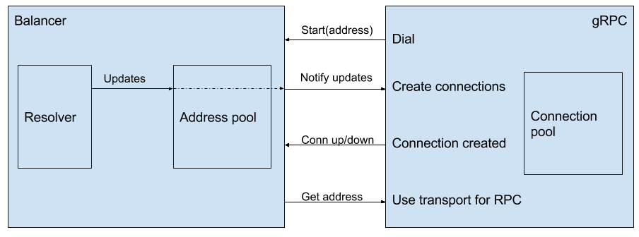
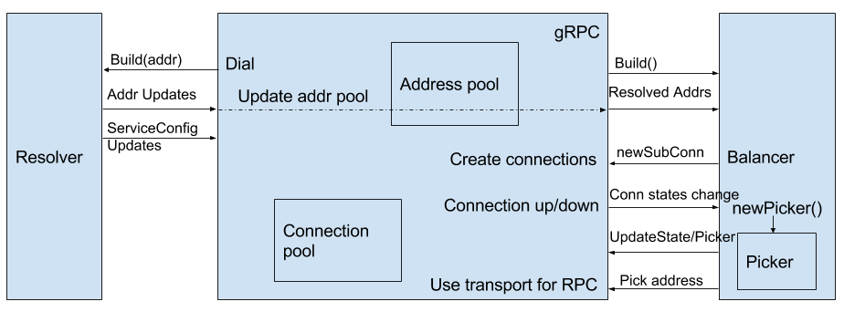

Resolver and balancer API changes
----
* Author(s): menghanl, dfawley, mmukhi
* Approver: a11r
* Status: Implemented
* Implemented in: go
* Last updated: 2018/01/17
* Discussion at: https://groups.google.com/forum/#!topic/grpc-io/rUDN7-cZvz8

## Abstract

The v1 balancer API in gRPC-go cannot support balancer hot switching. There are also other issues related to balancer, resolver and connectivity state.

This document contains the v1 implementation of balancer in gRPC-go, the issues that cannot be solved with the v1 set of APIs, and proposed solutions for the issues.

## Background

### The v1 implementation



gRPC talks to balancer directly, but doesn't know about the existence of the resolver. Resolver is essentially a part of balancer from gRPC's point of view. Balancer maintains the pool of resolved addresses and monitors the updates from resolver.

#### Initialization

```go
grpc.Dial(targetName, grpc.WithBalancer(grpc.Roundrobin(userCustomResolver())))
```

Upon dialing, gRPC takes the user provided balancer. Users don't provide resolver to gRPC directly. In the example code above, the balancer constructor takes a resolver as an argument. Other balancer implementations may choose to not take the resolver.

gRPC starts the balancer with the target name. The balancer in the example will initialize the resolver as well.

#### Address updates

Balancer gets the address updates from resolver, maintains a pool of resolved addresses, and notifies gRPC of the addresses to which gRPC should create connections. gRPC will create a connection to each of the address, and maintain the connection pool. There will be a gRPC goroutine watching balancer updates and maintaining the connection pool. (Address is the address(IP) + some metadata, so it's possible to create multiple connections to one same server).

Note that the updates in the v1 resolver API are delta, not the full address list. This is the reason of one of our issues.

##### If balancer is not provided

If balancer is not provided, the target name will be used directly to do net.Dial(). net.Dial() will do the resolving part and return a connection for use.

#### Connection up and down

gRPC notifies the balancer of addresses to which the connection is established or lost. So balancer can make load balancing decisions based on the connection status.

#### Make RPCs

gRPC first gets an address picked by the balancer. Balancer picks the address based on the connection status, the RPC information and the load balancing policy. gRPC finds the connection corresponding to the returned address, and sends RPC on that connection.

### Issues

#### The balancing policy needs to be changed on service config updates 

Upon service config updating, gRPC will look at the LoadBalancingPolicy field and decide which balancing policy to use. If the LoadBalancingPolicy specified by the service config is different from what's currently being used, gRPC should be able to change the policy. Refer to go/grpc-service-config for more details on this.

Right now, there's no API to notify balancer of service config changes, so to change the balancing policy, the balancer needs to be swapped out. But swapping out the balancer and at the same time keeping the old resolver and address pool is not feasible because of the v1 structure.

#### Randomize the resolved address list 

Each resolver should be able to randomize the order of the resolved address list, and this should be part of the resolver's implementation. For example, a DNS resolver may choose to not randomize the order of the address list, but another custom resolver may choose to do the randomization.

#### Service config be associated with a server name and returned by resolver 

As designed in the [service config](https://github.com/grpc/grpc/blob/master/doc/service_config.md#architecture) and [name resolution](https://github.com/grpc/grpc/blob/master/doc/naming.md#resolver-plugins), the resolver, when asked to resolve a particular server name, will return both the resolved addresses and the service config.
 
#### Connectivity state should be aggregated by balancer

Different balancers may have different connectivity state even with the same state for all connections. For example, grpclb may consider the channel to be not ready if it cannot talk to the remote balancer.

## Goals

Solve the following issues:

1. The balancing policy needs to be changed on service config updates
1. Resolver should be able to randomize the resolved address list
1. Resolver should return both resolved addresses and service config
1. Connectivity state should be aggregated by balancer

## Solution

Change the resolver API, balancer API and the structure.

### The balancer API and the structure 

Change the balancer API and structure between gRPC, resolver and balancer.



In the new structure, gRPC talks to both resolver and balancer directly. gRPC maintains the address pool and connection pool, notifies balancer about the updates from resolver. The balancer calls gRPC callbacks to create and remove connections.

#### Initialization 

```go
resolver.Register(userCustomResolverBuilder())
balancer.Register(newRoundRobinBuilder())
grpc.Dial(targetName)
```

Upon dialing, gRPC calls resolver API to resolve target name, and also gets the service config from resolver. gRPC starts the balancer based on balancer config and resolved address type.

The resolver used to resolve the target is picked from the resolvers registered (including default resolvers and custom resolvers), based the target name [scheme](https://github.com/grpc/grpc/blob/master/doc/naming.md#name-syntax). 
The RegisterResolver() API registers the resolver to a global resolver map, and the scheme in targetName decides which resolver to use. If targetName doesn't contain a scheme, a default resolver (DNS) will be used.

RegisterBalancer() API registers a balancer. When choosing a balancer to use, the following list is checked in order:

1.  Use the balancer provided by v1 WithBalancer() API (consistent with the old behavior, and balancer auto switching will be disabled)
1.  Use grpclb if at least one of the resolved addresses is grpclb
1.  Use the balancer specified by service config
1.  Use the balancer provided by WithBalancerName() dial option 
1.  Use pick_first

#### Address updates 

gRPC watches the updates from resolver. When a new resolver update is received, gRPC updates the address pool, and notifies balancer of the update.

gRPC provides callbacks for balancers to create and remove connections. Balancer should be watching resolved address updates from gRPC, and call the callbacks with the newly updated addresses.

Note that the connection pool is built on the addresses from balancer, not on the addresses from resolver. The addresses used to create connections and addresses used to create subconns are separate, and can be totally unrelated. The balancer can use a list of addresses totally different from the list received to create new connections (grpclb for example). And gRPC doesn't invalidate the connection in the connection pool on resolver updates. Only callbacks from balancer to remove addresses can invalidate connections.

There will be a goroutine watching updates from resolver, maintaining the address pool, and sending updates to balancer.

Note that the resolver API is changed to returning the full address list, not just delta.

#### Connection state change 

gRPC notifies the balancer of connection whose connectivity state has changed. So balancer can make load balancing decisions based on the connection status.

Also, balancers need to aggregate the connectivity state of all connections, add its own state and report the overall state as part of the state of the balancer.

Note that Balancers need to send a signal to gRPC if its internal state has changed, which may have made it valid for gRPC to call another pick, to unblock RPCs blocking on no-connection-available error.

#### Make RPCs 

gRPC first requests an SubConnection from the balancer using the picker.Pick method. The SubConnection should be picked based on the connection status, the RPC information and the load balancing policy. gRPC finds the connection corresponding to the returned SubConnection, and sends RPC on that connection.

See the comments on Pick() for details on the expected behavior from balancer.

#### Swapping out balancer 

When there's a change in service config LoadBalancingPolicy (or other equivalent such as resolved addresses are balancer servers not backends) which causes the balancer being swapped out, gRPC will close the existing balancer and build a new balancer. The existing picker will still be used to pick until a new picked is returned from the new balancer.

Optimizations can be done to reuse existing connections in this process:

1.  Build the new balancer with balancer config
1.  When gRPC callbacks gets called by balancer to create new connections:
    1.  For connections already exist, they will be reused and copied to a new pool
    1.  For connections don't exist, new connection will be estalished
1.  When the new balancer sends the first signal to indicate gRPC its internal state has changed and it's ok to pick:
    1.  gRPC will stop the older balancer and switch to the new one
    1.  For connections only in the old balancer's pool, they will be shutdown.

Note that gRPC doesn't invalidate the current connection pool until it's removed by balancer. But since every RPC needs to call balancer.Pick() to pick a connection to use, we won't mistakenly pick a connection that balancer wants to avoid. The purpose here is to avoid closing and reopening the same connection when old balancer and new balancer use the same addresses.

### The resolver API 

Change the resolver API. In the new API, resolvers return the full list of updated addresses, instead of the delta of each update.

Also, add another method in the new API to return service config updates. The service config returned by resolver to gRPC will be in JSON format.

### new APIs

#### Balancer API 

```go
package balancer

import "resolver" // for resolver.Address
import "connectivity" // for connectivity interface

// SubConn represents a gRPC sub connection.
// Each sub connection contains a list of addresses. gRPC will
// try to connect to them (in sequence), and stop trying the
// remainder once one connection is successful.
//
// The reconnect backoff will be applied on the list, not a single address.
// For example, try_on_all_addresses -> backoff -> try_on_all_addresses.
//
// All SubConns start in IDLE, and will not try to connect. To trigger
// the connecting, Balancers must call Connect.
// When the connection encounters an error, it will reconnect immediately.
// When the connection becomes IDLE, it will not reconnect unless Connect is
// called.
//
// This interface is to be implemented by gRPC. Users should not need a
// brand new implementation of this interface. For the situations like
// testing, the new implementation should embed this interface. This allows
// gRPC to add new methods to this interface.
type SubConn interface {
	// UpdateAddresses updates the addresses used in this SubConn.
	// gRPC checks if currently-connected address is still in the new list.
	// If it's in the list, the connection will be kept.
	// If it's not in the list, the connection will gracefully closed, and
	// a new connection will be created.
	//
	// This will trigger a state transition for the SubConn.
	UpdateAddresses([]resolver.Address)
	// Connect starts the connecting for this SubConn.
	Connect()
}

// NewSubConnOptions contains options to create new SubConn.
type NewSubConnOptions struct{}

// ClientConn represents a gRPC ClientConn.
//
// This interface is to be implemented by gRPC. Users should not need a
// brand new implementation of this interface. For the situations like
// testing, the new implementation should embed this interface. This allows
// gRPC to add new methods to this interface.
type ClientConn interface {
	// NewSubConn is called by balancer to create a new SubConn.
	// It doesn't block and wait for the connections to be established.
	// Behaviors of the SubConn can be controlled by options.
	NewSubConn([]resolver.Address, NewSubConnOptions) (SubConn, error)
	// RemoveSubConn removes the SubConn from ClientConn.
	// The SubConn will be shutdown.
	RemoveSubConn(SubConn)

	// UpdateBalancerState is called by balancer to nofity gRPC that some internal
	// state in balancer has changed.
	//
	// gRPC will update the connectivity state of the ClientConn, and will call pick
	// on the new picker to pick new SubConn.
	UpdateBalancerState(s connectivity.State, p Picker)

	// ResolveNow is called by balancer to notify gRPC to do a name resolving.
	ResolveNow(resolver.ResolveNowOption)

	// Target returns the dial target for this ClientConn.
	Target() string
}

// BuildOptions contains additional information for Build.
type BuildOptions struct {
	// DialCreds is the transport credential the Balancer implementation can
	// use to dial to a remote load balancer server. The Balancer implementations
	// can ignore this if it does not need to talk to another party securely.
	DialCreds credentials.TransportCredentials
	// Dialer is the custom dialer the Balancer implementation can use to dial
	// to a remote load balancer server. The Balancer implementations
	// can ignore this if it doesn't need to talk to remote balancer.
	Dialer func(context.Context, string) (net.Conn, error)
}

// Builder creates a balancer.
type Builder interface {
	// Build creates a new balancer with the ClientConn.
	Build(cc ClientConn, opts BuildOptions) Balancer
	// Name returns the name of balancers built by this builder.
	// It will be used to pick balancers (for example in service config).
	Name() string
}

// PickOptions contains addition information for the Pick operation.
type PickOptions struct{}

// DoneInfo contains additional information for Done.
type DoneInfo struct {
	// Err is the rpc error the RPC finished with. It could be nil.
	Err error
}

var (
	// ErrNoSubConnAvailable indicates no SubConn is available for pick().
	// gRPC will block the RPC until a new picker is available via UpdateBalancerState().
	ErrNoSubConnAvailable = errors.New("no SubConn is available")
	// ErrTransientFailure indicates all SubConns are in TransientFailure.
	// WaitForReady RPCs will block, non-WaitForReady RPCs will fail.
	ErrTransientFailure = errors.New("all SubConns are in TransientFailure")
)

// Picker is used by gRPC to pick a SubConn to send an RPC.
// Balancer is expected to generate a new picker from its snapshot everytime its
// internal state has changed.
//
// The pickers used by gRPC can be updated by ClientConn.UpdateBalancerState().
type Picker interface {
	// Pick returns the SubConn to be used to send the RPC.
	// The returned SubConn must be one returned by NewSubConn().
	//
	// This functions is expected to return:
	// - a SubConn that is known to be READY;
	// - ErrNoSubConnAvailable if no SubConn is available, but progress is being
	//   made (for example, some SubConn is in CONNECTING mode);
	// - other errors if no active connecting is happening (for example, all SubConn
	//   are in TRANSIENT_FAILURE mode).
	//
	// If a SubConn is returned:
	// - If it is READY, gRPC will send the RPC on it;
	// - If it is not ready, or becomes not ready after it's returned, gRPC will block
	//   until UpdateBalancerState() is called and will call pick on the new picker.
	//
	// If the returned error is not nil:
	// - If the error is ErrNoSubConnAvailable, gRPC will block until UpdateBalancerState()
	// - If the error is ErrTransientFailure:
	//   - If the RPC is wait-for-ready, gRPC will block until UpdateBalancerState()
	//     is called to pick again;
	//   - Otherwise, RPC will fail with unavailable error.
	// - Else (error is other non-nil error):
	//   - The RPC will fail with unavailable error.
	//
	// The returned done() function will be called once the rpc has finished, with the
	// final status of that RPC.
	// done may be nil if balancer doesn't care about the RPC status.
	Pick(ctx context.Context, opts PickOptions) (conn SubConn, done func(DoneInfo), err error)
}

// Balancer takes input from gRPC, manages SubConns, and collects and aggregates
// the connectivity states.
//
// It also generates and updates the Picker used by gRPC to pick SubConns for RPCs.
//
// HandleSubConnectionStateChange, HandleResolvedAddrs and Close are guaranteed
// to be called synchronously from the same goroutine.
// There's no guarantee on picker.Pick, it may be called anytime.
type Balancer interface {
	// HandleSubConnStateChange is called by gRPC when the connectivity state
	// of sc has changed.
	// Balancer is expected to aggregate all the state of SubConn and report
	// that back to gRPC.
	// Balancer should also generate and update Pickers when its internal state has
	// been changed by the new state.
	HandleSubConnStateChange(sc SubConn, state connectivity.State)
	// HandleResolvedAddrs is called by gRPC to send updated resolved addresses to
	// balancers.
	// Balancer can create new SubConn or remove SubConn with the addresses.
	// An empty address slice and a non-nil error will be passed if the resolver returns
	// non-nil error to gRPC.
	HandleResolvedAddrs([]resolver.Address, error)
	// Close closes the balancer. The balancer is not required to call
	// ClientConn.RemoveSubConn for its existing SubConns.
	Close()
}
```

```go
package connectivity

type State int

const (
	// Idle indicates the ClientConn is idle.
	Idle State = iota
	// Connecting indicates the ClienConn is connecting.
	Connecting
	// Ready indicates the ClientConn is ready for work.
	Ready
	// TransientFailure indicates the ClientConn has seen a failure but expects to recover.
	TransientFailure
	// Shutdown indicates the ClientConn has started shutting down.
	Shutdown
)

// Reporter reports the connectivity states.
type Reporter interface {
	CurrentState() State
	WaitForStateChange(context.Context, State) bool
}
```

#### Resolver API

```go
package resolver

// SetDefaultScheme sets the default scheme that will be used.
// The default default scheme is "dns".
func SetDefaultScheme(scheme string) {
}

// AddressType indicates the address type returned by name resolution.
type AddressType uint8

const (
	// Backend indicates the address is for a backend server.
	Backend AddressType = iota
	// GRPCLB indicates the address is for a grpclb load balancer.
	GRPCLB
)

// Address represents a server the client connects to.
// This is the EXPERIMENTAL API and may be changed or extended in the future.
type Address struct {
	// Addr is the server address on which a connection will be established.
	Addr string
	// Type is the type of this address.
	Type AddressType
	// ServerName is the name of this address.
	// It's the name of the grpc load balancer, which will be used for authentication.
	ServerName string
	// Metadata is the information associated with Addr, which may be used
	// to make load balancing decision.
	Metadata interface{}
}

// BuildOption includes additional information for the builder to create
// the resolver.
type BuildOption struct {}

// ClientConn contains the callbacks for resolver to notify any updates
// to the gRPC ClientConn.
//
// This interface is to be implemented by gRPC. Users should not need a
// brand new implementation of this interface. For the situations like
// testing, the new implementation should embed this interface. This allows
// gRPC to add new methods to this interface.
type ClientConn interface {
	// NewAddress is called by resolver to notify ClientConn a new list
	// of resolved addresses.
	// The address list should be the complete list of resolved addresses.
	NewAddress(addresses []Address)
	// NewServiceConfig is called by resolver to notify ClientConn a new
	// service config. The service config should be provided as a json string.
	NewServiceConfig(serviceConfig string)
}

type Target struct {
	Scheme    string
	Authority string
	Endpoint  string
}

// Builder creates a resolver that will be used to watch name resolution updates.
type Builder interface {
	// Build creates a new resolver for the given target.
	//
	// gRPC dial calls Build synchronously, and fails if the returned error is
	// not nil.
	Build(target Target, cc ClientConn, opts BuildOption) (Resolver, error)
	// Scheme returns the scheme supported by this resolver.
	// Scheme is defined at https://github.com/grpc/grpc/blob/master/doc/naming.md.
	Scheme() string
}

// ResolveNowOption includes additional information for ResolveNow.
type ResolveNowOption struct{}

// Resolver watches for the updates on the specified target.
// Updates include address updates and service config updates.
type Resolver interface {
	// ResolveNow will be called by gRPC to try to resolve the target name again.
	// It's just a hint, resolver can ignore this if it's not necessary.
	ResolveNow(ResolveNowOption)
	// Close closes the resolver.
	Close()
}
```

## Solutions considered 

### The balancing policy needs to be changed on service config updates 

1.  Change the structure and balancer APIs
    *   Changes to the balancer API
        *   Add a function to take updated resolved addresses
    *   Pro: 
        *   The most straightforward solution
        *   Not a hack
    *   Con: 
        *   Not only an API change, but also a structure change
        *   Needs some refactoring in gRPC code
1.  Extract resolver and address pool from balancer
    *   Changes to the balancer APIs
        *   Add a function to extract the resolver
        *   Add a function to extract the current address pool (optional)
    *   Pro: 
        *   No structure change, current implementation doesn't change
    *   Con: 
        *   An API change
        *   Breaks the assumption that gRPC doesn't know about the existence of the resolver
        *   The structure is different from other languages
1.  Notify balancer of balancing policy changes
    *   Create a wrapper of multiple balancing policies. gRPC doesn't swap balancer, but the balancer switches balancing policy
    *   Changes to the balancer APIs
        *   Add a function to notify the balancer of the service config change
    *   Pro:
        *   Just another balancer implementation
        *   No structure change
        *   Can be implemented as a google3 only feature
    *   Con:
        *   Also includes an API change
        *   Works well if service config is google3 only feature
        *   The structure is different from other languages

### Resolver should be able to randomize the resolved address list 

The v1 resolver API returns delta, not the full list. To support randoming the returned address list, there are 3 possible solutions:

1.  Change the resolver API to return the full list
    *   Pro: most straightforward, and each resolver implementation can decide on if they want to randomize the address list
    *   Con: it will be an API change
1.  Do the randomize in balancer, because balancer maintains the address pool
    *   Pro: no API change, and the v1 structure still works
    *   Con: randomizing the resolved address list becomes part of the implementation of balancer, each balancer implementation needs to do it, and it's out of the control of resolvers
1.  Change the structure between resolver, balancer and gRPC. gRPC talks to resolver and balancer, and also maintains the address pool. gRPC does the randomization on the address pool.
    *   Pro: no API change for resolver, not every balancer needs to implement randomization
    *   Con: randomizing the resolved address list becomes part of the implementation of gRPC, it's out of the control of resolvers, and there's will be a structure change.

### Service config be associated with a server name and returned by resolver 

1.  resolver.Resolve() returns a watcher and a service config watcher.
1.  resolver.Resolve() returns a watcher, watch.Next() returns addresses and service config
1.  resolver.Resolve() returns a watcher, watcher has method Next() returns addresses and serviceConfig() returns service config.

### Channels vs blocking functions

In the new APIs, we choose functions returning channels, instead of functions that may block. The rationale behind is that, this gives us the flexibility to implement. gRPC needs to have goroutines watching updates from resolvers and balancers, each goroutine will be a infinite loop listening for updates. If APIs are blocking calls, there has to be one goroutine per watching function. With functions returning channels, we can combine these goroutines into one if we want.

About how gRPC sends updates to balancer, we also have the options of using a function or using a channel. We choose to use channel because if we use one goroutine to watch updates from resolvers and balancers, we will call send address updates to balancers in the same goroutine. If we choose to use function, detailed comment is needed to make sure balancer implementations won't cause deadlock in this goroutine (e.g. write to an unbuffered channel in the address update function, and gRPC read from the same goroutine in the same channel). Using channel, we have control of the buffer size of the channel, and can avoid this deadlock in gRPC.

### How balancers get subconn connectivity states

To support Connectivity APIs, balancers need to have access to underlying subconns to get the connectivity state of them.

1.  Keep the Notify() channel to send updates from balancer to gRPC, replace Up() with another channel to send subconn reference from gRPC to balancer
    *  Pro: similar to the old API on notifying updates to gRPC
    *  Con: the API to create subconns is async, which may add complexity to the balancer implementation
1.  Keep the Notify() channel, replace Up() with a function sending addeConn states changes to balancer, like ConnStateUpdate(address, newState)
    *  Pro: similar to old API
    *  Con: the API is very limited to connectivity state, if balancers are going to need more information on subconn, we need to have another API change
1.  Replace Notify() and Up() with a sync function to create subconns, which takes the addresses and returns the subconn
    *  Pro: gives balancer the real access to subconn, we can easily add new features
    *  Con: different from the old API
    
### Pick not a blocking call

In the previous API, pick is expected to block in the case of no connection is available, and BlockingWait is true. Thus, every balancer needs to reimplement this logic.
In the new design, we decide to move the blocking logic into gRPC, and give balancers the callbacks to unblock. So balancers don't need to reimplement the blocking, and can just focus on it's internal states.

### SubConnections support multiple addresses

In the case of pickfirst balancer, each SubConnection tries to connect to all addresses, and pick the first one that is successful. Also, when reconnecting, it should restart from the beginning and try every address. If all connections failed, backoff should be applied on the address list, not on individual address.

1.  Keep the structure of addrConn, but do some coordination between them on retrying and backoff
1.  Modify addrConn to support multiple addresses (and rename it to subconn)
    *  This solution is simpler and clener
    
### Why use callbacks in the APIs, not channel or blocking functions

To get information from a channel or blocking function call, balancers need to create and maintain their own goroutines, and wait on any input. With callbacks, we can move this goroutine into gRPC, and manage it in gRPC. This could make it easier to implement balancers.

## Implementation

The implementation includes multiple steps and PRs:

*  Change the interfaces and migrate v1 existing balancers
   * Provide a way to wrap old balancers into new APIs
*  Add support for service config based on the new APIs
*  Support switching balancers

The implementation has been done (https://github.com/grpc/grpc-go/issues/1388).
