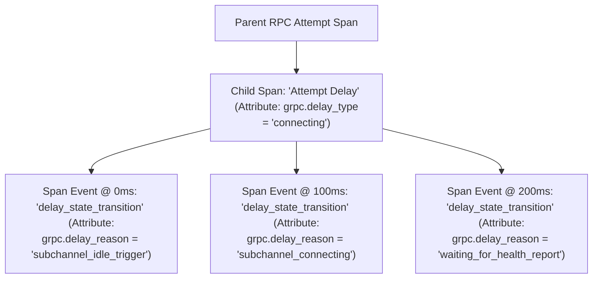
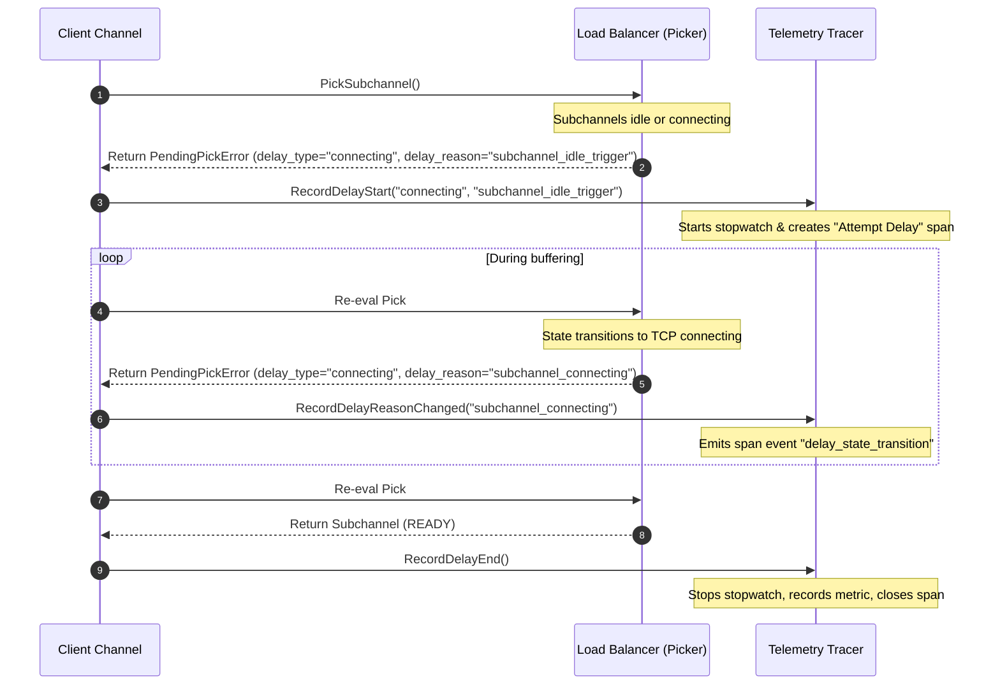

# RPC Delay Observability
----
* Author(s): Madhav Bissa (@madhavbissa)
* Approver: markdroth
* Implemented in: Go, Java, C++
* Last updated: 2026-06-19
* Discussion at: <google group thread> (filled after thread exists)

## Abstract

This proposal introduces client-side metrics and tracing to measure the delays an RPC experiences within the client channel before it is sent over the network. In this context, "delay" refers to the time an RPC spends blocked or queued inside the channel waiting for name resolution, configuration parsing, or downstream connection establishment. To expose these states, this document proposes two new histograms, two dedicated tracing spans, and corresponding additions to the CallTracer and CallAttemptTracer APIs.


## Background

Existing gRPC core telemetry infrastructure, as defined in [gRPC A66 (OpenTelemetry Metrics)][A66] and [gRPC A72 (OpenTelemetry Tracing)][A72], tracks the overall end-to-end duration of RPC calls and attempts. However, these metrics and spans function as aggregate buckets that do not decompose latency, leaving delays inside the client channel invisible to operators.

Before an RPC attempt can be sent over the network, the client channel must perform several critical operations, including resolving the target name, parsing service configurations, instantiating load balancing policies, and obtaining a connectivity picker. If any of these phases stall—such as during a slow DNS lookup, a Route Lookup Service (RLS) control-plane query, or a Cluster Discovery Service (CDS) metadata fetch—the RPC is delayed. To the application, this appears as high latency or a timeout. However, because current telemetry lacks visibility into these resolution and routing states, developers cannot distinguish between a slow network, a slow backend, or a channel initialization delay. This is particularly challenging for clients utilizing the Route Lookup Service (RLS), where diagnosing RLS-related hangs or isolating whether delays stem from pending route lookups requires complex manual debugging.

While there are many potential sources of delay along the client-side pipeline (including interceptor execution, credential fetching, and filter evaluation), this proposal focuses specifically on introducing observability for the two most common bottlenecks: **name resolution** and **load balancing pick** delays. This proposal establishes a generic telemetry framework extensible to other client-side delays in the future.


### Related Proposals:
* **[gRPC A66: OpenTelemetry Metrics][A66]**: Establishes base OpenTelemetry metrics.
* **[gRPC A72: OpenTelemetry Tracing][A72]**: Establishes tracing spans and events.
* **[gRPC A56: Priority LB Policy][A56]**: Establishes the priority load balancing policy and child failover mechanics.
* **[gRPC A28: xDS Traffic Splitting and Routing][A28]**: Establishes the `xds_cluster_manager` and `weighted_target` container policies.


## Proposal

### 1. Telemetry Schema

To measure client-side delays, we introduce a duration histogram and a dedicated tracing span at the **Call Level** (for name resolution delays), and another histogram and span at the **Attempt Level** (for load balancing pick delays).

We split observability data between low-cardinality metrics and high-cardinality debug tracing across two layers:

1.  **Call Level Observability (Channel-level Delays)**:
    *   **Scope**: Measures delays that occur at the channel level before an individual network attempt is initiated. This is primarily used to observe name resolution and configuration resolution delays.
    *   **Metric**: `grpc.client.call.delay.duration` (Float64 Histogram).
    *   **Tracing Span**: A child span named **`"Call Delay"`**, created as a child of the main RPC Call span.
2.  **Attempt Level Observability (Attempt-level Delays)**:
    *   **Scope**: Measures delays that occur within the lifecycle of a specific RPC attempt, primarily during the load balancing pick loop and connection establishment.
    *   **Metric**: `grpc.client.attempt.delay.duration` (Float64 Histogram).
    *   **Tracing Span**: A child span named **`"Attempt Delay"`**, created as a child of the individual Attempt span.

#### Span Attributes and Events

For both layers, a child span is created for each distinct `grpc.delay_type`, and transitions within that type are recorded as span events:

*   **`grpc.delay_type` (Span Attribute & Metric Label)**: A low-cardinality, composed string representing the type of the delay. The value format is `[parent_prefix:]base_type` (e.g., `connecting`, `p0:connecting`, or `rls_lookup_pending`). It is recorded as a **span attribute** on the child span and as a **metric label** on the corresponding duration histogram.
*   **`grpc.delay_reason` (Span Event Attribute)**: A high-cardinality string capturing runtime details (such as target names, subchannel IP addresses, or connection error messages). 

When a delay begins, the tracer creates the child span (`"Call Delay"` or `"Attempt Delay"`) carrying the `grpc.delay_type` attribute. It also records the initial reason as a span event named `"delay_state_transition"` containing the `grpc.delay_reason` string.

If the state changes but the `grpc.delay_type` remains the same (e.g., a priority policy fails over or RLS changes backend targets), the tracer emits a new `"delay_state_transition"` span event on the active child span with the updated `grpc.delay_reason` string, without recreating the span.

When the delay resolves or transitions to a different delay type, the active child span is closed.



#### Span Event Schema Specification
To ensure tracing backends can programmatically parse `"delay_state_transition"` events, the event MUST conform to the following structural schema:
```json
{
  "name": "delay_state_transition",
  "attributes": {
    "grpc.delay_type": "string (the active delay type, e.g., 'connecting')",
    "grpc.delay_reason": "string (the new granular state description)"
  }
}
```

#### Metrics Definitions

The following metrics are registered as client-side per-call metrics, extending the instrumentation framework defined in [gRPC A66][A66].

##### 1. Call Delay Duration Histogram

| Field | Value |
|---|---|
| **Name** | `grpc.client.call.delay.duration` |
| **Type** | Float64 Histogram |
| **Unit** | `s` (seconds) |
| **Description** | EXPERIMENTAL. Time an RPC spent waiting at the call level before an attempt was initiated, such as waiting for name resolution. |
| **Labels** | `grpc.target`, `grpc.delay_type` |
| **Optional Labels** | `grpc.method` |
| **Bucket Boundaries** | Same as A66 latency buckets: 0, 0.00001, 0.00005, 0.0001, 0.0003, 0.0006, 0.0008, 0.001, 0.002, 0.003, 0.004, 0.005, 0.006, 0.008, 0.01, 0.013, 0.016, 0.02, 0.025, 0.03, 0.04, 0.05, 0.065, 0.08, 0.1, 0.13, 0.16, 0.2, 0.25, 0.3, 0.4, 0.5, 0.65, 0.8, 1, 2, 5, 10, 20, 50, 100 |
| **Default Enabled** | `false` (experimental, opt-in) |

##### 2. Attempt Delay Duration Histogram

| Field | Value |
|---|---|
| **Name** | `grpc.client.attempt.delay.duration` |
| **Type** | Float64 Histogram |
| **Unit** | `s` (seconds) |
| **Description** | EXPERIMENTAL. Time an RPC attempt spent waiting for a load balancing pick or connection establishment. |
| **Labels** | `grpc.target`, `grpc.delay_type` |
| **Optional Labels** | `grpc.method` |
| **Bucket Boundaries** | Same as A66 latency buckets: 0, 0.00001, 0.00005, 0.0001, 0.0003, 0.0006, 0.0008, 0.001, 0.002, 0.003, 0.004, 0.005, 0.006, 0.008, 0.01, 0.013, 0.016, 0.02, 0.025, 0.03, 0.04, 0.05, 0.065, 0.08, 0.1, 0.13, 0.16, 0.2, 0.25, 0.3, 0.4, 0.5, 0.65, 0.8, 1, 2, 5, 10, 20, 50, 100 |
| **Default Enabled** | `false` (experimental, opt-in) |


### 2. Telemetry Value Taxonomy

To ensure consistency across implementations, we define a taxonomy mapping client channel states and load balancing policies to metric and tracing labels. 

All connection-related delays are consolidated into a single low-cardinality metric label value (`"connecting"`), while their detailed root causes are recorded in the tracing `grpc.delay_reason` attribute.

#### 1. Metric Delay Types (`grpc.delay_type`)
The `grpc.delay_type` label is restricted to a closed, low-cardinality set of values:
*   `"connecting"`: Any client-side delay spent waiting for name resolution, config parsing, subchannel connection establishment, or picker initialization.
*   `"rls_lookup_pending"`: Specifically for Route Lookup Service (RLS) control-plane cache-miss lookups.
*   `"cds_dynamic_discovery"`: Specifically for xDS Cluster Discovery Service (CDS) dynamic metadata resource fetches.

#### 2. Taxonomy of Delay Reasons (`grpc.delay_reason`)
The high-cardinality `grpc.delay_reason` string represents the exact state of the connection or resolver.

##### Category A: Resolver & Metadata Delays
Recorded when the channel is stalled obtaining the initial endpoints or configurations:
*   `"resolver_dns_query_pending"`: DNS name resolution query is in progress.
*   `"rls_lookup_pending"`: RLS control-plane query is in progress.
*   `"cds_metadata_fetch"`: Waiting for dynamic CDS cluster resource definitions over xDS.

##### Category B: Subchannel Connection Delays (Metric Label: `"connecting"`)
Recorded when an RPC attempt is queued waiting for a subchannel to establish a connection:
*   `"subchannel_idle_trigger"`: The target subchannel was in `IDLE` state when picked, and a new connection attempt had to be triggered.
*   `"subchannel_connecting"`: The subchannel is actively in `CONNECTING` state (TCP handshake or TLS negotiation in progress).
*   `"subchannel_scaling_a105"`: The subchannel had a connection but transitioned back to `CONNECTING` or `TRANSIENT_FAILURE` to scale up additional connections to satisfy high concurrent streams (per gRFC A105).
*   `"subchannel_waiting_for_health"`: The network connection is established, but the RPC is blocked waiting for the initial Out-Of-Band (OOB) health check report to return `SERVING`.
*   `"subchannel_does_not_exist"`: The load balancer has not yet resolved or created the subchannel.

##### Category C: Picker and State Mismatches (Metric Label: `"connecting"`)
*   `"subchannel_state_mismatch"`: The subchannel transitioned out of `READY` before the active picker could be updated.
*   `"picker_failing_with_wait_for_ready"`: A `wait_for_ready` RPC is queued because the picker is in `TRANSIENT_FAILURE`.

##### Category D: Container Policy Pass-Through & Wrapping
Container load balancing policies propagate their children's delays by prepending a prefix, while forwarding the child's type and reason:
*   **priority**: Prepends the active tier index (e.g., `p0:connecting` or `p1:connecting`).
*   **xds_cluster_manager**: Prepends the targeted xDS cluster name (e.g. `xds_cluster_manager: child 'cluster-abc': connecting`).
*   **weighted_target**: Prepends the targeted weight group (e.g., `weighted_target: child 'canary': connecting`).
*   **rls**: Prepends the target route shard (e.g., `RLS: child 'shard-eu': connecting`).


### 3. Tracer API Changes

#### Language-Agnostic Lifecycle & State Machine

The client channel, load balancer, and telemetry tracer coordinate synchronously to record delays without dynamic memory allocation during routing.



1. **Initiating a Delay Segment**:
   When the client channel encounters a blocking state (e.g., name resolution pending or load balancing pick deferred):
   - A timer is started to measure the delay segment duration.
   - A child span (`"Call Delay"` at the call level, or `"Attempt Delay"` at the attempt level) is created under the parent RPC span.
   - The span is assigned the initial `grpc.delay_type` as a span attribute, and a `"delay_state_transition"` span event is emitted containing the `grpc.delay_reason` description.

2. **Handling State Transitions**:
   During an active delay, the internal state may transition (e.g., a subchannel reconnects, a different priority tier is chosen, or RLS updates its cache):
   - **Scenario A: Only the reason changes (same delay type)**.
     If the new state maps to the *same* `grpc.delay_type` but a different `grpc.delay_reason`:
     - The active child span remains open.
     - A new `"delay_state_transition"` span event is appended to the active span with the updated `grpc.delay_reason` string.
     - *No metric is recorded* and the timer continues running.
   - **Scenario B: The delay type changes**.
     If the new state maps to a *different* `grpc.delay_type`:
     - The timer is stopped.
     - The duration is recorded to the corresponding histogram (`grpc.client.call.delay.duration` or `grpc.client.attempt.delay.duration`) using the old `grpc.delay_type` as a label.
     - The active child span is closed.
     - A new delay segment is immediately initiated (restarting the timer, creating a new child span with the new `grpc.delay_type` attribute, and emitting the initial transition event).

3. **Concluding the Delay**:
   When the blocking state resolves (e.g., name resolution completes, a picker successfully selects a connection, or the RPC is cancelled or timed out):
   - The timer is stopped.
   - The final duration is recorded to the histogram using the active `grpc.delay_type` as a label.
   - The active child span is closed.

#### Language-Specific API Definitions

##### Go
In `google.golang.org/grpc/stats`:
```go
package stats

// DelayStart indicates the start of a delay segment.
type DelayStart struct {
	// DelayType describes the type of delay (e.g., "load_balancing").
	DelayType string
	// Reason is the initial dynamic debug string.
	Reason string
}

func (*DelayStart) IsClient() bool { return true }
func (*DelayStart) isRPCStats()   {}

// DelayReasonChanged indicates a transition in the dynamic delay reason.
type DelayReasonChanged struct {
	// Reason is the new dynamic debug string.
	Reason string
}

func (*DelayReasonChanged) IsClient() bool { return true }
func (*DelayReasonChanged) isRPCStats()   {}

// DelayEnd indicates the end of a delay segment.
type DelayEnd struct{}

func (*DelayEnd) IsClient() bool { return true }
func (*DelayEnd) isRPCStats()   {}
```

In `google.golang.org/grpc/internal/telemetry`:
*Note: This package is introduced internally as part of this gRFC to align Go's internal telemetry abstractions with C++ and Java.*
```go
package telemetry

import (
	"context"
	"net"

	"google.golang.org/grpc/metadata"
)

type Provider interface {
	NewClientCallTracer(ctx context.Context, target string, method string, failFast bool, isClientStream bool, isServerStream bool) ClientCallTracer
}

type ClientCallTracer interface {
	RecordDelayStart(delayType string, reason string)
	RecordDelayReasonChanged(reason string)
	RecordDelayEnd()
	StartNewAttempt(ctx context.Context, isTransparent bool) (context.Context, ClientCallAttemptTracer)
	RecordEnd(ctx context.Context, err error)
}

type ClientCallAttemptTracer interface {
	RecordBegin(ctx context.Context)
	RecordDelayStart(delayType string, reason string)
	RecordDelayReasonChanged(reason string)
	RecordDelayEnd()
	RecordOutHeader(ctx context.Context, remoteAddr net.Addr, localAddr net.Addr, compression string, md metadata.MD)
	RecordInHeader(ctx context.Context, wireLength int, compression string, md metadata.MD)
	RecordOutPayload(ctx context.Context, compressedLen int, uncompressedLen int)
	RecordInPayload(ctx context.Context, compressedLen int, uncompressedLen int)
	RecordInTrailer(ctx context.Context, wireLength int, md metadata.MD)
	RecordEnd(ctx context.Context, err error)
}

// GetClientCallAttemptTracer retrieves the active tracer implementation from the context.
func GetClientCallAttemptTracer(ctx context.Context) ClientCallAttemptTracer
```

##### Java
In `io.grpc.ClientStreamTracer`:
*Note: Methods are explicitly separated into Call-level and Attempt-level signatures to resolve scope collision, since Java utilizes a single ClientStreamTracer.*
```java
package io.grpc;

public abstract class ClientStreamTracer extends StreamTracer {
  /**
   * Called when a call-level delay segment (e.g. name resolution) starts.
   */
  public void recordCallDelayStart(String delayType, String delayReason) {}

  /**
   * Called when a call-level delay reason changes.
   */
  public void recordCallDelayReasonChanged(String delayReason) {}

  /**
   * Called when a call-level delay segment ends.
   */
  public void recordCallDelayEnd() {}

  /**
   * Called when an attempt-level delay segment (e.g. LB Pick connection) starts.
   */
  public void recordAttemptDelayStart(String delayType, String delayReason) {}

  /**
   * Called when an attempt-level delay reason changes.
   */
  public void recordAttemptDelayReasonChanged(String delayReason) {}

  /**
   * Called when an attempt-level delay segment ends.
   */
  public void recordAttemptDelayEnd() {}
}
```

##### C++ (Core)
In `src/core/telemetry/call_tracer.h`:
*Note: To prevent core interface bloat and align with the core thinning refactoring, we leverage the existing C++ Annotation framework rather than adding new virtual methods.*
```cpp
namespace grpc_core {

class DelayAnnotation final : public CallTracerAnnotationInterface::Annotation {
 public:
  enum class Stage { kStart, kReasonChanged, kEnd };
  
  DelayAnnotation(Stage stage, absl::string_view type, absl::string_view reason)
      : Annotation(CallTracerAnnotationInterface::AnnotationType::kDelay),
        stage_(stage), type_(type), reason_(reason) {}
        
  Stage stage() const { return stage_; }
  absl::string_view type() const { return type_; }
  absl::string_view reason() const { return reason_; }

 private:
  Stage stage_;
  absl::string_view type_;
  absl::string_view reason_;
};

} // namespace grpc_core
```


#### Language-Specific Recording Logic (Code Examples)

##### Go — `picker_wrapper.go`
```go
func (pw *pickerWrapper) pick(ctx context.Context, failfast bool, info balancer.PickInfo) (pick, error) {
	var ch chan struct{}
	var lastPickErr error
	pickBlocked := false

	var delayStartTime time.Time
	var delayType string
	var delayReason string
	var delayed bool

	for {
		pg := pw.pickerGen.Load()
		if pg == nil {
			return pick{}, ErrClientConnClosing
		}
		if pg.picker == nil {
			ch = pg.blockingCh
		}
		if ch == pg.blockingCh {
			// We are about to block on the channel. Record connecting delay.
			if !delayed {
				delayed = true
				delayStartTime = time.Now()
				delayType = "connecting"
				delayReason = "channel_connecting" 
				if tracer := telemetry.GetClientCallAttemptTracer(ctx); tracer != nil {
					tracer.RecordDelayStart(delayType, delayReason)
				}
			}
			// Block goroutine until next picker is updated
			select {
			case <-ctx.Done():
				if delayed {
					duration := time.Since(delayStartTime).Seconds()
					clientAttemptDelayDurationMetric.Record(metricsRecorder, duration, target, delayType, info.FullMethodName)
					if tracer := telemetry.GetClientCallAttemptTracer(ctx); tracer != nil {
						tracer.RecordDelayEnd()
					}
				}
				return pick{}, ctx.Err()
			case <-ch:
			}
			continue
		}

		if ch != nil {
			pickBlocked = true
		}
		ch = pg.blockingCh
		p := pg.picker

		pickResult, err := p.Pick(info)
		if err != nil {
			if err == balancer.ErrNoSubConnAvailable {
				currentType := "connecting"
				currentReason := "subchannel_connecting"
				if qe, ok := err.(*balancer.PendingPickError); ok {
					currentType = qe.DelayType
					currentReason = qe.DelayReason
				}
				
				if !delayed {
					delayed = true
					delayStartTime = time.Now()
					delayType = currentType
					delayReason = currentReason
					if tracer := telemetry.GetClientCallAttemptTracer(ctx); tracer != nil {
						tracer.RecordDelayStart(delayType, delayReason)
					}
				} else if currentType != delayType {
					// Type changed: Record metric and restart span.
					duration := time.Since(delayStartTime).Seconds()
					clientAttemptDelayDurationMetric.Record(metricsRecorder, duration, target, delayType, info.FullMethodName)
					if tracer := telemetry.GetClientCallAttemptTracer(ctx); tracer != nil {
						tracer.RecordDelayEnd()
						tracer.RecordDelayStart(currentType, currentReason)
					}
					delayStartTime = time.Now()
					delayType = currentType
					delayReason = currentReason
				} else if currentReason != delayReason {
					// Only reason changed: Record span event.
					delayReason = currentReason
					if tracer := telemetry.GetClientCallAttemptTracer(ctx); tracer != nil {
						tracer.RecordDelayReasonChanged(delayReason)
					}
				}
				continue
			}
			// ... non-delay error handling ...
		}

		// Success path
		if delayed {
			duration := time.Since(delayStartTime).Seconds()
			clientAttemptDelayDurationMetric.Record(metricsRecorder, duration, target, delayType, info.FullMethodName)
			if tracer := telemetry.GetClientCallAttemptTracer(ctx); tracer != nil {
				tracer.RecordDelayEnd()
			}
		}
		return pickResult, nil
	}
}
```

##### Java — `DelayedClientTransport.java`
```java
// Tracer callbacks are invoked strictly OUTSIDE DelayedClientTransport locks.
// AtomicBoolean guards guarantee recordDelayEnd() is executed exactly once.

private class PendingStream extends DelayedStream {
    private final PickSubchannelArgs args;
    private final ClientStreamTracer[] tracers;
    private final long delayStartNanos;
    private final String delayType;
    private final String delayReason;
    private final AtomicBoolean delayRecorded = new AtomicBoolean();

    PendingStream(PickSubchannelArgs args, ClientStreamTracer[] tracers, PickResult pickResult) {
        this.args = args;
        this.tracers = tracers;
        this.delayStartNanos = System.nanoTime();
        this.delayType = pickResult != null ? pickResult.getDelayType() : "connecting";
        this.delayReason = pickResult != null ? pickResult.getDelayReason() : "channel_connecting";
    }

    void recordDelayEnd(MetricsRecorder recorder, String target) {
        if (delayRecorded.compareAndSet(false, true)) {
            long durationNanos = System.nanoTime() - this.delayStartNanos;
            double durationSeconds = durationNanos / 1_000_000_000.0;
            recorder.recordClientAttemptDelayDuration(durationSeconds, target, this.delayType);
            for (ClientStreamTracer tracer : this.tracers) {
                tracer.recordAttemptDelayEnd();
            }
        }
    }
}

// In DelayedClientTransport.newStream():
PendingStream pendingStream = null;
synchronized (lock) {
    if (state == SHUTDOWN) {
        return new FailingClientStream(status);
    }
    if (transport == null) {
        pendingStream = new PendingStream(args, tracers, pickResult);
        pendingStreams.add(pendingStream);
    }
}
if (pendingStream != null) {
    // Invoke tracer callbacks OUTSIDE critical locks
    for (ClientStreamTracer tracer : tracers) {
        tracer.recordAttemptDelayStart(pendingStream.delayType, pendingStream.delayReason);
    }
}
```

##### C++ (Core) — `load_balanced_call_destination.cc`
```cpp
// LbDelayState is an RAII object that guarantees RecordDelayEnd is called on destruction (cancellation).
// Persisted across asynchronous Loop iterations by capturing it in the Loop lambda state.

class LbDelayState {
 public:
  LbDelayState(ClientCallTracerInterface::CallAttemptTracer* tracer, std::string target)
      : tracer_(tracer), target_(std::move(target)) {}

  ~LbDelayState() {
    if (delay_start_time_.has_value()) {
      // RAII Cancellation: Record final metric and close tracer
      RecordEnd();
    }
  }

  void Update(absl::string_view type, absl::string_view reason) {
    if (!delay_start_time_.has_value()) {
      delay_start_time_ = Timestamp::Now();
      type_ = std::string(type);
      reason_ = std::string(reason);
      tracer_->RecordAnnotation(DelayAnnotation(DelayAnnotation::Stage::kStart, type_, reason_));
    } else if (type != type_) {
      RecordEnd();
      delay_start_time_ = Timestamp::Now();
      type_ = std::string(type);
      reason_ = std::string(reason);
      tracer_->RecordAnnotation(DelayAnnotation(DelayAnnotation::Stage::kStart, type_, reason_));
    } else if (reason != reason_) {
      reason_ = std::string(reason);
      tracer_->RecordAnnotation(DelayAnnotation(DelayAnnotation::Stage::kReasonChanged, type_, reason_));
    }
  }

  void RecordEnd() {
    if (!delay_start_time_.has_value()) return;
    Duration duration = Timestamp::Now() - *delay_start_time_;
    stats_plugin_group.RecordHistogram(
        kClientAttemptDelayDurationHandle,
        duration.seconds(),
        {target_, type_},
        {});
    tracer_->RecordAnnotation(DelayAnnotation(DelayAnnotation::Stage::kEnd, type_, reason_));
    delay_start_time_.reset();
  }

 private:
  ClientCallTracerInterface::CallAttemptTracer* tracer_;
  std::string target_;
  std::optional<Timestamp> delay_start_time_;
  std::string type_;
  std::string reason_;
};

// Inside UnstartedCallHandler::StartCall mutable loop lambda:
auto delay_state = std::make_shared<LbDelayState>(call_tracer, target);

return Loop(
    [delay_state, picker, unstarted_handler]() mutable {
      return PickSubchannel(
          *picker,
          *unstarted_handler,
          delay_state.get() // Pass state pointer to persist across asynchronous iterations
      );
    }
);
```

### Feature Flag

All delay metrics, tracing, and API hooks will be guarded by a feature flag:
* **Go/Java Env Var**: `GRPC_EXPERIMENTAL_ENABLE_DELAY_OBSERVABILITY` (Default: `false`)
* **C++ Core Experiment**: `IsExperimentEnabled("client_delay_observability")` (registered in `experiments.h`)

## Rationale

We implement recording at the client channel level rather than inside specific load balancing policies because only the client channel manages the buffering, queueing, and context cancellation lifecycles of RPC calls. This decouples policy-level state reporting from duration measurement.

To minimize overhead, pickers pre-compute tokens at configuration time, avoiding dynamic string allocations during picks. Dynamic tokens are only used for policies that perform per-request routing (e.g., RLS, xDS cluster manager).

## Implementation

We will implement this in Go, Java, and C++ (Core), in that order.


[A66]: A66-otel-stats.md
[A72]: A72-open-telemetry-tracing.md
[A56]: A56-priority-lb-policy.md
[A28]: A28-xds-traffic-splitting-and-routing.md